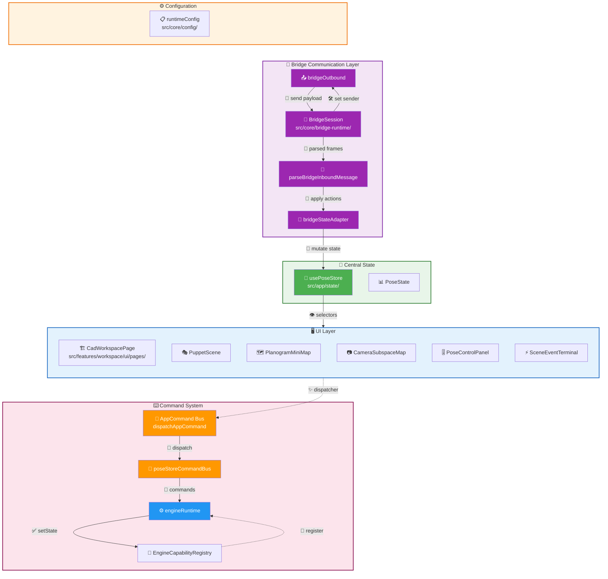
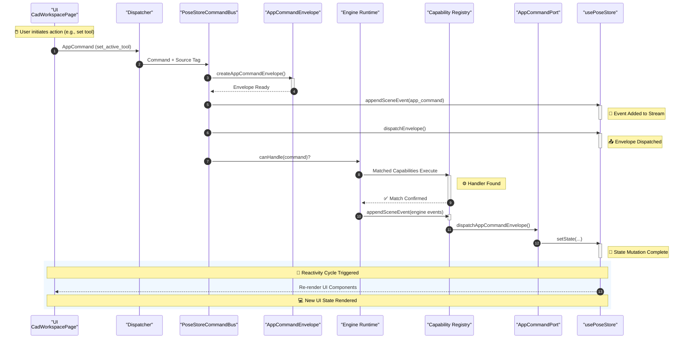
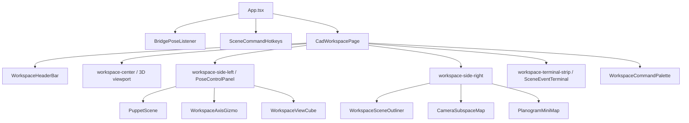

# Overview

Relevant source files

- [](https://github.com/e7canasta/puppet-studio/blob/cdd483bd/src/app/state/poseStore.ts)
- [](https://github.com/e7canasta/puppet-studio/blob/cdd483bd/src/core/app-commanding/appCommandBus.ts)
- [](https://github.com/e7canasta/puppet-studio/blob/cdd483bd/src/core/app-commanding/poseStoreCommandBus.ts)
- [](https://github.com/e7canasta/puppet-studio/blob/cdd483bd/src/core/bridge-runtime/bridgeMessages.ts)
- [](https://github.com/e7canasta/puppet-studio/blob/cdd483bd/src/core/bridge-runtime/bridgeOutbound.ts)
- [](https://github.com/e7canasta/puppet-studio/blob/cdd483bd/src/core/bridge-runtime/bridgeSession.ts)
- [](https://github.com/e7canasta/puppet-studio/blob/cdd483bd/src/core/bridge-runtime/bridgeStateAdapter.ts)
- [](https://github.com/e7canasta/puppet-studio/blob/cdd483bd/src/core/engine/engineCapabilityRegistry.ts)
- [](https://github.com/e7canasta/puppet-studio/blob/cdd483bd/src/core/workspace-shell/workspaceShellBridge.ts)
- [](https://github.com/e7canasta/puppet-studio/blob/cdd483bd/src/features/bridge/model/bridgeLifecycleSceneEvent.ts)
- [](https://github.com/e7canasta/puppet-studio/blob/cdd483bd/src/features/terminal/model/terminalCommandLine.ts)
- [](https://github.com/e7canasta/puppet-studio/blob/cdd483bd/src/features/workspace/hooks/useWorkspaceHudState.ts)
- [](https://github.com/e7canasta/puppet-studio/blob/cdd483bd/src/features/workspace/model/workspaceHudModel.ts)
- [](https://github.com/e7canasta/puppet-studio/blob/cdd483bd/src/features/workspace/ui/pages/CadWorkspacePage.tsx)

This page introduces puppet-studio: what it is, who it is for, and how its major subsystems relate to one another. It is a navigational entry point — each subsystem is described only at a high level here. Detailed documentation for each area is linked throughout.

---

## What Is puppet-studio?

puppet-studio is a browser-based CAD workspace for interactively editing 3D scene layouts (planograms) and monitoring real-time pose data streamed from an external analytics service. It connects to a WebSocket bridge server, receives live pose and scene updates, and allows a user to inspect, place, move, and rotate scene objects in both a 3D viewport and a 2D minimap.

A companion Python analytics library (`lib/`) provides utilities for ingesting bridge data server-side (see page [13](https://deepwiki.com/e7canasta/puppet-studio/13-python-analytics-library)).

---

## Major Subsystems

The codebase is organized into five principal layers:

|Layer|Role|Key Files|
|---|---|---|
|**Bridge Communication**|WebSocket lifecycle, inbound message parsing, outbound sending|`src/core/bridge-runtime/`|
|**Central State**|Single Zustand store holding all application state|`src/app/state/poseStore.ts`|
|**Command System**|Typed command dispatch from UI through to state mutations|`src/core/app-commanding/`|
|**UI**|React workspace shell, 3D scene, planogram, camera, terminal|`src/features/`|
|**Configuration**|Environment variable resolution and capability profiles|`src/core/config/`|

---

## Layer Diagram

**Subsystem layers and their primary code entities**

```
┌─────────────────┐         ┌──────────────────────┐
│    UI Layer     │         │   Configuration      │
├─────────────────┤         └──────────────────────┘
│ • CadWorkspacePage      ┌──────────────────────┐
│ • PuppetScene           │  Bridge              │
│ • PlanogramMiniMap      │  Communication       │
│ • CameraSubspaceMap     │  Layer               │
│ • PoseControlPanel      │  • BridgeSession     │
│ • SceneEventTerminal    │  • BridgeStateAdapter│
└─────────┬───────────────┘  • BridgeOutbound    │
          │                    • ParseMessages   │
          ▼                    └──────────────────┘
┌───────────────────────┐        │
│    Command System     │        ▼
│  • AppCommand Bus     │  ┌─────────────────┐
│  • PoseStore Cmd Bus  │  │ Central State   │
│  • Engine Runtime     │  │ • usePoseStore  │
│  • Capability Registry│  │ • PoseState     │
└───────────────────────┘  └─────────────────┘
```



Sources: [src/core/bridge-runtime/bridgeSession.ts1-289](https://github.com/e7canasta/puppet-studio/blob/cdd483bd/src/core/bridge-runtime/bridgeSession.ts#L1-L289) [src/core/bridge-runtime/bridgeStateAdapter.ts1-117](https://github.com/e7canasta/puppet-studio/blob/cdd483bd/src/core/bridge-runtime/bridgeStateAdapter.ts#L1-L117) [src/core/bridge-runtime/bridgeOutbound.ts1-19](https://github.com/e7canasta/puppet-studio/blob/cdd483bd/src/core/bridge-runtime/bridgeOutbound.ts#L1-L19) [src/core/bridge-runtime/bridgeMessages.ts1-118](https://github.com/e7canasta/puppet-studio/blob/cdd483bd/src/core/bridge-runtime/bridgeMessages.ts#L1-L118) [src/app/state/poseStore.ts1-157](https://github.com/e7canasta/puppet-studio/blob/cdd483bd/src/app/state/poseStore.ts#L1-L157) [src/core/app-commanding/appCommandBus.ts1-177](https://github.com/e7canasta/puppet-studio/blob/cdd483bd/src/core/app-commanding/appCommandBus.ts#L1-L177) [src/core/app-commanding/poseStoreCommandBus.ts1-321](https://github.com/e7canasta/puppet-studio/blob/cdd483bd/src/core/app-commanding/poseStoreCommandBus.ts#L1-L321) [src/core/engine/engineCapabilityRegistry.ts1-28](https://github.com/e7canasta/puppet-studio/blob/cdd483bd/src/core/engine/engineCapabilityRegistry.ts#L1-L28) [src/features/workspace/ui/pages/CadWorkspacePage.tsx1-50](https://github.com/e7canasta/puppet-studio/blob/cdd483bd/src/features/workspace/ui/pages/CadWorkspacePage.tsx#L1-L50)

---

## Bridge Communication

The bridge layer connects puppet-studio to an external WebSocket server. The `BridgeSession` class manages the socket lifecycle (connect, reconnect, disconnect). Inbound JSON frames are parsed by `parseBridgeInboundMessage` into a `ParsedBridgeInboundMessage` discriminated union, then mapped to `BridgeStateAction` values by `mapParsedBridgeInboundToActions`, and finally applied to `poseStore` via `applyBridgeStateActions`.

Outbound messages (e.g., scene patches, subscription requests) are sent through `sendBridgePayload` in `bridgeOutbound.ts`, which delegates to a registered `BridgeSender` function set by `setBridgeOutboundSender`.

For full bridge documentation, see page [5](https://deepwiki.com/e7canasta/puppet-studio/5-bridge-communication). For `BridgeSession` internals, see page [5.1](https://deepwiki.com/e7canasta/puppet-studio/5.1-bridgesession). For message parsing, see page [5.2](https://deepwiki.com/e7canasta/puppet-studio/5.2-message-parsing-and-state-adapter).

---

## Central State: `poseStore`

All runtime application state lives in a single Zustand store exported as `usePoseStore`. The `PoseState` type (defined in [src/app/state/poseStore.ts57-157](https://github.com/e7canasta/puppet-studio/blob/cdd483bd/src/app/state/poseStore.ts#L57-L157)) contains:

|Category|Example Fields|
|---|---|
|Bridge|`bridgeStatus`, `bridgeUrl`, `bridgeEnabled`, `bridgeError`|
|Scene|`scenePlacements`, `sceneRoom`, `sceneId`, `sceneRevision`, `sceneSequence`|
|Avatar / Pose|`avatarPlanPositionM`, `avatarRotationDeg`, `pose`|
|Undo/Redo|`sceneUndoStack`, `sceneRedoStack`, `sceneUndoDepth`|
|Deferred sync|`sceneDeferredRemoteQueue`, `sceneRemoteHoldEnabled`|
|UI|`cameraView`, `projectionMode`, `activeToolMode`, `selectedPlacementId`|
|Observability|`sceneEventLog`, `sceneEventTerminalOpen`|

React components read state via selector hooks: `usePoseStore((state) => state.someField)`. For complete state documentation, see page [3](https://deepwiki.com/e7canasta/puppet-studio/3-state-management).

---

## Command System

UI components dispatch typed `AppCommand` values (defined in [src/core/app-commanding/appCommandBus.ts11-138](https://github.com/e7canasta/puppet-studio/blob/cdd483bd/src/core/app-commanding/appCommandBus.ts#L11-L138)) through `createPoseStoreCommandDispatcher`, which calls `dispatchPoseStoreCommand`. Each command is wrapped in an `AppCommandEnvelope`, logged as a scene event, then processed by `poseStoreEngineRuntime`.

The engine runtime passes the envelope to registered `EngineCapability` instances (via `EngineCapabilityRegistry`) and then to the `AppCommandPort` implementation, which calls the corresponding `poseStore` action.

**Command dispatch flow**




---

## 🎯 Flow Breakdown

| Step | Actor Pair | Action | Emoji Meaning |
|------|------------|--------|---------------|
| 1 | UI → Dispatcher | User interaction triggers command | 🖱️ User Action |
| 2 | Dispatcher → Bus | Command wrapped with metadata | 🏷️ Metadata tagging |
| 3 | Bus → Envelope | Command packaged for transport | 📦 Serialization |
| 4 | Bus → Store | Event appended to event stream | 🗑️ Event Stream |
| 5 | Env → Runtime | Capability lookup & matching | 🔍 Pattern Matching |
| 6 | Runtime → Capability | Execute registered handlers | ⚙️ Execution |
| 7 | Capability → Port | Dispatch envelope through port | 🛠️ Port Routing |
| 8 | Port → Store | Mutation of central state | 📝 State Mutation |
| 9 | Store → UI | Re-trigger UI render cycle | 🖼️ Reactivity |

---

## 🧠 Architectural Patterns Identified

### 1️⃣ **CQRS Pattern** 
```
Command ──→ Write Side (Engine) ──→ Read Side (Store/UI)
     (Bus)      (Capability)         (Reactive)
```

### 2️⃣ **Event Sourcing Trail**
```
User Input → Command → Event → State Projection → UI Render
```

### 3️⃣ **Dependency Injection Flow**
```
getPoseStoreCommandPort() → getPoseStore() → AppCommandPort
```

---

## 📦 File-to-Actor Mapping

| Actor | File Path | Responsibility |
|-------|-----------|----------------|
| `UI` | `/features/workspace/ui/pages/CadWorkspacePage.tsx` | Entry point |
| `DISPCMD` | Inferred dispatcher factory | Command creation |
| `BUS` | `/core/app-commanding/poseStoreCommandBus.ts` | Command orchestration |
| `ENVWRAP` | `/core/app-commanding/appCommandBus.ts` | Event envelope creation |
| `ERUNTIME` | Inferred engine runtime creator | Capability execution |
| `CAPABILITY` | `/core/engine/engineCapabilityRegistry.ts` | Handler registry |
| `PORT` | `/core/config/runtimeConfig.ts` | Communication bridge |
| `STORE` | `/app/state/poseStore.ts` | State management |

---

Sources: [src/core/app-commanding/poseStoreCommandBus.ts282-321](https://github.com/e7canasta/puppet-studio/blob/cdd483bd/src/core/app-commanding/poseStoreCommandBus.ts#L282-L321) [src/core/app-commanding/appCommandBus.ts179-354](https://github.com/e7canasta/puppet-studio/blob/cdd483bd/src/core/app-commanding/appCommandBus.ts#L179-L354) [src/core/engine/engineCapabilityRegistry.ts1-28](https://github.com/e7canasta/puppet-studio/blob/cdd483bd/src/core/engine/engineCapabilityRegistry.ts#L1-L28)

For the full command system, see page [4](https://deepwiki.com/e7canasta/puppet-studio/4-command-system). For `AppCommand` types, see page [4.1](https://deepwiki.com/e7canasta/puppet-studio/4.1-appcommand-types-and-dispatch). For the engine runtime and capabilities, see page [4.2](https://deepwiki.com/e7canasta/puppet-studio/4.2-engine-runtime-and-capabilities).

---

## Workspace UI

The root of the UI tree is `App.tsx`, which renders:

- `BridgePoseListener` — wires `BridgeSession` lifecycle to React (see page [5.3](https://deepwiki.com/e7canasta/puppet-studio/5.3-bridgeposelistener))
- `SceneCommandHotkeys` — global keyboard shortcut handler (see page [6.8](https://deepwiki.com/e7canasta/puppet-studio/6.8-keyboard-shortcuts))
- `CadWorkspacePage` — the main workspace shell (see page [6.1](https://deepwiki.com/e7canasta/puppet-studio/6.1-cad-workspace-page))

`CadWorkspacePage` ([src/features/workspace/ui/pages/CadWorkspacePage.tsx71-835](https://github.com/e7canasta/puppet-studio/blob/cdd483bd/src/features/workspace/ui/pages/CadWorkspacePage.tsx#L71-L835)) orchestrates the panel grid, resizable splits, and lazily loads all major feature widgets:

|Widget|Component|Widget ID|
|---|---|---|
|3D Viewport|`PuppetScene`|—|
|Pose Properties|`PoseControlPanel`|`properties`|
|Camera Map|`CameraSubspaceMap`|`camera`|
|Planogram|`PlanogramMiniMap`|`planogram`|
|Scene Outliner|`WorkspaceSceneOutliner`|`outliner`|
|Event Terminal|`SceneEventTerminal`|—|

Panel and widget visibility is managed by `useWorkspaceHudState` ([src/features/workspace/hooks/useWorkspaceHudState.ts39-133](https://github.com/e7canasta/puppet-studio/blob/cdd483bd/src/features/workspace/hooks/useWorkspaceHudState.ts#L39-L133)), which persists layout state to `sessionStorage` under the key `simula.workspace.layout.v1`.

**UI component tree**





Sources: [src/features/workspace/ui/pages/CadWorkspacePage.tsx39-53](https://github.com/e7canasta/puppet-studio/blob/cdd483bd/src/features/workspace/ui/pages/CadWorkspacePage.tsx#L39-L53) [src/features/workspace/ui/pages/CadWorkspacePage.tsx458-834](https://github.com/e7canasta/puppet-studio/blob/cdd483bd/src/features/workspace/ui/pages/CadWorkspacePage.tsx#L458-L834) [src/features/workspace/hooks/useWorkspaceHudState.ts1-133](https://github.com/e7canasta/puppet-studio/blob/cdd483bd/src/features/workspace/hooks/useWorkspaceHudState.ts#L1-L133) [src/features/workspace/model/workspaceHudModel.ts1-52](https://github.com/e7canasta/puppet-studio/blob/cdd483bd/src/features/workspace/model/workspaceHudModel.ts#L1-L52)

For HUD layout and state, see page [6.2](https://deepwiki.com/e7canasta/puppet-studio/6.2-hud-layout-and-state-management). For the header bar and widget cards, see page [6.3](https://deepwiki.com/e7canasta/puppet-studio/6.3-header-bar-status-bar-and-widget-cards). For the command palette, see page [6.7](https://deepwiki.com/e7canasta/puppet-studio/6.7-workspace-command-palette).

---

## 3D Scene Rendering

The 3D viewport is implemented with `react-three-fiber`. `PuppetScene` is the top-level Three.js component, containing:

- `PuppetRig` — the ragdoll avatar with joint hierarchy driven by `poseStore.pose`
- `RoomEnvironment` / `RoomItem` — GLTF asset loading from `ASSET_CATALOG`
- `MonitoringSensorLayer` — camera detection box projections
- `CameraPresetController` — view presets and `OrbitControls`

For full 3D rendering documentation, see page [7](https://deepwiki.com/e7canasta/puppet-studio/7-3d-scene-rendering) and page [7.1](https://deepwiki.com/e7canasta/puppet-studio/7.1-puppetscene-component).

---

## Planogram System

The planogram represents the 2D floor-plan layout of the scene. `PlanogramMiniMap` renders this as a 2D canvas overlay showing placements, room boundaries, and the avatar footprint. Scene data (placements, room, monitoring cameras) arrives from the bridge and is stored in `poseStore` (`scenePlacements`, `sceneRoom`, `monitoringCameras`).

For planogram data model and MiniMap documentation, see page [8](https://deepwiki.com/e7canasta/puppet-studio/8-planogram-system) and page [8.1](https://deepwiki.com/e7canasta/puppet-studio/8.1-planogram-minimap). For bridge-to-state scene synchronization, see page [8.3](https://deepwiki.com/e7canasta/puppet-studio/8.3-scene-sync).

---

## Observability

Every significant event — bridge lifecycle, scene updates, commands, engine activity — is appended to `sceneEventLog` in `poseStore` via `appendSceneEvent`. Entries are typed `SceneEventEntry` values created by `createSceneEventEntry`. The `SceneEventTerminal` UI component exposes the log with filtering, search, payload inspection, and a command-line input.

For the event log data model, see page [11](https://deepwiki.com/e7canasta/puppet-studio/11-observability-and-event-logging). For the terminal UI and its command processing, see pages [6.5](https://deepwiki.com/e7canasta/puppet-studio/6.5-scene-event-terminal) and [6.6](https://deepwiki.com/e7canasta/puppet-studio/6.6-terminal-command-processing).

---

## Configuration

`runtimeConfig` (defined in `src/core/config/runtimeConfig.ts`) reads environment variables at startup to control:

- Default scene edit mode and terminal visibility
- Engine capability profiles (`demo`, `dev`, `ops`)
- Scene constraint zones and undo limits
- Bridge URL and deferred sync behavior

For complete configuration documentation, see page [12](https://deepwiki.com/e7canasta/puppet-studio/12-configuration).

---

## Python Analytics Library

The `lib/` directory contains a standalone Python package with utilities for parsing bridge message payloads and lifting 2D detection bounding boxes into 3D world-space poses. It operates independently of the TypeScript frontend.

For an overview of the Python library, see page [13](https://deepwiki.com/e7canasta/puppet-studio/13-python-analytics-library). For data parsing utilities, see page [13.1](https://deepwiki.com/e7canasta/puppet-studio/13.1-data-parsing-utilities). For the cuboid lifting algorithm, see page [13.2](https://deepwiki.com/e7canasta/puppet-studio/13.2-cuboid-lifting).


### On this page

- [Overview](https://deepwiki.com/e7canasta/puppet-studio#overview)
- [What Is puppet-studio?](https://deepwiki.com/e7canasta/puppet-studio#what-is-puppet-studio)
- [Major Subsystems](https://deepwiki.com/e7canasta/puppet-studio#major-subsystems)
- [Layer Diagram](https://deepwiki.com/e7canasta/puppet-studio#layer-diagram)
- [Bridge Communication](https://deepwiki.com/e7canasta/puppet-studio#bridge-communication)
- [Central State: `poseStore`](https://deepwiki.com/e7canasta/puppet-studio#central-state-posestore)
- [Command System](https://deepwiki.com/e7canasta/puppet-studio#command-system)
- [Workspace UI](https://deepwiki.com/e7canasta/puppet-studio#workspace-ui)
- [3D Scene Rendering](https://deepwiki.com/e7canasta/puppet-studio#3d-scene-rendering)
- [Planogram System](https://deepwiki.com/e7canasta/puppet-studio#planogram-system)
- [Observability](https://deepwiki.com/e7canasta/puppet-studio#observability)
- [Configuration](https://deepwiki.com/e7canasta/puppet-studio#configuration)
- [Python Analytics Library](https://deepwiki.com/e7canasta/puppet-studio#python-analytics-library)
