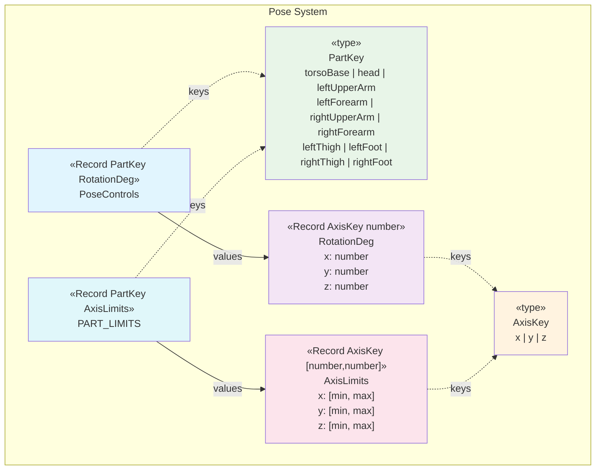
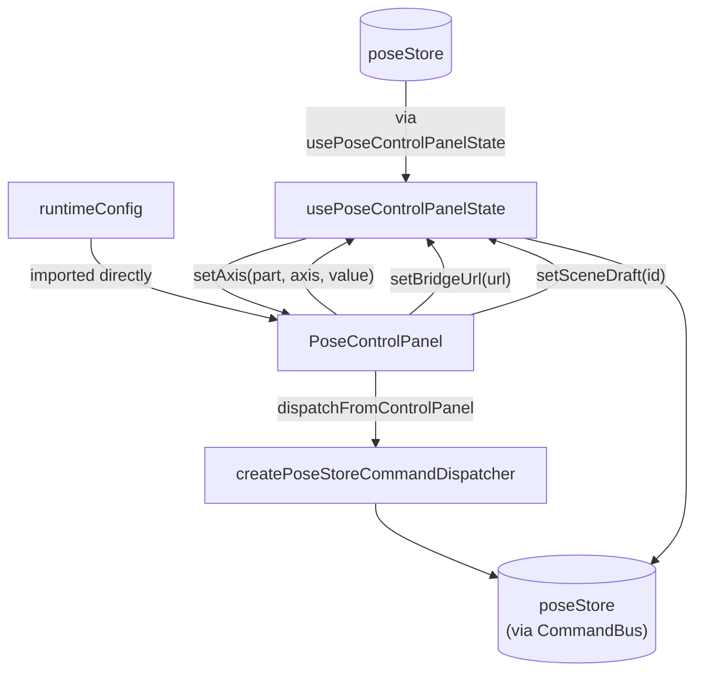
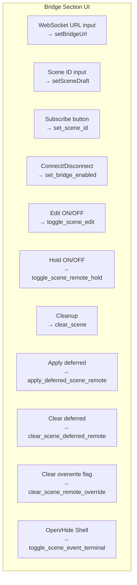
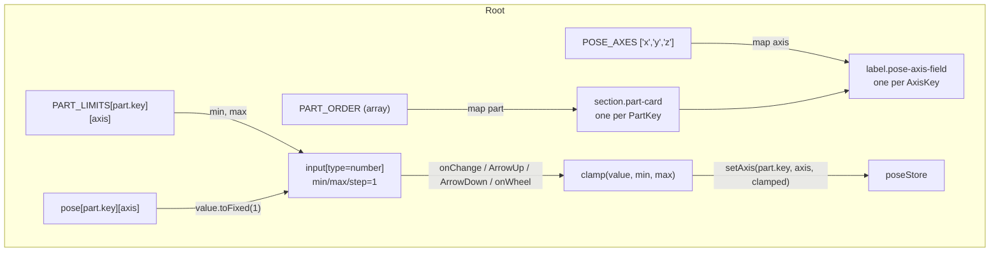
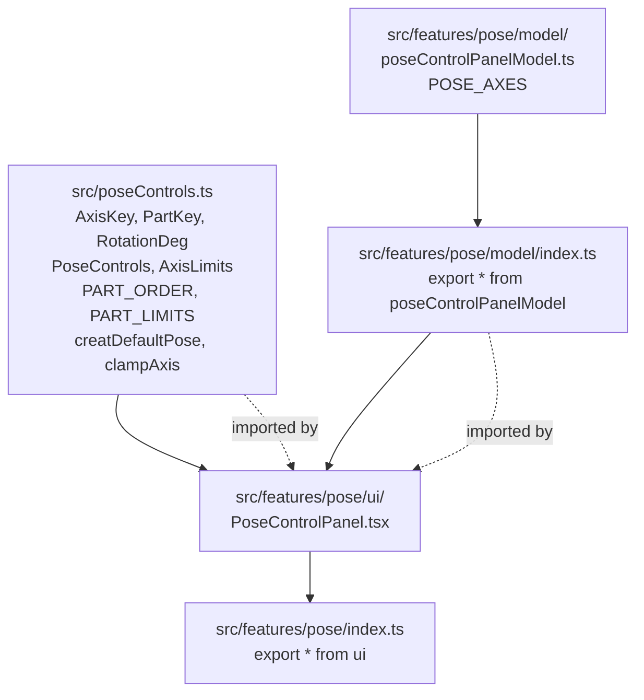

# Pose Controls

Relevant source files

- [](https://github.com/e7canasta/puppet-studio/blob/cdd483bd/src/App.tsx)
- [](https://github.com/e7canasta/puppet-studio/blob/cdd483bd/src/features/pose/index.ts)
- [](https://github.com/e7canasta/puppet-studio/blob/cdd483bd/src/features/pose/model/index.ts)
- [](https://github.com/e7canasta/puppet-studio/blob/cdd483bd/src/features/pose/model/poseControlPanelModel.ts)
- [](https://github.com/e7canasta/puppet-studio/blob/cdd483bd/src/features/pose/ui/PoseControlPanel.tsx)
- [](https://github.com/e7canasta/puppet-studio/blob/cdd483bd/src/poseControls.ts)

This page documents the pose controls data model, constants, and UI panel (`PoseControlPanel`) that allow users to manually manipulate a puppet avatar's joint rotations. It covers the core types and constraint data in `src/poseControls.ts`, the `POSE_AXES` model constant, and the full `PoseControlPanel` React component including its bridge diagnostics section.

For details on how pose data is received over the WebSocket bridge, see [Bridge Communication](https://deepwiki.com/e7canasta/puppet-studio/5-bridge-communication). For the 3D avatar rendering that consumes pose data, see [PuppetScene Component](https://deepwiki.com/e7canasta/puppet-studio/7.1-puppetscene-component). For workspace layout and the panel hosting, see [CAD Workspace Page](https://deepwiki.com/e7canasta/puppet-studio/6.1-cad-workspace-page).

---

## Core Data Structures

All fundamental types, part ordering, axis limits, and utility functions live in a single module.

**Source:** [src/poseControls.ts1-70](https://github.com/e7canasta/puppet-studio/blob/cdd483bd/src/poseControls.ts#L1-L70)

### Type Hierarchy

**Diagram: poseControls.ts type relationships**



Sources: [src/poseControls.ts1-18](https://github.com/e7canasta/puppet-studio/blob/cdd483bd/src/poseControls.ts#L1-L18)

---

### `PART_ORDER`

`PART_ORDER` is an ordered array of `{ key: PartKey; label: string }` objects. The UI iterates this array to render parts in a consistent, anatomically logical order from torso outward.

[src/poseControls.ts19-30](https://github.com/e7canasta/puppet-studio/blob/cdd483bd/src/poseControls.ts#L19-L30)

|Index|`key`|`label`|
|---|---|---|
|0|`torsoBase`|Torso Base|
|1|`head`|Head|
|2|`leftUpperArm`|L Upper Arm|
|3|`leftForearm`|L Forearm|
|4|`rightUpperArm`|R Upper Arm|
|5|`rightForearm`|R Forearm|
|6|`leftThigh`|L Thigh|
|7|`leftFoot`|L Foot|
|8|`rightThigh`|R Thigh|
|9|`rightFoot`|R Foot|

---

### `PART_LIMITS`

`PART_LIMITS` is a `Record<PartKey, AxisLimits>` that defines per-axis `[min, max]` degree bounds for each body part. These are enforced at the point of input in the panel via `clampAxis`.

[src/poseControls.ts32-43](https://github.com/e7canasta/puppet-studio/blob/cdd483bd/src/poseControls.ts#L32-L43)

|`PartKey`|X [min, max]|Y [min, max]|Z [min, max]|
|---|---|---|---|
|`torsoBase`|[-100, 100]|[-70, 70]|[-70, 70]|
|`head`|[-60, 60]|[-75, 75]|[-45, 45]|
|`leftUpperArm`|[-100, 85]|[-95, 95]|[-95, 95]|
|`leftForearm`|[-10, 140]|[-40, 40]|[-55, 55]|
|`rightUpperArm`|[-100, 85]|[-95, 95]|[-95, 95]|
|`rightForearm`|[-10, 140]|[-40, 40]|[-55, 55]|
|`leftThigh`|[-120, 70]|[-60, 60]|[-60, 60]|
|`leftFoot`|[-60, 60]|[-35, 35]|[-35, 35]|
|`rightThigh`|[-120, 70]|[-60, 60]|[-60, 60]|
|`rightFoot`|[-60, 60]|[-35, 35]|[-35, 35]|

---

### `createDefaultPose`

[src/poseControls.ts45-58](https://github.com/e7canasta/puppet-studio/blob/cdd483bd/src/poseControls.ts#L45-L58)

`createDefaultPose(): PoseControls` returns a fresh `PoseControls` object with every axis set to `0`. Used to initialize `poseStore` and to reset the avatar pose (the `reset_pose` command).

```
createDefaultPose() → PoseControls (all axes = 0)
```

---

### `clampAxis`

[src/poseControls.ts60-70](https://github.com/e7canasta/puppet-studio/blob/cdd483bd/src/poseControls.ts#L60-L70)

```
clampAxis(part: PartKey, axis: AxisKey, rawValue: number): number
```

Looks up `PART_LIMITS[part][axis]` and clamps `rawValue` to `[min, max]`. If `rawValue` is not finite, returns `0`. Called by the panel's `onChange` and keyboard/wheel handlers before dispatching a state update.

---

## Model Layer

**Source:** [src/features/pose/model/poseControlPanelModel.ts1-3](https://github.com/e7canasta/puppet-studio/blob/cdd483bd/src/features/pose/model/poseControlPanelModel.ts#L1-L3) [src/features/pose/model/index.ts1](https://github.com/e7canasta/puppet-studio/blob/cdd483bd/src/features/pose/model/index.ts#L1-L1)

`POSE_AXES` is a small constant exported from the model layer:

```
POSE_AXES: AxisKey[] = ['x', 'y', 'z']
```

`PoseControlPanel` imports `POSE_AXES` from the model to iterate the three rotation axes per body part when rendering input fields, keeping the axis enumeration decoupled from `poseControls.ts` re-exports.

---

## PoseControlPanel UI

**Source:** [src/features/pose/ui/PoseControlPanel.tsx1-242](https://github.com/e7canasta/puppet-studio/blob/cdd483bd/src/features/pose/ui/PoseControlPanel.tsx#L1-L242)

`PoseControlPanel` is the primary control surface for both bridge configuration and manual puppet pose editing. It is a single React component that renders two logical regions:

1. **Bridge section** — connection controls, scene subscription, scene edit/hold toggles, deferred queue management, and diagnostics
2. **Pose section** — one card per body part (in `PART_ORDER`), each with three numeric inputs (X/Y/Z in degrees)

### State: `usePoseControlPanelState`

The component destructures its entire state and actions from `usePoseControlPanelState()`. The relevant fields are listed below.

**Diagram: PoseControlPanel data flow**



Sources: [src/features/pose/ui/PoseControlPanel.tsx3-54](https://github.com/e7canasta/puppet-studio/blob/cdd483bd/src/features/pose/ui/PoseControlPanel.tsx#L3-L54)

#### State Fields

|Field|Type|Description|
|---|---|---|
|`bridgeEnabled`|`boolean`|Whether the WebSocket bridge is active|
|`bridgeError`|`string \| null`|Last bridge error message|
|`bridgeLastPoseAt`|`string \| null`|Timestamp of last pose message|
|`bridgeNonZeroAxes`|`number \| null`|Count of non-zero axes in last pose|
|`bridgeSequence`|`number \| null`|Sequence number of last bridge message|
|`bridgeStatus`|`BridgeStatus`|Connection status pill value|
|`bridgeUrl`|`string`|Current WebSocket URL|
|`pose`|`PoseControls`|Current joint rotations|
|`sceneDeferredApplyPendingConfirm`|`boolean`|Deferred apply awaiting confirm|
|`sceneDeferredRemoteCount`|`number`|Items in deferred queue|
|`sceneDeferredRemoteLastAt`|`string \| null`|Timestamp of last deferred item|
|`sceneDeferredRemoteLastKind`|`string \| null`|Kind of last deferred item|
|`sceneDraft`|`string`|Local draft scene ID input value|
|`sceneEditEnabled`|`boolean`|Whether scene editing is unlocked|
|`sceneEventTerminalOpen`|`boolean`|Whether the terminal shell is visible|
|`sceneError`|`string \| null`|Last scene error message|
|`sceneId`|`string`|Active subscribed scene ID|
|`sceneLastEventAt`|`string \| null`|Timestamp of last scene event|
|`scenePlacements`|`Placement[]`|All current scene placements|
|`sceneRedoDepth`|`number`|Depth of redo stack|
|`sceneRemoteHoldEnabled`|`boolean`|Whether remote updates are held|
|`sceneRemoteOverrideAt`|`string \| null`|Timestamp of overwrite flag|
|`sceneRemoteOverrideKind`|`string \| null`|Kind of overwrite event|
|`sceneRevision`|`number \| null`|Scene revision counter|
|`sceneSequence`|`number \| null`|Scene sequence number|
|`sceneSource`|`string`|Origin of current scene data|
|`sceneSpecialistGeneratedAt`|`string \| null`|AI specialist generation timestamp|
|`sceneSpecialistSource`|`string \| null`|Specialist model identifier|
|`sceneSpatialAgeS`|`number \| null`|Age of spatial data in seconds|
|`sceneSpatialFresh`|`boolean \| null`|Whether spatial data is within staleness window|
|`sceneSpatialStaleAfterS`|`number \| null`|Staleness threshold in seconds|
|`sceneSpatialStalePolicy`|`string \| null`|Policy applied when stale|
|`sceneUndoDepth`|`number`|Depth of undo stack|

#### Actions / Callbacks

|Name|Signature|Description|
|---|---|---|
|`dispatchFromControlPanel`|`(cmd: AppCommand) => void`|Routes any `AppCommand` into the command bus|
|`setAxis`|`(part: PartKey, axis: AxisKey, value: number) => void`|Updates a single rotation axis in `poseStore`|
|`setBridgeUrl`|`(url: string) => void`|Updates the bridge URL field|
|`setSceneDraft`|`(id: string) => void`|Updates the local scene ID draft|

---

### Bridge Section

[src/features/pose/ui/PoseControlPanel.tsx65-195](https://github.com/e7canasta/puppet-studio/blob/cdd483bd/src/features/pose/ui/PoseControlPanel.tsx#L65-L195)

The bridge section renders as a `section.part-card.bridge-card` and contains:

**Diagram: Bridge section commands dispatched**




**Inline stats bar** (always visible):

```
scene:{sceneId}  rev:{sceneRevision}  seq:{sceneSequence}
entities:{scenePlacements.length}  deferred:{sceneDeferredRemoteCount}  undo/redo:{sceneUndoDepth}/{sceneRedoDepth}
```

**Conditional controls:**

- The "Apply deferred" / "Clear deferred" button row is only rendered when `sceneDeferredRemoteCount > 0`.
- The "Clear overwrite flag" button is only rendered when `sceneRemoteOverrideAt` is non-null.
- `bridgeError` and `sceneError` messages render as `.bridge-error` paragraphs below the diagnostics if present.

---

### Diagnostics `<details>` Block

[src/features/pose/ui/PoseControlPanel.tsx144-182](https://github.com/e7canasta/puppet-studio/blob/cdd483bd/src/features/pose/ui/PoseControlPanel.tsx#L144-L182)

A collapsible `<details>` element labeled **Diagnostics** exposes runtime metadata not surfaced in the main controls. It reads both from `usePoseControlPanelState` and from `runtimeConfig` directly.

|Label|Source|
|---|---|
|`bridge seq`|`bridgeSequence`|
|`bridge nonZeroAxes`|`bridgeNonZeroAxes`|
|`last pose`|`bridgeLastPoseAt`|
|`scene source`|`sceneSource`|
|`scene last event`|`sceneLastEventAt`|
|`publish local→bridge`|`runtimeConfig.publishLocalSceneCommands`|
|`deferred apply mode`|`runtimeConfig.sceneDeferredApplyMode`|
|`deferred queue limit`|`runtimeConfig.sceneDeferredQueueLimit`|
|`event log limit`|`runtimeConfig.sceneEventLogLimit`|
|`hold release auto-apply`|`runtimeConfig.sceneDeferredAutoApplyOnRelease`|
|`hold release confirm`|`runtimeConfig.sceneDeferredRequireConfirmOnRelease`|
|`remote overwrite`|`sceneRemoteOverrideAt` / `sceneRemoteOverrideKind`|
|`deferred latest`|`sceneDeferredRemoteLastAt` / `sceneDeferredRemoteLastKind`|
|`constraints`|`runtimeConfig.sceneConstraintZones.length`|
|`scene edit default`|`runtimeConfig.defaultSceneEditEnabled`|
|`specialist source`|`sceneSpecialistSource`|
|`specialist generated`|`sceneSpecialistGeneratedAt`|
|`specialist fresh`|`sceneSpatialFresh`|
|`specialist age(s)`|`sceneSpatialAgeS` (2 decimal places)|
|`specialist staleAfter(s)`|`sceneSpatialStaleAfterS`|
|`specialist stalePolicy`|`sceneSpatialStalePolicy`|

For documentation on `runtimeConfig` fields, see [Configuration](https://deepwiki.com/e7canasta/puppet-studio/12-configuration).

---

### Pose Section

[src/features/pose/ui/PoseControlPanel.tsx197-239](https://github.com/e7canasta/puppet-studio/blob/cdd483bd/src/features/pose/ui/PoseControlPanel.tsx#L197-L239)

The component iterates `PART_ORDER` and renders one `section.part-card` per body part. Inside each card, it iterates `POSE_AXES` (`['x', 'y', 'z']`) to render one `<input type="number">` per axis.

**Diagram: Pose section rendering path**



Sources: [src/features/pose/ui/PoseControlPanel.tsx197-239](https://github.com/e7canasta/puppet-studio/blob/cdd483bd/src/features/pose/ui/PoseControlPanel.tsx#L197-L239) [src/poseControls.ts19-43](https://github.com/e7canasta/puppet-studio/blob/cdd483bd/src/poseControls.ts#L19-L43) [src/features/pose/model/poseControlPanelModel.ts1-3](https://github.com/e7canasta/puppet-studio/blob/cdd483bd/src/features/pose/model/poseControlPanelModel.ts#L1-L3)

#### Axis Input Interaction Model

Each axis `<input type="number">` supports three input methods:

|Method|Behavior|
|---|---|
|Direct text entry (`onChange`)|Parses to `Number`; skips if not finite; clamps to `[min, max]`|
|`ArrowUp` key|Increments value by `+1`, clamped|
|`ArrowDown` key|Decrements value by `-1`, clamped|
|Mouse wheel (`onWheel`)|`deltaY < 0` → `+1`; `deltaY >= 0` → `-1`; clamped|

Clamping is performed inline using the local `clamp` function (not `clampAxis`), which calls `Math.max(min, Math.min(max, value))`. The `clampAxis` export in `poseControls.ts` additionally handles non-finite values and is suitable for use outside the UI.

---

## Module Exports

**Diagram: Feature module export path**



Sources: [src/features/pose/index.ts1](https://github.com/e7canasta/puppet-studio/blob/cdd483bd/src/features/pose/index.ts#L1-L1) [src/features/pose/model/index.ts1](https://github.com/e7canasta/puppet-studio/blob/cdd483bd/src/features/pose/model/index.ts#L1-L1) [src/features/pose/model/poseControlPanelModel.ts1-3](https://github.com/e7canasta/puppet-studio/blob/cdd483bd/src/features/pose/model/poseControlPanelModel.ts#L1-L3) [src/poseControls.ts1-70](https://github.com/e7canasta/puppet-studio/blob/cdd483bd/src/poseControls.ts#L1-L70)

