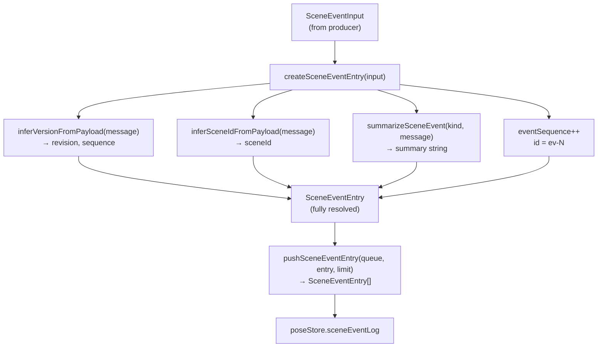
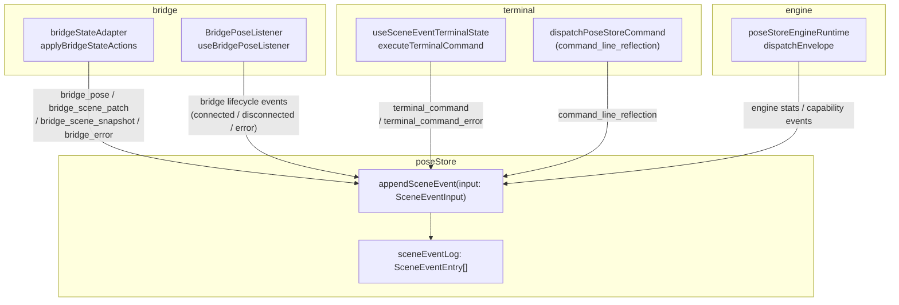
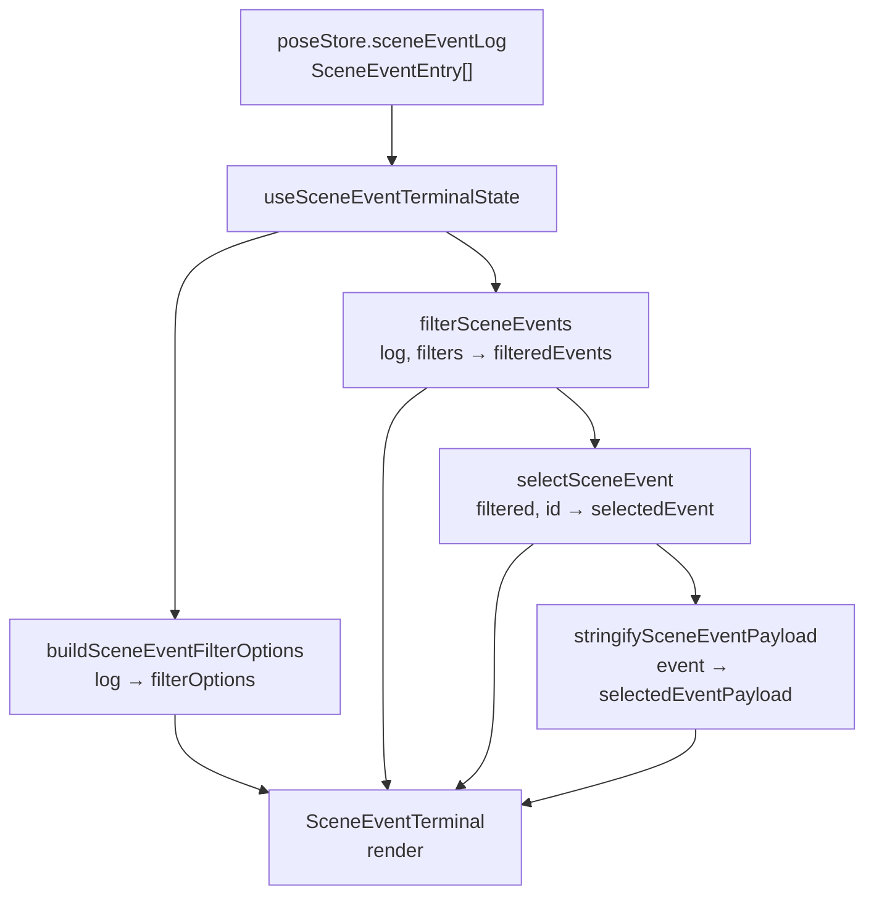

# Observability & Event Logging

Relevant source files

- [](https://github.com/e7canasta/puppet-studio/blob/cdd483bd/lib/analytics/parsing.py)
- [](https://github.com/e7canasta/puppet-studio/blob/cdd483bd/src/core/observability/sceneEventLog.ts)
- [](https://github.com/e7canasta/puppet-studio/blob/cdd483bd/src/features/bridge/model/index.ts)
- [](https://github.com/e7canasta/puppet-studio/blob/cdd483bd/src/features/terminal/hooks/index.ts)
- [](https://github.com/e7canasta/puppet-studio/blob/cdd483bd/src/features/terminal/hooks/useSceneEventTerminalState.ts)
- [](https://github.com/e7canasta/puppet-studio/blob/cdd483bd/src/features/terminal/ui/SceneEventTerminal.tsx)
- [](https://github.com/e7canasta/puppet-studio/blob/cdd483bd/src/features/workspace/ui/components/WorkspaceCommandPalette.tsx)
- [](https://github.com/e7canasta/puppet-studio/blob/cdd483bd/src/styles.css)

This page documents the event logging subsystem used throughout puppet-studio: the `SceneEventEntry` data model, the factory and queue utilities that produce and store entries, the source/summary inference helpers, and how events propagate from producers across the system into the `poseStore` log and the `SceneEventTerminal` UI.

For the `SceneEventTerminal` UI component and its filter/command state, see [page 6.5](https://deepwiki.com/e7canasta/puppet-studio/6.5-scene-event-terminal). For terminal command parsing and dispatch, see [page 6.6](https://deepwiki.com/e7canasta/puppet-studio/6.6-terminal-command-processing).

---

## Overview

Every significant runtime action — inbound bridge messages, outbound commands, lifecycle changes, and user terminal input — is recorded as a `SceneEventEntry` and pushed onto `poseStore.sceneEventLog`. The log is bounded in length, filterable in the terminal, and carries enough context (scene ID, sequence, revision, source) for correlation with external bridge messages.

The core implementation lives in [src/core/observability/sceneEventLog.ts](https://github.com/e7canasta/puppet-studio/blob/cdd483bd/src/core/observability/sceneEventLog.ts)

---

## Data Types

### `SceneEventLevel`

[src/core/observability/sceneEventLog.ts1](https://github.com/e7canasta/puppet-studio/blob/cdd483bd/src/core/observability/sceneEventLog.ts#L1-L1)

```
'debug' | 'error' | 'info' | 'warn'
```

Ordered severity. `debug` is the lowest verbosity; `error` is the highest. The terminal UI provides a level filter over these four values.

---

### `SceneEventEntry`

[src/core/observability/sceneEventLog.ts3-14](https://github.com/e7canasta/puppet-studio/blob/cdd483bd/src/core/observability/sceneEventLog.ts#L3-L14)

The fully resolved, stored form of an event. Every field is populated before the entry is appended to the log.

|Field|Type|Description|
|---|---|---|
|`id`|`string`|Monotonic string ID, e.g. `ev-42`|
|`at`|`string`|ISO 8601 timestamp|
|`kind`|`string`|Event kind string (e.g. `bridge_pose`)|
|`level`|`SceneEventLevel`|Severity|
|`source`|`string`|Dot-separated producer path (e.g. `bridge.scene`)|
|`summary`|`string`|Human-readable one-liner|
|`sceneId`|`string \| null`|Scene the event belongs to|
|`sequence`|`number \| null`|Bridge message sequence counter|
|`revision`|`number \| null`|Scene revision at time of event|
|`payload`|`unknown`|Raw message payload (optional, shown in terminal detail panel)|

---

### `SceneEventInput`

[src/core/observability/sceneEventLog.ts16-26](https://github.com/e7canasta/puppet-studio/blob/cdd483bd/src/core/observability/sceneEventLog.ts#L16-L26)

The looser input shape accepted by producers. Most fields are optional and are inferred from `message` if absent.

|Field|Required|Notes|
|---|---|---|
|`kind`|✅|Must always be provided|
|`source`|✅|Fallback source if not inferrable from payload|
|`level`|❌|Defaults to `'info'`|
|`message`|❌|Raw payload; used for summary and version inference|
|`summary`|❌|If absent, auto-generated by `summarizeSceneEvent`|
|`at`|❌|Defaults to `new Date().toISOString()`|
|`sceneId`|❌|Inferred from `message` if absent|
|`sequence`|❌|Inferred from `message` if absent|
|`revision`|❌|Inferred from `message` if absent|

---

## Factory Functions

**Entry creation lifecycle**





Sources: [src/core/observability/sceneEventLog.ts142-167](https://github.com/e7canasta/puppet-studio/blob/cdd483bd/src/core/observability/sceneEventLog.ts#L142-L167)

---

### `createSceneEventEntry`

[src/core/observability/sceneEventLog.ts142-160](https://github.com/e7canasta/puppet-studio/blob/cdd483bd/src/core/observability/sceneEventLog.ts#L142-L160)

Accepts a `SceneEventInput` and returns a fully populated `SceneEventEntry`.

- Calls `inferVersionFromPayload` to extract `revision`/`sequence` from `input.message` when not explicitly provided.
- Calls `inferSceneIdFromPayload` to extract `sceneId` from `input.message` when not explicitly provided.
- Calls `summarizeSceneEvent` to build `summary` when `input.summary` is absent.
- Increments the module-level `eventSequence` counter and formats an ID as `` `ev-${eventSequence}` ``.
- Stores `input.message` verbatim as `payload`.

The ID counter (`eventSequence`) is module-scoped and never reset during the page lifetime, guaranteeing uniqueness within a session.

---

### `pushSceneEventEntry`

[src/core/observability/sceneEventLog.ts162-167](https://github.com/e7canasta/puppet-studio/blob/cdd483bd/src/core/observability/sceneEventLog.ts#L162-L167)

Appends a `SceneEventEntry` to an existing queue and enforces a maximum length by trimming the oldest entries. The `limit` parameter comes from `poseStore` configuration (controlled by `runtimeConfig`).

```
pushSceneEventEntry(queue, entry, limit) → SceneEventEntry[]
```

If `limit` is not a positive integer, it defaults to `1` (safe fallback). The function is pure — it returns a new array and does not mutate the input.

---

## Summary and Source Inference

### `summarizeSceneEvent`

[src/core/observability/sceneEventLog.ts101-129](https://github.com/e7canasta/puppet-studio/blob/cdd483bd/src/core/observability/sceneEventLog.ts#L101-L129)

Produces a short human-readable string from a `kind` and raw `payload`. Logic is dispatch-based on `kind`:

|Kind(s)|Summary strategy|
|---|---|
|`bridge_pose`|`seq:N axes:N` from `summarizePose`|
|`bridge_scene_patch`, `scene_patch`, `bridge_scene_snapshot`, `scene_snapshot`, `scene_update`|`upserts:N removes:N` or `entities:N` or `placements:N` from `summarizeCounts`|
|`bridge_error`|`error:<detail>` from `summarizeError`|
|`scene_subscribe`|`subscribe scene:<id>`|
|_(any other kind)_|Returns `kind` unchanged|

---

### `inferSceneEventSource`

[src/core/observability/sceneEventLog.ts131-140](https://github.com/e7canasta/puppet-studio/blob/cdd483bd/src/core/observability/sceneEventLog.ts#L131-L140)

Determines the `source` string for an event. Precedence:

1. Explicit `source`, `specialist`, or `producer` field in `payload` (checked via `asRecord`).
2. Kind-based defaults:

|Kind|Default source|
|---|---|
|`bridge_pose`|`bridge.pose`|
|`bridge_scene_patch`, `scene_patch`|`bridge.scene_patch`|
|`bridge_scene_snapshot`, `scene_snapshot`, `scene_update`|`bridge.scene`|
|`scene_subscribe`|`frontend.scene`|
|_(any other)_|`fallbackSource` argument|

---

## Event Producers

The diagram below maps the known event producers to the code entities that call `appendSceneEvent` on `poseStore`.




Sources: [src/features/terminal/hooks/useSceneEventTerminalState.ts143-156](https://github.com/e7canasta/puppet-studio/blob/cdd483bd/src/features/terminal/hooks/useSceneEventTerminalState.ts#L143-L156) [src/features/bridge/model/index.ts1](https://github.com/e7canasta/puppet-studio/blob/cdd483bd/src/features/bridge/model/index.ts#L1-L1)

---

### Known Event Kinds

|Kind|Producer|Level|
|---|---|---|
|`bridge_pose`|Bridge inbound adapter|`info`|
|`bridge_scene_snapshot`|Bridge inbound adapter|`info`|
|`bridge_scene_patch`|Bridge inbound adapter|`info`|
|`bridge_error`|Bridge inbound adapter|`warn`|
|`bridge_connected`|`BridgePoseListener`|`info`|
|`bridge_disconnected`|`BridgePoseListener`|`warn`|
|`terminal_command`|`executeTerminalCommand`|`info`|
|`terminal_command_error`|`executeTerminalCommand`|`warn`|
|`command_line_reflection`|`dispatchPoseStoreCommand`|`info`|

---

## Integration with `poseStore`

`poseStore` exposes these observability-related state fields and actions (see [page 3](https://deepwiki.com/e7canasta/puppet-studio/3-state-management) for the full store reference):

|Field / Action|Type|Purpose|
|---|---|---|
|`sceneEventLog`|`SceneEventEntry[]`|Bounded log of all events|
|`sceneEventLogPaused`|`boolean`|When `true`, new events are counted in `sceneEventDroppedWhilePaused` but not appended|
|`sceneEventAutoScroll`|`boolean`|Terminal UI scrolls to newest event|
|`sceneEventDroppedWhilePaused`|`number`|Count of events dropped during pause|
|`sceneEventTerminalOpen`|`boolean`|Terminal panel visibility|
|`appendSceneEvent(input)`|action|Creates and pushes an entry via `createSceneEventEntry` + `pushSceneEventEntry`|
|`clearSceneEventLog()`|action|Empties the log|

The `appendSceneEvent` action is the single integration point — all producers call this action rather than writing to `sceneEventLog` directly.

---

## Consumption in the Terminal

The `useSceneEventTerminalState` hook ([src/features/terminal/hooks/useSceneEventTerminalState.ts](https://github.com/e7canasta/puppet-studio/blob/cdd483bd/src/features/terminal/hooks/useSceneEventTerminalState.ts)) reads `sceneEventLog` from `poseStore` and applies client-side filters before passing entries to `SceneEventTerminal`.





Sources: [src/features/terminal/hooks/useSceneEventTerminalState.ts66-79](https://github.com/e7canasta/puppet-studio/blob/cdd483bd/src/features/terminal/hooks/useSceneEventTerminalState.ts#L66-L79) [src/features/terminal/ui/SceneEventTerminal.tsx230-275](https://github.com/e7canasta/puppet-studio/blob/cdd483bd/src/features/terminal/ui/SceneEventTerminal.tsx#L230-L275)

### Filter Dimensions

`filterSceneEvents` supports filtering on five independent dimensions simultaneously:

|Filter|State field|Options source|
|---|---|---|
|Source|`sourceFilter`|`filterOptions.sources` (distinct values in log)|
|Kind|`kindFilter`|`filterOptions.kinds`|
|Scene|`sceneFilter`|`filterOptions.scenes`|
|Level|`levelFilter`|Fixed: `error`, `warn`, `info`, `debug`|
|Text search|`searchFilter`|Free-text match on source, kind, scene, summary|

All filters default to `'all'` (no filtering). The `buildSceneEventFilterOptions` helper builds the option lists by scanning the current log for distinct values.

---

## Terminal Event Logging on Command Execution

When the user runs a command in the terminal, `executeTerminalCommand` in `useSceneEventTerminalState` both dispatches `AppCommand`s and records the result as a scene event:

[src/features/terminal/hooks/useSceneEventTerminalState.ts133-173](https://github.com/e7canasta/puppet-studio/blob/cdd483bd/src/features/terminal/hooks/useSceneEventTerminalState.ts#L133-L173)

- **Kind**: `terminal_command` on success, `terminal_command_error` on failure.
- **Level**: `info` on success, `warn` on failure.
- **Source**: `frontend.command_line`
- **Payload** (`message`): `{ input, message, commands }` — the raw input string, result message, and array of dispatched `AppCommand`s.
- **Summary**: `` `cmd ${result.input} -> ${result.message}` ``

The in-memory `commandHistory` (capped at 120 entries) is separate from `sceneEventLog` and is local state in the hook; it is not persisted to `poseStore`.

---

## ID Generation

[src/core/observability/sceneEventLog.ts28-29](https://github.com/e7canasta/puppet-studio/blob/cdd483bd/src/core/observability/sceneEventLog.ts#L28-L29)

Event IDs are generated using a module-level integer counter:

```
const EVENT_PREFIX = 'ev'
let eventSequence = 0
// each createSceneEventEntry call: eventSequence += 1 → id = `ev-${eventSequence}`
```

IDs are not UUIDs — they are compact monotonic strings (`ev-1`, `ev-2`, …). They are unique within a browser session but reset on page reload. The terminal uses `id` as the React `key` and as the `selectedEventId` cursor.

Sources: [src/core/observability/sceneEventLog.ts28-29](https://github.com/e7canasta/puppet-studio/blob/cdd483bd/src/core/observability/sceneEventLog.ts#L28-L29) [src/core/observability/sceneEventLog.ts147](https://github.com/e7canasta/puppet-studio/blob/cdd483bd/src/core/observability/sceneEventLog.ts#L147-L147)

