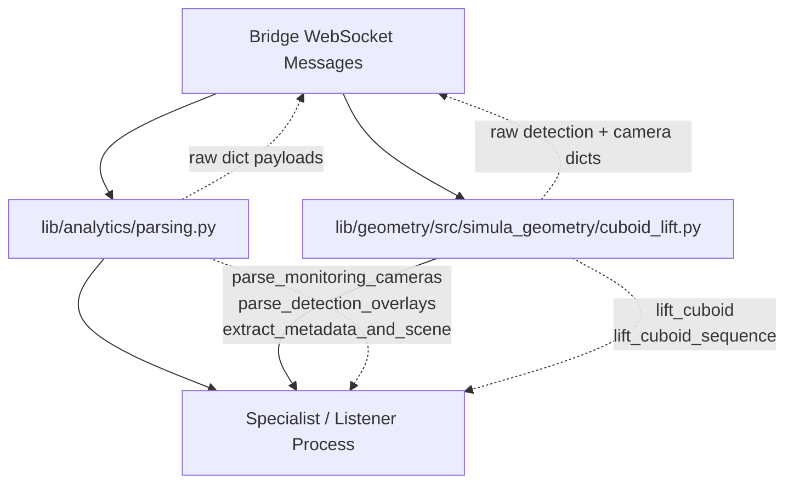
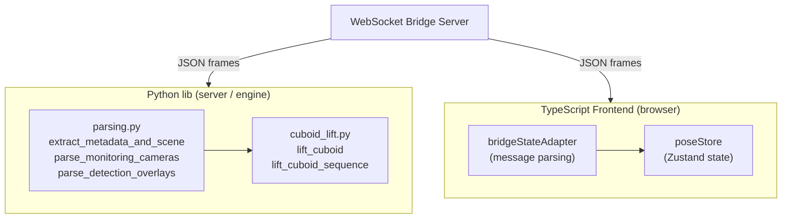
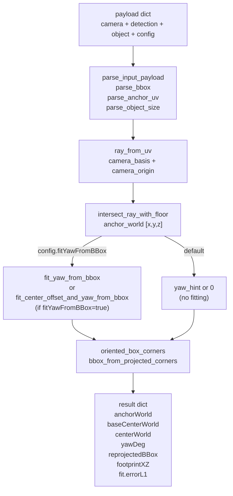
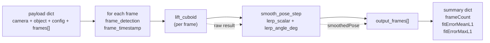

# Python Analytics Library

Relevant source files

- [](https://github.com/e7canasta/puppet-studio/blob/cdd483bd/lib/analytics/parsing.py)
- [](https://github.com/e7canasta/puppet-studio/blob/cdd483bd/lib/geometry/src/simula_geometry/cuboid_lift.py)
- [](https://github.com/e7canasta/puppet-studio/blob/cdd483bd/src/core/observability/sceneEventLog.ts)
- [](https://github.com/e7canasta/puppet-studio/blob/cdd483bd/src/core/scene-domain/scenePatch.ts)
- [](https://github.com/e7canasta/puppet-studio/blob/cdd483bd/src/planogram/sync.ts)
- [](https://github.com/e7canasta/puppet-studio/blob/cdd483bd/src/styles.css)

This page gives an overview of the `lib/` Python package: its purpose, structure, modules, and relationship to the TypeScript frontend. Detailed documentation of individual modules is split across sub-pages: for data parsing utilities see [Data Parsing Utilities](https://deepwiki.com/e7canasta/puppet-studio/13.1-data-parsing-utilities), and for the 3D lifting algorithm see [Cuboid Lifting](https://deepwiki.com/e7canasta/puppet-studio/13.2-cuboid-lifting).

---

## Purpose

The `lib/` directory contains a standalone Python library that operates on the same bridge message protocol as the TypeScript frontend. While the frontend visualizes and edits scene state in real time, the Python library provides **offline and server-side analytics** capabilities:

1. **Protocol ingestion** — parsing bridge messages (snapshots, patches, camera definitions, detection overlays) into well-typed Python dictionaries.
2. **Spatial estimation** — lifting 2D camera detections into approximate 3D poses using geometric ray-plane intersection and optional bbox-fitting optimization.

These two concerns are packaged as separate Python modules so they can be used independently.

---

## Package Structure

The library is organized into two sub-packages under `lib/`:

|Sub-package|Path|Purpose|
|---|---|---|
|`analytics`|`lib/analytics/parsing.py`|Protocol-level parsing of bridge messages|
|`simula_geometry`|`lib/geometry/src/simula_geometry/cuboid_lift.py`|2.5D cuboid pose estimation from camera detections|

**Module dependency diagram**



Sources: `lib/analytics/parsing.py`, `lib/geometry/src/simula_geometry/cuboid_lift.py`

---

## Relationship to the TypeScript Frontend

The Python library and the TypeScript frontend share the same bridge message protocol but operate in different execution environments and roles.

**System context diagram**



Both the TypeScript `parseBridgeInboundMessage` pipeline (see [Message Parsing & State Adapter](https://deepwiki.com/e7canasta/puppet-studio/5.2-message-parsing-and-state-adapter)) and the Python `extract_metadata_and_scene` / `parse_monitoring_cameras` functions recognise the same field aliases (e.g. `sceneId`/`scene_id`, `cameraId`/`camera_id`, `planPositionM`/`positionM`).

Sources: `lib/analytics/parsing.py:158-207`, `lib/geometry/src/simula_geometry/cuboid_lift.py:556-667`

---

## Module Overview

### `lib/analytics/parsing.py`

This module provides reusable, type-safe helpers for ingesting bridge message data in Python specialist processes.

|Function|Signature summary|Role|
|---|---|---|
|`to_str`|`(value) → str \| None`|Non-empty string or `None`|
|`to_float`|`(value, default) → float \| None`|Finite float or default|
|`clamp01`|`(value) → float`|Clamp to `[0.0, 1.0]`|
|`angle_delta_deg`|`(a, b) → float`|Shortest angular difference|
|`parse_monitoring_cameras`|`(raw) → dict[str, dict]`|Camera definitions keyed by ID|
|`parse_detection_overlays`|`(raw) → list[dict]`|Detection overlays with `cameraId` and `boxes`|
|`parse_entity_map`|`(raw_entities) → dict[str, dict]`|Entity lookup by `trackId`/`objectId`/`id`|
|`extract_metadata_and_scene`|`(message) → tuple`|`(scene_id, metadata, entity_like, removes)`|

Full documentation: [Data Parsing Utilities](https://deepwiki.com/e7canasta/puppet-studio/13.1-data-parsing-utilities)

Sources: `lib/analytics/parsing.py:20-207`

---

### `lib/geometry/src/simula_geometry/cuboid_lift.py`

This module implements a **2.5D cuboid lifting** algorithm. It takes a calibrated camera description, a 2D bounding box detection, and known object dimensions, and returns an estimated 3D pose constrained to the floor plane.

The module also exposes a CLI entry point (`main`) that reads a JSON payload file and prints the result.

**Key public functions:**

|Function|Description|
|---|---|
|`lift_cuboid(payload)`|Single-detection lift; returns `anchorWorld`, `baseCenterWorld`, `yawDeg`, `reprojectedBBox`, fit statistics|
|`lift_cuboid_sequence(payload)`|Batch lift over a `frames` list; applies optional lerp-based pose smoothing per frame|

**Supporting geometry functions (internal):**

|Function|Role|
|---|---|
|`camera_basis(camera)`|Computes `(right, up, forward)` unit vectors from yaw/pitch/roll|
|`camera_origin(camera)`|Extracts world position `(x, y, z)` from `planPositionM` + `heightM`|
|`ray_from_uv(camera, u, v)`|Emits a world-space ray for a given image UV coordinate|
|`intersect_ray_with_floor(origin, direction, floor_y)`|Ray-plane intersection at `y = floor_y`|
|`oriented_box_corners(...)`|Computes 8 world-space corners of an oriented box|
|`project_world_point(world_point, camera)`|Projects a 3D point back to image UV|
|`bbox_from_projected_corners(corners, camera)`|Computes an axis-aligned reprojected bounding box|
|`fit_yaw_from_bbox(...)`|Coarse+fine search over yaw to minimize L1 bbox error|
|`fit_center_offset_and_yaw_from_bbox(...)`|Joint search over yaw and depth offset|
|`smooth_pose_step(previous, ...)`|One lerp step on `(centerX, centerZ, yawDeg)`|

Full documentation: [Cuboid Lifting](https://deepwiki.com/e7canasta/puppet-studio/13.2-cuboid-lifting)

Sources: `lib/geometry/src/simula_geometry/cuboid_lift.py:556-825`

---

## Data Flow: Single Detection

**`lift_cuboid` internal data flow**



Sources: `lib/geometry/src/simula_geometry/cuboid_lift.py:556-667`

---

## Data Flow: Batch Sequence

**`lift_cuboid_sequence` batch processing flow**





Smoothing is controlled by `config.smoothCenterAlpha` and `config.smoothYawAlpha` (both default `1.0` = no smoothing). When alpha is less than `1.0`, `smooth_pose_step` blends the new position and yaw toward the previous frame's smoothed pose using linear interpolation.

Sources: `lib/geometry/src/simula_geometry/cuboid_lift.py:670-781`

---

## Shared Protocol Conventions

Both Python modules follow the same field-alias conventions used in the TypeScript bridge layer. The table below shows which aliases each Python parser accepts compared to what the TypeScript frontend uses:

|Concept|Python aliases accepted|TypeScript aliases (sync.ts)|
|---|---|---|
|Camera ID|`id`, `cameraId`, `camera_id`|`id`, `cameraId`, `camera_id`|
|Plan position|`planPositionM`, `positionM`, `position`|`planPositionM`, `positionM`|
|Camera height|`heightM`, `height`, `mountHeightM`|`heightM`, `height`, `mountHeightM`|
|Vertical FOV|`fovDeg`, `fov`, `verticalFovDeg`|`fovDeg`, `fov`, `verticalFovDeg`|
|Track ID|`trackId`, `track_id`|`trackId`, `track_id`|
|Anchor point|`anchorUV`, `anchor_uv`, `footpointUV`|`anchorUV`, `anchor_uv`, `footpointUV`|
|Scene ID|`sceneId`, `scene_id`|`sceneId`, `scene_id`|

Sources: `lib/analytics/parsing.py:53-89`, `lib/geometry/src/simula_geometry/cuboid_lift.py:94-114`, `src/planogram/sync.ts:211-237`

---

## CLI Usage

`cuboid_lift.py` can be run directly as a command-line tool:

```
python cuboid_lift.py --input-json payload.json [--mode auto|single|batch] [--pretty]
```

- `--mode auto` (default): detects batch mode if `payload.frames` is a list, otherwise single mode.
- `--pretty`: pretty-prints the JSON output with indentation.

The `main` function is at [lib/geometry/src/simula_geometry/cuboid_lift.py801-820](https://github.com/e7canasta/puppet-studio/blob/cdd483bd/lib/geometry/src/simula_geometry/cuboid_lift.py#L801-L820)

