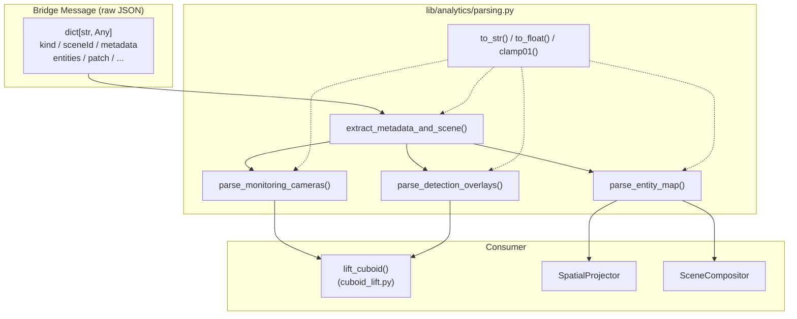
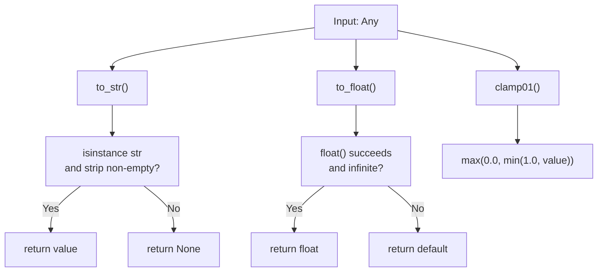

# Data Parsing Utilities

Relevant source files

- [](https://github.com/e7canasta/puppet-studio/blob/cdd483bd/lib/analytics/parsing.py)
- [](https://github.com/e7canasta/puppet-studio/blob/cdd483bd/lib/geometry/src/simula_geometry/cuboid_lift.py)
- [](https://github.com/e7canasta/puppet-studio/blob/cdd483bd/src/core/observability/sceneEventLog.ts)
- [](https://github.com/e7canasta/puppet-studio/blob/cdd483bd/src/core/scene-domain/scenePatch.ts)
- [](https://github.com/e7canasta/puppet-studio/blob/cdd483bd/src/planogram/sync.ts)
- [](https://github.com/e7canasta/puppet-studio/blob/cdd483bd/src/styles.css)

This page documents `lib/analytics/parsing.py`, the shared parsing utility module for the Python analytics library (`lib/`). It covers all exported functions: value converters (`to_str`, `to_float`, `clamp01`, `angle_delta_deg`) and protocol parsers (`parse_monitoring_cameras`, `parse_detection_overlays`, `parse_entity_map`, `extract_metadata_and_scene`).

For the TypeScript-side counterparts that perform equivalent parsing on the frontend, see the Bridge Scene Sync page ([8.3](https://deepwiki.com/e7canasta/puppet-studio/8.3-scene-sync)). For the cuboid lifting algorithm that consumes the output of these parsers, see [13.2](https://deepwiki.com/e7canasta/puppet-studio/13.2-cuboid-lifting). For an overview of the Python library as a whole, see [13](https://deepwiki.com/e7canasta/puppet-studio/13-python-analytics-library).

---

## Purpose

`parsing.py` centralizes all field extraction and normalization logic shared across Python specialists. It was refactored out of `mock-client/cuboid_lift_listener.py` to prevent duplication between the `SpatialProjector` and `SceneCompositor` components. Every function is stateless and pure.

The module handles two categories of work:

|Category|Functions|
|---|---|
|**Value converters**|`to_str`, `to_float`, `clamp01`, `angle_delta_deg`|
|**Protocol parsers**|`parse_monitoring_cameras`, `parse_detection_overlays`, `parse_entity_map`, `extract_metadata_and_scene`|

Sources: [lib/analytics/parsing.py1-8](https://github.com/e7canasta/puppet-studio/blob/cdd483bd/lib/analytics/parsing.py#L1-L8)

---

## Position in the Data Flow

The parsers in this module sit at the boundary between raw bridge message JSON and the structured data consumed by specialist algorithms like `lift_cuboid`.

**Diagram: Data Parsing Utilities — Position in Pipeline**



Sources: [lib/analytics/parsing.py1-208](https://github.com/e7canasta/puppet-studio/blob/cdd483bd/lib/analytics/parsing.py#L1-L208) [lib/geometry/src/simula_geometry/cuboid_lift.py449-463](https://github.com/e7canasta/puppet-studio/blob/cdd483bd/lib/geometry/src/simula_geometry/cuboid_lift.py#L449-L463)

---

## Value Converters

These are low-level building blocks used internally by all protocol parsers. They are also suitable for direct use in any specialist that needs safe type coercion.

### `to_str`

[lib/analytics/parsing.py20-24](https://github.com/e7canasta/puppet-studio/blob/cdd483bd/lib/analytics/parsing.py#L20-L24)

```
to_str(value: Any) -> str | None
```

Returns `value` unchanged if it is a non-empty string (after `strip()`); returns `None` otherwise. Used whenever a field may be missing, `None`, or a non-string type.

### `to_float`

[lib/analytics/parsing.py27-35](https://github.com/e7canasta/puppet-studio/blob/cdd483bd/lib/analytics/parsing.py#L27-L35)

```
to_float(value: Any, default: float | None = None) -> float | None
```

Attempts `float(value)`. If conversion fails or the result is not finite (`math.isfinite`), returns `default`. The `default` parameter is `None` unless overridden, so callers can distinguish "missing" from `0.0`.

### `clamp01`

[lib/analytics/parsing.py38-40](https://github.com/e7canasta/puppet-studio/blob/cdd483bd/lib/analytics/parsing.py#L38-L40)

```
clamp01(value: float) -> float
```

Clamps to `[0.0, 1.0]` using `max(0.0, min(1.0, value))`. Used for all UV coordinates and normalized bounding-box values before they are stored or passed to geometry routines.

### `angle_delta_deg`

[lib/analytics/parsing.py43-46](https://github.com/e7canasta/puppet-studio/blob/cdd483bd/lib/analytics/parsing.py#L43-L46)

```
angle_delta_deg(a: float, b: float) -> float
```

Returns the absolute shortest angular distance between two angles in degrees. The wrap-around arithmetic `(a - b + 180) % 360 - 180` handles the 359°→1° case correctly. Used by specialists that compare predicted vs. observed yaw to decide whether a tracked pose has changed significantly.




**Diagram: Value Converter Decision Logic**

Sources: [lib/analytics/parsing.py20-46](https://github.com/e7canasta/puppet-studio/blob/cdd483bd/lib/analytics/parsing.py#L20-L46)

---

## Protocol Parsers

### `parse_monitoring_cameras`

[lib/analytics/parsing.py53-89](https://github.com/e7canasta/puppet-studio/blob/cdd483bd/lib/analytics/parsing.py#L53-L89)

```
parse_monitoring_cameras(raw: Any) -> dict[str, dict[str, Any]]
```

Parses the `monitoringCameras` (or `cameras`) field from a bridge `scene_snapshot` or `scene_patch` message and returns a `dict` keyed by camera ID.

**Accepted input shapes:** a `list` of camera dicts, or a single camera `dict` (which is wrapped into a one-element list).

For each entry, the parser:

1. Extracts `id` via `to_str`, accepting `id`, `cameraId`, or `camera_id`.
2. Requires `planPositionM` to be a list of at least two elements; entries missing it are skipped.
3. Applies `to_float` with sensible defaults for all numeric fields.

|Output field|Source keys tried|Default|
|---|---|---|
|`id`|`id`, `cameraId`, `camera_id`|required|
|`planPositionM`|`planPositionM`|required|
|`heightM`|`heightM`, `height`, `mountHeightM`|`2.7`|
|`yawDeg`|`yawDeg`, `yaw`|`0.0`|
|`pitchDeg`|`pitchDeg`, `pitch`|`-35.0`|
|`rollDeg`|`rollDeg`, `roll`|`0.0`|
|`fovDeg`|`fovDeg`, `fov`|`65.0`|
|`aspectRatio`|`aspectRatio`, `aspect`|`16/9`|

The returned dict is directly compatible with the `camera` argument expected by `lift_cuboid` in `cuboid_lift.py`.

Sources: [lib/analytics/parsing.py53-89](https://github.com/e7canasta/puppet-studio/blob/cdd483bd/lib/analytics/parsing.py#L53-L89) [lib/geometry/src/simula_geometry/cuboid_lift.py125-151](https://github.com/e7canasta/puppet-studio/blob/cdd483bd/lib/geometry/src/simula_geometry/cuboid_lift.py#L125-L151)

---

### `parse_detection_overlays`

[lib/analytics/parsing.py96-125](https://github.com/e7canasta/puppet-studio/blob/cdd483bd/lib/analytics/parsing.py#L96-L125)

```
parse_detection_overlays(raw: Any) -> list[dict[str, Any]]
```

Parses the `cameraDetections` or `detectionOverlays` field from bridge messages. Returns a list of overlay dicts, each containing a `cameraId`, a `boxes` list (raw, not further normalized), and an optional `timestamp`.

**Accepted input shapes:** list of overlay dicts, or a single overlay dict.

The function does not normalize the individual detection boxes inside `boxes`; that normalization is left to downstream consumers (e.g., `parse_bbox` and `parse_anchor_uv` in `cuboid_lift.py`).

|Output field|Source keys tried|Notes|
|---|---|---|
|`cameraId`|`cameraId`, `camera_id`, `id`|required; entry skipped if absent|
|`boxes`|`boxes`, `detections`|kept as-is|
|`timestamp`|`timestamp`|optional|

Sources: [lib/analytics/parsing.py96-125](https://github.com/e7canasta/puppet-studio/blob/cdd483bd/lib/analytics/parsing.py#L96-L125)

---

### `parse_entity_map`

[lib/analytics/parsing.py132-151](https://github.com/e7canasta/puppet-studio/blob/cdd483bd/lib/analytics/parsing.py#L132-L151)

```
parse_entity_map(raw_entities: Any) -> dict[str, dict[str, Any]]
```

Converts a flat list of entity dicts into a lookup map. Each entity may be indexed by up to three keys: `trackId` (or `track_id`), `objectId` (or `object_id`), and `id`. All non-`None` keys from an entity are inserted into the map pointing to the same entity dict.

This means a single entity can be found by any of its identifiers, which matches the multi-key identity model used by the TypeScript `findPlacementIndex` function in `src/planogram/sync.ts`.

**Example structure:**

```
{
  "trk-42":   { "trackId": "trk-42", "objectId": "obj-7", "id": "ent-1", ... },
  "obj-7":    { same dict },
  "ent-1":    { same dict },
}
```

Sources: [lib/analytics/parsing.py132-151](https://github.com/e7canasta/puppet-studio/blob/cdd483bd/lib/analytics/parsing.py#L132-L151) [src/planogram/sync.ts370-388](https://github.com/e7canasta/puppet-studio/blob/cdd483bd/src/planogram/sync.ts#L370-L388)

---

### `extract_metadata_and_scene`

[lib/analytics/parsing.py158-207](https://github.com/e7canasta/puppet-studio/blob/cdd483bd/lib/analytics/parsing.py#L158-L207)

```
extract_metadata_and_scene(
    message: dict[str, Any]
) -> tuple[str | None, dict[str, Any] | None, list[Any] | None, list[Any] | None]
```

The top-level dispatcher for bridge message decomposition. Returns a 4-tuple:

```
(scene_id, metadata, entity_like, removes)
```

Behavior depends on `message["kind"]`:

|`kind`|`scene_id`|`metadata`|`entity_like`|`removes`|
|---|---|---|---|---|
|`bridge_scene_snapshot`|`message.sceneId`|`message.metadata`|`message.entities`|`None`|
|`bridge_scene_patch`|`message.sceneId`|`message.patch.metadata`|`message.patch.upserts`|`message.patch.removes`|
|anything else|`None`|`None`|`None`|`None`|

Any field that is not present or is not the expected type is returned as `None`. Callers must handle all `None` values.

The `scene_id` is extracted by `to_str`, accepting both `sceneId` and `scene_id` key spellings.

---

## Function Dependency Map

**Diagram: Internal Dependencies and Call Sites**

> **Note:** `clamp01` and `get_number` (the rough equivalent of `to_float`) are also independently defined in `cuboid_lift.py` [lib/geometry/src/simula_geometry/cuboid_lift.py28-91](https://github.com/e7canasta/puppet-studio/blob/cdd483bd/lib/geometry/src/simula_geometry/cuboid_lift.py#L28-L91) `parsing.py` provides the canonical shared versions; `cuboid_lift.py` is self-contained by design.

Sources: [lib/analytics/parsing.py1-208](https://github.com/e7canasta/puppet-studio/blob/cdd483bd/lib/analytics/parsing.py#L1-L208) [lib/geometry/src/simula_geometry/cuboid_lift.py28-114](https://github.com/e7canasta/puppet-studio/blob/cdd483bd/lib/geometry/src/simula_geometry/cuboid_lift.py#L28-L114)

---

## Relationship to TypeScript Counterparts

The parsing logic in `parsing.py` mirrors equivalent TypeScript functions in `src/planogram/sync.ts`. The two implementations are independent and must be kept in sync manually when the bridge protocol changes.

|Python (`parsing.py`)|TypeScript (`sync.ts`)|Purpose|
|---|---|---|
|`parse_monitoring_cameras`|`parseMonitoringCameras` [src/planogram/sync.ts239-245](https://github.com/e7canasta/puppet-studio/blob/cdd483bd/src/planogram/sync.ts#L239-L245)|Camera def list → keyed map / typed array|
|`parse_detection_overlays`|`parseCameraDetectionOverlays` [src/planogram/sync.ts323-329](https://github.com/e7canasta/puppet-studio/blob/cdd483bd/src/planogram/sync.ts#L323-L329)|Detection overlay list normalization|
|`parse_entity_map`|`findPlacementIndex` [src/planogram/sync.ts370-388](https://github.com/e7canasta/puppet-studio/blob/cdd483bd/src/planogram/sync.ts#L370-L388)|Multi-key entity identity lookup|
|`extract_metadata_and_scene`|`parseSceneSnapshotFromBridge` / `applyScenePatchFromBridge` [src/planogram/sync.ts411-550](https://github.com/e7canasta/puppet-studio/blob/cdd483bd/src/planogram/sync.ts#L411-L550)|Top-level bridge message decomposition|
|`to_str`|`toStringOrNull` [src/planogram/sync.ts58-60](https://github.com/e7canasta/puppet-studio/blob/cdd483bd/src/planogram/sync.ts#L58-L60)|Safe string extraction|
|`to_float`|`toFiniteNumber` [src/planogram/sync.ts52-56](https://github.com/e7canasta/puppet-studio/blob/cdd483bd/src/planogram/sync.ts#L52-L56)|Safe numeric extraction|
|`clamp01`|`clamp01` [src/planogram/sync.ts76-78](https://github.com/e7canasta/puppet-studio/blob/cdd483bd/src/planogram/sync.ts#L76-L78)|UV / normalized value clamping|

Sources: [lib/analytics/parsing.py1-208](https://github.com/e7canasta/puppet-studio/blob/cdd483bd/lib/analytics/parsing.py#L1-L208) [src/planogram/sync.ts52-78](https://github.com/e7canasta/puppet-studio/blob/cdd483bd/src/planogram/sync.ts#L52-L78) [src/planogram/sync.ts239-329](https://github.com/e7canasta/puppet-studio/blob/cdd483bd/src/planogram/sync.ts#L239-L329) [src/planogram/sync.ts411-550](https://github.com/e7canasta/puppet-studio/blob/cdd483bd/src/planogram/sync.ts#L411-L550)


### On this page

- [Data Parsing Utilities](https://deepwiki.com/e7canasta/puppet-studio/13.1-data-parsing-utilities#data-parsing-utilities)
- [Purpose](https://deepwiki.com/e7canasta/puppet-studio/13.1-data-parsing-utilities#purpose)
- [Position in the Data Flow](https://deepwiki.com/e7canasta/puppet-studio/13.1-data-parsing-utilities#position-in-the-data-flow)
- [Value Converters](https://deepwiki.com/e7canasta/puppet-studio/13.1-data-parsing-utilities#value-converters)
- [`to_str`](https://deepwiki.com/e7canasta/puppet-studio/13.1-data-parsing-utilities#to_str)
- [`to_float`](https://deepwiki.com/e7canasta/puppet-studio/13.1-data-parsing-utilities#to_float)
- [`clamp01`](https://deepwiki.com/e7canasta/puppet-studio/13.1-data-parsing-utilities#clamp01)
- [`angle_delta_deg`](https://deepwiki.com/e7canasta/puppet-studio/13.1-data-parsing-utilities#angle_delta_deg)
- [Protocol Parsers](https://deepwiki.com/e7canasta/puppet-studio/13.1-data-parsing-utilities#protocol-parsers)
- [`parse_monitoring_cameras`](https://deepwiki.com/e7canasta/puppet-studio/13.1-data-parsing-utilities#parse_monitoring_cameras)
- [`parse_detection_overlays`](https://deepwiki.com/e7canasta/puppet-studio/13.1-data-parsing-utilities#parse_detection_overlays)
- [`parse_entity_map`](https://deepwiki.com/e7canasta/puppet-studio/13.1-data-parsing-utilities#parse_entity_map)
- [`extract_metadata_and_scene`](https://deepwiki.com/e7canasta/puppet-studio/13.1-data-parsing-utilities#extract_metadata_and_scene)
- [Function Dependency Map](https://deepwiki.com/e7canasta/puppet-studio/13.1-data-parsing-utilities#function-dependency-map)
- [Relationship to TypeScript Counterparts](https://deepwiki.com/e7canasta/puppet-studio/13.1-data-parsing-utilities#relationship-to-typescript-counterparts)

