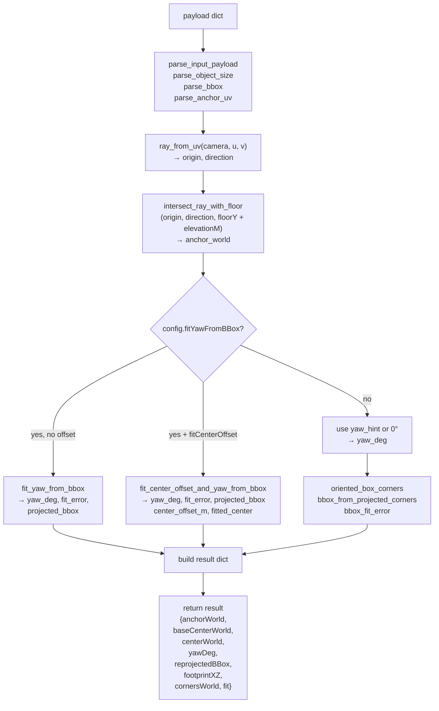
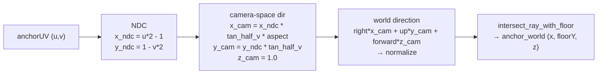
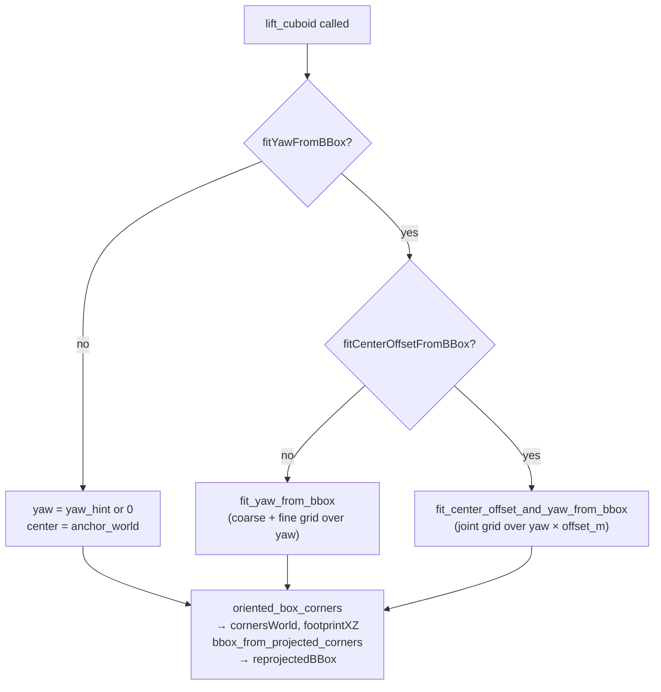
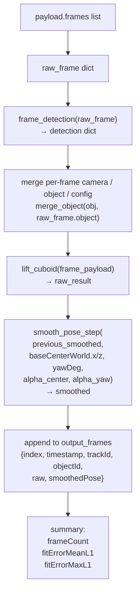

# Cuboid Lifting

Relevant source files

- [](https://github.com/e7canasta/puppet-studio/blob/cdd483bd/lib/geometry/src/simula_geometry/cuboid_lift.py)
- [](https://github.com/e7canasta/puppet-studio/blob/cdd483bd/src/core/scene-domain/scenePatch.ts)
- [](https://github.com/e7canasta/puppet-studio/blob/cdd483bd/src/planogram/sync.ts)

This page documents the 2.5D cuboid lifting algorithm implemented in `lib/geometry/src/simula_geometry/cuboid_lift.py`. The module estimates a 3D pose (position + yaw) for a rigid object on a floor plane, given a single calibrated camera, a 2D detection bounding box, and known object dimensions. It covers both the single-frame entry point (`lift_cuboid`) and the multi-frame entry point (`lift_cuboid_sequence`), including optional yaw/center-offset fitting and pose smoothing.

For documentation of the TypeScript planogram data structures that consume or produce detection overlays, see [Camera System](https://deepwiki.com/e7canasta/puppet-studio/9-camera-system) and [Scene Sync](https://deepwiki.com/e7canasta/puppet-studio/8.3-scene-sync). For parsing utilities that extract detection data from bridge messages on the Python side, see [Data Parsing Utilities](https://deepwiki.com/e7canasta/puppet-studio/13.1-data-parsing-utilities).

---

## Assumptions

The algorithm operates under four fixed constraints, always echoed back in the output under the `assumptions` key:

|Assumption|Meaning|
|---|---|
|`single_camera`|One camera view is used per estimate|
|`floor_plane_support`|The object's base sits on `world Y = floorY`|
|`object_pitch_roll_fixed_zero`|Object has no pitch or roll; only yaw is estimated|
|`anchor_uv_bottom_center_default`|When no explicit anchor is provided, the detection's bottom-center is used|

Sources: [lib/geometry/src/simula_geometry/cuboid_lift.py636-643](https://github.com/e7canasta/puppet-studio/blob/cdd483bd/lib/geometry/src/simula_geometry/cuboid_lift.py#L636-L643)

---

## Input Schema

Both `lift_cuboid` and `lift_cuboid_sequence` accept a plain Python `dict` as their payload. Parsing is handled by `parse_input_payload`, `parse_object_size`, `parse_anchor_uv`, and `parse_bbox`.

### Single-frame payload (`lift_cuboid`)

```
{
  "camera": { ... },
  "detection": { ... },
  "object": { ... },
  "config": { ... }   ← optional
}
```

### Batch payload (`lift_cuboid_sequence`)

```
{
  "camera": { ... },
  "object": { ... },
  "config": { ... },
  "frames": [ { "detection": {...}, ... }, ... ]
}
```

#### `camera` fields

|Field|Aliases|Default|Description|
|---|---|---|---|
|`planPositionM`|—|required|`[x, z]` floor-plan position of the camera|
|`heightM`|`height`, `mountHeightM`|`2.7`|Mounting height in metres|
|`yawDeg`|`yaw`|`0.0`|Camera horizontal rotation (degrees)|
|`pitchDeg`|`pitch`|`-35.0`|Camera vertical tilt (degrees, negative = downward)|
|`rollDeg`|`roll`|`0.0`|Camera roll (degrees)|
|`fovDeg`|`fov`, `verticalFovDeg`|`65.0`|Vertical field of view (degrees)|
|`aspectRatio`|`aspect`|`16/9`|Frame width-to-height ratio|

#### `detection` fields

All coordinates are normalised to `[0, 1]` (UV space).

|Field|Aliases|Description|
|---|---|---|
|`x`|`left`|Left edge of bounding box|
|`y`|`top`|Top edge of bounding box|
|`width`|`w`|Box width|
|`height`|`h`|Box height|
|`anchorUV`|`anchor_uv`, `footpointUV`, `footpoint_uv`|Explicit anchor point; defaults to bottom-center|

#### `object` fields

|Field|Description|
|---|---|
|`sizeM.width`|Object width in metres|
|`sizeM.depth`|Object depth in metres|
|`sizeM.height`|Object height in metres|
|`elevationM`|Base height above `floorY` (default `0.0`)|
|`yawDeg`|Yaw hint used as the starting point for search|

#### `config` fields

|Field|Default|Description|
|---|---|---|
|`floorY`|`0.0`|World Y of the floor plane|
|`fitYawFromBBox`|`false`|Enable yaw grid search|
|`fitCenterOffsetFromBBox`|`false`|Enable center-offset search (requires `fitYawFromBBox`)|
|`yawSearchStepDeg`|`2.0`|Coarse grid step for yaw search (degrees)|
|`centerOffsetMinM`|`-depth/2`|Minimum center offset from anchor along camera-away direction|
|`centerOffsetMaxM`|`+depth/2`|Maximum center offset|
|`centerOffsetStepM`|`0.08`|Coarse grid step for center-offset search (metres)|

Sources: [lib/geometry/src/simula_geometry/cuboid_lift.py449-476](https://github.com/e7canasta/puppet-studio/blob/cdd483bd/lib/geometry/src/simula_geometry/cuboid_lift.py#L449-L476) [lib/geometry/src/simula_geometry/cuboid_lift.py556-576](https://github.com/e7canasta/puppet-studio/blob/cdd483bd/lib/geometry/src/simula_geometry/cuboid_lift.py#L556-L576)

---

## Algorithm Overview

**Diagram: `lift_cuboid` — Single-Frame Pipeline**




Sources: [lib/geometry/src/simula_geometry/cuboid_lift.py556-667](https://github.com/e7canasta/puppet-studio/blob/cdd483bd/lib/geometry/src/simula_geometry/cuboid_lift.py#L556-L667)

---

## Camera Geometry

Two functions establish the camera's coordinate frame.

**`camera_origin(camera)`** [lib/geometry/src/simula_geometry/cuboid_lift.py144-151](https://github.com/e7canasta/puppet-studio/blob/cdd483bd/lib/geometry/src/simula_geometry/cuboid_lift.py#L144-L151)  
Reads `planPositionM[x, z]` and `heightM` to return a world-space `(x, y, z)` tuple.

**`camera_basis(camera)`** [lib/geometry/src/simula_geometry/cuboid_lift.py125-141](https://github.com/e7canasta/puppet-studio/blob/cdd483bd/lib/geometry/src/simula_geometry/cuboid_lift.py#L125-L141)  
Builds three orthogonal unit vectors from `yawDeg`, `pitchDeg`, and `rollDeg`:

|Vector|Description|
|---|---|
|`right`|Camera's horizontal right axis|
|`up`|Camera's upward axis (recomputed as `cross(forward, right)`)|
|`forward`|Direction the camera faces|

Roll (if non-zero) is applied via `rotate_around_axis`, which uses the Rodrigues rotation formula [lib/geometry/src/simula_geometry/cuboid_lift.py63-79](https://github.com/e7canasta/puppet-studio/blob/cdd483bd/lib/geometry/src/simula_geometry/cuboid_lift.py#L63-L79)

**`ray_from_uv(camera, u, v)`** [lib/geometry/src/simula_geometry/cuboid_lift.py154-180](https://github.com/e7canasta/puppet-studio/blob/cdd483bd/lib/geometry/src/simula_geometry/cuboid_lift.py#L154-L180)  
Converts a normalised image coordinate `(u, v)` to a world-space ray:

1. Map `u, v` → NDC in `[-1, 1]`.
2. Scale by `tan(fov/2)` and `aspectRatio` to get camera-space direction.
3. Rotate into world space using `right`, `up`, `forward`.
4. Returns `(origin, direction)`.

**`intersect_ray_with_floor(origin, direction, floor_y)`** [lib/geometry/src/simula_geometry/cuboid_lift.py183-198](https://github.com/e7canasta/puppet-studio/blob/cdd483bd/lib/geometry/src/simula_geometry/cuboid_lift.py#L183-L198)  
Standard ray–horizontal-plane intersection: `t = (floorY - origin.y) / direction.y`. Returns `None` if the ray is horizontal or pointing away from the floor.

**Diagram: Camera Ray Construction**



Sources: [lib/geometry/src/simula_geometry/cuboid_lift.py154-198](https://github.com/e7canasta/puppet-studio/blob/cdd483bd/lib/geometry/src/simula_geometry/cuboid_lift.py#L154-L198)

---

## Box Geometry

**`oriented_box_corners(center_x, center_z, width_m, depth_m, height_m, yaw_deg, base_y_m)`** [lib/geometry/src/simula_geometry/cuboid_lift.py201-228](https://github.com/e7canasta/puppet-studio/blob/cdd483bd/lib/geometry/src/simula_geometry/cuboid_lift.py#L201-L228)

Generates the 8 corners of an axis-aligned box (half-extents `±width/2`, `±depth/2`) rotated about the Y axis by `yaw_deg` using a standard 2D rotation matrix, positioned with its base at `base_y_m`. Each of the 4 footprint corners becomes two corners (bottom + top), so the list has 8 entries ordered as `[bot0, top0, bot1, top1, bot2, top2, bot3, top3]`. The footprint is extracted as every other entry: `corners[0::2]`.

**`project_world_point(world_point, camera)`** [lib/geometry/src/simula_geometry/cuboid_lift.py231-252](https://github.com/e7canasta/puppet-studio/blob/cdd483bd/lib/geometry/src/simula_geometry/cuboid_lift.py#L231-L252)  
Inverse of `ray_from_uv`: converts a 3D world point to `(u, v)` in normalised image space. Returns `None` if `z_cam <= 1e-5` (behind or at the camera).

**`bbox_from_projected_corners(corners, camera)`** [lib/geometry/src/simula_geometry/cuboid_lift.py255-274](https://github.com/e7canasta/puppet-studio/blob/cdd483bd/lib/geometry/src/simula_geometry/cuboid_lift.py#L255-L274)  
Projects all 8 corners, takes the axis-aligned bounding box of the visible projections (clamped to `[0, 1]`), and returns `{x, y, width, height}`.

---

## Yaw Fitting

When `config.fitYawFromBBox` is `true`, the algorithm replaces the fixed `yaw_hint` with a grid-search optimum.

**`fit_yaw_from_bbox(...)`** [lib/geometry/src/simula_geometry/cuboid_lift.py287-344](https://github.com/e7canasta/puppet-studio/blob/cdd483bd/lib/geometry/src/simula_geometry/cuboid_lift.py#L287-L344)

Two-phase coarse-to-fine search:

1. **Coarse phase**: sweeps `−180°` to `+180°` in steps of `coarse_step_deg` (default `2°`). Evaluates `bbox_fit_error` at each yaw.
2. **Fine phase**: refines within `±(coarse_step * 2)` of the coarse best, using steps of `coarse_step / 8`.

**`bbox_fit_error(observed, predicted)`** [lib/geometry/src/simula_geometry/cuboid_lift.py277-284](https://github.com/e7canasta/puppet-studio/blob/cdd483bd/lib/geometry/src/simula_geometry/cuboid_lift.py#L277-L284)  
L1 error combining center displacement (weight 2×) and size mismatch (weight 1×):

```
error = 2 * (|Δcx| + |Δcy|) + (|Δw| + |Δh|)
```

---

## Center-Offset Fitting

When both `fitYawFromBBox` and `fitCenterOffsetFromBBox` are `true`, the search is extended to also move the cuboid center along the camera-away direction from the anchor point.

**`fit_center_offset_and_yaw_from_bbox(...)`** [lib/geometry/src/simula_geometry/cuboid_lift.py347-446](https://github.com/e7canasta/puppet-studio/blob/cdd483bd/lib/geometry/src/simula_geometry/cuboid_lift.py#L347-L446)

The "camera-away direction" is the horizontal unit vector from the camera origin to `anchor_world`. The center is placed at `anchor_world + away_dir * offset_m`.

The error function adds an **anchor consistency term**: the bottom-center of the reprojected bbox must match the detected bottom-center:

```
error = bbox_fit_error(observed, predicted) + 2 * anchor_L1_error
```

Two-phase coarse-to-fine search is applied jointly over `(yaw_deg, offset_m)`.

**Diagram: Fitting Modes**




Sources: [lib/geometry/src/simula_geometry/cuboid_lift.py571-632](https://github.com/e7canasta/puppet-studio/blob/cdd483bd/lib/geometry/src/simula_geometry/cuboid_lift.py#L571-L632)

---

## Output: `lift_cuboid`

The function returns a `dict` with the following top-level keys:

```
{
  "status": "ok",
  "assumptions": [...],
  "inputEcho": { "anchorUV", "bbox", "sizeM" },
  "result": {
    "anchorWorld":            [x, y, z],
    "baseCenterWorld":        [x, y, z],
    "centerWorld":            [x, y, z],
    "footprintXZ":            [[x,z], [x,z], [x,z], [x,z]],
    "centerOffsetFromAnchorM": float,
    "yawDeg":                 float,
    "reprojectedBBox":        {x, y, width, height} | null,
    "cornersWorld":           [[x,y,z], ...] (8 entries),
    "fit": {
      "enabled":          bool,
      "fitCenterOffset":  bool | null,
      "errorL1":          float | null,
      "coarseStepDeg":    float | null,
      "offsetRangeM":     [min, max] | null,
      "offsetStepM":      float | null
    }
  }
}
```

|Field|Description|
|---|---|
|`anchorWorld`|World 3D point where the anchor ray hit the floor plane|
|`baseCenterWorld`|XZ center of the cuboid footprint at `floorY + elevationM`|
|`centerWorld`|Geometric center of the full cuboid (base + `height/2`)|
|`footprintXZ`|Four floor-level corners as `[x, z]` pairs|
|`yawDeg`|Estimated or fitted yaw, normalised to `(−180, 180]`|
|`reprojectedBBox`|Bounding box of the fitted cuboid as seen by the camera|
|`cornersWorld`|All 8 cuboid corners in world space|

Sources: [lib/geometry/src/simula_geometry/cuboid_lift.py636-667](https://github.com/e7canasta/puppet-studio/blob/cdd483bd/lib/geometry/src/simula_geometry/cuboid_lift.py#L636-L667)

---

## Sequence Processing: `lift_cuboid_sequence`

**`lift_cuboid_sequence(payload)`** [lib/geometry/src/simula_geometry/cuboid_lift.py670-781](https://github.com/e7canasta/puppet-studio/blob/cdd483bd/lib/geometry/src/simula_geometry/cuboid_lift.py#L670-L781)

Processes an ordered list of frames, each contributing one detection. For each valid frame:

1. Optionally overrides `camera`, `object`, or `config` fields at the frame level.
2. Calls `lift_cuboid` on the assembled single-frame payload.
3. Applies exponential moving average (EMA) smoothing via `smooth_pose_step`.

### Smoothing

**`smooth_pose_step(previous, current_center_x, current_center_z, current_yaw_deg, alpha_center, alpha_yaw)`** [lib/geometry/src/simula_geometry/cuboid_lift.py503-525](https://github.com/e7canasta/puppet-studio/blob/cdd483bd/lib/geometry/src/simula_geometry/cuboid_lift.py#L503-L525)

Applies linear interpolation independently for position and yaw:

|Variable|Config key|Default|
|---|---|---|
|`alpha_center`|`smoothCenterAlpha` / `smoothingAlpha`|`1.0` (no smoothing)|
|`alpha_yaw`|`smoothYawAlpha`|same as `alpha_center`|

An alpha of `1.0` means the current frame is accepted as-is. Values closer to `0.0` produce heavier smoothing. Yaw interpolation is performed with `lerp_angle_deg`, which takes the shortest angular path around the circle using `normalize_angle_deg` to avoid wrap-around discontinuities.

**Diagram: `lift_cuboid_sequence` Frame Loop**

### Per-frame output structure

Each entry in `output_frames` contains:

```
{
  "index":     int,
  "timestamp": str,
  "trackId":   str | null,
  "objectId":  str | null,
  "raw":       { ...same as lift_cuboid result... },
  "smoothedPose": {
    "baseCenterWorld": [x, y, z],
    "centerWorld":     [x, y, z],
    "planPositionM":   [x, z],
    "yawDeg":          float
  }
}
```

Note that `smoothedPose.planPositionM` is `[smoothed.centerX, smoothed.centerZ]`, directly compatible with the `Placement.planPositionM` field used in the TypeScript planogram system (see [Planogram System](https://deepwiki.com/e7canasta/puppet-studio/8-planogram-system)).

Sources: [lib/geometry/src/simula_geometry/cuboid_lift.py670-781](https://github.com/e7canasta/puppet-studio/blob/cdd483bd/lib/geometry/src/simula_geometry/cuboid_lift.py#L670-L781)

---

## CLI Usage

The module includes a `main()` entry point and an `argparse`-based CLI [lib/geometry/src/simula_geometry/cuboid_lift.py784-824](https://github.com/e7canasta/puppet-studio/blob/cdd483bd/lib/geometry/src/simula_geometry/cuboid_lift.py#L784-L824):

```
python cuboid_lift.py --input-json payload.json --mode auto --pretty
```

|Argument|Values|Description|
|---|---|---|
|`--input-json`|path|JSON payload file|
|`--mode`|`auto`, `single`, `batch`|`auto` detects by presence of `payload.frames`|
|`--pretty`|flag|Pretty-print output JSON|

---

## Helper Utilities

|Function|Location|Purpose|
|---|---|---|
|`clamp01`|[lib/geometry/src/simula_geometry/cuboid_lift.py28-29](https://github.com/e7canasta/puppet-studio/blob/cdd483bd/lib/geometry/src/simula_geometry/cuboid_lift.py#L28-L29)|Clamps a float to `[0, 1]`|
|`deg_to_rad`|[lib/geometry/src/simula_geometry/cuboid_lift.py32-33](https://github.com/e7canasta/puppet-studio/blob/cdd483bd/lib/geometry/src/simula_geometry/cuboid_lift.py#L32-L33)|Degrees → radians|
|`dot`|[lib/geometry/src/simula_geometry/cuboid_lift.py36-37](https://github.com/e7canasta/puppet-studio/blob/cdd483bd/lib/geometry/src/simula_geometry/cuboid_lift.py#L36-L37)|3-vector dot product|
|`cross`|[lib/geometry/src/simula_geometry/cuboid_lift.py40-45](https://github.com/e7canasta/puppet-studio/blob/cdd483bd/lib/geometry/src/simula_geometry/cuboid_lift.py#L40-L45)|3-vector cross product|
|`normalize`|[lib/geometry/src/simula_geometry/cuboid_lift.py48-52](https://github.com/e7canasta/puppet-studio/blob/cdd483bd/lib/geometry/src/simula_geometry/cuboid_lift.py#L48-L52)|Unit vector, guards against zero-length|
|`rotate_around_axis`|[lib/geometry/src/simula_geometry/cuboid_lift.py63-79](https://github.com/e7canasta/puppet-studio/blob/cdd483bd/lib/geometry/src/simula_geometry/cuboid_lift.py#L63-L79)|Rodrigues rotation formula|
|`get_number`|[lib/geometry/src/simula_geometry/cuboid_lift.py82-91](https://github.com/e7canasta/puppet-studio/blob/cdd483bd/lib/geometry/src/simula_geometry/cuboid_lift.py#L82-L91)|Tries multiple dict keys; returns first finite float|
|`normalize_angle_deg`|[lib/geometry/src/simula_geometry/cuboid_lift.py490-491](https://github.com/e7canasta/puppet-studio/blob/cdd483bd/lib/geometry/src/simula_geometry/cuboid_lift.py#L490-L491)|Wraps angle to `(−180, 180]`|
|`lerp_scalar`|[lib/geometry/src/simula_geometry/cuboid_lift.py494-495](https://github.com/e7canasta/puppet-studio/blob/cdd483bd/lib/geometry/src/simula_geometry/cuboid_lift.py#L494-L495)|Linear interpolation of scalars|
|`lerp_angle_deg`|[lib/geometry/src/simula_geometry/cuboid_lift.py498-500](https://github.com/e7canasta/puppet-studio/blob/cdd483bd/lib/geometry/src/simula_geometry/cuboid_lift.py#L498-L500)|Shortest-path angular lerp|
|`frame_detection`|[lib/geometry/src/simula_geometry/cuboid_lift.py528-545](https://github.com/e7canasta/puppet-studio/blob/cdd483bd/lib/geometry/src/simula_geometry/cuboid_lift.py#L528-L545)|Extracts or inlines a detection dict from a frame|
|`frame_timestamp`|[lib/geometry/src/simula_geometry/cuboid_lift.py548-553](https://github.com/e7canasta/puppet-studio/blob/cdd483bd/lib/geometry/src/simula_geometry/cuboid_lift.py#L548-L553)|Resolves frame timestamp string|
|`merge_object`|[lib/geometry/src/simula_geometry/cuboid_lift.py478-487](https://github.com/e7canasta/puppet-studio/blob/cdd483bd/lib/geometry/src/simula_geometry/cuboid_lift.py#L478-L487)|Deep-merges `sizeM` sub-dict from per-frame object override|

### On this page

- [Cuboid Lifting](https://deepwiki.com/e7canasta/puppet-studio/13.2-cuboid-lifting#cuboid-lifting)
- [Assumptions](https://deepwiki.com/e7canasta/puppet-studio/13.2-cuboid-lifting#assumptions)
- [Input Schema](https://deepwiki.com/e7canasta/puppet-studio/13.2-cuboid-lifting#input-schema)
- [Single-frame payload (`lift_cuboid`)](https://deepwiki.com/e7canasta/puppet-studio/13.2-cuboid-lifting#single-frame-payload-lift_cuboid)
- [Batch payload (`lift_cuboid_sequence`)](https://deepwiki.com/e7canasta/puppet-studio/13.2-cuboid-lifting#batch-payload-lift_cuboid_sequence)
- [`camera` fields](https://deepwiki.com/e7canasta/puppet-studio/13.2-cuboid-lifting#camera-fields)
- [`detection` fields](https://deepwiki.com/e7canasta/puppet-studio/13.2-cuboid-lifting#detection-fields)
- [`object` fields](https://deepwiki.com/e7canasta/puppet-studio/13.2-cuboid-lifting#object-fields)
- [`config` fields](https://deepwiki.com/e7canasta/puppet-studio/13.2-cuboid-lifting#config-fields)
- [Algorithm Overview](https://deepwiki.com/e7canasta/puppet-studio/13.2-cuboid-lifting#algorithm-overview)
- [Camera Geometry](https://deepwiki.com/e7canasta/puppet-studio/13.2-cuboid-lifting#camera-geometry)
- [Box Geometry](https://deepwiki.com/e7canasta/puppet-studio/13.2-cuboid-lifting#box-geometry)
- [Yaw Fitting](https://deepwiki.com/e7canasta/puppet-studio/13.2-cuboid-lifting#yaw-fitting)
- [Center-Offset Fitting](https://deepwiki.com/e7canasta/puppet-studio/13.2-cuboid-lifting#center-offset-fitting)
- [Output: `lift_cuboid`](https://deepwiki.com/e7canasta/puppet-studio/13.2-cuboid-lifting#output-lift_cuboid)
- [Sequence Processing: `lift_cuboid_sequence`](https://deepwiki.com/e7canasta/puppet-studio/13.2-cuboid-lifting#sequence-processing-lift_cuboid_sequence)
- [Smoothing](https://deepwiki.com/e7canasta/puppet-studio/13.2-cuboid-lifting#smoothing)
- [Per-frame output structure](https://deepwiki.com/e7canasta/puppet-studio/13.2-cuboid-lifting#per-frame-output-structure)
- [CLI Usage](https://deepwiki.com/e7canasta/puppet-studio/13.2-cuboid-lifting#cli-usage)
- [Helper Utilities](https://deepwiki.com/e7canasta/puppet-studio/13.2-cuboid-lifting#helper-utilities)

