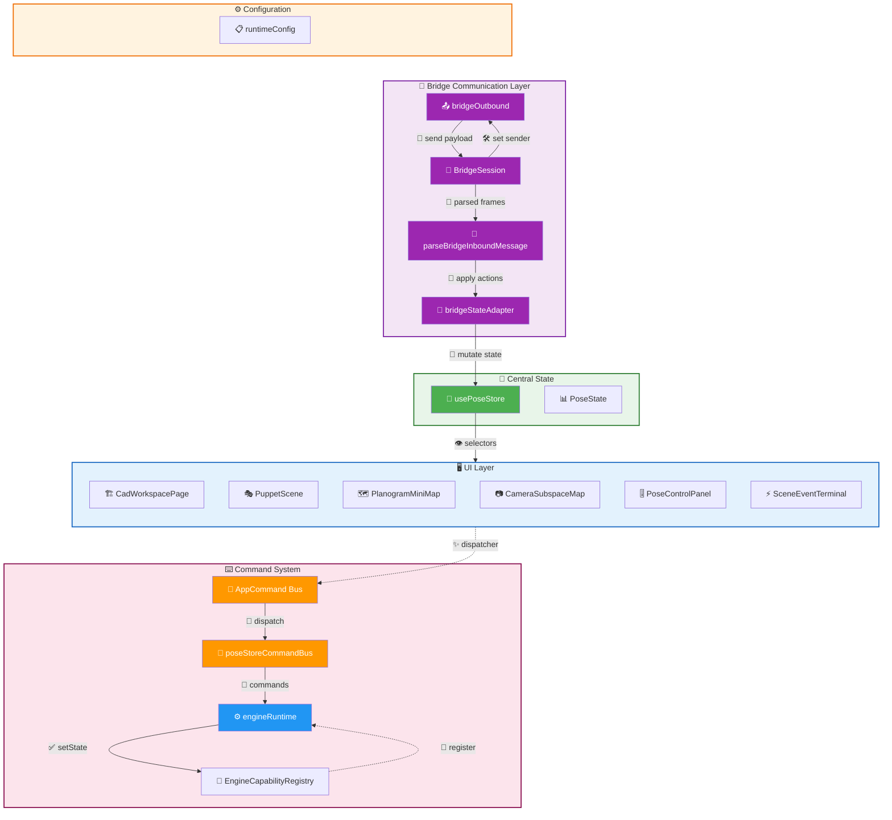
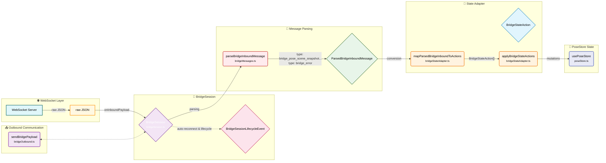
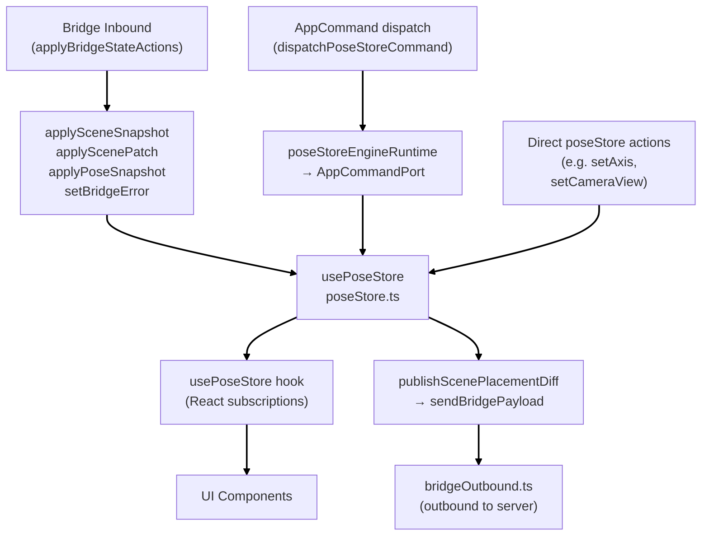
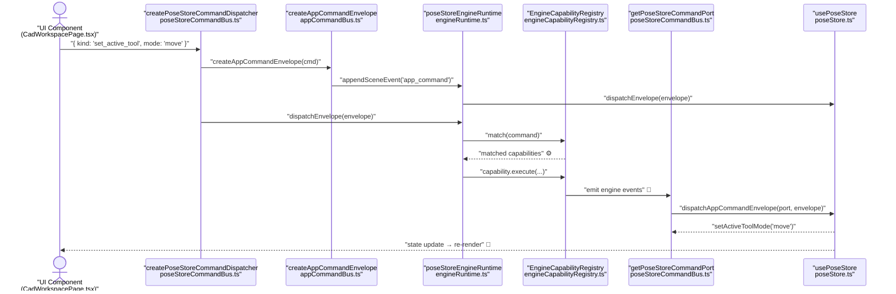
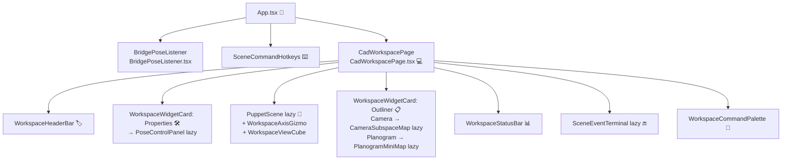

# Architecture

Relevant source files

- [](https://github.com/e7canasta/puppet-studio/blob/cdd483bd/src/app/state/poseStore.ts)
- [](https://github.com/e7canasta/puppet-studio/blob/cdd483bd/src/core/app-commanding/appCommandBus.ts)
- [](https://github.com/e7canasta/puppet-studio/blob/cdd483bd/src/core/app-commanding/poseStoreCommandBus.ts)
- [](https://github.com/e7canasta/puppet-studio/blob/cdd483bd/src/core/bridge-runtime/bridgeMessages.ts)
- [](https://github.com/e7canasta/puppet-studio/blob/cdd483bd/src/core/bridge-runtime/bridgeOutbound.ts)
- [](https://github.com/e7canasta/puppet-studio/blob/cdd483bd/src/core/bridge-runtime/bridgeSession.ts)
- [](https://github.com/e7canasta/puppet-studio/blob/cdd483bd/src/core/bridge-runtime/bridgeStateAdapter.ts)
- [](https://github.com/e7canasta/puppet-studio/blob/cdd483bd/src/core/config/runtimeConfig.ts)
- [](https://github.com/e7canasta/puppet-studio/blob/cdd483bd/src/core/engine/engineCapabilityRegistry.ts)
- [](https://github.com/e7canasta/puppet-studio/blob/cdd483bd/src/core/engine/engineRuntime.ts)
- [](https://github.com/e7canasta/puppet-studio/blob/cdd483bd/src/core/workspace-shell/workspaceShellBridge.ts)
- [](https://github.com/e7canasta/puppet-studio/blob/cdd483bd/src/features/bridge/hooks/useBridgePoseListener.ts)
- [](https://github.com/e7canasta/puppet-studio/blob/cdd483bd/src/features/bridge/model/bridgeLifecycleSceneEvent.ts)
- [](https://github.com/e7canasta/puppet-studio/blob/cdd483bd/src/features/bridge/ui/BridgePoseListener.tsx)
- [](https://github.com/e7canasta/puppet-studio/blob/cdd483bd/src/features/terminal/model/terminalCommandLine.ts)
- [](https://github.com/e7canasta/puppet-studio/blob/cdd483bd/src/features/workspace/hooks/useWorkspaceHudState.ts)
- [](https://github.com/e7canasta/puppet-studio/blob/cdd483bd/src/features/workspace/model/workspaceHudModel.ts)
- [](https://github.com/e7canasta/puppet-studio/blob/cdd483bd/src/features/workspace/ui/pages/CadWorkspacePage.tsx)

This page describes the layered architecture of puppet-studio: how the major subsystems are organized, how data flows between them, and which source files implement each layer. It focuses on system-level relationships rather than the internal details of any individual subsystem. For deeper coverage of individual layers, see:

- State management details → [State Management](https://deepwiki.com/e7canasta/puppet-studio/3-state-management)
- Command types and dispatch → [Command System](https://deepwiki.com/e7canasta/puppet-studio/4-command-system)
- Bridge protocol and session → [Bridge Communication](https://deepwiki.com/e7canasta/puppet-studio/5-bridge-communication)
- Workspace UI structure → [Workspace UI](https://deepwiki.com/e7canasta/puppet-studio/6-workspace-ui)
- Configuration and env vars → [Configuration](https://deepwiki.com/e7canasta/puppet-studio/12-configuration)

---

## Layer Overview

The application is organized into five horizontal layers. Each layer depends only on layers below it; the UI layer never imports bridge internals directly, and the bridge never imports UI components.

**Layer summary:**

|Layer|Primary Responsibility|Key Files|
|---|---|---|
|Configuration|Env-var parsing; capability profiles|`src/core/config/runtimeConfig.ts`|
|Bridge Communication|WebSocket lifecycle; inbound parsing; outbound sending|`src/core/bridge-runtime/`|
|Central State (`poseStore`)|Single source of truth for all application state|`src/app/state/poseStore.ts`|
|Command & Engine|Typed command dispatch; pluggable capability execution|`src/core/app-commanding/`, `src/core/engine/`|
|UI Feature Modules|React components reading state, dispatching commands|`src/features/`|

**Layered architecture diagram:**




Sources: [src/app/state/poseStore.ts1-50](https://github.com/e7canasta/puppet-studio/blob/cdd483bd/src/app/state/poseStore.ts#L1-L50) [src/core/app-commanding/appCommandBus.ts1-30](https://github.com/e7canasta/puppet-studio/blob/cdd483bd/src/core/app-commanding/appCommandBus.ts#L1-L30) [src/core/app-commanding/poseStoreCommandBus.ts1-50](https://github.com/e7canasta/puppet-studio/blob/cdd483bd/src/core/app-commanding/poseStoreCommandBus.ts#L1-L50) [src/core/engine/engineRuntime.ts1-40](https://github.com/e7canasta/puppet-studio/blob/cdd483bd/src/core/engine/engineRuntime.ts#L1-L40) [src/core/bridge-runtime/bridgeSession.ts1-50](https://github.com/e7canasta/puppet-studio/blob/cdd483bd/src/core/bridge-runtime/bridgeSession.ts#L1-L50) [src/features/bridge/ui/BridgePoseListener.tsx1-7](https://github.com/e7canasta/puppet-studio/blob/cdd483bd/src/features/bridge/ui/BridgePoseListener.tsx#L1-L7)

---

## Bridge Communication Layer

The bridge layer connects to an external WebSocket server and translates raw JSON frames into typed `poseStore` mutations. The three components are always used together as a pipeline.

**Bridge inbound pipeline:**

```
WebSocket Server
       ↓ raw JSON
BridgeSession.onInboundPayload
       ↓ parseBridgeInboundMessage()
ParsedBridgeInboundMessage
       ↓ mapParsedBridgeInboundToActions()
BridgeStateAction[]
       ↓ applyBridgeStateActions()
usePoseStore state mutations
```




Sources: [src/core/bridge-runtime/bridgeMessages.ts58-118](https://github.com/e7canasta/puppet-studio/blob/cdd483bd/src/core/bridge-runtime/bridgeMessages.ts#L58-L118) [src/core/bridge-runtime/bridgeStateAdapter.ts38-117](https://github.com/e7canasta/puppet-studio/blob/cdd483bd/src/core/bridge-runtime/bridgeStateAdapter.ts#L38-L117) [src/features/bridge/hooks/useBridgePoseListener.ts24-87](https://github.com/e7canasta/puppet-studio/blob/cdd483bd/src/features/bridge/hooks/useBridgePoseListener.ts#L24-L87)

### Key bridge types

|Type / Function|File|Role|
|---|---|---|
|`BridgeSession`|`bridgeSession.ts`|WebSocket lifecycle, auto-reconnect|
|`BridgeSessionLifecycleEvent`|`bridgeSession.ts`|Union of lifecycle events (connecting, connected, disconnected, …)|
|`ParsedBridgeInboundMessage`|`bridgeMessages.ts`|Discriminated union of parsed message variants|
|`parseBridgeInboundMessage`|`bridgeMessages.ts`|Converts raw payload to `ParsedBridgeInboundMessage`|
|`BridgeStateAction`|`bridgeStateAdapter.ts`|Typed actions to apply to state|
|`mapParsedBridgeInboundToActions`|`bridgeStateAdapter.ts`|Converts parsed message to `BridgeStateAction[]`|
|`applyBridgeStateActions`|`bridgeStateAdapter.ts`|Calls methods on a `BridgeStatePort`|
|`sendBridgePayload`|`bridgeOutbound.ts`|Module-level outbound sender (calls registered sender fn)|

The `BridgePoseListener` React component ([src/features/bridge/ui/BridgePoseListener.tsx1-7](https://github.com/e7canasta/puppet-studio/blob/cdd483bd/src/features/bridge/ui/BridgePoseListener.tsx#L1-L7)) renders nothing but mounts `useBridgePoseListener`, which creates the `BridgeSession`, registers `setBridgeOutboundSender` and `setBridgeOutboundObserver`, and wires all callbacks to `poseStore` ([src/features/bridge/hooks/useBridgePoseListener.ts17-113](https://github.com/e7canasta/puppet-studio/blob/cdd483bd/src/features/bridge/hooks/useBridgePoseListener.ts#L17-L113)).

---

## Central State Layer (`poseStore`)

All application state lives in a single Zustand store created with `create<PoseState>` in [src/app/state/poseStore.ts500](https://github.com/e7canasta/puppet-studio/blob/cdd483bd/src/app/state/poseStore.ts#L500-L500)

The `PoseState` type ([src/app/state/poseStore.ts57-157](https://github.com/e7canasta/puppet-studio/blob/cdd483bd/src/app/state/poseStore.ts#L57-L157)) groups state into functional clusters:

|Cluster|Example fields|
|---|---|
|Avatar / Pose|`avatarObjectId`, `avatarPlanPositionM`, `pose`|
|Bridge|`bridgeEnabled`, `bridgeStatus`, `bridgeUrl`, `bridgeError`|
|Scene|`scenePlacements`, `sceneRoom`, `sceneRevision`, `sceneSequence`, `sceneSource`|
|Scene sync / deferred|`sceneRemoteHoldEnabled`, `sceneDeferredRemoteQueue`, `sceneLastAppliedRemoteRevision`|
|Undo / redo|`sceneUndoStack`, `sceneRedoStack`, `sceneUndoDepth`, `sceneRedoDepth`|
|Event log|`sceneEventLog`, `sceneEventTerminalOpen`, `sceneEventLogPaused`|
|Camera / viewport|`cameraView`, `projectionMode`, `viewportCameraQuaternion`, `monitoringCameras`|
|Selection / tools|`selectedPlacementId`, `activeToolMode`, `showDimensions`|
|HUD flags|`sceneEditEnabled`, `sceneRemoteHoldEnabled`|

UI components subscribe to individual slices using `usePoseStore((state) => state.someField)` to minimize re-renders.

**State mutation paths:**



Sources: [src/app/state/poseStore.ts500-560](https://github.com/e7canasta/puppet-studio/blob/cdd483bd/src/app/state/poseStore.ts#L500-L560) [src/app/state/poseStore.ts116-157](https://github.com/e7canasta/puppet-studio/blob/cdd483bd/src/app/state/poseStore.ts#L116-L157) [src/app/state/poseStore.ts412-445](https://github.com/e7canasta/puppet-studio/blob/cdd483bd/src/app/state/poseStore.ts#L412-L445)

---

## Command & Engine Layer

User actions in the UI become typed `AppCommand` values that travel through a two-stage pipeline before reaching `poseStore`.

**Stage 1 – Command Bus** (`src/core/app-commanding/`)

- `AppCommand` is a discriminated union of every possible command kind ([src/core/app-commanding/appCommandBus.ts11-138](https://github.com/e7canasta/puppet-studio/blob/cdd483bd/src/core/app-commanding/appCommandBus.ts#L11-L138)).
- `AppCommandEnvelope` wraps a command with metadata: `id`, `at`, `source`, `correlationId` ([src/core/app-commanding/appCommandBus.ts177-190](https://github.com/e7canasta/puppet-studio/blob/cdd483bd/src/core/app-commanding/appCommandBus.ts#L177-L190)).
- `createPoseStoreCommandDispatcher` (exported from `src/shared/ui`) returns a function bound to a source tag, calling `dispatchPoseStoreCommand` ([src/core/app-commanding/poseStoreCommandBus.ts282-321](https://github.com/e7canasta/puppet-studio/blob/cdd483bd/src/core/app-commanding/poseStoreCommandBus.ts#L282-L321)).
- `dispatchPoseStoreCommand` logs an `app_command` scene event, optionally logs a `command_line_reflection`, then calls `poseStoreEngineRuntime.dispatchEnvelope`.

**Stage 2 – Engine Runtime** (`src/core/engine/`)

- `createEngineRuntime` ([src/core/engine/engineRuntime.ts40-119](https://github.com/e7canasta/puppet-studio/blob/cdd483bd/src/core/engine/engineRuntime.ts#L40-L119)) returns an `EngineRuntime` with `dispatchEnvelope`, `registerCapability`, and `unregisterCapability`.
- On dispatch, the runtime queries `EngineCapabilityRegistry.match(command)` and calls `execute` on each matching capability.
- If no capability sets `stopDispatch`, the envelope is forwarded to `dispatchAppCommandEnvelope`, which calls the matching method on `AppCommandPort`.
- `AppCommandPort` ([src/core/app-commanding/appCommandBus.ts139-175](https://github.com/e7canasta/puppet-studio/blob/cdd483bd/src/core/app-commanding/appCommandBus.ts#L139-L175)) is a plain object whose methods call `poseStore` actions directly.

**Command dispatch sequence:**



Sources: [src/core/app-commanding/poseStoreCommandBus.ts154-321](https://github.com/e7canasta/puppet-studio/blob/cdd483bd/src/core/app-commanding/poseStoreCommandBus.ts#L154-L321) [src/core/engine/engineRuntime.ts63-101](https://github.com/e7canasta/puppet-studio/blob/cdd483bd/src/core/engine/engineRuntime.ts#L63-L101) [src/core/app-commanding/appCommandBus.ts192-354](https://github.com/e7canasta/puppet-studio/blob/cdd483bd/src/core/app-commanding/appCommandBus.ts#L192-L354) [src/core/engine/engineCapabilityRegistry.ts1-28](https://github.com/e7canasta/puppet-studio/blob/cdd483bd/src/core/engine/engineCapabilityRegistry.ts#L1-L28)

### Engine Capabilities

Capabilities are registered at module load time in `registerDefaultPoseStoreEngineCapabilities` ([src/core/app-commanding/poseStoreCommandBus.ts191-222](https://github.com/e7canasta/puppet-studio/blob/cdd483bd/src/core/app-commanding/poseStoreCommandBus.ts#L191-L222)). The two built-in capabilities are:

|ID|Created by|Default enabled|
|---|---|---|
|`engine.stats`|`createEngineStatsCapability`|`true` (overridable via profile)|
|`engine.sim.preview`|`createEngineSimPreviewCapability`|`false` (enabled in `demo` and `dev` profiles)|

Capabilities can be toggled at runtime via the `set_engine_capability_enabled` `AppCommand`, which calls `setPoseStoreEngineCapabilityEnabled` ([src/core/app-commanding/poseStoreCommandBus.ts249-263](https://github.com/e7canasta/puppet-studio/blob/cdd483bd/src/core/app-commanding/poseStoreCommandBus.ts#L249-L263)).

---

## UI Feature Layer

The `App.tsx` root mounts three top-level children:

1. `BridgePoseListener` — no rendered output; manages `BridgeSession` lifecycle as a side effect.
2. `SceneCommandHotkeys` — global `keydown` listener that dispatches `AppCommand`s.
3. `CadWorkspacePage` — the main workspace shell.

`CadWorkspacePage` ([src/features/workspace/ui/pages/CadWorkspacePage.tsx71-835](https://github.com/e7canasta/puppet-studio/blob/cdd483bd/src/features/workspace/ui/pages/CadWorkspacePage.tsx#L71-L835)) reads from both `usePoseStore` (via individual slice selectors) and `useWorkspaceHudState` (local layout state). It lazy-loads the five main feature components:

|Lazy component|Feature module|
|---|---|
|`PuppetScene`|`src/features/scene/`|
|`PoseControlPanel`|`src/features/pose/`|
|`CameraSubspaceMap`|`src/features/camera/`|
|`PlanogramMiniMap`|`src/features/planogram/`|
|`SceneEventTerminal`|`src/features/terminal/`|

All UI commands are dispatched through `createPoseStoreCommandDispatcher('ui.workspace_shell')` ([src/features/workspace/ui/pages/CadWorkspacePage.tsx96](https://github.com/e7canasta/puppet-studio/blob/cdd483bd/src/features/workspace/ui/pages/CadWorkspacePage.tsx#L96-L96)).

**Workspace HUD state** is kept separately from `poseStore` in a local React `useState` managed by `useWorkspaceHudState` ([src/features/workspace/hooks/useWorkspaceHudState.ts39-133](https://github.com/e7canasta/puppet-studio/blob/cdd483bd/src/features/workspace/hooks/useWorkspaceHudState.ts#L39-L133)). It persists to `sessionStorage` under the key `WORKSPACE_LAYOUT_STORAGE_KEY` ([src/features/workspace/model/workspaceHudModel.ts11](https://github.com/e7canasta/puppet-studio/blob/cdd483bd/src/features/workspace/model/workspaceHudModel.ts#L11-L11)). The `poseStoreCommandBus` bridges the gap by calling `dispatchWorkspaceShellCommand` ([src/core/workspace-shell/workspaceShellBridge.ts36-43](https://github.com/e7canasta/puppet-studio/blob/cdd483bd/src/core/workspace-shell/workspaceShellBridge.ts#L36-L43)) for layout-related commands; `useWorkspaceHudState` subscribes to these via `subscribeWorkspaceShellCommands`.

**UI component hierarchy:**



Sources: [src/features/workspace/ui/pages/CadWorkspacePage.tsx39-54](https://github.com/e7canasta/puppet-studio/blob/cdd483bd/src/features/workspace/ui/pages/CadWorkspacePage.tsx#L39-L54) [src/features/workspace/ui/pages/CadWorkspacePage.tsx458-834](https://github.com/e7canasta/puppet-studio/blob/cdd483bd/src/features/workspace/ui/pages/CadWorkspacePage.tsx#L458-L834) [src/features/workspace/hooks/useWorkspaceHudState.ts94-111](https://github.com/e7canasta/puppet-studio/blob/cdd483bd/src/features/workspace/hooks/useWorkspaceHudState.ts#L94-L111) [src/core/workspace-shell/workspaceShellBridge.ts36-58](https://github.com/e7canasta/puppet-studio/blob/cdd483bd/src/core/workspace-shell/workspaceShellBridge.ts#L36-L58)

---

## Configuration Layer

`runtimeConfig` ([src/core/config/runtimeConfig.ts116-134](https://github.com/e7canasta/puppet-studio/blob/cdd483bd/src/core/config/runtimeConfig.ts#L116-L134)) is a module-level singleton parsed from `import.meta.env` at startup. It is consumed by:

- `poseStore` — for `defaultSceneEditEnabled`, `sceneEventLogLimit`, undo stack limits, deferred-apply mode.
- `poseStoreCommandBus` — for capability profile resolution via `resolveEngineCapabilityDefaultEnabled`.
- Scene sync logic — for `sceneDeferredQueueLimit`, `sceneDeferredAutoApplyOnRelease`.

The three engine capability profiles control which capabilities start enabled:

|Profile|`engine.stats`|`engine.sim.preview`|
|---|---|---|
|`dev`|enabled|enabled|
|`ops`|enabled|disabled|
|`demo`|default|enabled|

Sources: [src/core/config/runtimeConfig.ts101-147](https://github.com/e7canasta/puppet-studio/blob/cdd483bd/src/core/config/runtimeConfig.ts#L101-L147) [src/core/app-commanding/poseStoreCommandBus.ts191-222](https://github.com/e7canasta/puppet-studio/blob/cdd483bd/src/core/app-commanding/poseStoreCommandBus.ts#L191-L222)


### On this page

- [Architecture](https://deepwiki.com/e7canasta/puppet-studio/2-architecture#architecture)
- [Layer Overview](https://deepwiki.com/e7canasta/puppet-studio/2-architecture#layer-overview)
- [Bridge Communication Layer](https://deepwiki.com/e7canasta/puppet-studio/2-architecture#bridge-communication-layer)
- [Key bridge types](https://deepwiki.com/e7canasta/puppet-studio/2-architecture#key-bridge-types)
- [Central State Layer (`poseStore`)](https://deepwiki.com/e7canasta/puppet-studio/2-architecture#central-state-layer-posestore)
- [Command & Engine Layer](https://deepwiki.com/e7canasta/puppet-studio/2-architecture#command-engine-layer)
- [Engine Capabilities](https://deepwiki.com/e7canasta/puppet-studio/2-architecture#engine-capabilities)
- [UI Feature Layer](https://deepwiki.com/e7canasta/puppet-studio/2-architecture#ui-feature-layer)
- [Configuration Layer](https://deepwiki.com/e7canasta/puppet-studio/2-architecture#configuration-layer)
