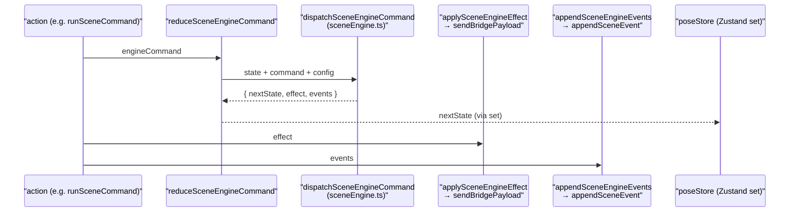
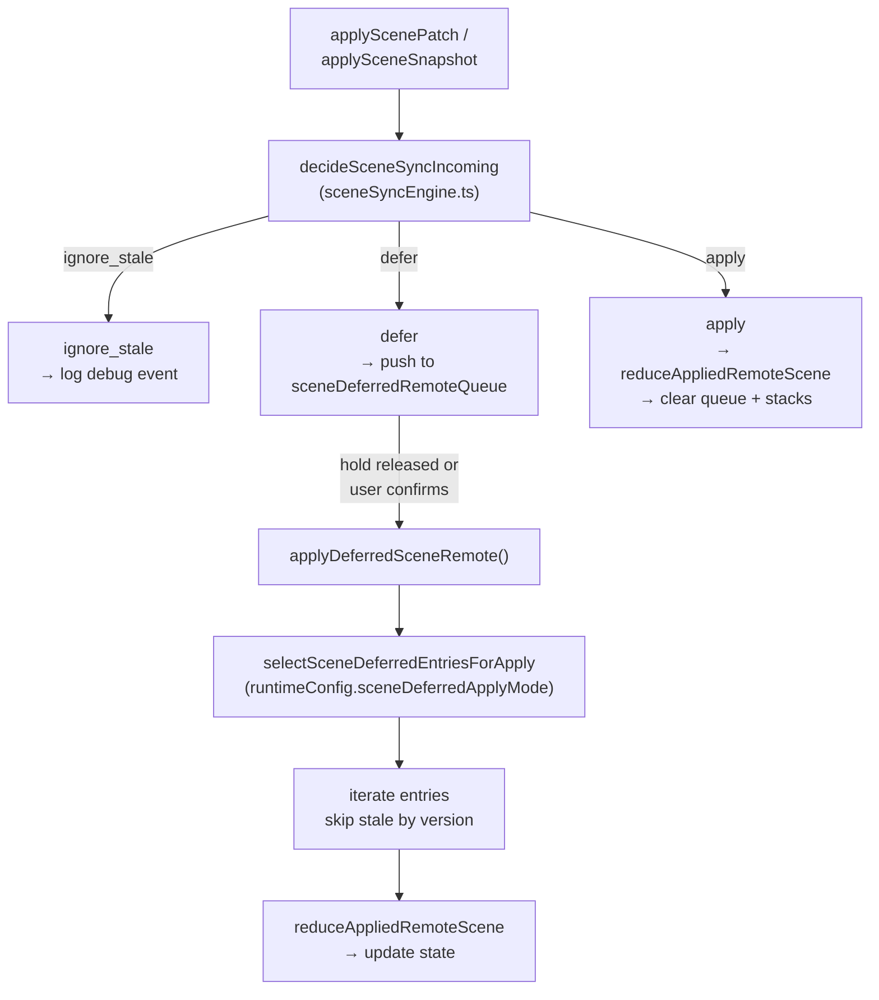
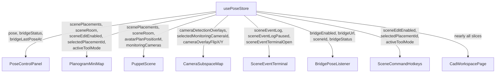

# State Management

Relevant source files

- [](https://github.com/e7canasta/puppet-studio/blob/cdd483bd/src/app/state/index.ts)
- [](https://github.com/e7canasta/puppet-studio/blob/cdd483bd/src/app/state/poseStore.ts)
- [](https://github.com/e7canasta/puppet-studio/blob/cdd483bd/src/core/app-commanding/appCommandBus.ts)
- [](https://github.com/e7canasta/puppet-studio/blob/cdd483bd/src/core/app-commanding/poseStoreCommandBus.ts)
- [](https://github.com/e7canasta/puppet-studio/blob/cdd483bd/src/core/engine/engineCapabilityRegistry.ts)
- [](https://github.com/e7canasta/puppet-studio/blob/cdd483bd/src/features/bridge/ui/index.ts)

This page documents `poseStore`, the single Zustand store that holds all runtime state for puppet-studio. It covers every property in the `PoseState` type, every action, undo/redo stack mechanics, the deferred remote update queue, and patterns for reading state in React components.

For how commands are dispatched into the store from UI components, see [Command System](https://deepwiki.com/e7canasta/puppet-studio/4-command-system). For how bridge messages arrive and are translated into store mutations, see [Bridge Communication](https://deepwiki.com/e7canasta/puppet-studio/5-bridge-communication).

---

## Overview

`poseStore` is defined in [src/app/state/poseStore.ts](https://github.com/e7canasta/puppet-studio/blob/cdd483bd/src/app/state/poseStore.ts) and exported as the `usePoseStore` hook via [src/app/state/index.ts](https://github.com/e7canasta/puppet-studio/blob/cdd483bd/src/app/state/index.ts) It is created with Zustand's `create` function and holds all mutable application state in a single flat object of type `PoseState`.

Every component in the application reads from this store. Every command ultimately writes to it. There is no secondary store.

**State shape diagram — `PoseState` domains**

```mermaid
graph TD
    PS["PoseState<br/>poseStore.ts"] --> AVATAR["Avatar<br/>avatarObjectId<br/>avatarTrackId<br/>avatarPlanPositionM<br/>avatarRotationDeg"]
    PS --> POSE["Pose<br/>pose: PoseControls"]
    PS --> BRIDGE["Bridge<br/>bridgeEnabled / bridgeStatus<br/>bridgeUrl / bridgeError<br/>bridgeSequence / bridgeLastPoseAt<br/>bridgeNonZeroAxes"]
    PS --> SCENE["Scene<br/>sceneId / sceneSource<br/>scenePlacements / sceneRoom<br/>sceneRevision / sceneSequence<br/>sceneError / sceneEditEnabled<br/>sceneRemoteHoldEnabled"]
    PS --> DEFERRED["Deferred Remote Queue<br/>sceneDeferredRemoteQueue<br/>sceneDeferredRemoteCount<br/>sceneDeferredRemoteLastAt<br/>sceneDeferredApplyPendingConfirm"]
    PS --> HISTORY["Undo/Redo<br/>sceneUndoStack / sceneUndoDepth<br/>sceneRedoStack / sceneRedoDepth"]
    PS --> SPECIALIST["Specialist Meta<br/>sceneSpecialistGeneratedAt<br/>sceneSpecialistSource<br/>sceneSpatialAgeS / sceneSpatialFresh<br/>sceneSpatialStaleAfterS<br/>sceneSpatialStalePolicy"]
    PS --> CAMERAS["Cameras<br/>cameraView / projectionMode<br/>viewportCameraQuaternion<br/>cameraOverlayFlipX / Y<br/>monitoringCameras<br/>cameraDetectionOverlays<br/>selectedMonitoringCameraId"]
    PS --> EVTLOG["Event Log<br/>sceneEventLog<br/>sceneEventLogPaused<br/>sceneEventAutoScroll<br/>sceneEventTerminalOpen<br/>sceneEventDroppedWhilePaused<br/>sceneLastEventAt"]
    PS --> UI["UI / Selection<br/>activeToolMode<br/>selectedPlacementId<br/>topQuarterTurns<br/>showDimensions"]
```




Sources: [src/app/state/poseStore.ts57-157](https://github.com/e7canasta/puppet-studio/blob/cdd483bd/src/app/state/poseStore.ts#L57-L157)

---

## PoseState Properties

### Avatar

|Property|Type|Default|Description|
|---|---|---|---|
|`avatarObjectId`|`string \| null`|`null`|Object identifier of the tracked avatar|
|`avatarTrackId`|`string \| null`|`null`|Track identifier used to filter pose snapshots|
|`avatarPlanPositionM`|`[number, number]`|`[0, 0]`|2D plan-view position in metres|
|`avatarRotationDeg`|`number`|`0`|Rotation of the avatar in degrees|

Sources: [src/app/state/poseStore.ts57-62](https://github.com/e7canasta/puppet-studio/blob/cdd483bd/src/app/state/poseStore.ts#L57-L62) [src/app/state/poseStore.ts501-504](https://github.com/e7canasta/puppet-studio/blob/cdd483bd/src/app/state/poseStore.ts#L501-L504)

### Pose

|Property|Type|Default|Description|
|---|---|---|---|
|`pose`|`PoseControls`|`createDefaultPose()`|Per-joint axis values for the puppet rig|

`PoseControls` is a record keyed by `PartKey` (joint names). Each entry has `x`, `y`, `z` number fields. See [Pose Controls](https://deepwiki.com/e7canasta/puppet-studio/10-pose-controls) for the full structure.

Sources: [src/app/state/poseStore.ts64](https://github.com/e7canasta/puppet-studio/blob/cdd483bd/src/app/state/poseStore.ts#L64-L64) [src/app/state/poseStore.ts507](https://github.com/e7canasta/puppet-studio/blob/cdd483bd/src/app/state/poseStore.ts#L507-L507)

### Bridge

|Property|Type|Default|Description|
|---|---|---|---|
|`bridgeEnabled`|`boolean`|`true`|Whether the WebSocket bridge should connect|
|`bridgeStatus`|`'disconnected' \| 'connecting' \| 'connected'`|`'disconnected'`|Current WebSocket connection state|
|`bridgeUrl`|`string`|`'ws://localhost:8765'`|WebSocket endpoint|
|`bridgeError`|`string \| null`|`null`|Last bridge-level error string|
|`bridgeSequence`|`number \| null`|`null`|Sequence number of the last received pose frame|
|`bridgeLastPoseAt`|`string \| null`|`null`|ISO timestamp of last received pose|
|`bridgeNonZeroAxes`|`number \| null`|`null`|Count of non-zero joint axes in the last frame|

Sources: [src/app/state/poseStore.ts65-71](https://github.com/e7canasta/puppet-studio/blob/cdd483bd/src/app/state/poseStore.ts#L65-L71) [src/app/state/poseStore.ts508-514](https://github.com/e7canasta/puppet-studio/blob/cdd483bd/src/app/state/poseStore.ts#L508-L514)

### Scene

|Property|Type|Default|Description|
|---|---|---|---|
|`sceneId`|`string`|`'scene-1'`|Active scene identifier sent to bridge|
|`sceneSource`|`'default' \| 'scene' \| 'local_edit'`|`'default'`|Origin of the current placement data|
|`scenePlacements`|`Placement[]`|Default planogram|Active set of placed objects|
|`sceneRoom`|`RoomDefinition`|Default planogram room|Room geometry (width, depth, height, wall thickness)|
|`sceneRevision`|`number \| null`|`null`|Revision counter for the current scene|
|`sceneSequence`|`number \| null`|`null`|Sequence counter from the bridge|
|`sceneError`|`string \| null`|`null`|Last scene processing error|
|`sceneEditEnabled`|`boolean`|`runtimeConfig.defaultSceneEditEnabled`|Whether local edits are permitted|
|`sceneRemoteHoldEnabled`|`boolean`|`false`|When `true`, incoming remote scene messages are queued rather than applied|
|`sceneRemoteOverrideAt`|`string \| null`|`null`|Timestamp when a remote update last overwrote a local edit|
|`sceneRemoteOverrideKind`|`SceneSyncRemoteKind \| null`|`null`|Kind of the overriding message|
|`sceneLastEventAt`|`string \| null`|`null`|Timestamp of the last applied remote scene event|
|`sceneLastAppliedRemoteRevision`|`number \| null`|`null`|Revision of the last applied remote message|
|`sceneLastAppliedRemoteSequence`|`number \| null`|`null`|Sequence of the last applied remote message|

Sources: [src/app/state/poseStore.ts78-107](https://github.com/e7canasta/puppet-studio/blob/cdd483bd/src/app/state/poseStore.ts#L78-L107) [src/app/state/poseStore.ts519-550](https://github.com/e7canasta/puppet-studio/blob/cdd483bd/src/app/state/poseStore.ts#L519-L550)

### Specialist / Spatial Metadata

These fields are carried in bridge scene messages and populated by `mergeSpecialistMeta`.

|Property|Type|Description|
|---|---|---|
|`sceneSpecialistGeneratedAt`|`string \| null`|Timestamp when the specialist generated the scene|
|`sceneSpecialistSource`|`string \| null`|Source identifier for the specialist|
|`sceneSpatialAgeS`|`number \| null`|Age of spatial data in seconds|
|`sceneSpatialFresh`|`boolean \| null`|Whether spatial data is within freshness threshold|
|`sceneSpatialStaleAfterS`|`number \| null`|Threshold in seconds after which spatial data is stale|
|`sceneSpatialStalePolicy`|`string \| null`|Policy name for staleness handling|

Sources: [src/app/state/poseStore.ts102-107](https://github.com/e7canasta/puppet-studio/blob/cdd483bd/src/app/state/poseStore.ts#L102-L107) [src/app/state/poseStore.ts181-201](https://github.com/e7canasta/puppet-studio/blob/cdd483bd/src/app/state/poseStore.ts#L181-L201)

### Deferred Remote Queue

|Property|Type|Default|Description|
|---|---|---|---|
|`sceneDeferredRemoteQueue`|`SceneSyncDeferredEnvelope[]`|`[]`|Buffered remote scene messages pending application|
|`sceneDeferredRemoteCount`|`number`|`0`|Number of entries currently in the queue|
|`sceneDeferredRemoteLastAt`|`string \| null`|`null`|Timestamp of the most recently queued message|
|`sceneDeferredRemoteLastKind`|`SceneSyncRemoteKind \| null`|`null`|Kind of the most recently queued message|
|`sceneDeferredApplyPendingConfirm`|`boolean`|`false`|`true` when the queue requires explicit user confirmation before applying|

Sources: [src/app/state/poseStore.ts80-84](https://github.com/e7canasta/puppet-studio/blob/cdd483bd/src/app/state/poseStore.ts#L80-L84) [src/app/state/poseStore.ts523-527](https://github.com/e7canasta/puppet-studio/blob/cdd483bd/src/app/state/poseStore.ts#L523-L527)

### Undo / Redo

|Property|Type|Default|Description|
|---|---|---|---|
|`sceneUndoStack`|`SceneHistoryEntry[]`|`[]`|Ordered list of reversible scene states|
|`sceneUndoDepth`|`number`|`0`|Length of the undo stack|
|`sceneRedoStack`|`SceneHistoryEntry[]`|`[]`|Ordered list of re-applicable states|
|`sceneRedoDepth`|`number`|`0`|Length of the redo stack|

Sources: [src/app/state/poseStore.ts108-111](https://github.com/e7canasta/puppet-studio/blob/cdd483bd/src/app/state/poseStore.ts#L108-L111) [src/app/state/poseStore.ts551-554](https://github.com/e7canasta/puppet-studio/blob/cdd483bd/src/app/state/poseStore.ts#L551-L554)

### Camera / Viewport

|Property|Type|Default|Description|
|---|---|---|---|
|`cameraView`|`'iso' \| 'top' \| 'front' \| 'back' \| 'left' \| 'right' \| 'sensor'`|`'iso'`|Active named camera preset|
|`projectionMode`|`'orthographic' \| 'perspective'`|`'orthographic'`|Projection mode for the 3D viewport|
|`viewportCameraQuaternion`|`[number, number, number, number]`|`[0,0,0,1]`|Live quaternion of the viewport camera|
|`cameraOverlayFlipX`|`boolean`|`false`|Whether the camera detection overlay is flipped on X|
|`cameraOverlayFlipY`|`boolean`|`false`|Whether the camera detection overlay is flipped on Y|
|`monitoringCameras`|`MonitoringCameraDefinition[]`|`[]`|Camera definitions received from bridge|
|`cameraDetectionOverlays`|`CameraDetectionOverlay[]`|`[]`|Detection overlay data from bridge|
|`selectedMonitoringCameraId`|`string \| null`|`null`|Currently selected monitoring camera|

Sources: [src/app/state/poseStore.ts72-76](https://github.com/e7canasta/puppet-studio/blob/cdd483bd/src/app/state/poseStore.ts#L72-L76) [src/app/state/poseStore.ts112-114](https://github.com/e7canasta/puppet-studio/blob/cdd483bd/src/app/state/poseStore.ts#L112-L114)

### Event Log

|Property|Type|Default|Description|
|---|---|---|---|
|`sceneEventLog`|`SceneEventEntry[]`|`[]`|Ordered list of scene events shown in the terminal|
|`sceneEventLogPaused`|`boolean`|`false`|When `true`, new events increment `sceneEventDroppedWhilePaused` instead of being appended|
|`sceneEventAutoScroll`|`boolean`|`true`|Whether the terminal auto-scrolls to new events|
|`sceneEventTerminalOpen`|`boolean`|`runtimeConfig.defaultSceneEventTerminalOpen`|Whether the event terminal panel is open|
|`sceneEventDroppedWhilePaused`|`number`|`0`|Count of events dropped while log was paused|

Sources: [src/app/state/poseStore.ts85-90](https://github.com/e7canasta/puppet-studio/blob/cdd483bd/src/app/state/poseStore.ts#L85-L90) [src/app/state/poseStore.ts528-532](https://github.com/e7canasta/puppet-studio/blob/cdd483bd/src/app/state/poseStore.ts#L528-L532)

### UI / Selection

|Property|Type|Default|Description|
|---|---|---|---|
|`activeToolMode`|`'move' \| 'rotate' \| 'select'`|`'select'`|Active tool in the planogram editor|
|`selectedPlacementId`|`string \| null`|`null`|ID of the currently selected `Placement`|
|`topQuarterTurns`|`0 \| 1 \| 2 \| 3`|`0`|Number of quarter-turn rotations applied to the top-down view|
|`showDimensions`|`boolean`|`true`|Whether dimension labels are shown in the scene|

Sources: [src/app/state/poseStore.ts113-115](https://github.com/e7canasta/puppet-studio/blob/cdd483bd/src/app/state/poseStore.ts#L113-L115) [src/app/state/poseStore.ts556-558](https://github.com/e7canasta/puppet-studio/blob/cdd483bd/src/app/state/poseStore.ts#L556-L558)

---

## Actions

**Action catalog diagram**

```mermaid
graph TD
    subgraph "Event log"
        A["appendSceneEvent(event)"]
        B["setSceneEventLogPaused(enabled)"]
        C["setSceneEventAutoScroll(enabled)"]
        D["setSceneEventTerminalOpen(enabled)"]
        E["toggleSceneEventTerminal()"]
        F["clearSceneEventLog()"]
    end

    subgraph "UI setters"
        G["setActiveToolMode(mode)"]
        H["setCameraView(view)"]
        I["setProjectionMode(mode)"]
        J["setSelectedPlacementId(id)"]
        K["setSelectedMonitoringCameraId(id)"]
        L["setSceneId(sceneId)"]
        M["setSceneEditEnabled(enabled)"]
        N["toggleSceneEdit()"]
        O["setShowDimensions(show)"]
        P["setViewportCameraQuaternion(q)"]
        Q["rotateTopView(dir)"]
        R["setCameraOverlayFlip(axis,enabled)"]
        S["resetCameraOverlayFlip()"]
    end

    subgraph "Scene hold / deferred"
        T["setSceneRemoteHoldEnabled(enabled)"]
        U["toggleSceneRemoteHold()"]
        V["clearSceneDeferredRemote()"]
        W["clearSceneRemoteOverride()"]
    end

    subgraph "Scene commands"
        X["runSceneCommand(command,meta?)"]
        Y["nudgeSelectedPlacement(dx,dz)"]
        Z["rotateSelectedPlacement(deg)"]
        AA["snapSelectedPlacementToGrid(step)"]
        BB["clearScene(meta?)"]
        CC["undoSceneEdit(meta?)"]
        DD["redoSceneEdit(meta?)"]
    end

    subgraph "Scene ingest"
        EE["applySceneSnapshot(message)"]
        FF["applyScenePatch(message)"]
        GG["applyDeferredSceneRemote()"]
    end

    subgraph "Pose actions"
        HH["applyPoseSnapshot(payload)"]
        II["setAxis(part,axis,value)"]
        JJ["resetPose()"]
    end

    subgraph "Bridge actions"
        KK["setBridgeEnabled(enabled)"]
        LL["setBridgeStatus(status)"]
        MM["setBridgeUrl(url)"]
        NN["setBridgeError(error)"]
        OO["setBridgeMeta(meta)"]
    end

    A --> B
    B --> C
    C --> D
    D --> E
    E --> F
    G --> H
    H --> I
    I --> J
    J --> K
    K --> L
    L --> M
    M --> N
    N --> O
    O --> P
    P --> Q
    Q --> R
    R --> S
    T --> U
    U --> V
    V --> W
    X --> Y
    Y --> Z
    Z --> AA
    AA --> BB
    BB --> CC
    CC --> DD
    EE --> FF
    FF --> GG
    HH --> II
    II --> JJ
    KK --> LL
    LL --> MM
    MM --> NN
    NN --> OO
```



Sources: [src/app/state/poseStore.ts116-157](https://github.com/e7canasta/puppet-studio/blob/cdd483bd/src/app/state/poseStore.ts#L116-L157)

### Scene Command Actions

The four scene-mutation actions — `runSceneCommand`, `clearScene`, `undoSceneEdit`, `redoSceneEdit` — share a common internal pattern:

1. Call `reduceSceneEngineCommand(state, engineCommand)` inside `set(...)`, which delegates to `dispatchSceneEngineCommand` from `sceneEngine`.
2. The result contains `nextState`, `effect`, and `events`.
3. `applySceneEngineEffect(effect)` is called outside `set` to potentially publish a bridge scene patch via `sendBridgePayload`.
4. `appendSceneEngineEvents(events)` logs the outcome to `sceneEventLog`.



Sources: [src/app/state/poseStore.ts432-470](https://github.com/e7canasta/puppet-studio/blob/cdd483bd/src/app/state/poseStore.ts#L432-L470) [src/app/state/poseStore.ts769-813](https://github.com/e7canasta/puppet-studio/blob/cdd483bd/src/app/state/poseStore.ts#L769-L813)

### Pose Snapshot Action

`applyPoseSnapshot(payload)` parses a raw bridge payload (which may contain a `joints` sub-object or be a joints map directly) and applies per-joint axis values to `pose`. Updates are guarded by:

- Track ID filtering: if `packetTrackId` is set and does not match `state.avatarTrackId`, the update is dropped.
- Value clamping: each axis value passes through `clampAxis(part, axis, value)` before being stored.
- No-op check: if neither joint values nor identity fields changed, state is returned unchanged.

Sources: [src/app/state/poseStore.ts814-853](https://github.com/e7canasta/puppet-studio/blob/cdd483bd/src/app/state/poseStore.ts#L814-L853)

### Event Log Actions

`appendSceneEvent(event)` is routed through `reduceSceneEventAppend`, which:

- If `sceneEventLogPaused` is `true`, increments `sceneEventDroppedWhilePaused` instead of appending.
- Otherwise, calls `createSceneEventEntry` and `pushSceneEventEntry`, capping the log at `runtimeConfig.sceneEventLogLimit`.

`setSceneEventLogPaused(false)` — when un-pausing with a non-zero drop count — inserts a synthetic `event_log_resume` warning entry summarising the number of dropped events before clearing the counter.

Sources: [src/app/state/poseStore.ts223-233](https://github.com/e7canasta/puppet-studio/blob/cdd483bd/src/app/state/poseStore.ts#L223-L233) [src/app/state/poseStore.ts866-889](https://github.com/e7canasta/puppet-studio/blob/cdd483bd/src/app/state/poseStore.ts#L866-L889)

---

## Undo / Redo Stack

The undo/redo stacks are arrays of `SceneHistoryEntry` objects managed entirely by the scene engine (`dispatchSceneEngineCommand` in `sceneEngine.ts`). `poseStore` stores and exposes them as state but does not manipulate them directly.

Key behaviours:

- **Local edit origin tracking**: `sceneSource` transitions to `'local_edit'` when scene commands produce history entries.
- **Stack reset on remote apply**: whenever a remote `scene_snapshot` or `scene_patch` is applied, `sceneUndoStack`, `sceneRedoStack`, `sceneUndoDepth`, and `sceneRedoDepth` are all reset to empty/zero via `reduceAppliedRemoteScene`.
- **Undo depth limit**: configurable via `runtimeConfig.sceneUndoLimit`, enforced inside `dispatchSceneEngineCommand`.
- **`hasLocalSceneEdits`**: internal helper that returns `true` if `sceneSource === 'local_edit'` or either stack is non-empty.

Sources: [src/app/state/poseStore.ts108-111](https://github.com/e7canasta/puppet-studio/blob/cdd483bd/src/app/state/poseStore.ts#L108-L111) [src/app/state/poseStore.ts235-237](https://github.com/e7canasta/puppet-studio/blob/cdd483bd/src/app/state/poseStore.ts#L235-L237) [src/app/state/poseStore.ts289-325](https://github.com/e7canasta/puppet-studio/blob/cdd483bd/src/app/state/poseStore.ts#L289-L325) [src/app/state/poseStore.ts790-813](https://github.com/e7canasta/puppet-studio/blob/cdd483bd/src/app/state/poseStore.ts#L790-L813)

---

## Deferred Remote Update Queue

When `sceneRemoteHoldEnabled` is `true`, or when there are local edits that would be overwritten, incoming `scene_snapshot` and `scene_patch` messages are not applied immediately. Instead they are placed in `sceneDeferredRemoteQueue`.

### Decision Logic

Both `applyScenePatch` and `applySceneSnapshot` call `decideSceneSyncIncoming` (from `sceneSyncEngine`) with:

- `appliedVersion` — current `{ revision, sequence }` from `sceneLastAppliedRemoteRevision` / `sceneLastAppliedRemoteSequence`
- `deferredQueue` — the current queue
- `hasLocalEdits` — result of `hasLocalSceneEdits`
- `holdRemoteEnabled` — `sceneRemoteHoldEnabled`
- `deferredQueueLimit` — from `runtimeConfig`

The decision can be:

|Decision type|Effect on store|
|---|---|
|`ignore_stale`|State unchanged; a `scene_patch_ignored_stale` / `scene_snapshot_ignored_stale` event is logged|
|`defer`|Entry appended to `sceneDeferredRemoteQueue`; counters updated|
|`apply`|`reduceAppliedRemoteScene` merges the parsed scene into state; stacks and deferred queue cleared|

### Applying the Deferred Queue

`applyDeferredSceneRemote()` drains the queue by calling `reduceDeferredSceneRemoteApply`, which:

1. Calls `selectSceneDeferredEntriesForApply` to pick entries based on `runtimeConfig.sceneDeferredApplyMode`.
2. Iterates entries in order, re-parsing each as a `ParsedSceneMessage`, skipping any that are stale relative to the latest seen version.
3. Passes the final valid parsed message through `reduceAppliedRemoteScene`.




### Remote Hold Toggle

`setSceneRemoteHoldEnabled` / `toggleSceneRemoteHold` both call `reduceSceneRemoteHoldEnabled`, which delegates to `decideSceneRemoteHoldTransition`. When hold is released:

- If `runtimeConfig.sceneDeferredAutoApplyOnRelease` is `true`, `applyDeferredSceneRemote()` is called automatically.
- If `runtimeConfig.sceneDeferredRequireConfirmOnRelease` is `true`, `sceneDeferredApplyPendingConfirm` is set to `true`, requiring the user to explicitly trigger `applyDeferredSceneRemote`.

Sources: [src/app/state/poseStore.ts327-410](https://github.com/e7canasta/puppet-studio/blob/cdd483bd/src/app/state/poseStore.ts#L327-L410) [src/app/state/poseStore.ts472-498](https://github.com/e7canasta/puppet-studio/blob/cdd483bd/src/app/state/poseStore.ts#L472-L498) [src/app/state/poseStore.ts559-712](https://github.com/e7canasta/puppet-studio/blob/cdd483bd/src/app/state/poseStore.ts#L559-L712) [src/app/state/poseStore.ts893-918](https://github.com/e7canasta/puppet-studio/blob/cdd483bd/src/app/state/poseStore.ts#L893-L918)

---

## Reading State in React Components

`usePoseStore` is a standard Zustand hook. Components subscribe to individual slices using a selector to avoid unnecessary re-renders.

**Pattern — selecting a single value:**

```
const sceneEditEnabled = usePoseStore((s) => s.sceneEditEnabled)
```

**Pattern — selecting multiple values:**

```
const { scenePlacements, sceneRoom } = usePoseStore((s) => ({
  scenePlacements: s.scenePlacements,
  sceneRoom: s.sceneRoom,
}))
```

**Pattern — selecting an action:**

```
const appendSceneEvent = usePoseStore((s) => s.appendSceneEvent)
```

**Accessing state outside React** (e.g. inside bridge callbacks or engine runtime):

```
const state = usePoseStore.getState()
state.appendSceneEvent({ ... })
```

This pattern is used extensively in the engine runtime and bridge outbound handlers. See [src/app/state/poseStore.ts447-470](https://github.com/e7canasta/puppet-studio/blob/cdd483bd/src/app/state/poseStore.ts#L447-L470) and [src/core/app-commanding/poseStoreCommandBus.ts39-151](https://github.com/e7canasta/puppet-studio/blob/cdd483bd/src/core/app-commanding/poseStoreCommandBus.ts#L39-L151) for examples.

**Selector diagram — which components read which slices**



Sources: [src/app/state/index.ts](https://github.com/e7canasta/puppet-studio/blob/cdd483bd/src/app/state/index.ts) [src/app/state/poseStore.ts500-557](https://github.com/e7canasta/puppet-studio/blob/cdd483bd/src/app/state/poseStore.ts#L500-L557) [src/core/app-commanding/poseStoreCommandBus.ts154-189](https://github.com/e7canasta/puppet-studio/blob/cdd483bd/src/core/app-commanding/poseStoreCommandBus.ts#L154-L189)

---

## Internal Helper Functions

These private functions in `poseStore.ts` implement the core reduction logic.

|Function|Purpose|
|---|---|
|`reduceSceneEventAppend`|Appends or drops an event based on `sceneEventLogPaused`|
|`reduceAppliedRemoteScene`|Merges a fully-parsed `ParsedSceneMessage` into state, resets undo/redo stacks and deferred queue|
|`reduceDeferredSceneRemoteApply`|Drains the deferred queue, applying entries in sequence order|
|`reduceSceneRemoteHoldEnabled`|Computes hold-enable/disable transition, delegates to `decideSceneRemoteHoldTransition`|
|`reduceSceneEngineCommand`|Wraps `dispatchSceneEngineCommand` with `runtimeConfig` options|
|`parseSceneMessage`|Dispatches to `applyScenePatchFromBridge` or `parseSceneSnapshotFromBridge` based on kind|
|`mergeSpecialistMeta`|Merges non-null fields from a `SceneSpecialistMeta` onto current specialist state fields|
|`hasLocalSceneEdits`|Returns `true` if `sceneSource === 'local_edit'` or either undo/redo stack is non-empty|
|`publishScenePlacementDiff`|Builds a scene patch from placement diff and calls `sendBridgePayload` if publishing is enabled|
|`appendSceneEngineEvents`|Converts `SceneEngineDomainEvent[]` into `appendSceneEvent` calls with appropriate levels|

Sources: [src/app/state/poseStore.ts159-470](https://github.com/e7canasta/puppet-studio/blob/cdd483bd/src/app/state/poseStore.ts#L159-L470)


### On this page

- [State Management](https://deepwiki.com/e7canasta/puppet-studio/3-state-management#state-management)
- [Overview](https://deepwiki.com/e7canasta/puppet-studio/3-state-management#overview)
- [PoseState Properties](https://deepwiki.com/e7canasta/puppet-studio/3-state-management#posestate-properties)
- [Avatar](https://deepwiki.com/e7canasta/puppet-studio/3-state-management#avatar)
- [Pose](https://deepwiki.com/e7canasta/puppet-studio/3-state-management#pose)
- [Bridge](https://deepwiki.com/e7canasta/puppet-studio/3-state-management#bridge)
- [Scene](https://deepwiki.com/e7canasta/puppet-studio/3-state-management#scene)
- [Specialist / Spatial Metadata](https://deepwiki.com/e7canasta/puppet-studio/3-state-management#specialist-spatial-metadata)
- [Deferred Remote Queue](https://deepwiki.com/e7canasta/puppet-studio/3-state-management#deferred-remote-queue)
- [Undo / Redo](https://deepwiki.com/e7canasta/puppet-studio/3-state-management#undo-redo)
- [Camera / Viewport](https://deepwiki.com/e7canasta/puppet-studio/3-state-management#camera-viewport)
- [Event Log](https://deepwiki.com/e7canasta/puppet-studio/3-state-management#event-log)
- [UI / Selection](https://deepwiki.com/e7canasta/puppet-studio/3-state-management#ui-selection)
- [Actions](https://deepwiki.com/e7canasta/puppet-studio/3-state-management#actions)
- [Scene Command Actions](https://deepwiki.com/e7canasta/puppet-studio/3-state-management#scene-command-actions)
- [Pose Snapshot Action](https://deepwiki.com/e7canasta/puppet-studio/3-state-management#pose-snapshot-action)
- [Event Log Actions](https://deepwiki.com/e7canasta/puppet-studio/3-state-management#event-log-actions)
- [Undo / Redo Stack](https://deepwiki.com/e7canasta/puppet-studio/3-state-management#undo-redo-stack)
- [Deferred Remote Update Queue](https://deepwiki.com/e7canasta/puppet-studio/3-state-management#deferred-remote-update-queue)
- [Decision Logic](https://deepwiki.com/e7canasta/puppet-studio/3-state-management#decision-logic)
- [Applying the Deferred Queue](https://deepwiki.com/e7canasta/puppet-studio/3-state-management#applying-the-deferred-queue)
- [Remote Hold Toggle](https://deepwiki.com/e7canasta/puppet-studio/3-state-management#remote-hold-toggle)
- [Reading State in React Components](https://deepwiki.com/e7canasta/puppet-studio/3-state-management#reading-state-in-react-components)
- [Internal Helper Functions](https://deepwiki.com/e7canasta/puppet-studio/3-state-management#internal-helper-functions)
