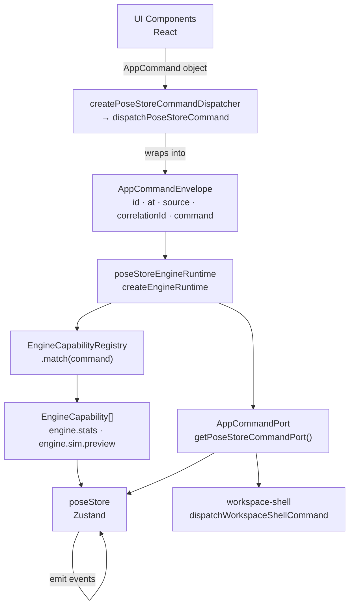
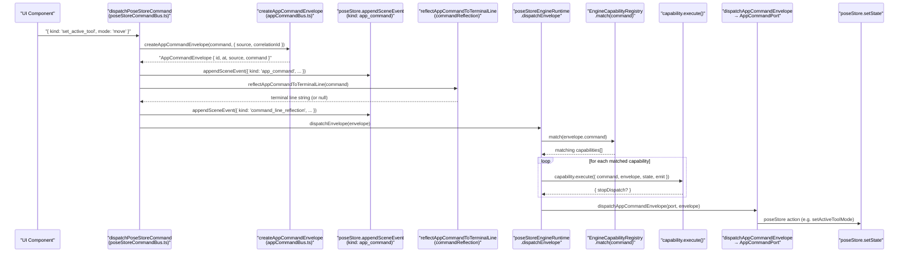
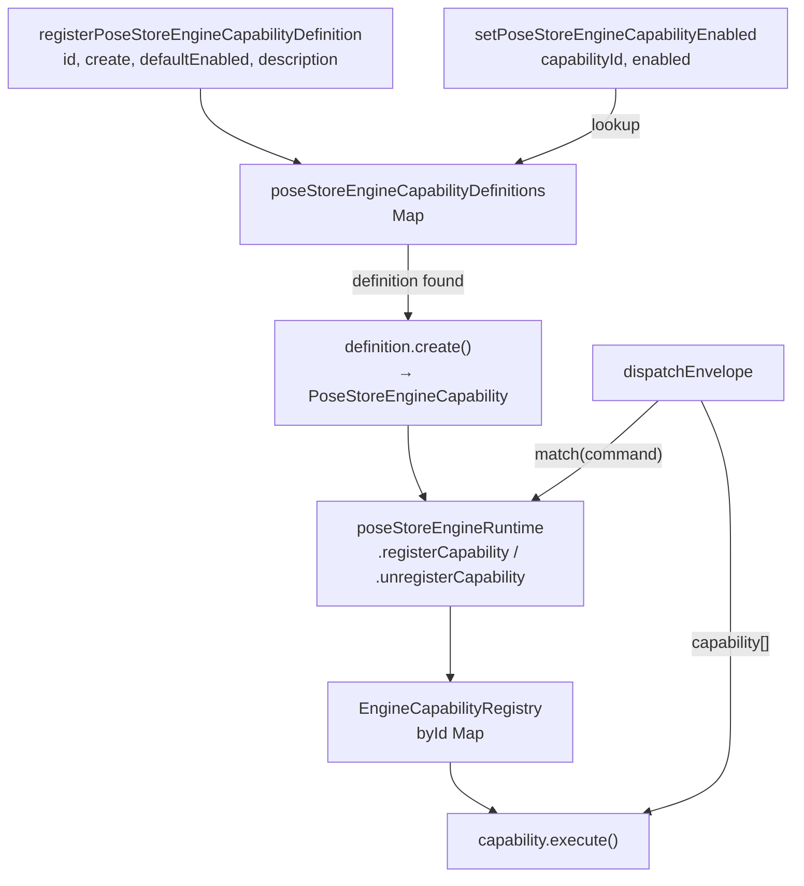

# Command System

Relevant source files

- 
- 
- 
- 
- 

This page describes how application commands originate in UI components and travel through the command bus, engine runtime, and port interface to ultimately mutate `poseStore` state. It is an overview of the full dispatch pipeline; for the complete `AppCommand` type catalogue and individual dispatch functions, see [AppCommand Types & Dispatch](https://deepwiki.com/e7canasta/puppet-studio/4.1-appcommand-types-and-dispatch). For the engine runtime internals and capability authoring, see [Engine Runtime & Capabilities](https://deepwiki.com/e7canasta/puppet-studio/4.2-engine-runtime-and-capabilities). For the `poseStore` state properties that commands modify, see [State Management](https://deepwiki.com/e7canasta/puppet-studio/3-state-management).

---

## Purpose

The command system is the single, explicit path by which any user action — keyboard shortcut, button click, terminal input — changes application state. Rather than components calling store actions directly, each intent is expressed as a typed `AppCommand` value, wrapped in an envelope with metadata, run through registered engine capabilities, and finally dispatched to `AppCommandPort` methods that resolve to `poseStore` mutations or workspace shell commands.

This indirection gives:

- A single audit log entry per command (scene event of kind `app_command`)
- Optional pre/post hooks via `EngineCapability` without touching UI code
- Reproducible command replaying (envelope carries `id`, `at`, `source`, `correlationId`)
- Configurable capability enablement per deployment profile

---

## Layers at a Glance

**Structural diagram: Command System Layers**

Sources: [src/core/app-commanding/poseStoreCommandBus.ts154-189](https://github.com/e7canasta/puppet-studio/blob/cdd483bd/src/core/app-commanding/poseStoreCommandBus.ts#L154-L189) [src/core/app-commanding/appCommandBus.ts139-175](https://github.com/e7canasta/puppet-studio/blob/cdd483bd/src/core/app-commanding/appCommandBus.ts#L139-L175) [src/core/engine/engineRuntime.ts63-101](https://github.com/e7canasta/puppet-studio/blob/cdd483bd/src/core/engine/engineRuntime.ts#L63-L101)

---

## Core Source Files

|File|Role|
|---|---|
|`src/core/app-commanding/appCommandBus.ts`|Defines `AppCommand` union, `AppCommandPort`, `AppCommandEnvelope`, `dispatchAppCommand`, `dispatchAppCommandEnvelope`, `createAppCommandEnvelope`|
|`src/core/app-commanding/poseStoreCommandBus.ts`|Singleton `poseStoreEngineRuntime`, `getPoseStoreCommandPort`, `dispatchPoseStoreCommand`, capability registration and lifecycle|
|`src/core/engine/engineRuntime.ts`|Generic `createEngineRuntime` factory — capability matching loop, envelope dispatch, event emission|
|`src/core/engine/engineCapabilityRegistry.ts`|`EngineCapabilityRegistry` — `register`, `unregister`, `match`, `list`, `clear`|
|`src/core/config/runtimeConfig.ts`|`resolveEngineCapabilityDefaultEnabled`, `ENGINE_CAPABILITY_PROFILE_PRESETS`|

---

## Dispatch Path Step-by-Step

**Sequence diagram: full dispatch path**

Sources: [src/core/app-commanding/poseStoreCommandBus.ts282-321](https://github.com/e7canasta/puppet-studio/blob/cdd483bd/src/core/app-commanding/poseStoreCommandBus.ts#L282-L321) [src/core/engine/engineRuntime.ts63-101](https://github.com/e7canasta/puppet-studio/blob/cdd483bd/src/core/engine/engineRuntime.ts#L63-L101) [src/core/app-commanding/appCommandBus.ts335-354](https://github.com/e7canasta/puppet-studio/blob/cdd483bd/src/core/app-commanding/appCommandBus.ts#L335-L354)

### Key steps explained

1. **`dispatchPoseStoreCommand`** — the public entry point [src/core/app-commanding/poseStoreCommandBus.ts282-321](https://github.com/e7canasta/puppet-studio/blob/cdd483bd/src/core/app-commanding/poseStoreCommandBus.ts#L282-L321) Takes an `AppCommand` and optional `{ source, correlationId }`. Calls `createAppCommandEnvelope`, logs two scene events (`app_command` and `command_line_reflection`), then calls `poseStoreEngineRuntime.dispatchEnvelope`.
    
2. **`createAppCommandEnvelope`** — wraps the command [src/core/app-commanding/appCommandBus.ts179-190](https://github.com/e7canasta/puppet-studio/blob/cdd483bd/src/core/app-commanding/appCommandBus.ts#L179-L190) Calls `createEngineCommandEnvelope` with an `idPrefix` of `'cmd'`, timestamping `at` and assigning a UUID `id`.
    
3. **`poseStoreEngineRuntime.dispatchEnvelope`** — runs the capability loop [src/core/engine/engineRuntime.ts63-101](https://github.com/e7canasta/puppet-studio/blob/cdd483bd/src/core/engine/engineRuntime.ts#L63-L101) Calls `EngineCapabilityRegistry.match` to find every registered capability that returns `true` for `canHandle(command)`. Each is executed; if any returns `{ stopDispatch: true }`, the envelope is **not** forwarded to the port.
    
4. **`dispatchAppCommandEnvelope` → `AppCommandPort`** — the final dispatch [src/core/app-commanding/appCommandBus.ts335-354](https://github.com/e7canasta/puppet-studio/blob/cdd483bd/src/core/app-commanding/appCommandBus.ts#L335-L354) For commands that carry an envelope (`clear_scene`, `undo_scene_edit`, `redo_scene_edit`, `run_scene_command`), the envelope is passed through so `poseStore` can record `commandId` provenance. All others fall through to `dispatchAppCommand`.
    
5. **`getPoseStoreCommandPort`** — constructs the port object on demand [src/core/app-commanding/poseStoreCommandBus.ts39-152](https://github.com/e7canasta/puppet-studio/blob/cdd483bd/src/core/app-commanding/poseStoreCommandBus.ts#L39-L152) Reads `usePoseStore.getState()` once and returns an `AppCommandPort` whose methods call the matching store actions or forward workspace UI commands to `dispatchWorkspaceShellCommand`.
    

---

## The AppCommandPort Interface

`AppCommandPort` (defined in [src/core/app-commanding/appCommandBus.ts139-175](https://github.com/e7canasta/puppet-studio/blob/cdd483bd/src/core/app-commanding/appCommandBus.ts#L139-L175)) is the boundary between the engine runtime and the actual state store. Each method on the port corresponds to exactly one `AppCommand` kind. The port implementation in `getPoseStoreCommandPort` [src/core/app-commanding/poseStoreCommandBus.ts39-152](https://github.com/e7canasta/puppet-studio/blob/cdd483bd/src/core/app-commanding/poseStoreCommandBus.ts#L39-L152) maps those methods to either:

- A `poseStore` action (e.g., `setActiveToolMode`, `setCameraView`)
- A `dispatchWorkspaceShellCommand` call for layout/panel commands that live outside `poseStore`

**Mapping diagram: AppCommand kinds → AppCommandPort methods → targets**

```mermaid
graph TD
    subgraph "Capability Manager"
        A1["setActiveToolMode"]
        A2["setCameraView /<br/>setProjectionMode"]
        A3["runSceneCommand"]
        A4["undoSceneEdit /<br/>redoSceneEdit /<br/>clearScene"]
        A5["setBridgeEnabled /<br/>setSceneId"]
        A6["resetPose /<br/>rotateTopView"]
        A7["toggleSceneEdit /<br/>toggleSceneRemoteHold"]
        A8["setSelectedPlacementId<br/>setSelectedMonitoringCameraId"]
        A9["applyDeferredSceneRemote<br/>clearSceneDeferredRemote<br/>clearSceneRemoteOverride"]
    end

    subgraph "Workspace Shell"
        B1["dispatchWorkspaceShellCommand<br/>apply_layout_preset"]
        B2["dispatchWorkspaceShellCommand<br/>toggle_left_panel /<br/>toggle_right_panel"]
        B3["dispatchWorkspaceShellCommand<br/>set_widget_visible /<br/>toggle_widget_*"]
    end

    subgraph "Scene State (poseStore)"
        C1["setPoseStoreEngineCapabilityEnabled"]
    end

    CMD["AppCommand<br/>(kind discriminant)"]

    CMD --> A1
    CMD --> A2
    CMD --> A3
    CMD --> A4
    CMD --> A5
    CMD --> A6
    CMD --> A7
    CMD --> A8
    CMD --> A9
    CMD --> B1
    CMD --> B2
    CMD --> B3
    CMD --> C1
```

Sources: [src/core/app-commanding/poseStoreCommandBus.ts39-152](https://github.com/e7canasta/puppet-studio/blob/cdd483bd/src/core/app-commanding/poseStoreCommandBus.ts#L39-L152) [src/core/app-commanding/appCommandBus.ts192-333](https://github.com/e7canasta/puppet-studio/blob/cdd483bd/src/core/app-commanding/appCommandBus.ts#L192-L333)

---

## Capability System Overview

Capabilities are optional, stateful interceptors that observe every dispatched command before it reaches the port. They are registered on the singleton `poseStoreEngineRuntime`.

### Built-in Capabilities

|Capability ID|Factory|Default Enabled|Description|
|---|---|---|---|
|`engine.stats`|`createEngineStatsCapability`|`true` (overridden by profile)|Aggregated command counters by kind/source|
|`engine.sim.preview`|`createEngineSimPreviewCapability`|`false` (overridden by profile)|Snapshot preview for local simulation workflows|

Sources: [src/core/app-commanding/poseStoreCommandBus.ts191-222](https://github.com/e7canasta/puppet-studio/blob/cdd483bd/src/core/app-commanding/poseStoreCommandBus.ts#L191-L222)

### Capability Profile Presets

Controlled by `VITE_FRONTEND_ENGINE_CAPABILITY_PROFILE` [src/core/config/runtimeConfig.ts101-114](https://github.com/e7canasta/puppet-studio/blob/cdd483bd/src/core/config/runtimeConfig.ts#L101-L114):

|Profile|Enabled|Disabled|
|---|---|---|
|`dev`|`engine.stats`, `engine.sim.preview`|—|
|`ops`|`engine.stats`|`engine.sim.preview`|
|`demo`|`engine.sim.preview`|—|

`resolveEngineCapabilityDefaultEnabled` [src/core/config/runtimeConfig.ts136-147](https://github.com/e7canasta/puppet-studio/blob/cdd483bd/src/core/config/runtimeConfig.ts#L136-L147) applies the following precedence: explicit `VITE_FRONTEND_ENGINE_CAPABILITIES_DISABLED` > explicit `VITE_FRONTEND_ENGINE_CAPABILITIES_ENABLED` > profile preset > `fallbackDefaultEnabled`.

### Capability Lifecycle

Sources: [src/core/app-commanding/poseStoreCommandBus.ts238-263](https://github.com/e7canasta/puppet-studio/blob/cdd483bd/src/core/app-commanding/poseStoreCommandBus.ts#L238-L263) [src/core/engine/engineCapabilityRegistry.ts1-28](https://github.com/e7canasta/puppet-studio/blob/cdd483bd/src/core/engine/engineCapabilityRegistry.ts#L1-L28) [src/core/engine/engineRuntime.ts40-119](https://github.com/e7canasta/puppet-studio/blob/cdd483bd/src/core/engine/engineRuntime.ts#L40-L119)

The `set_engine_capability_enabled` `AppCommand` dispatches through the normal command path and eventually calls `setPoseStoreEngineCapabilityEnabled` via the port [src/core/app-commanding/poseStoreCommandBus.ts99-119](https://github.com/e7canasta/puppet-studio/blob/cdd483bd/src/core/app-commanding/poseStoreCommandBus.ts#L99-L119) This means capability toggling is itself a logged, auditable command.

---

## Scene Event Logging in the Command Path

Every call to `dispatchPoseStoreCommand` produces at least one and up to two scene events:

|Event kind|Condition|Source tag|
|---|---|---|
|`app_command`|Always|`frontend.command_bus`|
|`command_line_reflection`|Command has a terminal-line representation AND source is not `ui.event_terminal.*`|`frontend.command_line`|

Capabilities emit events of kind `engine_runtime_event` at `debug` level via the `emitEvent` callback wired into `poseStoreEngineRuntime` [src/core/app-commanding/poseStoreCommandBus.ts158-169](https://github.com/e7canasta/puppet-studio/blob/cdd483bd/src/core/app-commanding/poseStoreCommandBus.ts#L158-L169)

Capability errors are caught and logged as `engine_capability_error` at `warn` level [src/core/app-commanding/poseStoreCommandBus.ts172-188](https://github.com/e7canasta/puppet-studio/blob/cdd483bd/src/core/app-commanding/poseStoreCommandBus.ts#L172-L188)

For more on scene event structure and consumption, see [Observability & Event Logging](https://deepwiki.com/e7canasta/puppet-studio/11-observability-and-event-logging).

---

## Creating a Command Dispatcher in a Component

UI components do not call `dispatchPoseStoreCommand` directly. Instead, `CadWorkspacePage` (and other orchestrators) create a bound dispatcher via `createPoseStoreCommandDispatcher`, which fixes a `source` tag and optional `correlationId`. This is documented in detail under [CAD Workspace Page](https://deepwiki.com/e7canasta/puppet-studio/6.1-cad-workspace-page).

The dispatcher returned is a function `(command: AppCommand) => void` that internally calls `dispatchPoseStoreCommand(command, { source })`.

Sources: [src/core/app-commanding/poseStoreCommandBus.ts282-321](https://github.com/e7canasta/puppet-studio/blob/cdd483bd/src/core/app-commanding/poseStoreCommandBus.ts#L282-L321)

### On this page

- [Command System](https://deepwiki.com/e7canasta/puppet-studio/4-command-system#command-system)
- [Purpose](https://deepwiki.com/e7canasta/puppet-studio/4-command-system#purpose)
- [Layers at a Glance](https://deepwiki.com/e7canasta/puppet-studio/4-command-system#layers-at-a-glance)
- [Core Source Files](https://deepwiki.com/e7canasta/puppet-studio/4-command-system#core-source-files)
- [Dispatch Path Step-by-Step](https://deepwiki.com/e7canasta/puppet-studio/4-command-system#dispatch-path-step-by-step)
- [Key steps explained](https://deepwiki.com/e7canasta/puppet-studio/4-command-system#key-steps-explained)
- [The AppCommandPort Interface](https://deepwiki.com/e7canasta/puppet-studio/4-command-system#the-appcommandport-interface)
- [Capability System Overview](https://deepwiki.com/e7canasta/puppet-studio/4-command-system#capability-system-overview)
- [Built-in Capabilities](https://deepwiki.com/e7canasta/puppet-studio/4-command-system#built-in-capabilities)
- [Capability Profile Presets](https://deepwiki.com/e7canasta/puppet-studio/4-command-system#capability-profile-presets)
- [Capability Lifecycle](https://deepwiki.com/e7canasta/puppet-studio/4-command-system#capability-lifecycle)
- [Scene Event Logging in the Command Path](https://deepwiki.com/e7canasta/puppet-studio/4-command-system#scene-event-logging-in-the-command-path)
- [Creating a Command Dispatcher in a Component](https://deepwiki.com/e7canasta/puppet-studio/4-command-system#creating-a-command-dispatcher-in-a-component)
