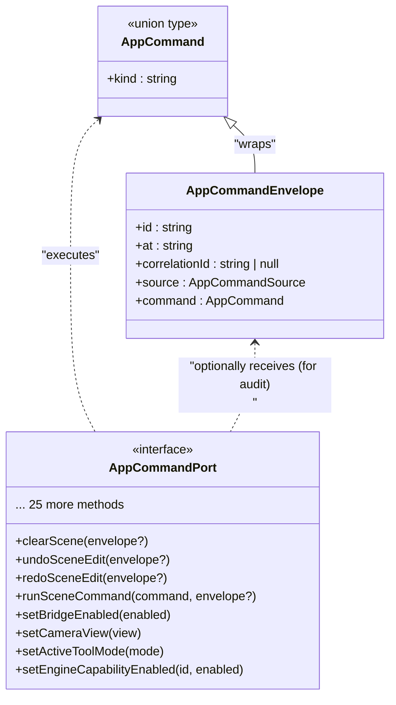
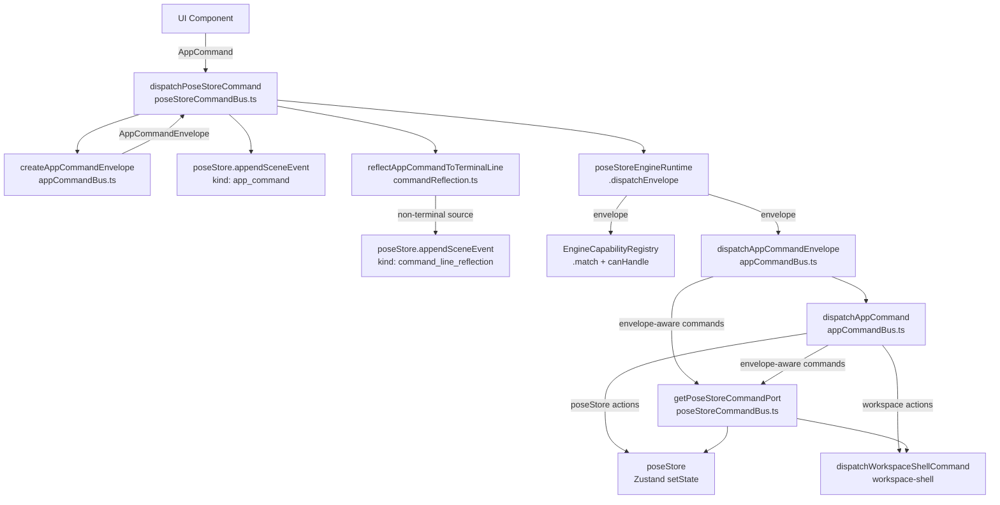
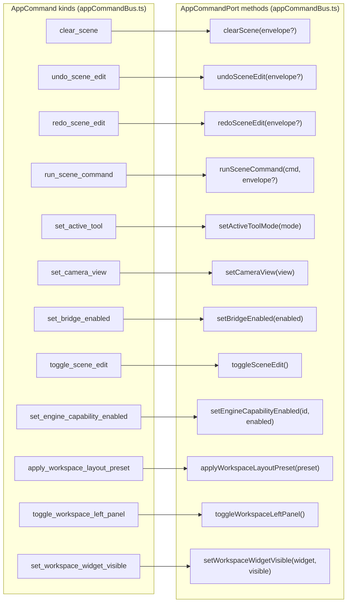

# AppCommand Types & Dispatch

Relevant source files

- [](https://github.com/e7canasta/puppet-studio/blob/cdd483bd/src/core/app-commanding/appCommandBus.ts)
- [](https://github.com/e7canasta/puppet-studio/blob/cdd483bd/src/core/app-commanding/poseStoreCommandBus.ts)
- [](https://github.com/e7canasta/puppet-studio/blob/cdd483bd/src/core/engine/engineCapabilityRegistry.ts)

## Purpose & Scope

This page documents the `AppCommand` union type, every command variant and its fields, the `AppCommandEnvelope` wrapper, the `AppCommandPort` interface, and the three dispatch functions: `createAppCommandEnvelope`, `dispatchAppCommand`, and `dispatchAppCommandEnvelope`. It also covers `dispatchPoseStoreCommand`, the public entry point that wires all of these together with the engine runtime and `poseStore`.

This page covers the _types and dispatch logic_ in the command system. For how the engine runtime processes envelopes and runs capabilities once dispatched, see [Engine Runtime & Capabilities](https://deepwiki.com/e7canasta/puppet-studio/4.2-engine-runtime-and-capabilities). For the broader command flow overview, see [Command System](https://deepwiki.com/e7canasta/puppet-studio/4-command-system).

---

## Core Type Relationships

**Type Diagram: AppCommand, Envelope, and Port**



Sources: [src/core/app-commanding/appCommandBus.ts139-177](https://github.com/e7canasta/puppet-studio/blob/cdd483bd/src/core/app-commanding/appCommandBus.ts#L139-L177)

---

## AppCommand Union Type

`AppCommand` is a discriminated union defined in [src/core/app-commanding/appCommandBus.ts11-138](https://github.com/e7canasta/puppet-studio/blob/cdd483bd/src/core/app-commanding/appCommandBus.ts#L11-L138) Every variant carries a `kind` string literal and zero or more additional fields. The full set of variants is listed below, grouped by concern.

### Scene State Commands

|`kind`|Extra Fields|Description|
|---|---|---|
|`clear_scene`|—|Resets the entire scene|
|`undo_scene_edit`|—|Pops the undo stack|
|`redo_scene_edit`|—|Applies the next redo entry|
|`run_scene_command`|`command: SceneCommand`|Delegates to the scene command handler|
|`toggle_scene_edit`|—|Enables or disables scene editing|
|`toggle_scene_remote_hold`|—|Pauses or resumes remote scene updates|
|`apply_deferred_scene_remote`|—|Flushes the deferred remote update queue|
|`clear_scene_deferred_remote`|—|Discards the deferred remote update queue|
|`clear_scene_remote_override`|—|Clears any local scene override|

### Camera & View Commands

|`kind`|Extra Fields|Description|
|---|---|---|
|`set_camera_view`|`view: AppCameraView`|Moves the viewport camera to a preset|
|`set_projection_mode`|`mode: AppProjectionMode`|Switches between `orthographic` and `perspective`|
|`rotate_top_view`|`direction: -1 \| 1`|Rotates the top-down view by one step|
|`set_camera_overlay_flip`|`axis: AppCameraOverlayAxis`, `enabled: boolean`|Flips the camera overlay on x or y|
|`reset_camera_overlay_flip`|—|Clears all camera overlay flip state|

### Selection & Tool Commands

|`kind`|Extra Fields|Description|
|---|---|---|
|`set_active_tool`|`mode: AppToolMode`|Sets the active tool: `move`, `rotate`, or `select`|
|`set_selected_placement`|`placementId: string \| null`|Selects a planogram placement|
|`set_selected_monitoring_camera`|`cameraId: string \| null`|Selects a monitoring camera|
|`set_show_dimensions`|`show: boolean`|Shows or hides placement dimension overlays|
|`reset_pose`|—|Resets the puppet pose to default|

### Bridge & Scene Identity Commands

|`kind`|Extra Fields|Description|
|---|---|---|
|`set_bridge_enabled`|`enabled: boolean`|Connects or disconnects the WebSocket bridge|
|`set_scene_id`|`sceneId: string`|Sets the active scene identifier|

### Engine Commands

|`kind`|Extra Fields|Description|
|---|---|---|
|`request_engine_stats`|—|Triggers a stats report from the engine runtime|
|`request_engine_sim_preview`|—|Requests a sim preview snapshot|
|`set_engine_capability_enabled`|`capabilityId: string`, `enabled: boolean`|Enables or disables a named engine capability|

### Event Log Commands

|`kind`|Extra Fields|Description|
|---|---|---|
|`clear_scene_event_log`|—|Empties the scene event log|
|`set_scene_event_auto_scroll`|`enabled: boolean`|Toggles auto-scroll in the terminal|
|`set_scene_event_log_paused`|`enabled: boolean`|Pauses or unpauses event log ingestion|

### Workspace UI Commands

|`kind`|Extra Fields|Description|
|---|---|---|
|`apply_workspace_layout_preset`|`preset: WorkspaceLayoutPreset`|Applies a named layout preset|
|`restore_workspace_layout_defaults`|—|Resets the HUD layout to defaults|
|`toggle_workspace_left_panel`|—|Toggles the left panel visibility|
|`toggle_workspace_right_panel`|—|Toggles the right panel visibility|
|`toggle_scene_event_terminal`|—|Shows or hides the event terminal|
|`set_workspace_widget_visible`|`widget: WorkspaceWidgetId`, `visible: boolean`|Sets a named widget visible or hidden|
|`toggle_workspace_widget_collapsed`|`widget: WorkspaceWidgetId`|Collapses or expands a named widget|
|`toggle_workspace_widget_pinned`|`widget: WorkspaceWidgetId`|Pins or unpins a named widget|

Sources: [src/core/app-commanding/appCommandBus.ts11-138](https://github.com/e7canasta/puppet-studio/blob/cdd483bd/src/core/app-commanding/appCommandBus.ts#L11-L138)

---

## Supporting Scalar Types

Defined in [src/core/app-commanding/appCommandBus.ts5-9](https://github.com/e7canasta/puppet-studio/blob/cdd483bd/src/core/app-commanding/appCommandBus.ts#L5-L9):

|Type|Values|
|---|---|
|`AppCameraView`|`'iso' \| 'top' \| 'front' \| 'back' \| 'left' \| 'right' \| 'sensor'`|
|`AppProjectionMode`|`'orthographic' \| 'perspective'`|
|`AppCameraOverlayAxis`|`'x' \| 'y'`|
|`AppToolMode`|`'move' \| 'rotate' \| 'select'`|
|`AppCommandSource`|`string` (free-form tag, e.g. `'ui.hotkey'`, `'ui.event_terminal'`)|

---

## AppCommandEnvelope

`AppCommandEnvelope` is an alias for `EngineCommandEnvelope<AppCommand>`:

```
AppCommandEnvelope = EngineCommandEnvelope<AppCommand>
```

[src/core/app-commanding/appCommandBus.ts177](https://github.com/e7canasta/puppet-studio/blob/cdd483bd/src/core/app-commanding/appCommandBus.ts#L177-L177)

The envelope fields are:

|Field|Type|Description|
|---|---|---|
|`id`|`string`|Unique command ID, prefixed with `'cmd'`|
|`at`|`string`|ISO timestamp at creation|
|`correlationId`|`string \| null`|Optional caller-supplied correlation token|
|`source`|`AppCommandSource`|Identifies the UI subsystem issuing the command|
|`command`|`AppCommand`|The wrapped command payload|

The envelope is used downstream by the engine runtime and by certain `AppCommandPort` methods (`clearScene`, `undoSceneEdit`, `redoSceneEdit`, `runSceneCommand`) that need audit metadata when mutating the undo/redo stack. These port methods accept an optional `envelope?` argument and extract `commandId`, `correlationId`, `at`, and `source` from it via `toSceneEngineMeta` in [src/core/app-commanding/poseStoreCommandBus.ts41-49](https://github.com/e7canasta/puppet-studio/blob/cdd483bd/src/core/app-commanding/poseStoreCommandBus.ts#L41-L49)

Sources: [src/core/app-commanding/appCommandBus.ts177-190](https://github.com/e7canasta/puppet-studio/blob/cdd483bd/src/core/app-commanding/appCommandBus.ts#L177-L190) [src/core/app-commanding/poseStoreCommandBus.ts39-49](https://github.com/e7canasta/puppet-studio/blob/cdd483bd/src/core/app-commanding/poseStoreCommandBus.ts#L39-L49)

---

## AppCommandPort Interface

`AppCommandPort` is an interface defined at [src/core/app-commanding/appCommandBus.ts139-175](https://github.com/e7canasta/puppet-studio/blob/cdd483bd/src/core/app-commanding/appCommandBus.ts#L139-L175) with one method per logical action. It is the boundary between dispatch logic (which knows about `AppCommand` variants) and state mutation (which knows about `poseStore` and workspace shell commands).

The concrete implementation is produced at runtime by `getPoseStoreCommandPort()` in [src/core/app-commanding/poseStoreCommandBus.ts39-152](https://github.com/e7canasta/puppet-studio/blob/cdd483bd/src/core/app-commanding/poseStoreCommandBus.ts#L39-L152) That function reads `usePoseStore.getState()` and maps each port method to either a `poseStore` action or a `dispatchWorkspaceShellCommand` call.

**Port Method → Implementation mapping (selected examples)**

|Port Method|Implemented By|
|---|---|
|`clearScene(envelope?)`|`state.clearScene(toSceneEngineMeta(envelope))`|
|`undoSceneEdit(envelope?)`|`state.undoSceneEdit(toSceneEngineMeta(envelope))`|
|`runSceneCommand(cmd, env?)`|`state.runSceneCommand(cmd, toSceneEngineMeta(env))`|
|`applyWorkspaceLayoutPreset(preset)`|`dispatchWorkspaceShellCommand({ kind: 'apply_layout_preset', preset })`|
|`toggleWorkspaceLeftPanel()`|`dispatchWorkspaceShellCommand({ kind: 'toggle_left_panel' })`|
|`setEngineCapabilityEnabled(id, enabled)`|`setPoseStoreEngineCapabilityEnabled(id, enabled)` + scene event|
|`requestEngineStats()`|appends `engine_stats_unavailable` warn event (stats capability handles the real work)|

Sources: [src/core/app-commanding/appCommandBus.ts139-175](https://github.com/e7canasta/puppet-studio/blob/cdd483bd/src/core/app-commanding/appCommandBus.ts#L139-L175) [src/core/app-commanding/poseStoreCommandBus.ts39-152](https://github.com/e7canasta/puppet-studio/blob/cdd483bd/src/core/app-commanding/poseStoreCommandBus.ts#L39-L152)

---

## Dispatch Functions

### `createAppCommandEnvelope`

[src/core/app-commanding/appCommandBus.ts179-190](https://github.com/e7canasta/puppet-studio/blob/cdd483bd/src/core/app-commanding/appCommandBus.ts#L179-L190)

Creates a new `AppCommandEnvelope` from a bare `AppCommand`. Delegates to `createEngineCommandEnvelope` with `idPrefix: 'cmd'`. Options:

|Option|Default|
|---|---|
|`source`|`'ui.unknown'`|
|`correlationId`|`null`|
|`id`|auto-generated with `'cmd'` prefix|
|`at`|current ISO timestamp|

---

### `dispatchAppCommand`

[src/core/app-commanding/appCommandBus.ts192-333](https://github.com/e7canasta/puppet-studio/blob/cdd483bd/src/core/app-commanding/appCommandBus.ts#L192-L333)

A plain switch-style function that takes an `AppCommandPort` and a bare `AppCommand` (no envelope), and calls the appropriate port method. Used when envelope metadata is not needed. All 35 command kinds are handled by explicit `if` branches.

---

### `dispatchAppCommandEnvelope`

[src/core/app-commanding/appCommandBus.ts335-354](https://github.com/e7canasta/puppet-studio/blob/cdd483bd/src/core/app-commanding/appCommandBus.ts#L335-L354)

Like `dispatchAppCommand`, but accepts an `AppCommandEnvelope`. For the four envelope-aware commands (`clear_scene`, `undo_scene_edit`, `redo_scene_edit`, `run_scene_command`) it passes the envelope to the port method for audit purposes. All other commands fall through to `dispatchAppCommand`.

```
dispatchAppCommandEnvelope(port, envelope)
  ├─ clear_scene        → port.clearScene(envelope)
  ├─ undo_scene_edit    → port.undoSceneEdit(envelope)
  ├─ redo_scene_edit    → port.redoSceneEdit(envelope)
  ├─ run_scene_command  → port.runSceneCommand(command.command, envelope)
  └─ everything else    → dispatchAppCommand(port, command)
```

Sources: [src/core/app-commanding/appCommandBus.ts335-354](https://github.com/e7canasta/puppet-studio/blob/cdd483bd/src/core/app-commanding/appCommandBus.ts#L335-L354)

---

### `dispatchPoseStoreCommand`

[src/core/app-commanding/poseStoreCommandBus.ts282-321](https://github.com/e7canasta/puppet-studio/blob/cdd483bd/src/core/app-commanding/poseStoreCommandBus.ts#L282-L321)

This is the **primary public entry point** for all UI-originated commands. It orchestrates the full dispatch pipeline:

1. Creates an `AppCommandEnvelope` via `createAppCommandEnvelope`, stamping the `source` tag.
2. Appends an `app_command` debug event to `poseStore` via `appendSceneEvent`.
3. Calls `reflectAppCommandToTerminalLine` — if the command produces a human-readable line and the source is not the terminal itself, appends a `command_line_reflection` info event.
4. Calls `poseStoreEngineRuntime.dispatchEnvelope(envelope)`, which runs registered capabilities and then calls `dispatchAppCommandEnvelope` on the port.
5. Returns the created `AppCommandEnvelope`.

**Signature:**

```
dispatchPoseStoreCommand(
  command: AppCommand,
  options?: { correlationId?: string | null; source?: string }
): AppCommandEnvelope
```

Sources: [src/core/app-commanding/poseStoreCommandBus.ts282-321](https://github.com/e7canasta/puppet-studio/blob/cdd483bd/src/core/app-commanding/poseStoreCommandBus.ts#L282-L321)

---

## Full Dispatch Flow

**Diagram: Command Dispatch Pipeline (code entity view)**



Sources: [src/core/app-commanding/poseStoreCommandBus.ts282-321](https://github.com/e7canasta/puppet-studio/blob/cdd483bd/src/core/app-commanding/poseStoreCommandBus.ts#L282-L321) [src/core/app-commanding/appCommandBus.ts179-354](https://github.com/e7canasta/puppet-studio/blob/cdd483bd/src/core/app-commanding/appCommandBus.ts#L179-L354)

---

**Diagram: AppCommandPort — Kind to Port Method Mapping**



Sources: [src/core/app-commanding/appCommandBus.ts192-354](https://github.com/e7canasta/puppet-studio/blob/cdd483bd/src/core/app-commanding/appCommandBus.ts#L192-L354)

---

## Envelope-Aware vs Plain Dispatch

Four commands receive the full `AppCommandEnvelope` instead of just the `AppCommand`. This lets the receiving `poseStore` action attach audit metadata to undo/redo stack entries.

|Command|Port Method|Why envelope matters|
|---|---|---|
|`clear_scene`|`clearScene(envelope)`|Records command ID on undo stack entry|
|`undo_scene_edit`|`undoSceneEdit(envelope)`|Correlates undo operation to originating command|
|`redo_scene_edit`|`redoSceneEdit(envelope)`|Same as undo|
|`run_scene_command`|`runSceneCommand(cmd, envelope)`|Associates scene mutation to command for event log|

All other commands are dispatched via `dispatchAppCommand`, which only needs the command payload.

Sources: [src/core/app-commanding/appCommandBus.ts335-354](https://github.com/e7canasta/puppet-studio/blob/cdd483bd/src/core/app-commanding/appCommandBus.ts#L335-L354) [src/core/app-commanding/poseStoreCommandBus.ts41-49](https://github.com/e7canasta/puppet-studio/blob/cdd483bd/src/core/app-commanding/poseStoreCommandBus.ts#L41-L49)
### On this page

- [AppCommand Types & Dispatch](https://deepwiki.com/e7canasta/puppet-studio/4.1-appcommand-types-and-dispatch#appcommand-types-dispatch)
- [Purpose & Scope](https://deepwiki.com/e7canasta/puppet-studio/4.1-appcommand-types-and-dispatch#purpose-scope)
- [Core Type Relationships](https://deepwiki.com/e7canasta/puppet-studio/4.1-appcommand-types-and-dispatch#core-type-relationships)
- [AppCommand Union Type](https://deepwiki.com/e7canasta/puppet-studio/4.1-appcommand-types-and-dispatch#appcommand-union-type)
- [Scene State Commands](https://deepwiki.com/e7canasta/puppet-studio/4.1-appcommand-types-and-dispatch#scene-state-commands)
- [Camera & View Commands](https://deepwiki.com/e7canasta/puppet-studio/4.1-appcommand-types-and-dispatch#camera-view-commands)
- [Selection & Tool Commands](https://deepwiki.com/e7canasta/puppet-studio/4.1-appcommand-types-and-dispatch#selection-tool-commands)
- [Bridge & Scene Identity Commands](https://deepwiki.com/e7canasta/puppet-studio/4.1-appcommand-types-and-dispatch#bridge-scene-identity-commands)
- [Engine Commands](https://deepwiki.com/e7canasta/puppet-studio/4.1-appcommand-types-and-dispatch#engine-commands)
- [Event Log Commands](https://deepwiki.com/e7canasta/puppet-studio/4.1-appcommand-types-and-dispatch#event-log-commands)
- [Workspace UI Commands](https://deepwiki.com/e7canasta/puppet-studio/4.1-appcommand-types-and-dispatch#workspace-ui-commands)
- [Supporting Scalar Types](https://deepwiki.com/e7canasta/puppet-studio/4.1-appcommand-types-and-dispatch#supporting-scalar-types)
- [AppCommandEnvelope](https://deepwiki.com/e7canasta/puppet-studio/4.1-appcommand-types-and-dispatch#appcommandenvelope)
- [AppCommandPort Interface](https://deepwiki.com/e7canasta/puppet-studio/4.1-appcommand-types-and-dispatch#appcommandport-interface)
- [Dispatch Functions](https://deepwiki.com/e7canasta/puppet-studio/4.1-appcommand-types-and-dispatch#dispatch-functions)
- [`createAppCommandEnvelope`](https://deepwiki.com/e7canasta/puppet-studio/4.1-appcommand-types-and-dispatch#createappcommandenvelope)
- [`dispatchAppCommand`](https://deepwiki.com/e7canasta/puppet-studio/4.1-appcommand-types-and-dispatch#dispatchappcommand)
- [`dispatchAppCommandEnvelope`](https://deepwiki.com/e7canasta/puppet-studio/4.1-appcommand-types-and-dispatch#dispatchappcommandenvelope)
- [`dispatchPoseStoreCommand`](https://deepwiki.com/e7canasta/puppet-studio/4.1-appcommand-types-and-dispatch#dispatchposestorecommand)
- [Full Dispatch Flow](https://deepwiki.com/e7canasta/puppet-studio/4.1-appcommand-types-and-dispatch#full-dispatch-flow)
- [Envelope-Aware vs Plain Dispatch](https://deepwiki.com/e7canasta/puppet-studio/4.1-appcommand-types-and-dispatch#envelope-aware-vs-plain-dispatch)
