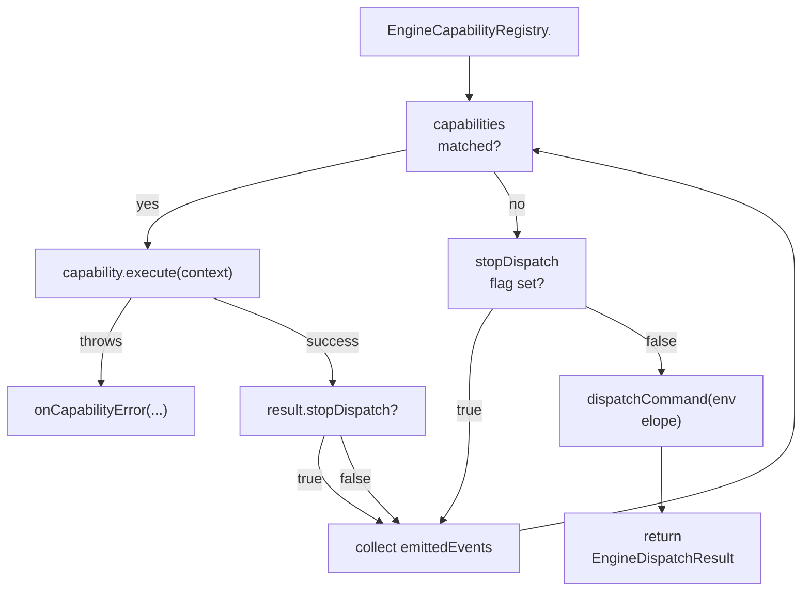
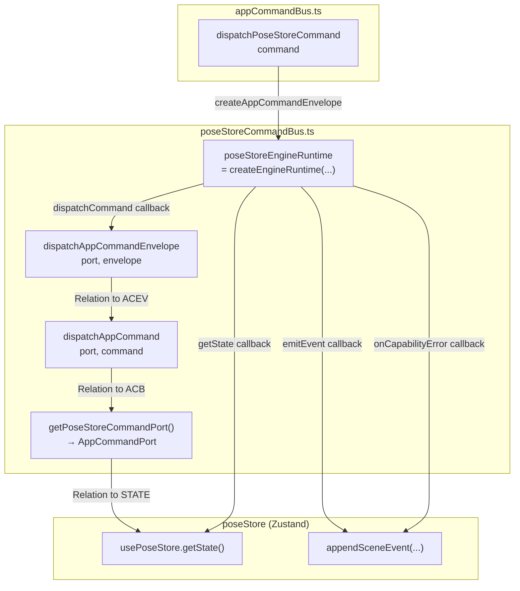
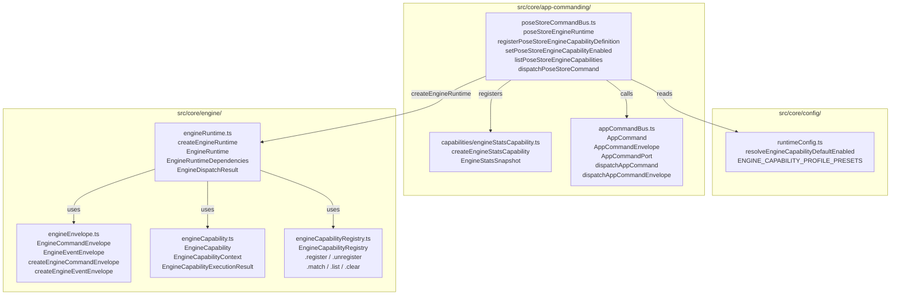

# Engine Runtime & Capabilities

Relevant source files

- [](https://github.com/e7canasta/puppet-studio/blob/cdd483bd/src/core/app-commanding/appCommandBus.ts)
- [](https://github.com/e7canasta/puppet-studio/blob/cdd483bd/src/core/app-commanding/capabilities/engineStatsCapability.ts)
- [](https://github.com/e7canasta/puppet-studio/blob/cdd483bd/src/core/app-commanding/poseStoreCommandBus.ts)
- [](https://github.com/e7canasta/puppet-studio/blob/cdd483bd/src/core/config/runtimeConfig.ts)
- [](https://github.com/e7canasta/puppet-studio/blob/cdd483bd/src/core/engine/engineCapability.ts)
- [](https://github.com/e7canasta/puppet-studio/blob/cdd483bd/src/core/engine/engineCapabilityRegistry.ts)
- [](https://github.com/e7canasta/puppet-studio/blob/cdd483bd/src/core/engine/engineEnvelope.ts)
- [](https://github.com/e7canasta/puppet-studio/blob/cdd483bd/src/core/engine/engineRuntime.ts)

This page documents the generic engine runtime, the capability plugin system built on top of it, and the concrete `poseStoreEngineRuntime` instance that wires it into the application's central state store. It covers the interfaces `EngineCapability`, `EngineCapabilityRegistry`, and `EngineRuntime`, the envelope types `EngineCommandEnvelope` and `EngineEventEnvelope`, and the `registerPoseStoreEngineCapabilityDefinition` lifecycle.

For the upstream step that creates commands and routes them here, see page [4.1](https://deepwiki.com/e7canasta/puppet-studio/4.1-appcommand-types-and-dispatch) (AppCommand Types & Dispatch). For configuration variables that control which capabilities are active at startup, see page [12](https://deepwiki.com/e7canasta/puppet-studio/12-configuration).

---

## Purpose

The engine runtime sits between the command bus and the `AppCommandPort`. Every `AppCommand` that is dispatched passes through the runtime before it reaches state-mutating port methods. The runtime:

1. Matches the command against all registered **capabilities**.
2. Executes each matching capability, collecting any emitted events.
3. Forwards the command to the `AppCommandPort` (unless a capability signals `stopDispatch`).

Capabilities can observe or intercept commands, accumulate side-effect data (e.g. statistics), and emit structured events — all without modifying the core dispatch path.

Sources: [src/core/engine/engineRuntime.ts1-119](https://github.com/e7canasta/puppet-studio/blob/cdd483bd/src/core/engine/engineRuntime.ts#L1-L119)

---

## Core Types

### Envelopes

All commands and events that pass through the runtime are wrapped in envelopes carrying metadata.

|Type|File|Fields|
|---|---|---|
|`EngineCommandEnvelope<TCommand>`|`engineEnvelope.ts`|`id`, `at`, `source`, `correlationId`, `command`|
|`EngineEventEnvelope<TEvent>`|`engineEnvelope.ts`|`id`, `at`, `kind`, `source`, `commandId`, `correlationId`, `payload`|
|`EngineCommandEnvelopeOptions`|`engineEnvelope.ts`|optional overrides: `id`, `idPrefix`, `at`, `source`, `correlationId`|
|`EngineEventEnvelopeOptions`|`engineEnvelope.ts`|optional overrides for event envelope creation|

Both factory functions use module-level monotonic counters (`commandSequence`, `eventSequence`) to generate default IDs.

- `createEngineCommandEnvelope` — [src/core/engine/engineEnvelope.ts41-54](https://github.com/e7canasta/puppet-studio/blob/cdd483bd/src/core/engine/engineEnvelope.ts#L41-L54)
- `createEngineEventEnvelope` — [src/core/engine/engineEnvelope.ts56-72](https://github.com/e7canasta/puppet-studio/blob/cdd483bd/src/core/engine/engineEnvelope.ts#L56-L72)

Sources: [src/core/engine/engineEnvelope.ts1-72](https://github.com/e7canasta/puppet-studio/blob/cdd483bd/src/core/engine/engineEnvelope.ts#L1-L72)

---

### EngineCapability Interface

Defined in [src/core/engine/engineCapability.ts21-25](https://github.com/e7canasta/puppet-studio/blob/cdd483bd/src/core/engine/engineCapability.ts#L21-L25)

```
EngineCapability<TCommand, TEvent, TState>
  id: string
  canHandle(command: TCommand): boolean
  execute(context: EngineCapabilityContext<TCommand, TEvent, TState>): EngineCapabilityExecutionResult
```

The `EngineCapabilityContext` passed to `execute` contains:

|Field|Type|Description|
|---|---|---|
|`command`|`TCommand`|The raw command object|
|`envelope`|`EngineCommandEnvelope<TCommand>`|Full envelope with metadata|
|`state`|`TState`|Snapshot of application state at dispatch time|
|`emit`|`(kind, payload, options?) => void`|Emits an `EngineEventEnvelope` and calls `dependencies.emitEvent`|

`EngineCapabilityExecutionResult` is either `void` or `{ stopDispatch?: boolean }`. Returning `{ stopDispatch: true }` prevents the command from reaching the `AppCommandPort`.

Sources: [src/core/engine/engineCapability.ts1-26](https://github.com/e7canasta/puppet-studio/blob/cdd483bd/src/core/engine/engineCapability.ts#L1-L26)

---

### EngineCapabilityRegistry

`EngineCapabilityRegistry<TCommand, TEvent, TState>` is a thin keyed map of capabilities.

|Method|Behaviour|
|---|---|
|`register(capability)`|Stores by `capability.id`. Throws if duplicate `id`.|
|`unregister(id)`|Silently removes if present.|
|`match(command)`|Returns all capabilities where `canHandle(command)` returns `true`.|
|`list()`|Returns all registered capabilities.|
|`clear()`|Empties the map.|

Sources: [src/core/engine/engineCapabilityRegistry.ts1-28](https://github.com/e7canasta/puppet-studio/blob/cdd483bd/src/core/engine/engineCapabilityRegistry.ts#L1-L28)

---

## createEngineRuntime

`createEngineRuntime<TCommand, TEvent, TState>(dependencies)` is the factory function defined in [src/core/engine/engineRuntime.ts40-119](https://github.com/e7canasta/puppet-studio/blob/cdd483bd/src/core/engine/engineRuntime.ts#L40-L119) It returns an `EngineRuntime<TCommand, TEvent, TState>` object.

**Dependencies**

|Field|Required|Description|
|---|---|---|
|`dispatchCommand`|Yes|Called with the envelope after capabilities run (unless stopped)|
|`getState`|Yes|Returns the current `TState` snapshot passed to capabilities|
|`emitEvent`|No|Called with each `EngineEventEnvelope` produced by capabilities|
|`onCapabilityError`|No|Called when a capability's `execute` throws; receives `{ capabilityId, command, envelope, error }`|
|`registry`|No|Custom `EngineCapabilityRegistry`; a new one is created if omitted|

**Returned EngineRuntime methods**

|Method|Description|
|---|---|
|`dispatch(command, options?)`|Wraps command in an envelope then calls `dispatchEnvelope`|
|`dispatchEnvelope(envelope)`|Core dispatch loop — runs capabilities, then forwards|
|`registerCapability(capability)`|Delegates to `EngineCapabilityRegistry.register`|
|`unregisterCapability(id)`|Delegates to `EngineCapabilityRegistry.unregister`|
|`listCapabilities()`|Returns all registered capabilities|
|`clearCapabilities()`|Empties the registry|

**EngineDispatchResult** (returned by `dispatch` and `dispatchEnvelope`):

|Field|Type|Description|
|---|---|---|
|`envelope`|`EngineCommandEnvelope<TCommand>`|The dispatched envelope|
|`handledByCapabilities`|`string[]`|IDs of capabilities that executed|
|`emittedEvents`|`EngineEventEnvelope<TEvent>[]`|Events produced during dispatch|
|`dispatchedToCommandPort`|`boolean`|`false` if any capability returned `stopDispatch: true`|

Sources: [src/core/engine/engineRuntime.ts11-119](https://github.com/e7canasta/puppet-studio/blob/cdd483bd/src/core/engine/engineRuntime.ts#L11-L119)

---

## Dispatch Flow

**Title: EngineRuntime dispatch loop**


Sources: [src/core/engine/engineRuntime.ts63-101](https://github.com/e7canasta/puppet-studio/blob/cdd483bd/src/core/engine/engineRuntime.ts#L63-L101)

---

## PoseStore Integration

The application creates one concrete runtime instance — `poseStoreEngineRuntime` — at module load time in [src/core/app-commanding/poseStoreCommandBus.ts154-189](https://github.com/e7canasta/puppet-studio/blob/cdd483bd/src/core/app-commanding/poseStoreCommandBus.ts#L154-L189)

**Title: poseStoreEngineRuntime wiring**




The three callbacks passed to `createEngineRuntime` are:

- **`dispatchCommand`** — calls `dispatchAppCommandEnvelope(getPoseStoreCommandPort(), envelope)` [src/core/app-commanding/poseStoreCommandBus.ts155-157](https://github.com/e7canasta/puppet-studio/blob/cdd483bd/src/core/app-commanding/poseStoreCommandBus.ts#L155-L157)
- **`emitEvent`** — writes an `engine_runtime_event` scene event via `appendSceneEvent` [src/core/app-commanding/poseStoreCommandBus.ts158-170](https://github.com/e7canasta/puppet-studio/blob/cdd483bd/src/core/app-commanding/poseStoreCommandBus.ts#L158-L170)
- **`onCapabilityError`** — writes an `engine_capability_error` scene event [src/core/app-commanding/poseStoreCommandBus.ts172-188](https://github.com/e7canasta/puppet-studio/blob/cdd483bd/src/core/app-commanding/poseStoreCommandBus.ts#L172-L188)
- **`getState`** — returns `usePoseStore.getState()` [src/core/app-commanding/poseStoreCommandBus.ts171](https://github.com/e7canasta/puppet-studio/blob/cdd483bd/src/core/app-commanding/poseStoreCommandBus.ts#L171-L171)

Sources: [src/core/app-commanding/poseStoreCommandBus.ts154-189](https://github.com/e7canasta/puppet-studio/blob/cdd483bd/src/core/app-commanding/poseStoreCommandBus.ts#L154-L189)

---

## PoseStore Capability Types

`poseStoreCommandBus.ts` narrows the generic type parameters to the specific application types:

```
PoseStoreEngineCapabilityEvent = { [key: string]: unknown }
PoseStoreEngineCapability = EngineCapability<AppCommand, PoseStoreEngineCapabilityEvent, PoseStoreState>
```

A **`PoseStoreEngineCapabilityDefinition`** is a record used by the capability definition registry:

|Field|Type|Description|
|---|---|---|
|`id`|`string`|Unique capability identifier, e.g. `'engine.stats'`|
|`create`|`() => PoseStoreEngineCapability`|Factory called when capability is enabled|
|`defaultEnabled`|`boolean`|Resolved from config at registration time|
|`description`|`string`|Human-readable summary|

A **`PoseStoreEngineCapabilityStatus`** is the shape returned by `listPoseStoreEngineCapabilities()`:

|Field|Type|
|---|---|
|`id`|`string`|
|`description`|`string`|
|`defaultEnabled`|`boolean`|
|`enabled`|`boolean` (live, from `listCapabilities()`)|

Sources: [src/core/app-commanding/poseStoreCommandBus.ts17-35](https://github.com/e7canasta/puppet-studio/blob/cdd483bd/src/core/app-commanding/poseStoreCommandBus.ts#L17-L35)

---

## Capability Lifecycle

**Title: Capability definition and enable/disable lifecycle**

### Public API Functions

|Function|File|Description|
|---|---|---|
|`registerPoseStoreEngineCapabilityDefinition(definition)`|`poseStoreCommandBus.ts`|Adds a definition to the module-level `Map`. Throws on duplicate `id`.|
|`registerPoseStoreEngineCapability(capability)`|`poseStoreCommandBus.ts`|Directly registers an instance into the runtime (bypasses definition map).|
|`setPoseStoreEngineCapabilityEnabled(id, enabled)`|`poseStoreCommandBus.ts`|Returns `'changed' \| 'noop' \| 'not_found'`. On enable: calls `definition.create()` then registers. On disable: calls `unregisterCapability`.|
|`unregisterPoseStoreEngineCapability(id)`|`poseStoreCommandBus.ts`|Removes instance from runtime directly.|
|`listPoseStoreEngineCapabilities()`|`poseStoreCommandBus.ts`|Returns `PoseStoreEngineCapabilityStatus[]` sorted by `id`.|

Sources: [src/core/app-commanding/poseStoreCommandBus.ts238-280](https://github.com/e7canasta/puppet-studio/blob/cdd483bd/src/core/app-commanding/poseStoreCommandBus.ts#L238-L280)

The `set_engine_capability_enabled` `AppCommand` routes through `AppCommandPort.setEngineCapabilityEnabled`, which calls `setPoseStoreEngineCapabilityEnabled` and writes an `engine_capability_toggle` or `engine_capability_unknown` scene event [src/core/app-commanding/poseStoreCommandBus.ts99-118](https://github.com/e7canasta/puppet-studio/blob/cdd483bd/src/core/app-commanding/poseStoreCommandBus.ts#L99-L118)

---

## Built-in Capabilities

### engineStatsCapability

Registered as `'engine.stats'` in [src/core/app-commanding/poseStoreCommandBus.ts192-198](https://github.com/e7canasta/puppet-studio/blob/cdd483bd/src/core/app-commanding/poseStoreCommandBus.ts#L192-L198)

Factory: `createEngineStatsCapability` in [src/core/app-commanding/capabilities/engineStatsCapability.ts15-41](https://github.com/e7canasta/puppet-studio/blob/cdd483bd/src/core/app-commanding/capabilities/engineStatsCapability.ts#L15-L41)

- `canHandle` returns `true` for **every** command — it acts as a universal counter.
- On each command it increments `byKind[command.kind]` and `bySource[envelope.source]`.
- When `command.kind === 'request_engine_stats'`, it emits an `engine.stats_snapshot` event and returns `{ stopDispatch: true }`, so the command never reaches the port's fallback handler.

|`EngineStatsSnapshot` Field|Description|
|---|---|
|`totalCommands`|Cumulative count of all commands seen|
|`byKind`|`Record<string, number>` — count per command kind|
|`bySource`|`Record<string, number>` — count per envelope source|
|`generatedAt`|ISO timestamp of the snapshot|

Sources: [src/core/app-commanding/capabilities/engineStatsCapability.ts1-47](https://github.com/e7canasta/puppet-studio/blob/cdd483bd/src/core/app-commanding/capabilities/engineStatsCapability.ts#L1-L47)

### engineSimPreviewCapability

Registered as `'engine.sim.preview'` in [src/core/app-commanding/poseStoreCommandBus.ts199-205](https://github.com/e7canasta/puppet-studio/blob/cdd483bd/src/core/app-commanding/poseStoreCommandBus.ts#L199-L205) Created by `createEngineSimPreviewCapability` (imported from the `capabilities` index). This capability is **disabled by default** unless the capability profile or explicit env var enables it.

Sources: [src/core/app-commanding/poseStoreCommandBus.ts191-221](https://github.com/e7canasta/puppet-studio/blob/cdd483bd/src/core/app-commanding/poseStoreCommandBus.ts#L191-L221)

---

## Configuration & Profiles

Capability default-enabled status is determined at registration time by `resolveEngineCapabilityDefaultEnabled(capabilityId, fallbackDefault)` defined in [src/core/config/runtimeConfig.ts136-147](https://github.com/e7canasta/puppet-studio/blob/cdd483bd/src/core/config/runtimeConfig.ts#L136-L147)

Resolution order (first match wins):

1. `VITE_FRONTEND_ENGINE_CAPABILITIES_DISABLED` list — forces `false`
2. `VITE_FRONTEND_ENGINE_CAPABILITIES_ENABLED` list — forces `true`
3. Active profile's `disable` list — forces `false`
4. Active profile's `enable` list — forces `true`
5. `fallbackDefaultEnabled` argument

`VITE_FRONTEND_ENGINE_CAPABILITY_PROFILE` selects the active profile (`dev` by default):

|Profile|Enables|Disables|
|---|---|---|
|`dev`|`engine.stats`, `engine.sim.preview`|—|
|`ops`|`engine.stats`|`engine.sim.preview`|
|`demo`|`engine.sim.preview`|—|

The current policy is logged as an `engine_capability_policy` scene event at startup [src/core/app-commanding/poseStoreCommandBus.ts207-221](https://github.com/e7canasta/puppet-studio/blob/cdd483bd/src/core/app-commanding/poseStoreCommandBus.ts#L207-L221)

Sources: [src/core/config/runtimeConfig.ts101-147](https://github.com/e7canasta/puppet-studio/blob/cdd483bd/src/core/config/runtimeConfig.ts#L101-L147) [src/core/app-commanding/poseStoreCommandBus.ts191-222](https://github.com/e7canasta/puppet-studio/blob/cdd483bd/src/core/app-commanding/poseStoreCommandBus.ts#L191-L222)

---

## Summary: Code Entity Map

**Title: Engine runtime — files, types, and their roles**



Sources: [src/core/engine/engineRuntime.ts1-119](https://github.com/e7canasta/puppet-studio/blob/cdd483bd/src/core/engine/engineRuntime.ts#L1-L119) [src/core/engine/engineCapability.ts1-26](https://github.com/e7canasta/puppet-studio/blob/cdd483bd/src/core/engine/engineCapability.ts#L1-L26) [src/core/engine/engineCapabilityRegistry.ts1-28](https://github.com/e7canasta/puppet-studio/blob/cdd483bd/src/core/engine/engineCapabilityRegistry.ts#L1-L28) [src/core/engine/engineEnvelope.ts1-72](https://github.com/e7canasta/puppet-studio/blob/cdd483bd/src/core/engine/engineEnvelope.ts#L1-L72) [src/core/app-commanding/poseStoreCommandBus.ts1-321](https://github.com/e7canasta/puppet-studio/blob/cdd483bd/src/core/app-commanding/poseStoreCommandBus.ts#L1-L321) [src/core/app-commanding/capabilities/engineStatsCapability.ts1-47](https://github.com/e7canasta/puppet-studio/blob/cdd483bd/src/core/app-commanding/capabilities/engineStatsCapability.ts#L1-L47) [src/core/config/runtimeConfig.ts136-147](https://github.com/e7canasta/puppet-studio/blob/cdd483bd/src/core/config/runtimeConfig.ts#L136-L147)


### On this page

- [Engine Runtime & Capabilities](https://deepwiki.com/e7canasta/puppet-studio/4.2-engine-runtime-and-capabilities#engine-runtime-capabilities)
- [Purpose](https://deepwiki.com/e7canasta/puppet-studio/4.2-engine-runtime-and-capabilities#purpose)
- [Core Types](https://deepwiki.com/e7canasta/puppet-studio/4.2-engine-runtime-and-capabilities#core-types)
- [Envelopes](https://deepwiki.com/e7canasta/puppet-studio/4.2-engine-runtime-and-capabilities#envelopes)
- [EngineCapability Interface](https://deepwiki.com/e7canasta/puppet-studio/4.2-engine-runtime-and-capabilities#enginecapability-interface)
- [EngineCapabilityRegistry](https://deepwiki.com/e7canasta/puppet-studio/4.2-engine-runtime-and-capabilities#enginecapabilityregistry)
- [createEngineRuntime](https://deepwiki.com/e7canasta/puppet-studio/4.2-engine-runtime-and-capabilities#createengineruntime)
- [Dispatch Flow](https://deepwiki.com/e7canasta/puppet-studio/4.2-engine-runtime-and-capabilities#dispatch-flow)
- [PoseStore Integration](https://deepwiki.com/e7canasta/puppet-studio/4.2-engine-runtime-and-capabilities#posestore-integration)
- [PoseStore Capability Types](https://deepwiki.com/e7canasta/puppet-studio/4.2-engine-runtime-and-capabilities#posestore-capability-types)
- [Capability Lifecycle](https://deepwiki.com/e7canasta/puppet-studio/4.2-engine-runtime-and-capabilities#capability-lifecycle)
- [Public API Functions](https://deepwiki.com/e7canasta/puppet-studio/4.2-engine-runtime-and-capabilities#public-api-functions)
- [Built-in Capabilities](https://deepwiki.com/e7canasta/puppet-studio/4.2-engine-runtime-and-capabilities#built-in-capabilities)
- [engineStatsCapability](https://deepwiki.com/e7canasta/puppet-studio/4.2-engine-runtime-and-capabilities#enginestatscapability)
- [engineSimPreviewCapability](https://deepwiki.com/e7canasta/puppet-studio/4.2-engine-runtime-and-capabilities#enginesimpreviewcapability)
- [Configuration & Profiles](https://deepwiki.com/e7canasta/puppet-studio/4.2-engine-runtime-and-capabilities#configuration-profiles)
- [Summary: Code Entity Map](https://deepwiki.com/e7canasta/puppet-studio/4.2-engine-runtime-and-capabilities#summary-code-entity-map)
