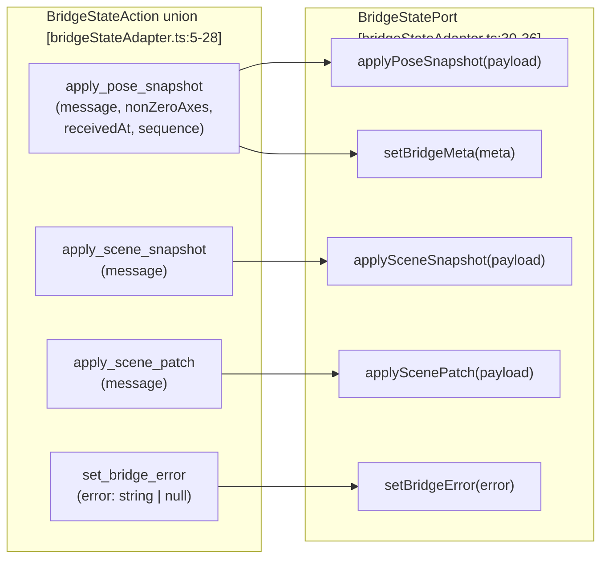
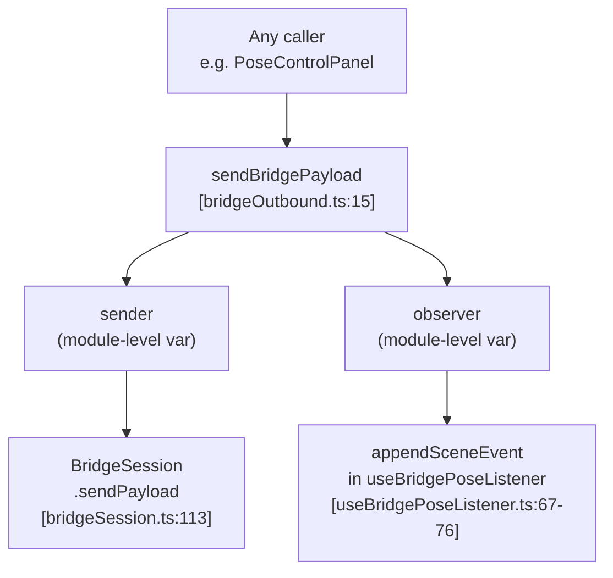

# Bridge Communication

Relevant source files

- [](https://github.com/e7canasta/puppet-studio/blob/cdd483bd/src/core/bridge-runtime/bridgeMessages.ts)
- [](https://github.com/e7canasta/puppet-studio/blob/cdd483bd/src/core/bridge-runtime/bridgeOutbound.ts)
- [](https://github.com/e7canasta/puppet-studio/blob/cdd483bd/src/core/bridge-runtime/bridgeSession.ts)
- [](https://github.com/e7canasta/puppet-studio/blob/cdd483bd/src/core/bridge-runtime/bridgeStateAdapter.ts)
- [](https://github.com/e7canasta/puppet-studio/blob/cdd483bd/src/features/bridge/hooks/useBridgePoseListener.ts)
- [](https://github.com/e7canasta/puppet-studio/blob/cdd483bd/src/features/bridge/model/bridgeLifecycleSceneEvent.ts)
- [](https://github.com/e7canasta/puppet-studio/blob/cdd483bd/src/features/bridge/ui/BridgePoseListener.tsx)

This page covers the purpose, message protocol, and data-flow architecture of the WebSocket bridge system. It explains how the frontend establishes a connection to the external bridge server, processes inbound messages, and sends outbound payloads.

- For the `BridgeSession` class in detail (constructor, reconnect logic, lifecycle events), see [BridgeSession](https://deepwiki.com/e7canasta/puppet-studio/5.1-bridgesession).
- For message parsing and the state adapter, see [Message Parsing & State Adapter](https://deepwiki.com/e7canasta/puppet-studio/5.2-message-parsing-and-state-adapter).
- For how the bridge is wired into React, see [BridgePoseListener](https://deepwiki.com/e7canasta/puppet-studio/5.3-bridgeposelistener).

---

## Purpose

The bridge is a WebSocket channel between the frontend and an external server (typically a Python analytics process). Over this channel, the server pushes real-time pose data, scene snapshots, and scene patches. The frontend can also send outbound payloads — primarily a `scene_subscribe` message to register interest in a named scene.

All bridge state (connection status, error messages, pose data, scene placements) is ultimately written into `poseStore` (Zustand). No bridge logic lives inside React component render functions; it is isolated in the `core/bridge-runtime` module and wired into React via a single hook.

---

## System Components

The bridge communication layer is composed of four distinct modules:

|Module|File|Role|
|---|---|---|
|`BridgeSession`|`src/core/bridge-runtime/bridgeSession.ts`|WebSocket lifecycle, reconnect, raw message I/O|
|`parseBridgeInboundMessage`|`src/core/bridge-runtime/bridgeMessages.ts`|Parse raw JSON into a typed union|
|`mapParsedBridgeInboundToActions` / `applyBridgeStateActions`|`src/core/bridge-runtime/bridgeStateAdapter.ts`|Map parsed messages to `poseStore` mutations|
|`sendBridgePayload`|`src/core/bridge-runtime/bridgeOutbound.ts`|Module-level outbound sender registry|

These are assembled by `useBridgePoseListener` in `src/features/bridge/hooks/useBridgePoseListener.ts`.

Sources: `src/core/bridge-runtime/bridgeSession.ts`, `src/core/bridge-runtime/bridgeMessages.ts`, `src/core/bridge-runtime/bridgeStateAdapter.ts`, `src/core/bridge-runtime/bridgeOutbound.ts`, `src/features/bridge/hooks/useBridgePoseListener.ts`

---

## Message Protocol

### Inbound Messages (Server → Frontend)

Every inbound frame must be a JSON object with a `kind` field. The parser [`parseBridgeInboundMessage`](https://github.com/e7canasta/puppet-studio/blob/cdd483bd/%60parseBridgeInboundMessage%60) normalises the `kind` string and classifies the message into one of these variants:

|`kind` (wire value)|Parsed `type`|Notes|
|---|---|---|
|`bridge_pose`|`bridge_pose`|Real-time pose frame with `sequence`, `nonZeroAxes`, `receivedAt`|
|`bridge_error`|`bridge_error`|Error detail from `details`, `message`, or `code` fields|
|`scene_snapshot`, `bridge_scene_snapshot`, `scene_update`|`scene_snapshot`|Full scene replacement; `rawKind` preserves the original string|
|`scene_patch`, `bridge_scene_patch`|`scene_patch`|Incremental scene update; `rawKind` preserved|
|anything else|`other`|Passed through without state mutation|
|non-object or missing `kind`|`invalid`|Logged as a warning; dropped|

Sources: [src/core/bridge-runtime/bridgeMessages.ts58-118](https://github.com/e7canasta/puppet-studio/blob/cdd483bd/src/core/bridge-runtime/bridgeMessages.ts#L58-L118)

### Outbound Messages (Frontend → Server)

The frontend sends one message type immediately after a connection is established and a `sceneId` is configured:

```
{ "kind": "scene_subscribe", "sceneId": "<sceneId>" }
```

This is sent by `BridgeSession.trySendSceneSubscribe()` [src/core/bridge-runtime/bridgeSession.ts271-288](https://github.com/e7canasta/puppet-studio/blob/cdd483bd/src/core/bridge-runtime/bridgeSession.ts#L271-L288) The session tracks `subscribedSceneId` to avoid re-sending the subscription on reconnects if the scene ID has not changed.

Other outbound payloads can be sent at any time via `sendBridgePayload` from `bridgeOutbound.ts`.

Sources: [src/core/bridge-runtime/bridgeSession.ts271-288](https://github.com/e7canasta/puppet-studio/blob/cdd483bd/src/core/bridge-runtime/bridgeSession.ts#L271-L288) [src/core/bridge-runtime/bridgeOutbound.ts1-19](https://github.com/e7canasta/puppet-studio/blob/cdd483bd/src/core/bridge-runtime/bridgeOutbound.ts#L1-L19)

---

## Inbound Processing Pipeline

**Diagram: Inbound Data Flow (code entities)**

```mermaid
graph LR
WebSocket_Server["WebSocket Server"] -->|"raw JSON frame"| BridgeSession["BridgeSession<br/>socket.onmessage<br/>[bridgeSession.ts:213-225]"]
BridgeSession -->|"JSON.parse(event.data)"| onInboundPayload_callback["onInboundPayload<br/>callback"]
onInboundPayload_callback -->|"parseBridgeInboundMessage<br/>[bridgeMessages.ts:58]"| parseBridgeInboundMessage["parseBridgeInboundMessage<br/>[bridgeMessages.ts:58]"]

parseBridgeInboundMessage -->|"type: invalid"| appendSceneEvent_invalid["appendSceneEvent<br/>level: warn<br/>kind:<br/>bridge_inbound_invalid"]
parseBridgeInboundMessage -->|"type: bridge_pose<br/>bridge_error<br/>scene_snapshot<br/>scene_patch<br/>other"| appendSceneEvent_valid["appendSceneEvent<br/>level: info or error"]

appendSceneEvent_valid -->|"mapParsedBridgeInboundToActions<br/>[bridgeStateAdapters.ts:38]"| mapParsedBridgeInboundToActions["mapParsedBridgeInboundToActions<br/>[bridgeStateAdapters.ts:38]"]
mapParsedBridgeInboundToActions -->|"BridgeStateAction[]"| applyBridgeStateActions["applyBridgeStateActions<br/>[bridgeStateAdapters.ts:93]"]

applyBridgeStateActions -->|"apply_pose_snapshot"| BridgeStatePort_pose["BridgeStatePort<br/>.applyPoseSnapshot<br/>+.setBridgeMeta"]
applyBridgeStateActions -->|"apply_scene_snapshot"| BridgeStatePort_scene_snap["BridgeStatePort<br/>.applySceneSnapshot"]
applyBridgeStateActions -->|"apply_scene_patch"| BridgeStatePort_scene_patch["BridgeStatePort<br/>.applyScenePatch"]
applyBridgeStateActions -->|"set_bridge_error"| BridgeStatePort_error["BridgeStatePort<br/>.setBridgeError"]

BridgeStatePort_pose -->|"+"| poseStore["poseStore<br/>[app/state]"]
BridgeStatePort_scene_snap -->|"+"| poseStore
BridgeStatePort_scene_patch -->|"+"| poseStore
BridgeStatePort_error -->|"+"| poseStore

```



Sources: [src/features/bridge/hooks/useBridgePoseListener.ts30-55](https://github.com/e7canasta/puppet-studio/blob/cdd483bd/src/features/bridge/hooks/useBridgePoseListener.ts#L30-L55) [src/core/bridge-runtime/bridgeMessages.ts58-118](https://github.com/e7canasta/puppet-studio/blob/cdd483bd/src/core/bridge-runtime/bridgeMessages.ts#L58-L118) [src/core/bridge-runtime/bridgeStateAdapter.ts38-117](https://github.com/e7canasta/puppet-studio/blob/cdd483bd/src/core/bridge-runtime/bridgeStateAdapter.ts#L38-L117)

### Step-by-step

1. **Raw receive.** `BridgeSession.socket.onmessage` parses the WebSocket frame with `JSON.parse`. If that fails, a `inbound_json_invalid` lifecycle event is emitted and the payload is discarded [src/core/bridge-runtime/bridgeSession.ts213-225](https://github.com/e7canasta/puppet-studio/blob/cdd483bd/src/core/bridge-runtime/bridgeSession.ts#L213-L225)
    
2. **`parseBridgeInboundMessage`.** The parsed object is handed to `parseBridgeInboundMessage`, which returns a `ParsedBridgeInboundMessage` discriminated union [src/core/bridge-runtime/bridgeMessages.ts3-38](https://github.com/e7canasta/puppet-studio/blob/cdd483bd/src/core/bridge-runtime/bridgeMessages.ts#L3-L38)
    
3. **Scene event logging.** `useBridgePoseListener` appends a `SceneEventInput` to `poseStore` for every message received — valid or invalid. Invalid messages use level `warn`; `bridge_error` payloads use `error`; all others use `info` [src/features/bridge/hooks/useBridgePoseListener.ts32-51](https://github.com/e7canasta/puppet-studio/blob/cdd483bd/src/features/bridge/hooks/useBridgePoseListener.ts#L32-L51)
    
4. **`mapParsedBridgeInboundToActions`.** Converts the parsed message into a `BridgeStateAction[]`. Messages of type `other` produce an empty array (no mutation) [src/core/bridge-runtime/bridgeStateAdapter.ts38-91](https://github.com/e7canasta/puppet-studio/blob/cdd483bd/src/core/bridge-runtime/bridgeStateAdapter.ts#L38-L91)
    
5. **`applyBridgeStateActions`.** Iterates the action list and calls the corresponding method on `BridgeStatePort` — the interface implemented by `poseStore.getState()` [src/core/bridge-runtime/bridgeStateAdapter.ts93-117](https://github.com/e7canasta/puppet-studio/blob/cdd483bd/src/core/bridge-runtime/bridgeStateAdapter.ts#L93-L117)
    

---

## `BridgeStateAction` and `BridgeStatePort`

**Diagram: Action types and their port methods**




`BridgeStatePort` is a structural interface — any object satisfying its shape can be used as a target. In practice, `poseStore.getState()` implements it directly.

Sources: [src/core/bridge-runtime/bridgeStateAdapter.ts5-36](https://github.com/e7canasta/puppet-studio/blob/cdd483bd/src/core/bridge-runtime/bridgeStateAdapter.ts#L5-L36)

---

## Outbound Sending

`bridgeOutbound.ts` maintains two module-level singletons: a `sender` function and an `observer` function.

| Function                    | Signature                                       | Role                                                      |
| --------------------------- | ----------------------------------------------- | --------------------------------------------------------- |
| `setBridgeOutboundSender`   | `(fn: BridgeSender \| null) => void`            | Registers the active `BridgeSession.sendPayload`          |
| `setBridgeOutboundObserver` | `(fn: BridgeOutboundObserver \| null) => void`  | Registers a callback that logs every outbound attempt     |
| `sendBridgePayload`         | `(payload: Record<string, unknown>) => boolean` | Calls `sender`, notifies `observer`, returns success flag |

Sources: [src/core/bridge-runtime/bridgeOutbound.ts1-19](https://github.com/e7canasta/puppet-studio/blob/cdd483bd/src/core/bridge-runtime/bridgeOutbound.ts#L1-L19)



**Diagram: Outbound module wiring**

`useBridgePoseListener` registers both the sender and observer when the `BridgeSession` is created [src/features/bridge/hooks/useBridgePoseListener.ts67-77](https://github.com/e7canasta/puppet-studio/blob/cdd483bd/src/features/bridge/hooks/useBridgePoseListener.ts#L67-L77) and clears them on cleanup [src/features/bridge/hooks/useBridgePoseListener.ts83-84](https://github.com/e7canasta/puppet-studio/blob/cdd483bd/src/features/bridge/hooks/useBridgePoseListener.ts#L83-L84)

The observer logs every outbound attempt as a scene event: sent attempts become `level: info`; dropped attempts (no active session) become `level: warn`.

---

## Lifecycle Events

`BridgeSession` emits `BridgeSessionLifecycleEvent` objects via the `onLifecycle` callback. `useBridgePoseListener` converts each one to a `SceneEventInput` via `toBridgeLifecycleSceneEvent` [src/features/bridge/model/bridgeLifecycleSceneEvent.ts4-75](https://github.com/e7canasta/puppet-studio/blob/cdd483bd/src/features/bridge/model/bridgeLifecycleSceneEvent.ts#L4-L75) and appends it to `poseStore`.

|Lifecycle `kind`|Scene event `kind`|Level|
|---|---|---|
|`connecting`|`bridge_connecting`|`info`|
|`connected`|`bridge_connected`|`info`|
|`disconnected`|`bridge_disconnected`|`warn` (if will reconnect), `info`|
|`reconnect_scheduled`|`bridge_reconnect_scheduled`|`warn`|
|`socket_create_error`|`bridge_socket_create_error`|`error`|
|`socket_error`|`bridge_socket_error`|`error`|
|`inbound_json_invalid`|`bridge_inbound_json_invalid`|`warn`|
|`scene_subscribe_sent`|`scene_subscribe`|`info`|

Sources: [src/features/bridge/model/bridgeLifecycleSceneEvent.ts1-75](https://github.com/e7canasta/puppet-studio/blob/cdd483bd/src/features/bridge/model/bridgeLifecycleSceneEvent.ts#L1-L75) [src/core/bridge-runtime/bridgeSession.ts3-39](https://github.com/e7canasta/puppet-studio/blob/cdd483bd/src/core/bridge-runtime/bridgeSession.ts#L3-L39)

---

## Integration Point: `useBridgePoseListener`

`useBridgePoseListener` is the single point where all the above modules are assembled. It:

1. Creates a `BridgeSession` instance once on mount (stable `useEffect` with `[]` deps).
2. Passes callbacks for `onInboundPayload`, `onLifecycle`, `onStatus`, and `onError`.
3. Registers `setBridgeOutboundSender` and `setBridgeOutboundObserver`.
4. Reacts to `bridgeEnabled`, `bridgeUrl`, and `sceneId` from `poseStore` in a second `useEffect` to call `session.setEnabled`, `session.setUrl`, and `session.setSceneId` [src/features/bridge/hooks/useBridgePoseListener.ts89-112](https://github.com/e7canasta/puppet-studio/blob/cdd483bd/src/features/bridge/hooks/useBridgePoseListener.ts#L89-L112)
5. Destroys the session and clears outbound singletons on unmount.

The `BridgePoseListener` React component [src/features/bridge/ui/BridgePoseListener.tsx1-6](https://github.com/e7canasta/puppet-studio/blob/cdd483bd/src/features/bridge/ui/BridgePoseListener.tsx#L1-L6) renders nothing — it exists solely to mount this hook as a side-effect within the component tree (placed at the root in `App.tsx`).

For a full description of `BridgePoseListener`, see [BridgePoseListener](https://deepwiki.com/e7canasta/puppet-studio/5.3-bridgeposelistener).

Sources: [src/features/bridge/hooks/useBridgePoseListener.ts17-113](https://github.com/e7canasta/puppet-studio/blob/cdd483bd/src/features/bridge/hooks/useBridgePoseListener.ts#L17-L113) [src/features/bridge/ui/BridgePoseListener.tsx1-6](https://github.com/e7canasta/puppet-studio/blob/cdd483bd/src/features/bridge/ui/BridgePoseListener.tsx#L1-L6)


### On this page

- [Bridge Communication](https://deepwiki.com/e7canasta/puppet-studio/5-bridge-communication#bridge-communication)
- [Purpose](https://deepwiki.com/e7canasta/puppet-studio/5-bridge-communication#purpose)
- [System Components](https://deepwiki.com/e7canasta/puppet-studio/5-bridge-communication#system-components)
- [Message Protocol](https://deepwiki.com/e7canasta/puppet-studio/5-bridge-communication#message-protocol)
- [Inbound Messages (Server → Frontend)](https://deepwiki.com/e7canasta/puppet-studio/5-bridge-communication#inbound-messages-server-frontend)
- [Outbound Messages (Frontend → Server)](https://deepwiki.com/e7canasta/puppet-studio/5-bridge-communication#outbound-messages-frontend-server)
- [Inbound Processing Pipeline](https://deepwiki.com/e7canasta/puppet-studio/5-bridge-communication#inbound-processing-pipeline)
- [Step-by-step](https://deepwiki.com/e7canasta/puppet-studio/5-bridge-communication#step-by-step)
- [`BridgeStateAction` and `BridgeStatePort`](https://deepwiki.com/e7canasta/puppet-studio/5-bridge-communication#bridgestateaction-and-bridgestateport)
- [Outbound Sending](https://deepwiki.com/e7canasta/puppet-studio/5-bridge-communication#outbound-sending)
- [Lifecycle Events](https://deepwiki.com/e7canasta/puppet-studio/5-bridge-communication#lifecycle-events)
- [Integration Point: `useBridgePoseListener`](https://deepwiki.com/e7canasta/puppet-studio/5-bridge-communication#integration-point-usebridgeposelistener)

