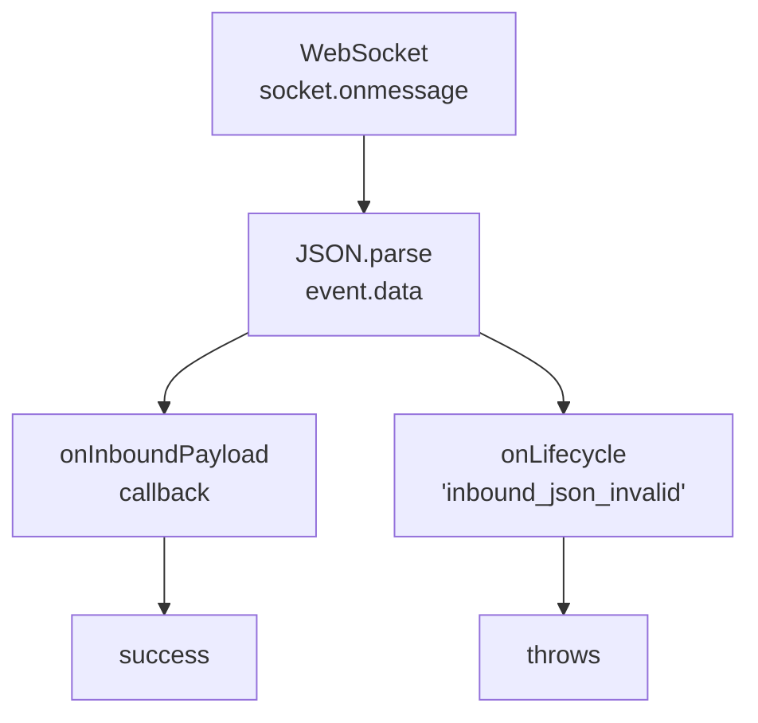
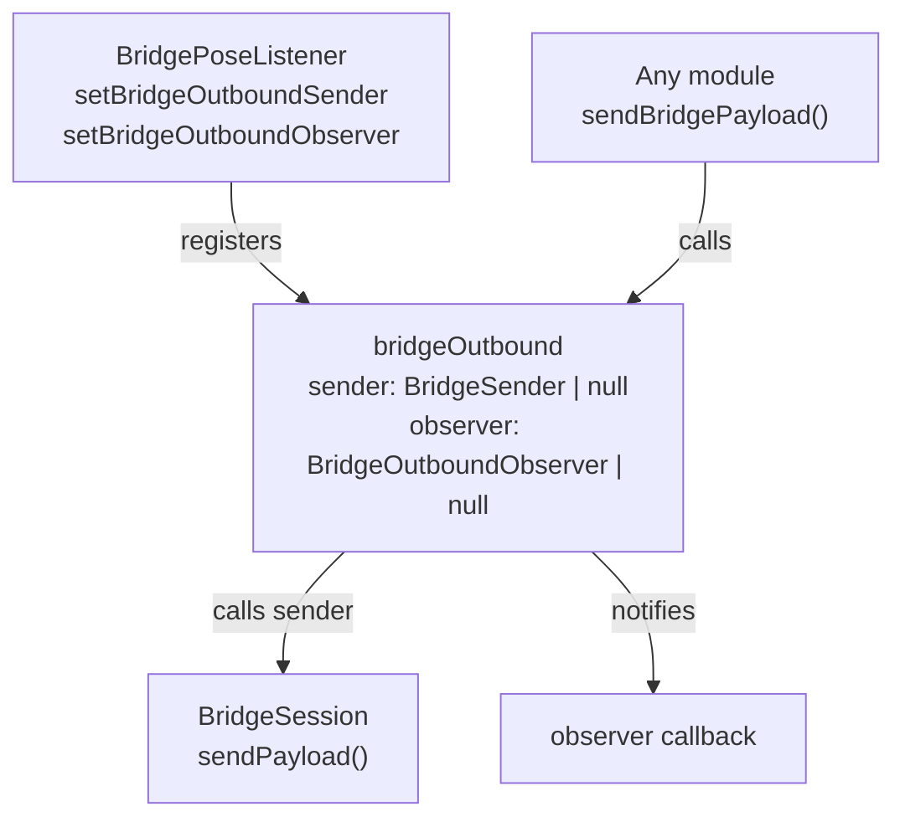
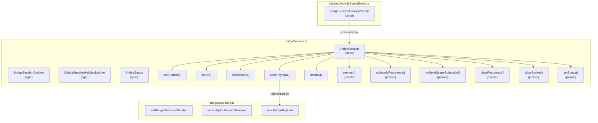

# BridgeSession

Relevant source files

- [](https://github.com/e7canasta/puppet-studio/blob/cdd483bd/src/core/bridge-runtime/bridgeMessages.ts)
- [](https://github.com/e7canasta/puppet-studio/blob/cdd483bd/src/core/bridge-runtime/bridgeOutbound.ts)
- [](https://github.com/e7canasta/puppet-studio/blob/cdd483bd/src/core/bridge-runtime/bridgeSession.ts)
- [](https://github.com/e7canasta/puppet-studio/blob/cdd483bd/src/core/bridge-runtime/bridgeStateAdapter.ts)
- [](https://github.com/e7canasta/puppet-studio/blob/cdd483bd/src/features/bridge/model/bridgeLifecycleSceneEvent.ts)

This page documents `BridgeSession`, the class responsible for managing the WebSocket connection lifecycle between puppet-studio and an external bridge server. It covers the class constructor and options, all public methods, the automatic reconnect loop, the `BridgeSessionLifecycleEvent` union type, `BridgeStatus`, and the `BridgeSessionWebSocketLike` socket abstraction. It also documents the `bridgeOutbound` module, which is a thin layer for routing outbound payloads through the session.

For how inbound WebSocket payloads are parsed and mapped to `poseStore` mutations after `BridgeSession` delivers them, see [Message Parsing & State Adapter](https://deepwiki.com/e7canasta/puppet-studio/5.2-message-parsing-and-state-adapter). For how `BridgeSession` is wired into the React component tree, see [BridgePoseListener](https://deepwiki.com/e7canasta/puppet-studio/5.3-bridgeposelistener).

---

## Overview

`BridgeSession` is a plain TypeScript class (not a React component). It owns a single WebSocket connection to the bridge server and handles:

- Opening and closing the socket in response to `setEnabled` / `setUrl` calls.
- Sending a `scene_subscribe` frame whenever a `sceneId` is available and the socket is open.
- Scheduling automatic reconnections when the socket closes unexpectedly.
- Delivering parsed inbound JSON to a caller-supplied `onInboundPayload` callback.
- Emitting typed `BridgeSessionLifecycleEvent` notifications for every notable state transition.

Sources: [src/core/bridge-runtime/bridgeSession.ts77-289](https://github.com/e7canasta/puppet-studio/blob/cdd483bd/src/core/bridge-runtime/bridgeSession.ts#L77-L289)

---

## Types

### `BridgeStatus`

[src/core/bridge-runtime/bridgeSession.ts1](https://github.com/e7canasta/puppet-studio/blob/cdd483bd/src/core/bridge-runtime/bridgeSession.ts#L1-L1)

|Value|Meaning|
|---|---|
|`'connected'`|Socket is open and confirmed by an `onopen` event|
|`'connecting'`|`connect()` has been called; socket creation is in progress|
|`'disconnected'`|No active socket; either disabled or waiting for reconnect|

### `BridgeSessionWebSocketLike`

[src/core/bridge-runtime/bridgeSession.ts41-49](https://github.com/e7canasta/puppet-studio/blob/cdd483bd/src/core/bridge-runtime/bridgeSession.ts#L41-L49)

A structural interface that mirrors the browser `WebSocket` API. `BridgeSession` never imports `WebSocket` directly; it always uses this type. This makes the session fully testable without a real WebSocket.

|Member|Type|Description|
|---|---|---|
|`readyState`|`number`|`1` means open (`OPEN_READY_STATE`)|
|`send`|`(data: string) => void`|Sends a string frame|
|`close`|`() => void`|Closes the socket|
|`onopen`|handler or `null`|Called when connection is established|
|`onclose`|handler or `null`|Called when connection closes|
|`onerror`|handler or `null`|Called on socket errors|
|`onmessage`|`(event: { data: unknown }) => void \| null`|Called for each incoming frame|

By default the constructor supplies a factory that wraps `new WebSocket(url)` [src/core/bridge-runtime/bridgeSession.ts96-100](https://github.com/e7canasta/puppet-studio/blob/cdd483bd/src/core/bridge-runtime/bridgeSession.ts#L96-L100)

### `BridgeSessionOptions`

[src/core/bridge-runtime/bridgeSession.ts51-60](https://github.com/e7canasta/puppet-studio/blob/cdd483bd/src/core/bridge-runtime/bridgeSession.ts#L51-L60)

All fields are optional, allowing dependency injection for testing.

|Option|Type|Default|Description|
|---|---|---|---|
|`createSocket`|`(url: string) => BridgeSessionWebSocketLike`|`new WebSocket(url)`|Socket factory|
|`setTimeoutFn`|`(cb, ms) => unknown`|`globalThis.setTimeout`|Used to schedule reconnects|
|`clearTimeoutFn`|`(token) => void`|`globalThis.clearTimeout`|Cancels pending reconnect|
|`onInboundPayload`|`(payload: unknown) => void`|—|Called with each parsed JSON frame|
|`onLifecycle`|`(event: BridgeSessionLifecycleEvent) => void`|—|Lifecycle event subscriber|
|`onStatus`|`(status: BridgeStatus) => void`|—|Status change subscriber|
|`onError`|`(error: string \| null) => void`|—|Error string subscriber (`null` = cleared)|
|`reconnectMs`|`number`|`1200`|Delay before reconnect attempt|

---

## `BridgeSessionLifecycleEvent` Union

Every notable transition emits one of the following event kinds via the `onLifecycle` callback. These events are consumed by `BridgePoseListener` (see [BridgePoseListener](https://deepwiki.com/e7canasta/puppet-studio/5.3-bridgeposelistener)) and translated into `SceneEventEntry` records for the terminal.

[src/core/bridge-runtime/bridgeSession.ts3-40](https://github.com/e7canasta/puppet-studio/blob/cdd483bd/src/core/bridge-runtime/bridgeSession.ts#L3-L40)

|`kind`|Extra fields|When emitted|
|---|---|---|
|`'connecting'`|`url`|`connect()` begins a new socket creation|
|`'connected'`|`url`|Socket `onopen` fires|
|`'disconnected'`|`url`, `willReconnect: boolean`|Socket `onclose` fires|
|`'reconnect_scheduled'`|`url`, `delayMs: number`|A reconnect timer is set|
|`'socket_create_error'`|`url`, `message: string`|`createSocket()` throws|
|`'socket_error'`|`url`|Socket `onerror` fires|
|`'inbound_json_invalid'`|`url`|A frame cannot be `JSON.parse`d|
|`'scene_subscribe_sent'`|`url`, `sceneId: string`|A `scene_subscribe` payload is sent|

The mapping to `SceneEventInput` format is defined in `toBridgeLifecycleSceneEvent` [src/features/bridge/model/bridgeLifecycleSceneEvent.ts4-75](https://github.com/e7canasta/puppet-studio/blob/cdd483bd/src/features/bridge/model/bridgeLifecycleSceneEvent.ts#L4-L75)

---

## `BridgeSession` Class

**File:** [src/core/bridge-runtime/bridgeSession.ts77-289](https://github.com/e7canasta/puppet-studio/blob/cdd483bd/src/core/bridge-runtime/bridgeSession.ts#L77-L289)

### Private State

|Field|Type|Purpose|
|---|---|---|
|`enabled`|`boolean`|Whether the session should be active|
|`url`|`string`|Current target WebSocket URL|
|`sceneId`|`string \| null`|Normalized scene to subscribe to|
|`socket`|`BridgeSessionWebSocketLike \| null`|Live socket, or `null` when disconnected|
|`subscribedSceneId`|`string \| null`|Scene ID last confirmed as subscribed|
|`status`|`BridgeStatus`|Current connection status|
|`reconnectToken`|`unknown`|Token returned by `setTimeoutFn`; `null` when no timer is pending|

### Public Methods

#### `constructor(options?: BridgeSessionOptions)`

[src/core/bridge-runtime/bridgeSession.ts94-107](https://github.com/e7canasta/puppet-studio/blob/cdd483bd/src/core/bridge-runtime/bridgeSession.ts#L94-L107)

Stores all options. If `reconnectMs` is not a finite positive number, defaults to `1200` ms. Does not open a socket.

#### `setEnabled(enabled: boolean)`

[src/core/bridge-runtime/bridgeSession.ts119-129](https://github.com/e7canasta/puppet-studio/blob/cdd483bd/src/core/bridge-runtime/bridgeSession.ts#L119-L129)

Calling with `true` triggers `connect()`. Calling with `false` cancels any pending reconnect, closes the socket, and moves to `'disconnected'`. Idempotent — no-ops if value has not changed.

#### `setUrl(url: string)`

[src/core/bridge-runtime/bridgeSession.ts138-150](https://github.com/e7canasta/puppet-studio/blob/cdd483bd/src/core/bridge-runtime/bridgeSession.ts#L138-L150)

Updates the target URL. If the session is enabled, closes the current socket (if any) and immediately opens a new connection. If the session is disabled, the URL is stored for use when it is later enabled.

#### `setSceneId(sceneId: string)`

[src/core/bridge-runtime/bridgeSession.ts131-136](https://github.com/e7canasta/puppet-studio/blob/cdd483bd/src/core/bridge-runtime/bridgeSession.ts#L131-L136)

Normalizes the value with `normalizeSceneId` (trims whitespace; empty string becomes `null`). If the normalized value differs from the current one, calls `trySendSceneSubscribe()` to send a subscription frame if possible.

#### `sendPayload(payload: Record<string, unknown>): boolean`

[src/core/bridge-runtime/bridgeSession.ts113-117](https://github.com/e7canasta/puppet-studio/blob/cdd483bd/src/core/bridge-runtime/bridgeSession.ts#L113-L117)

Serializes `payload` as JSON and sends it if the socket is in `readyState === 1` (`OPEN`). Returns `true` on success, `false` otherwise. This is the same method used internally to send the `scene_subscribe` frame.

#### `destroy()`

[src/core/bridge-runtime/bridgeSession.ts109-111](https://github.com/e7canasta/puppet-studio/blob/cdd483bd/src/core/bridge-runtime/bridgeSession.ts#L109-L111)

Delegates to `setEnabled(false)`. Intended for cleanup when the owning component unmounts.

---

## Connection Lifecycle State Machine

**Connection and Reconnect Flow**

Sources: [src/core/bridge-runtime/bridgeSession.ts119-263](https://github.com/e7canasta/puppet-studio/blob/cdd483bd/src/core/bridge-runtime/bridgeSession.ts#L119-L263)

### Reconnect Logic

[src/core/bridge-runtime/bridgeSession.ts251-263](https://github.com/e7canasta/puppet-studio/blob/cdd483bd/src/core/bridge-runtime/bridgeSession.ts#L251-L263)

When a socket closes while `enabled` is `true`, `scheduleReconnect()` is called. It:

1. Guards against double-scheduling (`reconnectToken !== null` check).
2. Calls `setTimeoutFn` with `reconnectMs` delay.
3. Emits a `reconnect_scheduled` lifecycle event.
4. On timer fire, clears the token and calls `connect()`.

Calling `clearReconnect()` (triggered by `setEnabled(false)` or `setUrl()`) cancels the timer.

---

## Inbound Message Handling

**Inbound Frame Path**



Sources: [src/core/bridge-runtime/bridgeSession.ts213-225](https://github.com/e7canasta/puppet-studio/blob/cdd483bd/src/core/bridge-runtime/bridgeSession.ts#L213-L225)

`BridgeSession` performs only JSON deserialization. It does not interpret the payload structure. The caller — in practice `BridgePoseListener` via `bridgeStateAdapter` — is responsible for parsing and acting on the content (see [Message Parsing & State Adapter](https://deepwiki.com/e7canasta/puppet-studio/5.2-message-parsing-and-state-adapter)).

---

## Scene Subscription

[src/core/bridge-runtime/bridgeSession.ts271-288](https://github.com/e7canasta/puppet-studio/blob/cdd483bd/src/core/bridge-runtime/bridgeSession.ts#L271-L288)

`trySendSceneSubscribe()` is a private method called:

- From `socket.onopen` (after connection is established).
- From `setSceneId()` (when the scene ID changes while already connected).

It sends a frame of the form:

```
{ "kind": "scene_subscribe", "sceneId": "<sceneId>" }
```

The method is a no-op if any of the following are true:

- `sceneId` is `null`.
- The socket is absent or not open.
- `subscribedSceneId === sceneId` (already subscribed).

On success, `subscribedSceneId` is updated and a `scene_subscribe_sent` lifecycle event is emitted. `subscribedSceneId` is cleared to `null` whenever the socket is closed, ensuring re-subscription happens on the next connection.

---

## Outbound Sender Module (`bridgeOutbound`)

**File:** [src/core/bridge-runtime/bridgeOutbound.ts1-19](https://github.com/e7canasta/puppet-studio/blob/cdd483bd/src/core/bridge-runtime/bridgeOutbound.ts#L1-L19)

A module-level singleton that decouples any part of the codebase from holding a direct reference to a `BridgeSession` instance.

**Module-level relationships**


Sources: [src/core/bridge-runtime/bridgeOutbound.ts1-19](https://github.com/e7canasta/puppet-studio/blob/cdd483bd/src/core/bridge-runtime/bridgeOutbound.ts#L1-L19)

|Export|Signature|Description|
|---|---|---|
|`setBridgeOutboundSender`|`(next: BridgeSender \| null) => void`|Registers the active `BridgeSession.sendPayload` as the sender|
|`setBridgeOutboundObserver`|`(next: BridgeOutboundObserver \| null) => void`|Registers a side-effect observer (payload + sent boolean)|
|`sendBridgePayload`|`(payload) => boolean`|Calls the sender if set; always calls the observer; returns whether it was sent|

The module stores `sender` and `observer` as module-level variables [src/core/bridge-runtime/bridgeOutbound.ts4-5](https://github.com/e7canasta/puppet-studio/blob/cdd483bd/src/core/bridge-runtime/bridgeOutbound.ts#L4-L5) `BridgePoseListener` sets both when mounting and clears them when unmounting (see [BridgePoseListener](https://deepwiki.com/e7canasta/puppet-studio/5.3-bridgeposelistener)).

---

## Code Entity Map

**BridgeSession internals by file location**




Sources: [src/core/bridge-runtime/bridgeSession.ts1-289](https://github.com/e7canasta/puppet-studio/blob/cdd483bd/src/core/bridge-runtime/bridgeSession.ts#L1-L289) [src/core/bridge-runtime/bridgeOutbound.ts1-19](https://github.com/e7canasta/puppet-studio/blob/cdd483bd/src/core/bridge-runtime/bridgeOutbound.ts#L1-L19) [src/features/bridge/model/bridgeLifecycleSceneEvent.ts1-75](https://github.com/e7canasta/puppet-studio/blob/cdd483bd/src/features/bridge/model/bridgeLifecycleSceneEvent.ts#L1-L75)

### On this page

- [BridgeSession](https://deepwiki.com/e7canasta/puppet-studio/5.1-bridgesession#bridgesession)
- [Overview](https://deepwiki.com/e7canasta/puppet-studio/5.1-bridgesession#overview)
- [Types](https://deepwiki.com/e7canasta/puppet-studio/5.1-bridgesession#types)
- [`BridgeStatus`](https://deepwiki.com/e7canasta/puppet-studio/5.1-bridgesession#bridgestatus)
- [`BridgeSessionWebSocketLike`](https://deepwiki.com/e7canasta/puppet-studio/5.1-bridgesession#bridgesessionwebsocketlike)
- [`BridgeSessionOptions`](https://deepwiki.com/e7canasta/puppet-studio/5.1-bridgesession#bridgesessionoptions)
- [`BridgeSessionLifecycleEvent` Union](https://deepwiki.com/e7canasta/puppet-studio/5.1-bridgesession#bridgesessionlifecycleevent-union)
- [`BridgeSession` Class](https://deepwiki.com/e7canasta/puppet-studio/5.1-bridgesession#bridgesession-class)
- [Private State](https://deepwiki.com/e7canasta/puppet-studio/5.1-bridgesession#private-state)
- [Public Methods](https://deepwiki.com/e7canasta/puppet-studio/5.1-bridgesession#public-methods)
- [`constructor(options?: BridgeSessionOptions)`](https://deepwiki.com/e7canasta/puppet-studio/5.1-bridgesession#constructoroptions-bridgesessionoptions)
- [`setEnabled(enabled: boolean)`](https://deepwiki.com/e7canasta/puppet-studio/5.1-bridgesession#setenabledenabled-boolean)
- [`setUrl(url: string)`](https://deepwiki.com/e7canasta/puppet-studio/5.1-bridgesession#seturlurl-string)
- [`setSceneId(sceneId: string)`](https://deepwiki.com/e7canasta/puppet-studio/5.1-bridgesession#setsceneidsceneid-string)
- [`sendPayload(payload: Record<string, unknown>): boolean`](https://deepwiki.com/e7canasta/puppet-studio/5.1-bridgesession#sendpayloadpayload-recordstring-unknown-boolean)
- [`destroy()`](https://deepwiki.com/e7canasta/puppet-studio/5.1-bridgesession#destroy)
- [Connection Lifecycle State Machine](https://deepwiki.com/e7canasta/puppet-studio/5.1-bridgesession#connection-lifecycle-state-machine)
- [Reconnect Logic](https://deepwiki.com/e7canasta/puppet-studio/5.1-bridgesession#reconnect-logic)
- [Inbound Message Handling](https://deepwiki.com/e7canasta/puppet-studio/5.1-bridgesession#inbound-message-handling)
- [Scene Subscription](https://deepwiki.com/e7canasta/puppet-studio/5.1-bridgesession#scene-subscription)
- [Outbound Sender Module (`bridgeOutbound`)](https://deepwiki.com/e7canasta/puppet-studio/5.1-bridgesession#outbound-sender-module-bridgeoutbound)
- [Code Entity Map](https://deepwiki.com/e7canasta/puppet-studio/5.1-bridgesession#code-entity-map)
