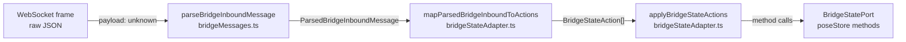
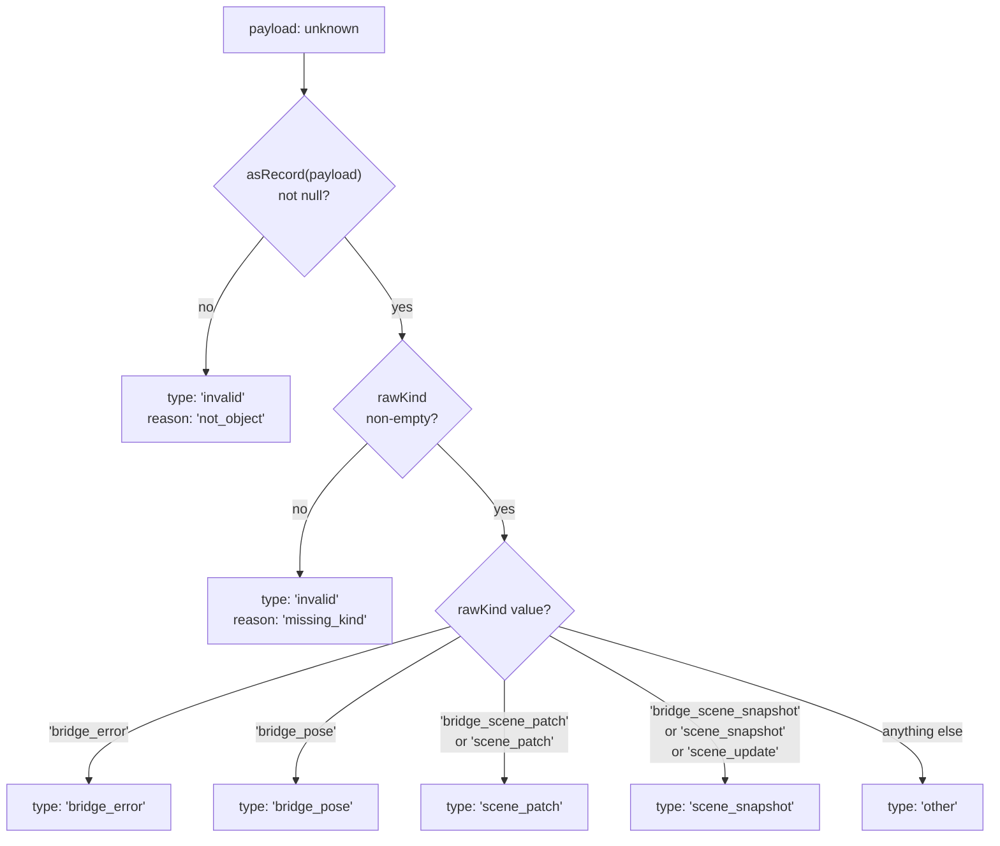
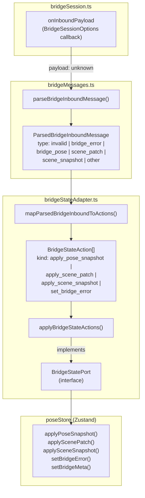

# Message Parsing & State Adapter

Relevant source files

- [](https://github.com/e7canasta/puppet-studio/blob/cdd483bd/src/core/bridge-runtime/bridgeMessages.ts)
- [](https://github.com/e7canasta/puppet-studio/blob/cdd483bd/src/core/bridge-runtime/bridgeOutbound.ts)
- [](https://github.com/e7canasta/puppet-studio/blob/cdd483bd/src/core/bridge-runtime/bridgeSession.ts)
- [](https://github.com/e7canasta/puppet-studio/blob/cdd483bd/src/core/bridge-runtime/bridgeStateAdapter.ts)
- [](https://github.com/e7canasta/puppet-studio/blob/cdd483bd/src/features/bridge/model/bridgeLifecycleSceneEvent.ts)
- [](https://github.com/e7canasta/puppet-studio/blob/cdd483bd/src/features/bridge/model/index.ts)
- [](https://github.com/e7canasta/puppet-studio/blob/cdd483bd/src/features/terminal/hooks/index.ts)

## Purpose & Scope

This page documents the two-stage pipeline that converts raw WebSocket payloads received by `BridgeSession` into concrete mutations on `poseStore`. The pipeline is implemented in two files:

- `src/core/bridge-runtime/bridgeMessages.ts` — parsing raw payloads into typed, discriminated messages
- `src/core/bridge-runtime/bridgeStateAdapter.ts` — mapping those messages to state actions and applying them via a port

For details on `BridgeSession` itself (connection lifecycle, reconnect, `onInboundPayload` callback), see [BridgeSession](https://deepwiki.com/e7canasta/puppet-studio/5.1-bridgesession). For how `BridgePoseListener` wires this pipeline into React, see [BridgePoseListener](https://deepwiki.com/e7canasta/puppet-studio/5.3-bridgeposelistener). For the `poseStore` actions that are ultimately called, see [State Management](https://deepwiki.com/e7canasta/puppet-studio/3-state-management).

---

## Pipeline Overview

When a JSON frame arrives over WebSocket, it passes through three sequential steps before reaching `poseStore`.

**Pipeline: Raw payload → poseStore mutation**



Sources: [src/core/bridge-runtime/bridgeMessages.ts58-118](https://github.com/e7canasta/puppet-studio/blob/cdd483bd/src/core/bridge-runtime/bridgeMessages.ts#L58-L118) [src/core/bridge-runtime/bridgeStateAdapter.ts38-117](https://github.com/e7canasta/puppet-studio/blob/cdd483bd/src/core/bridge-runtime/bridgeStateAdapter.ts#L38-L117)

---

## Step 1: `parseBridgeInboundMessage`

**Function:** `parseBridgeInboundMessage(payload: unknown): ParsedBridgeInboundMessage` **File:** [src/core/bridge-runtime/bridgeMessages.ts58-118](https://github.com/e7canasta/puppet-studio/blob/cdd483bd/src/core/bridge-runtime/bridgeMessages.ts#L58-L118)

This function accepts anything (`unknown`) delivered by `BridgeSession.onInboundPayload` and returns a fully-typed discriminated union value. It performs no state side-effects.

### Internal helpers

|Helper|Purpose|
|---|---|
|`asRecord`|Returns the value as `Dict` or `null` if it is not a plain object|
|`asText`|Returns a trimmed string or `null`|
|`asInteger`|Returns an integer or `null`|
|`normalizeKind`|Trims and extracts the `kind` string field|

Sources: [src/core/bridge-runtime/bridgeMessages.ts40-57](https://github.com/e7canasta/puppet-studio/blob/cdd483bd/src/core/bridge-runtime/bridgeMessages.ts#L40-L57)

### `ParsedBridgeInboundMessage` union

The return type is a discriminated union on the `type` field:

|`type`|Conditions|Key fields|
|---|---|---|
|`"invalid"`|Payload is not an object, or has no `kind`|`reason: 'not_object' \| 'missing_kind'`|
|`"bridge_error"`|`kind === 'bridge_error'`|`detail: string \| null`, `message: Dict`|
|`"bridge_pose"`|`kind === 'bridge_pose'`|`message`, `nonZeroAxes`, `receivedAt`, `sequence`|
|`"scene_patch"`|`kind === 'bridge_scene_patch' \| 'scene_patch'`|`message`, `rawKind`|
|`"scene_snapshot"`|`kind === 'bridge_scene_snapshot' \| 'scene_snapshot' \| 'scene_update'`|`message`, `rawKind`|
|`"other"`|Any other non-empty `kind`|`kind: string`, `message`|

Note that `scene_snapshot` accepts three wire aliases (`bridge_scene_snapshot`, `scene_snapshot`, `scene_update`) for backwards compatibility. Similarly `scene_patch` accepts `bridge_scene_patch` and `scene_patch`.

Sources: [src/core/bridge-runtime/bridgeMessages.ts3-38](https://github.com/e7canasta/puppet-studio/blob/cdd483bd/src/core/bridge-runtime/bridgeMessages.ts#L3-L38) [src/core/bridge-runtime/bridgeMessages.ts95-111](https://github.com/e7canasta/puppet-studio/blob/cdd483bd/src/core/bridge-runtime/bridgeMessages.ts#L95-L111)

### Parse decision tree



Sources: [src/core/bridge-runtime/bridgeMessages.ts58-118](https://github.com/e7canasta/puppet-studio/blob/cdd483bd/src/core/bridge-runtime/bridgeMessages.ts#L58-L118)

---

## Step 2: `mapParsedBridgeInboundToActions`

**Function:** `mapParsedBridgeInboundToActions(parsed: ParsedBridgeInboundMessage): BridgeStateAction[]` **File:** [src/core/bridge-runtime/bridgeStateAdapter.ts38-91](https://github.com/e7canasta/puppet-studio/blob/cdd483bd/src/core/bridge-runtime/bridgeStateAdapter.ts#L38-L91)

Converts a `ParsedBridgeInboundMessage` into zero or more `BridgeStateAction` values. This is a pure function with no side-effects.

### `BridgeStateAction` union

|`kind`|Payload fields|Purpose|
|---|---|---|
|`"apply_pose_snapshot"`|`message`, `nonZeroAxes`, `receivedAt`, `sequence`|Update the avatar pose in `poseStore`|
|`"apply_scene_patch"`|`message`|Apply an incremental patch to the scene placements|
|`"apply_scene_snapshot"`|`message`|Replace scene placements with a full snapshot|
|`"set_bridge_error"`|`error: string`|Record a bridge-level error string|
|`"set_bridge_error"`|`error: null`|Clear any existing bridge error|

Sources: [src/core/bridge-runtime/bridgeStateAdapter.ts5-28](https://github.com/e7canasta/puppet-studio/blob/cdd483bd/src/core/bridge-runtime/bridgeStateAdapter.ts#L5-L28)

### Mapping table

|`ParsedBridgeInboundMessage.type`|Actions emitted|
|---|---|
|`"invalid"`|`[]` (empty — no actions)|
|`"other"`|`[]` (empty — no actions)|
|`"bridge_error"`|`[set_bridge_error(detail)]`|
|`"bridge_pose"`|`[apply_pose_snapshot, set_bridge_error(null)]`|
|`"scene_snapshot"`|`[apply_scene_snapshot, set_bridge_error(null)]`|
|`"scene_patch"`|`[apply_scene_patch, set_bridge_error(null)]`|

A successful message (`bridge_pose`, `scene_snapshot`, `scene_patch`) always clears any outstanding bridge error by appending a `set_bridge_error(null)` action.

Sources: [src/core/bridge-runtime/bridgeStateAdapter.ts38-91](https://github.com/e7canasta/puppet-studio/blob/cdd483bd/src/core/bridge-runtime/bridgeStateAdapter.ts#L38-L91)

---

## Step 3: `BridgeStatePort` and `applyBridgeStateActions`

### `BridgeStatePort`

**Type:** [src/core/bridge-runtime/bridgeStateAdapter.ts30-36](https://github.com/e7canasta/puppet-studio/blob/cdd483bd/src/core/bridge-runtime/bridgeStateAdapter.ts#L30-L36)

`BridgeStatePort` is an interface that decouples the state adapter from the concrete `poseStore` implementation. Any object satisfying this interface can be used as a sink for bridge actions.

```
BridgeStatePort {
  applyPoseSnapshot(payload: unknown): void
  applyScenePatch(payload: unknown):   void
  applySceneSnapshot(payload: unknown):void
  setBridgeError(error: string | null):void
  setBridgeMeta(meta: {
    nonZeroAxes?: number | null
    receivedAt?: string | null
    sequence?: number | null
  }): void
}
```

In production use, each method maps directly to a `poseStore` action of the same name.

### `applyBridgeStateActions`

**Function:** `applyBridgeStateActions(port: BridgeStatePort, actions: BridgeStateAction[]` **File:** [src/core/bridge-runtime/bridgeStateAdapter.ts93-117](https://github.com/e7canasta/puppet-studio/blob/cdd483bd/src/core/bridge-runtime/bridgeStateAdapter.ts#L93-L117)

Iterates the action list and dispatches each action to the port:

|Action kind|Port method(s) called|
|---|---|
|`set_bridge_error`|`port.setBridgeError(action.error)`|
|`apply_pose_snapshot`|`port.applyPoseSnapshot(action.message)` then `port.setBridgeMeta(...)`|
|`apply_scene_snapshot`|`port.applySceneSnapshot(action.message)`|
|`apply_scene_patch`|`port.applyScenePatch(action.message)`|

Note that `apply_pose_snapshot` makes two port calls: first the payload, then the metadata (`nonZeroAxes`, `receivedAt`, `sequence`) as a separate `setBridgeMeta` call.

Sources: [src/core/bridge-runtime/bridgeStateAdapter.ts93-117](https://github.com/e7canasta/puppet-studio/blob/cdd483bd/src/core/bridge-runtime/bridgeStateAdapter.ts#L93-L117)

---

## Full Data Flow: Code Entity View

This diagram maps system-level names to their exact code symbols.




Sources: [src/core/bridge-runtime/bridgeMessages.ts1-118](https://github.com/e7canasta/puppet-studio/blob/cdd483bd/src/core/bridge-runtime/bridgeMessages.ts#L1-L118) [src/core/bridge-runtime/bridgeStateAdapter.ts1-117](https://github.com/e7canasta/puppet-studio/blob/cdd483bd/src/core/bridge-runtime/bridgeStateAdapter.ts#L1-L117) [src/core/bridge-runtime/bridgeSession.ts51-60](https://github.com/e7canasta/puppet-studio/blob/cdd483bd/src/core/bridge-runtime/bridgeSession.ts#L51-L60)

---

## Error Handling

- If `parseBridgeInboundMessage` receives a non-object payload, it returns `{ type: 'invalid', reason: 'not_object' }`.
- If the payload is an object with no `kind` field, it returns `{ type: 'invalid', reason: 'missing_kind' }`.
- Both `"invalid"` and `"other"` message types produce an empty action list (`[]`) from `mapParsedBridgeInboundToActions`, so no state mutation occurs.
- The caller (`BridgePoseListener`) is responsible for logging invalid messages as scene events (see [BridgePoseListener](https://deepwiki.com/e7canasta/puppet-studio/5.3-bridgeposelistener)).
- A `bridge_error` message from the server produces a `set_bridge_error` action which sets a visible error string in `poseStore`'s bridge slice.
- Every successful message type clears any existing bridge error by also emitting `set_bridge_error(null)`.

Sources: [src/core/bridge-runtime/bridgeMessages.ts59-73](https://github.com/e7canasta/puppet-studio/blob/cdd483bd/src/core/bridge-runtime/bridgeMessages.ts#L59-L73) [src/core/bridge-runtime/bridgeStateAdapter.ts38-91](https://github.com/e7canasta/puppet-studio/blob/cdd483bd/src/core/bridge-runtime/bridgeStateAdapter.ts#L38-L91)

---

## Relationship to Scene Sync

`apply_scene_snapshot` and `apply_scene_patch` deliver their `message: Dict` payloads directly to `poseStore.applySceneSnapshot` and `poseStore.applyScenePatch`. The detailed parsing of these payloads (extracting `scenePlacements`, `sceneRoom`, `monitoringCameras`, etc.) is handled downstream in `parseSceneSnapshotFromBridge` and `applyScenePatchFromBridge`. That logic is documented in [Scene Sync](https://deepwiki.com/e7canasta/puppet-studio/8.3-scene-sync).


### On this page

- [Message Parsing & State Adapter](https://deepwiki.com/e7canasta/puppet-studio/5.2-message-parsing-and-state-adapter#message-parsing-state-adapter)
- [Purpose & Scope](https://deepwiki.com/e7canasta/puppet-studio/5.2-message-parsing-and-state-adapter#purpose-scope)
- [Pipeline Overview](https://deepwiki.com/e7canasta/puppet-studio/5.2-message-parsing-and-state-adapter#pipeline-overview)
- [Step 1: `parseBridgeInboundMessage`](https://deepwiki.com/e7canasta/puppet-studio/5.2-message-parsing-and-state-adapter#step-1-parsebridgeinboundmessage)
- [Internal helpers](https://deepwiki.com/e7canasta/puppet-studio/5.2-message-parsing-and-state-adapter#internal-helpers)
- [`ParsedBridgeInboundMessage` union](https://deepwiki.com/e7canasta/puppet-studio/5.2-message-parsing-and-state-adapter#parsedbridgeinboundmessage-union)
- [Parse decision tree](https://deepwiki.com/e7canasta/puppet-studio/5.2-message-parsing-and-state-adapter#parse-decision-tree)
- [Step 2: `mapParsedBridgeInboundToActions`](https://deepwiki.com/e7canasta/puppet-studio/5.2-message-parsing-and-state-adapter#step-2-mapparsedbridgeinboundtoactions)
- [`BridgeStateAction` union](https://deepwiki.com/e7canasta/puppet-studio/5.2-message-parsing-and-state-adapter#bridgestateaction-union)
- [Mapping table](https://deepwiki.com/e7canasta/puppet-studio/5.2-message-parsing-and-state-adapter#mapping-table)
- [Step 3: `BridgeStatePort` and `applyBridgeStateActions`](https://deepwiki.com/e7canasta/puppet-studio/5.2-message-parsing-and-state-adapter#step-3-bridgestateport-and-applybridgestateactions)
- [`BridgeStatePort`](https://deepwiki.com/e7canasta/puppet-studio/5.2-message-parsing-and-state-adapter#bridgestateport)
- [`applyBridgeStateActions`](https://deepwiki.com/e7canasta/puppet-studio/5.2-message-parsing-and-state-adapter#applybridgestateactions)
- [Full Data Flow: Code Entity View](https://deepwiki.com/e7canasta/puppet-studio/5.2-message-parsing-and-state-adapter#full-data-flow-code-entity-view)
- [Error Handling](https://deepwiki.com/e7canasta/puppet-studio/5.2-message-parsing-and-state-adapter#error-handling)
- [Relationship to Scene Sync](https://deepwiki.com/e7canasta/puppet-studio/5.2-message-parsing-and-state-adapter#relationship-to-scene-sync)
