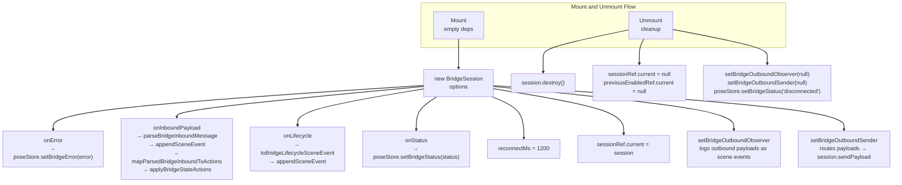
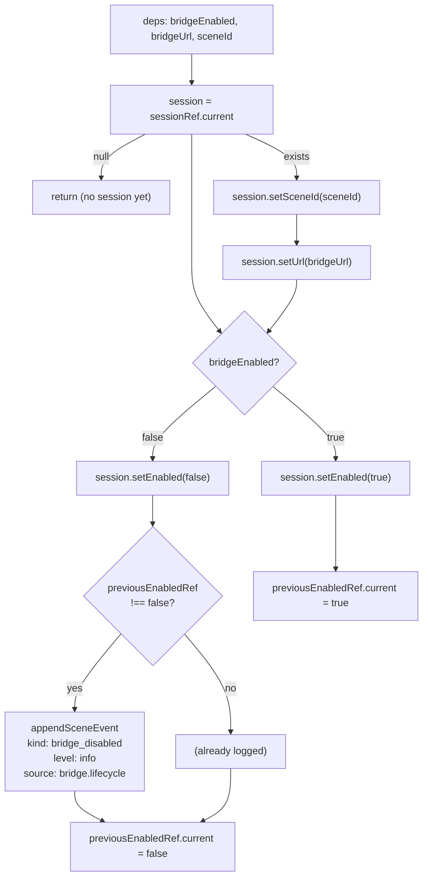
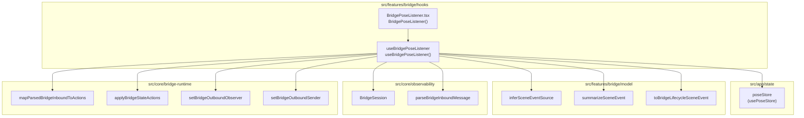

# BridgePoseListener

Relevant source files

- [](https://github.com/e7canasta/puppet-studio/blob/cdd483bd/src/features/bridge/hooks/index.ts)
- [](https://github.com/e7canasta/puppet-studio/blob/cdd483bd/src/features/bridge/hooks/useBridgePoseListener.ts)
- [](https://github.com/e7canasta/puppet-studio/blob/cdd483bd/src/features/bridge/ui/BridgePoseListener.tsx)
- [](https://github.com/e7canasta/puppet-studio/blob/cdd483bd/src/features/workspace/hooks/index.ts)

This page covers the `BridgePoseListener` React component and the `useBridgePoseListener` hook that backs it. Together they are responsible for managing the `BridgeSession` lifecycle within React, wiring inbound WebSocket payloads into `poseStore`, and registering the outbound sender and observer singletons.

For a description of `BridgeSession` itself (reconnect logic, status events, etc.), see [BridgeSession](https://deepwiki.com/e7canasta/puppet-studio/5.1-bridgesession).  
For the message parsing pipeline (`parseBridgeInboundMessage`, `mapParsedBridgeInboundToActions`, `applyBridgeStateActions`), see [Message Parsing & State Adapter](https://deepwiki.com/e7canasta/puppet-studio/5.2-message-parsing-and-state-adapter).  
For the outbound sender/observer (`setBridgeOutboundSender`, `setBridgeOutboundObserver`, `bridgeOutbound`), see [Bridge Communication](https://deepwiki.com/e7canasta/puppet-studio/5-bridge-communication).

---

## Role in the Application

`BridgePoseListener` is a **render-nothing React component** whose only job is to execute a side-effect hook. It is mounted once near the root of the application (`App.tsx`) and remains alive for the entire session. Because it renders `null`, it has no visual footprint.

**File:** [src/features/bridge/ui/BridgePoseListener.tsx1-6](https://github.com/e7canasta/puppet-studio/blob/cdd483bd/src/features/bridge/ui/BridgePoseListener.tsx#L1-L6)

```
BridgePoseListener()
  └─ useBridgePoseListener()   ← all real logic lives here
  └─ return null
```

Sources: [src/features/bridge/ui/BridgePoseListener.tsx1-6](https://github.com/e7canasta/puppet-studio/blob/cdd483bd/src/features/bridge/ui/BridgePoseListener.tsx#L1-L6)

---

## useBridgePoseListener Hook

**File:** [src/features/bridge/hooks/useBridgePoseListener.ts1-113](https://github.com/e7canasta/puppet-studio/blob/cdd483bd/src/features/bridge/hooks/useBridgePoseListener.ts#L1-L113)

The hook contains two `useEffect` blocks and two `useRef` holders.

|Symbol|Type|Purpose|
|---|---|---|
|`sessionRef`|`useRef<BridgeSession \| null>`|Holds the single `BridgeSession` instance across renders|
|`previousEnabledRef`|`useRef<boolean \| null>`|Tracks the last known enabled state to avoid duplicate log events|
|`RECONNECT_MS`|`const` (1200)|Reconnect delay passed to `BridgeSession`|

Sources: [src/features/bridge/hooks/useBridgePoseListener.ts15-23](https://github.com/e7canasta/puppet-studio/blob/cdd483bd/src/features/bridge/hooks/useBridgePoseListener.ts#L15-L23)

---

## Effect 1 — Session Construction (mount / unmount)

Runs once (empty dependency array). Constructs a `BridgeSession`, wires all callbacks, and registers the global outbound sender and observer.

**Diagram: Effect 1 wiring**




Sources: [src/features/bridge/hooks/useBridgePoseListener.ts24-87](https://github.com/e7canasta/puppet-studio/blob/cdd483bd/src/features/bridge/hooks/useBridgePoseListener.ts#L24-L87)

### Inbound payload pipeline

When a WebSocket frame arrives, `onInboundPayload` runs the following steps in sequence:

1. Call `parseBridgeInboundMessage(payload)` → `ParsedBridgeInboundMessage`
2. If `parsed.type === 'invalid'`, log a `warn` scene event with kind `bridge_inbound_invalid` and return early.
3. Otherwise determine the event kind:
    - For `scene_patch` / `scene_snapshot`: use `parsed.rawKind`
    - For all others: use `parsed.kind`
4. Log an `info` (or `error` for `bridge_error`) scene event via `appendSceneEvent`, calling `inferSceneEventSource` and `summarizeSceneEvent` to fill `source` and `summary`.
5. Call `mapParsedBridgeInboundToActions(parsed)` → `BridgeStateAction[]`
6. If the action array is non-empty, call `applyBridgeStateActions(usePoseStore.getState(), actions)`.

Sources: [src/features/bridge/hooks/useBridgePoseListener.ts30-55](https://github.com/e7canasta/puppet-studio/blob/cdd483bd/src/features/bridge/hooks/useBridgePoseListener.ts#L30-L55)

### Outbound observer

`setBridgeOutboundObserver` receives a callback `(payload, sent) => void`. Every time something else in the system calls into `bridgeOutbound`, this callback fires and logs a scene event:

|`sent`|scene event level|`summary` prefix|
|---|---|---|
|`true`|`info`|`out`|
|`false`|`warn`|`out(drop)`|

Sources: [src/features/bridge/hooks/useBridgePoseListener.ts67-76](https://github.com/e7canasta/puppet-studio/blob/cdd483bd/src/features/bridge/hooks/useBridgePoseListener.ts#L67-L76)

---

## Effect 2 — Session Configuration (reactive)

Runs whenever `bridgeEnabled`, `bridgeUrl`, or `sceneId` changes. Pushes new values into the existing session.



**Diagram: Effect 2 state-driven configuration**

Sources: [src/features/bridge/hooks/useBridgePoseListener.ts89-112](https://github.com/e7canasta/puppet-studio/blob/cdd483bd/src/features/bridge/hooks/useBridgePoseListener.ts#L89-L112)

---

## State Reads from poseStore

The hook subscribes to three `poseStore` slices via `usePoseStore` selectors. Each change in these values re-runs Effect 2.

|`poseStore` field|Used for|
|---|---|
|`bridgeEnabled`|`session.setEnabled(true/false)`|
|`bridgeUrl`|`session.setUrl(url)`|
|`sceneId`|`session.setSceneId(id)`|

`appendSceneEvent`, `setBridgeError`, and `setBridgeStatus` are read imperatively inside Effect 1 via `usePoseStore.getState()` to avoid adding them as reactive dependencies.

Sources: [src/features/bridge/hooks/useBridgePoseListener.ts17-22](https://github.com/e7canasta/puppet-studio/blob/cdd483bd/src/features/bridge/hooks/useBridgePoseListener.ts#L17-L22) [src/features/bridge/hooks/useBridgePoseListener.ts25-62](https://github.com/e7canasta/puppet-studio/blob/cdd483bd/src/features/bridge/hooks/useBridgePoseListener.ts#L25-L62)

---

## Full Component / Hook Relationship




**Diagram: Module boundaries and call graph**

Sources: [src/features/bridge/ui/BridgePoseListener.tsx1-6](https://github.com/e7canasta/puppet-studio/blob/cdd483bd/src/features/bridge/ui/BridgePoseListener.tsx#L1-L6) [src/features/bridge/hooks/useBridgePoseListener.ts1-13](https://github.com/e7canasta/puppet-studio/blob/cdd483bd/src/features/bridge/hooks/useBridgePoseListener.ts#L1-L13)

---

## Lifecycle Summary

|Phase|What happens|
|---|---|
|Mount|`BridgeSession` created; `onError`, `onInboundPayload`, `onLifecycle`, `onStatus` callbacks registered; outbound sender and observer singletons set|
|`bridgeEnabled = true`|`session.setEnabled(true)` → session opens WebSocket and starts reconnect loop|
|`bridgeEnabled = false`|`session.setEnabled(false)` → connection torn down; `bridge_disabled` scene event logged|
|`bridgeUrl` or `sceneId` change|Forwarded to session immediately; session reconnects if currently enabled|
|Unmount|`session.destroy()` called; outbound sender/observer cleared; `setBridgeStatus('disconnected')`|

Sources: [src/features/bridge/hooks/useBridgePoseListener.ts24-112](https://github.com/e7canasta/puppet-studio/blob/cdd483bd/src/features/bridge/hooks/useBridgePoseListener.ts#L24-L112)


### On this page

- [BridgePoseListener](https://deepwiki.com/e7canasta/puppet-studio/5.3-bridgeposelistener#bridgeposelistener)
- [Role in the Application](https://deepwiki.com/e7canasta/puppet-studio/5.3-bridgeposelistener#role-in-the-application)
- [useBridgePoseListener Hook](https://deepwiki.com/e7canasta/puppet-studio/5.3-bridgeposelistener#usebridgeposelistener-hook)
- [Effect 1 — Session Construction (mount / unmount)](https://deepwiki.com/e7canasta/puppet-studio/5.3-bridgeposelistener#effect-1-session-construction-mount-unmount)
- [Inbound payload pipeline](https://deepwiki.com/e7canasta/puppet-studio/5.3-bridgeposelistener#inbound-payload-pipeline)
- [Outbound observer](https://deepwiki.com/e7canasta/puppet-studio/5.3-bridgeposelistener#outbound-observer)
- [Effect 2 — Session Configuration (reactive)](https://deepwiki.com/e7canasta/puppet-studio/5.3-bridgeposelistener#effect-2-session-configuration-reactive)
- [State Reads from poseStore](https://deepwiki.com/e7canasta/puppet-studio/5.3-bridgeposelistener#state-reads-from-posestore)
- [Full Component / Hook Relationship](https://deepwiki.com/e7canasta/puppet-studio/5.3-bridgeposelistener#full-component-hook-relationship)
- [Lifecycle Summary](https://deepwiki.com/e7canasta/puppet-studio/5.3-bridgeposelistener#lifecycle-summary)
