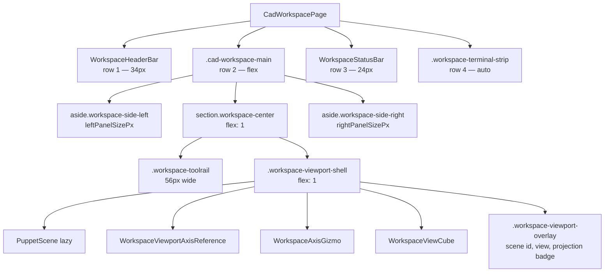
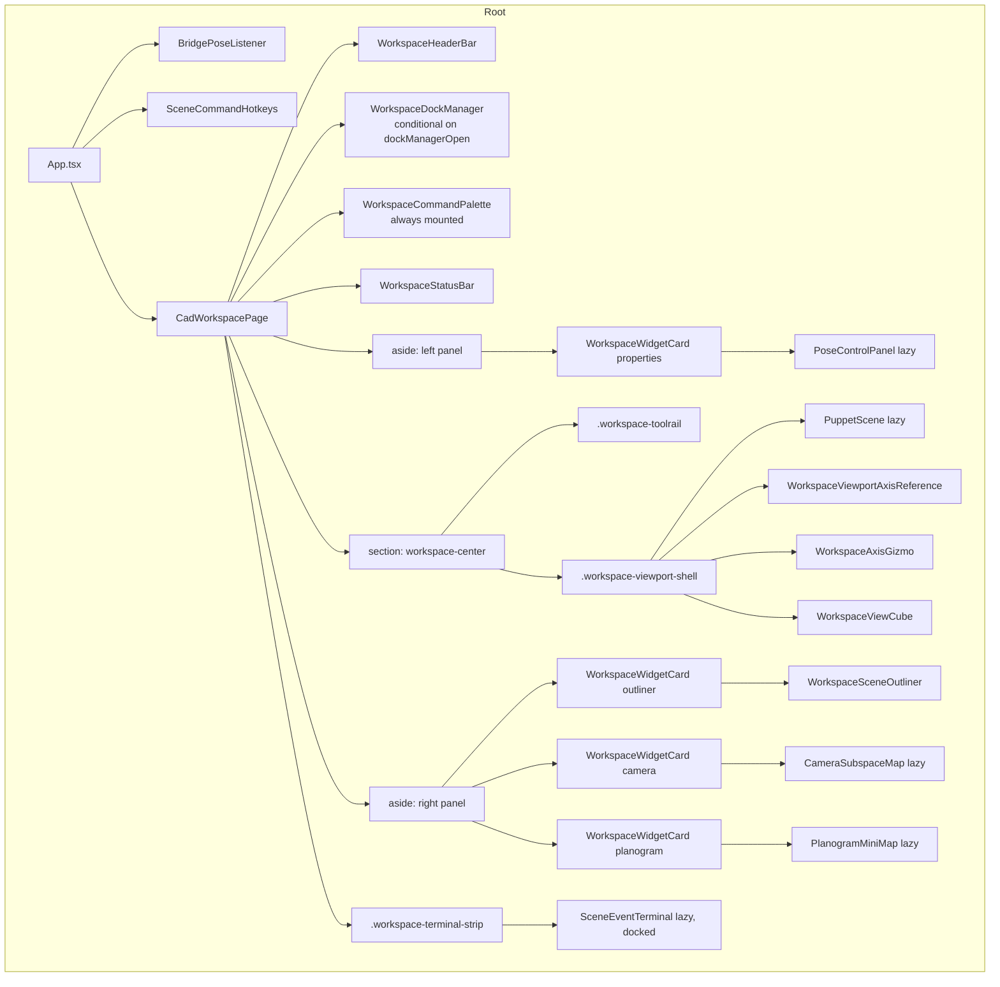
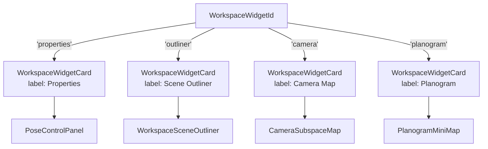
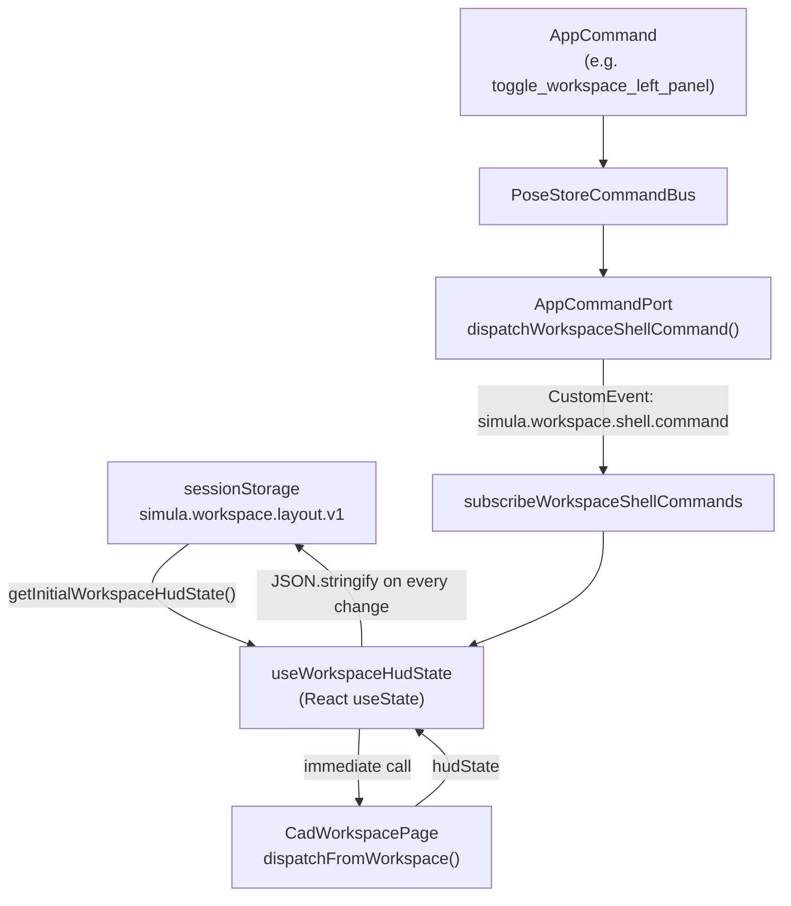

# Workspace UI

Relevant source files

- [](https://github.com/e7canasta/puppet-studio/blob/cdd483bd/lib/analytics/parsing.py)
- [](https://github.com/e7canasta/puppet-studio/blob/cdd483bd/src/core/observability/sceneEventLog.ts)
- [](https://github.com/e7canasta/puppet-studio/blob/cdd483bd/src/core/workspace-shell/workspaceShellBridge.ts)
- [](https://github.com/e7canasta/puppet-studio/blob/cdd483bd/src/features/terminal/model/terminalCommandLine.ts)
- [](https://github.com/e7canasta/puppet-studio/blob/cdd483bd/src/features/workspace/hooks/useWorkspaceHudState.ts)
- [](https://github.com/e7canasta/puppet-studio/blob/cdd483bd/src/features/workspace/index.ts)
- [](https://github.com/e7canasta/puppet-studio/blob/cdd483bd/src/features/workspace/model/workspaceHudModel.ts)
- [](https://github.com/e7canasta/puppet-studio/blob/cdd483bd/src/features/workspace/ui/pages/CadWorkspacePage.tsx)
- [](https://github.com/e7canasta/puppet-studio/blob/cdd483bd/src/styles.css)

This page covers the workspace UI shell: its top-level structure, resizable panel grid, widget lifecycle, and the feature components it hosts. It acts as a navigation hub for all workspace UI sub-pages.

For state management details of `poseStore` itself, see [State Management](https://deepwiki.com/e7canasta/puppet-studio/3-state-management). For the command system that workspace components dispatch to, see [Command System](https://deepwiki.com/e7canasta/puppet-studio/4-command-system). For the bridge status badge and live-data wiring see [Bridge Communication](https://deepwiki.com/e7canasta/puppet-studio/5-bridge-communication).

---

## Purpose and Scope

The workspace UI is the entire visible application shell rendered after `App.tsx` mounts. It is built around `CadWorkspacePage`, which reads from both `poseStore` (via `usePoseStore`) and a local `useWorkspaceHudState` hook, then lays out a fixed four-row grid containing a header bar, a resizable three-column main area, a status bar, and a collapsible terminal strip.

Everything described here lives under `src/features/workspace/`.

---

## Top-Level Grid Structure

The `.cad-workspace` root element is a CSS grid with four rows defined in [src/styles.css38-39](https://github.com/e7canasta/puppet-studio/blob/cdd483bd/src/styles.css#L38-L39):

|Row|Height|Content|
|---|---|---|
|1|`34px`|`WorkspaceHeaderBar`|
|2|`minmax(0, 1fr)`|`.cad-workspace-main` — three-column flex area|
|3|`24px`|`WorkspaceStatusBar`|
|4|`auto`|`.workspace-terminal-strip` — `SceneEventTerminal` or collapsed bar|

**Workspace Shell Layout**



Sources: [src/features/workspace/ui/pages/CadWorkspacePage.tsx458-834](https://github.com/e7canasta/puppet-studio/blob/cdd483bd/src/features/workspace/ui/pages/CadWorkspacePage.tsx#L458-L834) [src/styles.css34-46](https://github.com/e7canasta/puppet-studio/blob/cdd483bd/src/styles.css#L34-L46)

---

## Component Tree



**Full component hierarchy under CadWorkspacePage**

Sources: [src/features/workspace/ui/pages/CadWorkspacePage.tsx39-53](https://github.com/e7canasta/puppet-studio/blob/cdd483bd/src/features/workspace/ui/pages/CadWorkspacePage.tsx#L39-L53) [src/features/workspace/ui/pages/CadWorkspacePage.tsx458-834](https://github.com/e7canasta/puppet-studio/blob/cdd483bd/src/features/workspace/ui/pages/CadWorkspacePage.tsx#L458-L834)

---

## Widget System

### `WorkspaceWidgetId`

Four named widget slots are defined in [src/core/workspace-shell/workspaceShellBridge.ts2](https://github.com/e7canasta/puppet-studio/blob/cdd483bd/src/core/workspace-shell/workspaceShellBridge.ts#L2-L2):

```
'camera' | 'outliner' | 'planogram' | 'properties'
```

### `WorkspaceWidgetHud`

Each widget carries three boolean flags defined in [src/features/workspace/model/workspaceHudModel.ts4-8](https://github.com/e7canasta/puppet-studio/blob/cdd483bd/src/features/workspace/model/workspaceHudModel.ts#L4-L8):

|Field|Type|Effect|
|---|---|---|
|`visible`|`boolean`|Whether the slot appears in the DOM at all|
|`collapsed`|`boolean`|Widget header only; body is hidden|
|`pinned`|`boolean`|Surfaced in `WorkspaceWidgetCard` header|

Default initial values [src/features/workspace/model/workspaceHudModel.ts36-41](https://github.com/e7canasta/puppet-studio/blob/cdd483bd/src/features/workspace/model/workspaceHudModel.ts#L36-L41):

|Widget|`collapsed`|`pinned`|`visible`|
|---|---|---|---|
|`camera`|`true`|`true`|`true`|
|`outliner`|`false`|`true`|`true`|
|`planogram`|`false`|`true`|`true`|
|`properties`|`false`|`true`|`true`|

### Panel Size Constants

Defined in [src/features/workspace/model/workspaceHudModel.ts13-23](https://github.com/e7canasta/puppet-studio/blob/cdd483bd/src/features/workspace/model/workspaceHudModel.ts#L13-L23):

|Dimension|Min px|Max px|Default px|
|---|---|---|---|
|Left panel width|260|520|340|
|Right panel width|260|520|340|
|Right outliner height|180|520|300|
|Terminal height|180|520|240|

**Widget slot to component mapping**



Sources: [src/features/workspace/model/workspaceHudModel.ts1-51](https://github.com/e7canasta/puppet-studio/blob/cdd483bd/src/features/workspace/model/workspaceHudModel.ts#L1-L51) [src/features/workspace/ui/pages/CadWorkspacePage.tsx495-793](https://github.com/e7canasta/puppet-studio/blob/cdd483bd/src/features/workspace/ui/pages/CadWorkspacePage.tsx#L495-L793)

---

## HUD State Management

`useWorkspaceHudState` is the local React hook that owns the `WorkspaceHudState` value. It is not part of `poseStore`.

**State flow for HUD layout**



The persistence key is `WORKSPACE_LAYOUT_STORAGE_KEY = 'simula.workspace.layout.v1'` stored in `sessionStorage`. On load, `mergeWorkspaceHudState` merges any persisted partial state with `INITIAL_WORKSPACE_HUD_STATE` so missing fields always get safe defaults.

Sources: [src/features/workspace/hooks/useWorkspaceHudState.ts27-133](https://github.com/e7canasta/puppet-studio/blob/cdd483bd/src/features/workspace/hooks/useWorkspaceHudState.ts#L27-L133) [src/features/workspace/model/workspaceHudModel.ts11-52](https://github.com/e7canasta/puppet-studio/blob/cdd483bd/src/features/workspace/model/workspaceHudModel.ts#L11-L52) [src/core/workspace-shell/workspaceShellBridge.ts34-58](https://github.com/e7canasta/puppet-studio/blob/cdd483bd/src/core/workspace-shell/workspaceShellBridge.ts#L34-L58)

---

## Layout Presets

Three named presets are applied via the `apply_workspace_layout_preset` command and handled by `applyWorkspaceLayoutPreset` in [src/features/workspace/model/workspaceHudModel.ts197-244](https://github.com/e7canasta/puppet-studio/blob/cdd483bd/src/features/workspace/model/workspaceHudModel.ts#L197-L244):

|Preset|Left panel|Right panel|Terminal height|Widgets|
|---|---|---|---|---|
|`focus`|closed|closed|220px|all hidden|
|`authoring`|open (340px)|open (340px)|240px|all defaults|
|`observability`|closed|open (380px)|320px|camera + outliner expanded, planogram collapsed, properties hidden|

---

## Resizable Panels

Panel resizing is pointer-capture–based, handled by three functions in `CadWorkspacePage`:

- `beginResize(kind)` — attaches `pointermove`/`pointerup` listeners to `window` and records `ResizeStart` in `resizeStartRef`
- `handleResizeMove` — computes delta from pointer origin and calls the appropriate setter on `useWorkspaceHudState`
- `handleResizeEnd` — clears `resizeStartRef` and removes window listeners

`ResizeKind` values and the dimension each controls [src/features/workspace/ui/pages/CadWorkspacePage.tsx55-63](https://github.com/e7canasta/puppet-studio/blob/cdd483bd/src/features/workspace/ui/pages/CadWorkspacePage.tsx#L55-L63):

|`ResizeKind`|Controls|
|---|---|
|`'left'`|`leftPanelSizePx`|
|`'right'`|`rightPanelSizePx`|
|`'right_outliner'`|`rightPanelOutlinerHeightPx`|
|`'terminal'`|`terminalHeightPx`|

Sources: [src/features/workspace/ui/pages/CadWorkspacePage.tsx147-214](https://github.com/e7canasta/puppet-studio/blob/cdd483bd/src/features/workspace/ui/pages/CadWorkspacePage.tsx#L147-L214)

---

## Tool Rail

The `.workspace-toolrail` is a 56px-wide vertical strip in the center section [src/features/workspace/ui/pages/CadWorkspacePage.tsx517-659](https://github.com/e7canasta/puppet-studio/blob/cdd483bd/src/features/workspace/ui/pages/CadWorkspacePage.tsx#L517-L659) It contains icon buttons grouped by separator:

**Group 1 — Active tool**

- `select`, `move`, `rotate` — dispatches `set_active_tool`

**Group 2 — Camera views**

- `iso`, `front`, `right`, `left`, `back`, `top`, `sensor` — dispatches `set_camera_view`
- projection toggle (Ortho/Persp) — dispatches `set_projection_mode`

**Group 3 — Engine commands**

- Stats, Sim — dispatches `request_engine_stats`, `request_engine_sim_preview`

**Group 4 — Scene tools**

- Snap (disabled unless `sceneEditEnabled && selectedPlacementId`) — dispatches `run_scene_command { kind: 'snap_selected_to_grid' }`
- Dims toggle — dispatches `set_show_dimensions`

All buttons route through `createPoseStoreCommandDispatcher('ui.workspace_shell')`.

---

## Lazy-Loaded Feature Components

All five feature components are loaded with `React.lazy` + `Suspense`. Each has a dedicated fallback loading element [src/features/workspace/ui/pages/CadWorkspacePage.tsx39-53](https://github.com/e7canasta/puppet-studio/blob/cdd483bd/src/features/workspace/ui/pages/CadWorkspacePage.tsx#L39-L53):

|Component|Module path|Fallback text|
|---|---|---|
|`PuppetScene`|`features/scene/ui/PuppetScene`|`Loading scene...`|
|`PoseControlPanel`|`features/pose/ui/PoseControlPanel`|`Loading controls...`|
|`CameraSubspaceMap`|`features/camera/ui/CameraSubspaceMap`|`Loading camera map...`|
|`PlanogramMiniMap`|`features/planogram/ui/PlanogramMiniMap`|`Loading planogram...`|
|`SceneEventTerminal`|`features/terminal/ui/SceneEventTerminal`|`Loading terminal...`|

For details on each, see the corresponding sub-pages: [3D Scene Rendering](https://deepwiki.com/e7canasta/puppet-studio/7-3d-scene-rendering), [Camera System](https://deepwiki.com/e7canasta/puppet-studio/9-camera-system), [Planogram System](https://deepwiki.com/e7canasta/puppet-studio/8-planogram-system), [Scene Event Terminal](https://deepwiki.com/e7canasta/puppet-studio/6.5-scene-event-terminal).

---

## Command Dispatch

`CadWorkspacePage` creates a single dispatcher instance via:

```
const dispatchFromWorkspace = createPoseStoreCommandDispatcher('ui.workspace_shell')
```

This tags all commands with the source string `'ui.workspace_shell'` so they appear labeled in the event terminal. Widget visibility and collapse state changes wrap this dispatcher in stable `useCallback`s: `setWidgetVisibilityFromWorkspace`, `toggleWidgetCollapsedFromWorkspace`, `toggleWidgetPinnedFromWorkspace` [src/features/workspace/ui/pages/CadWorkspacePage.tsx126-145](https://github.com/e7canasta/puppet-studio/blob/cdd483bd/src/features/workspace/ui/pages/CadWorkspacePage.tsx#L126-L145)

---

## Quick Actions (Command Palette)

`CadWorkspacePage` builds a `useMemo`-derived array of `WorkspaceQuickAction[]` passed to `WorkspaceCommandPalette`. Groups and sample entries [src/features/workspace/ui/pages/CadWorkspacePage.tsx216-449](https://github.com/e7canasta/puppet-studio/blob/cdd483bd/src/features/workspace/ui/pages/CadWorkspacePage.tsx#L216-L449):

|Group|Examples|
|---|---|
|Layout|Toggle left/right panel, apply preset, restore defaults|
|Terminal|Toggle terminal|
|Scene|Toggle edit mode, toggle remote hold|
|View|Switch camera view, toggle projection mode|
|Tools|Select/move/rotate, snap selection, toggle dimensions|
|Engine|Request stats, request sim preview|
|Widgets|Toggle outliner, camera, planogram visibility|

The palette is opened by dispatching `WORKSPACE_COMMAND_PALETTE_EVENT` as a `CustomEvent` on `window`. See [Workspace Command Palette](https://deepwiki.com/e7canasta/puppet-studio/6.7-workspace-command-palette) for full details.

---

## Sub-page Index

|Page|Topic|
|---|---|
|[CAD Workspace Page](https://deepwiki.com/e7canasta/puppet-studio/6.1-cad-workspace-page)|`CadWorkspacePage` internals, resize logic, state subscriptions|
|[HUD Layout & State Management](https://deepwiki.com/e7canasta/puppet-studio/6.2-hud-layout-and-state-management)|`WorkspaceHudState`, `useWorkspaceHudState`, layout presets, sessionStorage|
|[Header Bar, Status Bar & Widget Cards](https://deepwiki.com/e7canasta/puppet-studio/6.3-header-bar-status-bar-and-widget-cards)|`WorkspaceHeaderBar`, `WorkspaceStatusBar`, `WorkspaceWidgetCard`|
|[Viewport Controls](https://deepwiki.com/e7canasta/puppet-studio/6.4-viewport-controls)|`WorkspaceViewCube`, `WorkspaceAxisGizmo`, `WorkspaceViewportAxisReference`|
|[Scene Event Terminal](https://deepwiki.com/e7canasta/puppet-studio/6.5-scene-event-terminal)|`SceneEventTerminal`, filtering, event log|
|[Terminal Command Processing](https://deepwiki.com/e7canasta/puppet-studio/6.6-terminal-command-processing)|`runTerminalCommandLine`, `TerminalCommandContext`, command catalog|
|[Workspace Command Palette](https://deepwiki.com/e7canasta/puppet-studio/6.7-workspace-command-palette)|`WorkspaceCommandPalette`, `WorkspaceQuickAction`, keyboard trigger|
|[Keyboard Shortcuts](https://deepwiki.com/e7canasta/puppet-studio/6.8-keyboard-shortcuts)|`useSceneCommandHotkeys`, `STUDIO_SHORTCUTS`, hotkey dispatch|

Sources: [src/features/workspace/ui/pages/CadWorkspacePage.tsx1-835](https://github.com/e7canasta/puppet-studio/blob/cdd483bd/src/features/workspace/ui/pages/CadWorkspacePage.tsx#L1-L835) [src/features/workspace/model/workspaceHudModel.ts1-314](https://github.com/e7canasta/puppet-studio/blob/cdd483bd/src/features/workspace/model/workspaceHudModel.ts#L1-L314) [src/features/workspace/hooks/useWorkspaceHudState.ts1-133](https://github.com/e7canasta/puppet-studio/blob/cdd483bd/src/features/workspace/hooks/useWorkspaceHudState.ts#L1-L133) [src/core/workspace-shell/workspaceShellBridge.ts1-58](https://github.com/e7canasta/puppet-studio/blob/cdd483bd/src/core/workspace-shell/workspaceShellBridge.ts#L1-L58)


### On this page

- [Workspace UI](https://deepwiki.com/e7canasta/puppet-studio/6-workspace-ui#workspace-ui)
- [Purpose and Scope](https://deepwiki.com/e7canasta/puppet-studio/6-workspace-ui#purpose-and-scope)
- [Top-Level Grid Structure](https://deepwiki.com/e7canasta/puppet-studio/6-workspace-ui#top-level-grid-structure)
- [Component Tree](https://deepwiki.com/e7canasta/puppet-studio/6-workspace-ui#component-tree)
- [Widget System](https://deepwiki.com/e7canasta/puppet-studio/6-workspace-ui#widget-system)
- [`WorkspaceWidgetId`](https://deepwiki.com/e7canasta/puppet-studio/6-workspace-ui#workspacewidgetid)
- [`WorkspaceWidgetHud`](https://deepwiki.com/e7canasta/puppet-studio/6-workspace-ui#workspacewidgethud)
- [Panel Size Constants](https://deepwiki.com/e7canasta/puppet-studio/6-workspace-ui#panel-size-constants)
- [HUD State Management](https://deepwiki.com/e7canasta/puppet-studio/6-workspace-ui#hud-state-management)
- [Layout Presets](https://deepwiki.com/e7canasta/puppet-studio/6-workspace-ui#layout-presets)
- [Resizable Panels](https://deepwiki.com/e7canasta/puppet-studio/6-workspace-ui#resizable-panels)
- [Tool Rail](https://deepwiki.com/e7canasta/puppet-studio/6-workspace-ui#tool-rail)
- [Lazy-Loaded Feature Components](https://deepwiki.com/e7canasta/puppet-studio/6-workspace-ui#lazy-loaded-feature-components)
- [Command Dispatch](https://deepwiki.com/e7canasta/puppet-studio/6-workspace-ui#command-dispatch)
- [Quick Actions (Command Palette)](https://deepwiki.com/e7canasta/puppet-studio/6-workspace-ui#quick-actions-command-palette)
- [Sub-page Index](https://deepwiki.com/e7canasta/puppet-studio/6-workspace-ui#sub-page-index)

