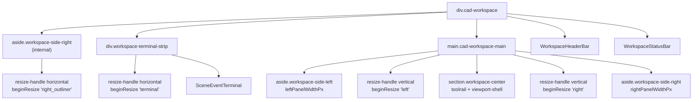
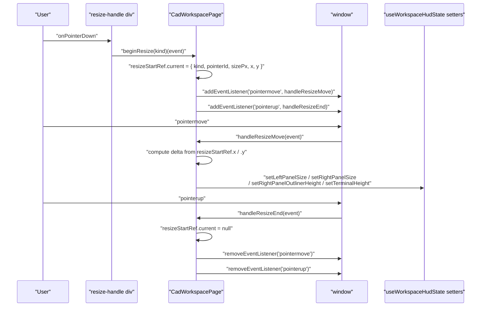

# CAD Workspace Page

Relevant source files

- [](https://github.com/e7canasta/puppet-studio/blob/cdd483bd/src/core/workspace-shell/index.ts)
- [](https://github.com/e7canasta/puppet-studio/blob/cdd483bd/src/core/workspace-shell/workspaceShellBridge.ts)
- [](https://github.com/e7canasta/puppet-studio/blob/cdd483bd/src/features/terminal/model/terminalCommandLine.ts)
- [](https://github.com/e7canasta/puppet-studio/blob/cdd483bd/src/features/workspace/hooks/useWorkspaceHudState.ts)
- [](https://github.com/e7canasta/puppet-studio/blob/cdd483bd/src/features/workspace/model/index.ts)
- [](https://github.com/e7canasta/puppet-studio/blob/cdd483bd/src/features/workspace/model/workspaceHudModel.ts)
- [](https://github.com/e7canasta/puppet-studio/blob/cdd483bd/src/features/workspace/ui/pages/CadWorkspacePage.tsx)
- [](https://github.com/e7canasta/puppet-studio/blob/cdd483bd/src/shared/shortcuts/index.ts)

`CadWorkspacePage` is the main UI orchestrator for the puppet-studio workspace. It assembles the full panel layout, reads scene and HUD state, handles panel resize interactions, registers quick actions for the command palette, and dispatches all UI-originated commands through the command bus.

This page focuses on the structure and wiring of `CadWorkspacePage` itself. For the HUD state model and layout presets, see [6.2](https://deepwiki.com/e7canasta/puppet-studio/6.2-hud-layout-and-state-management). For the header bar, status bar, and widget cards, see [6.3](https://deepwiki.com/e7canasta/puppet-studio/6.3-header-bar-status-bar-and-widget-cards). For the command palette mechanism, see [6.7](https://deepwiki.com/e7canasta/puppet-studio/6.7-workspace-command-palette).

---

## Component Position in the App Tree

`CadWorkspacePage` is mounted by `App.tsx` alongside `BridgePoseListener` and `SceneCommandHotkeys`. It is the root of the visible workspace UI.

```mermaid
graph TD
    Apptsx["App.tsx"] --> BridgePoseListener["BridgePoseListener"]
    Apptsx --> SceneCommandHotkeys["SceneCommandHotkeys"]
    Apptsx --> CadWorkspacePage["CadWorkspacePage"]

    CadWorkspacePage --> WorkspaceHeaderBar["WorkspaceHeaderBar"]
    CadWorkspacePage --> WorkspaceDockManager["WorkspaceDockManager<br/>(conditional)"]
    CadWorkspacePage --> main_cad_workspace_main["main.cad-workspace-main"]
    CadWorkspacePage --> WorkspaceStatusBar["WorkspaceStatusBar"]
    CadWorkspacePage --> workspace_terminal_strip["workspace-terminal-strip"]
    CadWorkspacePage --> WorkspaceCommandPalette["WorkspaceCommandPalette"]

    main_cad_workspace_main --> section_workspace_center["section.workspace-center"]
    main_cad_workspace_main --> aside_workspace_side_right["aside.workspace-side-right<br/>(rightPanelOpen)"]

    section_workspace_center --> div_workspace_toolrail["div.workspace-toolrail"]
    section_workspace_center --> div_workspace_viewport_shell["div.workspace-viewport-shell"]

    div_workspace_viewport_shell --> div_workspace_viewport_overlay["div.workspace-viewport-overlay"]
    div_workspace_viewport_shell --> WorkspaceAxisGizmo["WorkspaceAxisGizmo"]
    div_workspace_viewport_shell --> WorkspaceViewCube["WorkspaceViewCube"]
    div_workspace_viewport_shell --> WorkspaceViewportAxisReference["WorkspaceViewportAxisReference"]
    div_workspace_viewport_shell --> PuppetScene["PuppetScene (lazy)"]

    aside_workspace_side_right --> WorkspaceWidgetCard_SceneOutliner["WorkspaceWidgetCard:<br/>Scene Outliner"]
    aside_workspace_side_right --> WorkspaceWidgetCard_CameraMap["WorkspaceWidgetCard:<br/>Camera Map"]
    aside_workspace_side_right --> WorkspaceWidgetCard_Planogram["WorkspaceWidgetCard:<br/>Planogram"]

    WorkspaceWidgetCard_SceneOutliner --> WorkspaceSceneOutliner["WorkspaceSceneOutliner"]
    WorkspaceWidgetCard_CameraMap --> CameraSubspaceMap["CameraSubspaceMap (lazy)"]
    WorkspaceWidgetCard_Planogram --> PlanogramMiniMap["PlanogramMiniMap (lazy)"]

    WorkspaceDockManager --> aside_workspace_side_left["aside.workspace-side-left<br/>(showPropertiesWidget)"]

    aside_workspace_side_left --> WorkspaceWidgetCard_Properties["WorkspaceWidgetCard:<br/>Properties"]

    WorkspaceWidgetCard_Properties --> PoseControlPanel["PoseControlPanel (lazy)"]

    workspace_terminal_strip --> SceneEventTerminal["SceneEventTerminal (lazy,<br/>layout-docked)"]
```



**Diagram: Workspace component tree rooted at CadWorkspacePage**

Sources: [src/features/workspace/ui/pages/CadWorkspacePage.tsx1-835](https://github.com/e7canasta/puppet-studio/blob/cdd483bd/src/features/workspace/ui/pages/CadWorkspacePage.tsx#L1-L835)

---

## State Dependencies

`CadWorkspacePage` draws from two state sources:

### From `poseStore` (via `usePoseStore`)

|State field|Usage|
|---|---|
|`bridgeStatus`|Passed to `WorkspaceHeaderBar` for status badge|
|`bridgeUrl`|Passed to `WorkspaceStatusBar`|
|`cameraView`|Active camera view; drives toolrail button highlights|
|`viewportCameraQuaternion`|Passed to `WorkspaceAxisGizmo` and `WorkspaceViewCube`|
|`monitoringCameraCount`|Viewport overlay and status bar|
|`projectionMode`|Drives projection toggle button and overlay badge|
|`sceneEditEnabled`|Enables snap button; passed to header and status bar|
|`sceneEventTerminalOpen`|Controls terminal strip height|
|`sceneId`|Viewport overlay label|
|`scenePlacements.length`|Viewport overlay entity count|
|`sceneRemoteHoldEnabled`|Passed to header|
|`sceneRevision` / `sceneSequence`|Passed to status bar|
|`sceneEventLog.length`|Triggers `activeCapabilities` recompute; terminal collapsed bar|
|`activeToolMode`|Active tool highlight in toolrail|
|`selectedPlacementId`|Guards snap-to-grid button|
|`showDimensions`|Highlights dimensions button|
|`cameraDetectionOverlays`|Aggregates total detection box count|

Sources: [src/features/workspace/ui/pages/CadWorkspacePage.tsx72-95](https://github.com/e7canasta/puppet-studio/blob/cdd483bd/src/features/workspace/ui/pages/CadWorkspacePage.tsx#L72-L95)

### From `useWorkspaceHudState`

`useWorkspaceHudState` is a local React hook that manages panel dimensions and widget visibility. It reads from and persists to `sessionStorage` under the key `WORKSPACE_LAYOUT_STORAGE_KEY` (`simula.workspace.layout.v1`).

|Returned value|Description|
|---|---|
|`leftPanelSizePx`|Current pixel width of the left panel|
|`leftPanelOpen`|Whether the left panel is open|
|`rightPanelSizePx`|Current pixel width of the right panel|
|`rightPanelOpen`|Whether the right panel is open|
|`rightPanelOutlinerHeightPx`|Height of the outliner section within the right panel|
|`terminalHeightPx`|Height of the terminal strip|
|`widgets`|`WorkspaceWidgetHudState` — per-widget `collapsed`, `pinned`, `visible`|
|`showCameraWidget`|Derived: `rightPanelOpen && widgets.camera.visible`|
|`showOutlinerWidget`|Derived: `rightPanelOpen && widgets.outliner.visible`|
|`showPlanWidget`|Derived: `rightPanelOpen && widgets.planogram.visible`|
|`showPropertiesWidget`|Derived: `leftPanelOpen && widgets.properties.visible`|
|`setLeftPanelSize` / `setRightPanelSize` etc.|Panel size setters (clamped)|

Sources: [src/features/workspace/hooks/useWorkspaceHudState.ts39-133](https://github.com/e7canasta/puppet-studio/blob/cdd483bd/src/features/workspace/hooks/useWorkspaceHudState.ts#L39-L133) [src/features/workspace/model/workspaceHudModel.ts25-52](https://github.com/e7canasta/puppet-studio/blob/cdd483bd/src/features/workspace/model/workspaceHudModel.ts#L25-L52)

---

## Layout Structure

`CadWorkspacePage` renders a CSS grid-based layout with optional left and right side panels flanking a central viewport section.

**Diagram: CadWorkspacePage layout regions and resize handles**



### Panel Width Computation

The pixel widths passed to the side panels are not taken directly from `hudState` — they are adjusted for collapse states:

```
leftPanelWidthPx    = widgets.properties.collapsed ? 220 : leftPanelSizePx
rightPanelWidthPx   = widgets.outliner.collapsed ? Math.max(280, rightPanelSizePx - 40) : rightPanelSizePx
outlinerHeightPx    = widgets.outliner.collapsed ? 36 : rightPanelOutlinerHeightPx
```

Sources: [src/features/workspace/ui/pages/CadWorkspacePage.tsx452-456](https://github.com/e7canasta/puppet-studio/blob/cdd483bd/src/features/workspace/ui/pages/CadWorkspacePage.tsx#L452-L456)

---

## Panel Resize Logic

Resizing is implemented with raw `pointermove` / `pointerup` listeners attached to `window`, not to the drag handle element. This ensures dragging continues even when the pointer moves outside the handle.

**Diagram: Panel resize interaction sequence**


### `ResizeKind` and Delta Directions

|`ResizeKind`|Delta axis|Size setter|Direction|
|---|---|---|---|
|`'left'`|X|`setLeftPanelSize`|positive delta → wider|
|`'right'`|X|`setRightPanelSize`|positive delta → narrower|
|`'right_outliner'`|Y|`setRightPanelOutlinerHeight`|positive delta → taller|
|`'terminal'`|Y|`setTerminalHeight`|positive delta → shorter|

The right panel shrinks when dragged right because the panel is anchored to the right edge. The terminal shrinks when dragged down because the handle sits at the top of the terminal strip.

Sources: [src/features/workspace/ui/pages/CadWorkspacePage.tsx55-63](https://github.com/e7canasta/puppet-studio/blob/cdd483bd/src/features/workspace/ui/pages/CadWorkspacePage.tsx#L55-L63) [src/features/workspace/ui/pages/CadWorkspacePage.tsx147-213](https://github.com/e7canasta/puppet-studio/blob/cdd483bd/src/features/workspace/ui/pages/CadWorkspacePage.tsx#L147-L213)

---

## Lazy-Loaded Feature Components

All heavy feature components are code-split with `React.lazy` and wrapped in `<Suspense>`:

|Lazy component|Import module|Fallback|
|---|---|---|
|`PuppetScene`|`features/scene/ui/PuppetScene`|`"Loading scene..."`|
|`PoseControlPanel`|`features/pose/ui/PoseControlPanel`|`"Loading controls..."`|
|`CameraSubspaceMap`|`features/camera/ui/CameraSubspaceMap`|`"Loading camera map..."`|
|`PlanogramMiniMap`|`features/planogram/ui/PlanogramMiniMap`|`"Loading planogram..."`|
|`SceneEventTerminal`|`features/terminal/ui/SceneEventTerminal`|`"Loading terminal..."`|

`SceneEventTerminal` receives `layout="docked"` when rendered in the terminal strip.

Sources: [src/features/workspace/ui/pages/CadWorkspacePage.tsx39-53](https://github.com/e7canasta/puppet-studio/blob/cdd483bd/src/features/workspace/ui/pages/CadWorkspacePage.tsx#L39-L53) [src/features/workspace/ui/pages/CadWorkspacePage.tsx661-663](https://github.com/e7canasta/puppet-studio/blob/cdd483bd/src/features/workspace/ui/pages/CadWorkspacePage.tsx#L661-L663) [src/features/workspace/ui/pages/CadWorkspacePage.tsx813-820](https://github.com/e7canasta/puppet-studio/blob/cdd483bd/src/features/workspace/ui/pages/CadWorkspacePage.tsx#L813-L820)

---

## Toolrail

The `div.workspace-toolrail` inside `section.workspace-center` contains the primary scene editing controls as icon buttons. Each button dispatches an `AppCommand` directly via `dispatchFromWorkspace`.

|Button|Command dispatched|Active condition|
|---|---|---|
|Select|`{ kind: 'set_active_tool', mode: 'select' }`|`activeTool === 'select'`|
|Move|`{ kind: 'set_active_tool', mode: 'move' }`|`activeTool === 'move'`|
|Rotate|`{ kind: 'set_active_tool', mode: 'rotate' }`|`activeTool === 'rotate'`|
|Iso / Front / Right / Left / Back / Top|`{ kind: 'set_camera_view', view: '...' }`|`cameraView === view`|
|Cam|`{ kind: 'set_camera_view', view: 'sensor' }`|`cameraView === 'sensor'`|
|Ortho/Persp toggle|`{ kind: 'set_projection_mode', mode: '...' }`|`projectionMode === 'orthographic'`|
|Stats|`{ kind: 'request_engine_stats' }`|—|
|Sim|`{ kind: 'request_engine_sim_preview' }`|—|
|Snap|`{ kind: 'run_scene_command', command: { kind: 'snap_selected_to_grid', stepM } }`|disabled unless `canSnapSelection`|
|Dims|`{ kind: 'set_show_dimensions', show: !showDimensions }`|`showDimensions`|

`canSnapSelection` is `sceneEditEnabled && Boolean(selectedPlacementId)`. The snap step comes from `SCENE_COMMAND_SNAP_STEP_M` in the runtime config.

Sources: [src/features/workspace/ui/pages/CadWorkspacePage.tsx517-659](https://github.com/e7canasta/puppet-studio/blob/cdd483bd/src/features/workspace/ui/pages/CadWorkspacePage.tsx#L517-L659)

---

## Viewport Overlay

The floating overlay inside the viewport shell (`div.workspace-viewport-overlay`) shows read-only diagnostic info directly derived from `poseStore`:

- **Line 1**: `sceneId` | current camera view label | projection mode badge (`ORTHO` / `PERSP`)
- **Line 2** (muted): entity count | camera count | detection count | active tool

The camera view label is formatted by `formatCameraViewLabel`, which maps `'iso'` → `'iso view'`, `'sensor'` → `'cam'`, others pass through unchanged.

Sources: [src/features/workspace/ui/pages/CadWorkspacePage.tsx65-69](https://github.com/e7canasta/puppet-studio/blob/cdd483bd/src/features/workspace/ui/pages/CadWorkspacePage.tsx#L65-L69) [src/features/workspace/ui/pages/CadWorkspacePage.tsx665-686](https://github.com/e7canasta/puppet-studio/blob/cdd483bd/src/features/workspace/ui/pages/CadWorkspacePage.tsx#L665-L686)

---

## Command Dispatching

All commands from `CadWorkspacePage` are dispatched through a single dispatcher instance created with:

```
const dispatchFromWorkspace = createPoseStoreCommandDispatcher('ui.workspace_shell')
```

The source tag `'ui.workspace_shell'` is attached to every `AppCommandEnvelope` generated from this page, making events traceable in the scene event log.

Three callback wrappers are defined for widget operations, each stable across renders via `useCallback`:

|Callback|Command kind|
|---|---|
|`setWidgetVisibilityFromWorkspace(widget, visible)`|`set_workspace_widget_visible`|
|`toggleWidgetCollapsedFromWorkspace(widget)`|`toggle_workspace_widget_collapsed`|
|`toggleWidgetPinnedFromWorkspace(widget)`|`toggle_workspace_widget_pinned`|

Sources: [src/features/workspace/ui/pages/CadWorkspacePage.tsx96](https://github.com/e7canasta/puppet-studio/blob/cdd483bd/src/features/workspace/ui/pages/CadWorkspacePage.tsx#L96-L96) [src/features/workspace/ui/pages/CadWorkspacePage.tsx126-145](https://github.com/e7canasta/puppet-studio/blob/cdd483bd/src/features/workspace/ui/pages/CadWorkspacePage.tsx#L126-L145)

---

## Quick Actions Registration

```mermaid
graph TD
    PA["WorkspaceCommand<br/>actions=quickActions"] 
    G1["Group: Layout"]
    G2["Group: Terminal"]
    G3["Group: Scene"]
    G4["Group: View"]
    G5["Group: Tools"]
    G6["Group: Engine"]
    G7["Group: Widgets"]
    L1["toggle_workspace_left_panel"]
    L2["toggle_workspace_right_panel"]
    L3["apply_workspace_layout_preset focus"]
    L4["apply_workspace_layout_preset authoring"]
    L5["apply_workspace_layout_preset observability"]
    L6["restore_workspace_layout_defaults"]
    T1["toggle_scene_event_terminal"]
    S1["toggle_scene_edit"]
    S2["toggle_scene_remote_hold"]
    V1["set_camera_view iso/top/front/back/left/right/sensor"]
    V2["set_projection_mode orthographic/perspective"]
    T2["set_active_tool select/move/rotate"]
    T3["run_scene_command snap_selected_to_grid"]
    T4["set_show_dimensions"]
    E1["request_engine_stats"]
    E2["request_engine_sim_preview"]
    W1["toggle_workspace_widget_collapsed outliner"]
    W2["set_workspace_widget_visible camera"]
    W3["set_workspace_widget_visible planogram"]

    PA --> G1
    PA --> G2
    PA --> G3
    PA --> G4
    PA --> G5
    PA --> G6
    PA --> G7

    G1 --> L1
    G1 --> L2
    G1 --> L3
    G1 --> L4
    G1 --> L5
    G1 --> L6

    G2 --> T1

    G3 --> S1
    G3 --> S2

    G4 --> V1
    G4 --> V2

    G5 --> T2
    G5 --> T3
    G5 --> T4

    G6 --> E1
    G6 --> E2

    G7 --> W1
    G7 --> W2
    G7 --> W3
```

`CadWorkspacePage` builds a `WorkspaceQuickAction[]` array (memoized via `useMemo`) and passes it to `<WorkspaceCommandPalette actions={quickActions} />`. When the user opens the palette (via keyboard shortcut or the header button), these actions are searchable.



**Diagram: Quick action groups and their command targets**

Several quick actions include a `shortcut` field referencing constants from `STUDIO_SHORTCUTS`:

|Quick action id|Shortcut constant|
|---|---|
|`toggle_terminal`|`STUDIO_SHORTCUTS.terminal.toggle`|
|`snap_selected_to_grid`|`STUDIO_SHORTCUTS.scene.snap`|
|`toggle_dimensions`|`STUDIO_SHORTCUTS.scene.measure`|

The command palette is opened programmatically by dispatching a `CustomEvent` with type `WORKSPACE_COMMAND_PALETTE_EVENT` to `window`:

```
window.dispatchEvent(new CustomEvent(WORKSPACE_COMMAND_PALETTE_EVENT, { detail: { open: true } }))
```

Sources: [src/features/workspace/ui/pages/CadWorkspacePage.tsx118-124](https://github.com/e7canasta/puppet-studio/blob/cdd483bd/src/features/workspace/ui/pages/CadWorkspacePage.tsx#L118-L124) [src/features/workspace/ui/pages/CadWorkspacePage.tsx216-450](https://github.com/e7canasta/puppet-studio/blob/cdd483bd/src/features/workspace/ui/pages/CadWorkspacePage.tsx#L216-L450)

---

## Dock Manager

The `WorkspaceDockManager` is a conditional overlay toggled by local React state `dockManagerOpen`. It provides a UI for bulk widget visibility, collapse, and pin changes. It is opened from both the header bar and the right panel tab strip.

When open, `WorkspaceDockManager` receives:

- `widgets` — current `WorkspaceWidgetHudState`
- `onSetWidgetVisible` — bound to `setWidgetVisibilityFromWorkspace`
- `onToggleWidgetCollapsed` — bound to `toggleWidgetCollapsedFromWorkspace`
- `onToggleWidgetPinned` — bound to `toggleWidgetPinnedFromWorkspace`
- `onClose` — sets `dockManagerOpen` to `false`

Sources: [src/features/workspace/ui/pages/CadWorkspacePage.tsx116](https://github.com/e7canasta/puppet-studio/blob/cdd483bd/src/features/workspace/ui/pages/CadWorkspacePage.tsx#L116-L116) [src/features/workspace/ui/pages/CadWorkspacePage.tsx484-492](https://github.com/e7canasta/puppet-studio/blob/cdd483bd/src/features/workspace/ui/pages/CadWorkspacePage.tsx#L484-L492)

---

## Right Panel Tab Bar

When `rightPanelOpen && anyRightWidgetVisible`, the right panel renders an inline tab bar with four buttons:

|Button|Toggles visibility of|
|---|---|
|Outliner|`widgets.outliner.visible`|
|Camera|`widgets.camera.visible`|
|Planogram|`widgets.planogram.visible`|
|Dock|`dockManagerOpen` local state|

If the outliner is shown alongside camera or planogram widgets, a horizontal resize handle (`beginResize('right_outliner')`) appears between them, allowing the outliner's share of the right panel to be resized.

Sources: [src/features/workspace/ui/pages/CadWorkspacePage.tsx708-793](https://github.com/e7canasta/puppet-studio/blob/cdd483bd/src/features/workspace/ui/pages/CadWorkspacePage.tsx#L708-L793)


### On this page

- [CAD Workspace Page](https://deepwiki.com/e7canasta/puppet-studio/6.1-cad-workspace-page#cad-workspace-page)
- [Component Position in the App Tree](https://deepwiki.com/e7canasta/puppet-studio/6.1-cad-workspace-page#component-position-in-the-app-tree)
- [State Dependencies](https://deepwiki.com/e7canasta/puppet-studio/6.1-cad-workspace-page#state-dependencies)
- [From `poseStore` (via `usePoseStore`)](https://deepwiki.com/e7canasta/puppet-studio/6.1-cad-workspace-page#from-posestore-via-useposestore)
- [From `useWorkspaceHudState`](https://deepwiki.com/e7canasta/puppet-studio/6.1-cad-workspace-page#from-useworkspacehudstate)
- [Layout Structure](https://deepwiki.com/e7canasta/puppet-studio/6.1-cad-workspace-page#layout-structure)
- [Panel Width Computation](https://deepwiki.com/e7canasta/puppet-studio/6.1-cad-workspace-page#panel-width-computation)
- [Panel Resize Logic](https://deepwiki.com/e7canasta/puppet-studio/6.1-cad-workspace-page#panel-resize-logic)
- [`ResizeKind` and Delta Directions](https://deepwiki.com/e7canasta/puppet-studio/6.1-cad-workspace-page#resizekind-and-delta-directions)
- [Lazy-Loaded Feature Components](https://deepwiki.com/e7canasta/puppet-studio/6.1-cad-workspace-page#lazy-loaded-feature-components)
- [Toolrail](https://deepwiki.com/e7canasta/puppet-studio/6.1-cad-workspace-page#toolrail)
- [Viewport Overlay](https://deepwiki.com/e7canasta/puppet-studio/6.1-cad-workspace-page#viewport-overlay)
- [Command Dispatching](https://deepwiki.com/e7canasta/puppet-studio/6.1-cad-workspace-page#command-dispatching)
- [Quick Actions Registration](https://deepwiki.com/e7canasta/puppet-studio/6.1-cad-workspace-page#quick-actions-registration)
- [Dock Manager](https://deepwiki.com/e7canasta/puppet-studio/6.1-cad-workspace-page#dock-manager)
- [Right Panel Tab Bar](https://deepwiki.com/e7canasta/puppet-studio/6.1-cad-workspace-page#right-panel-tab-bar)
