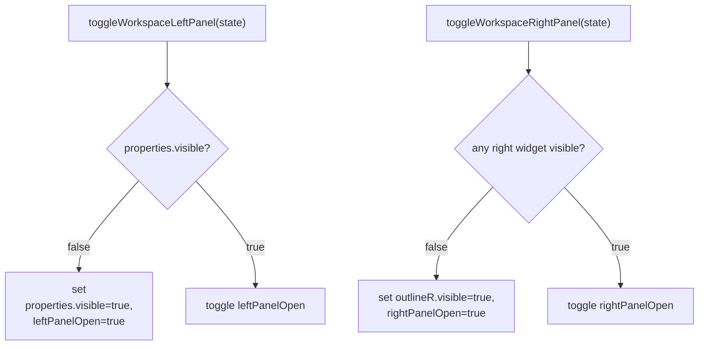
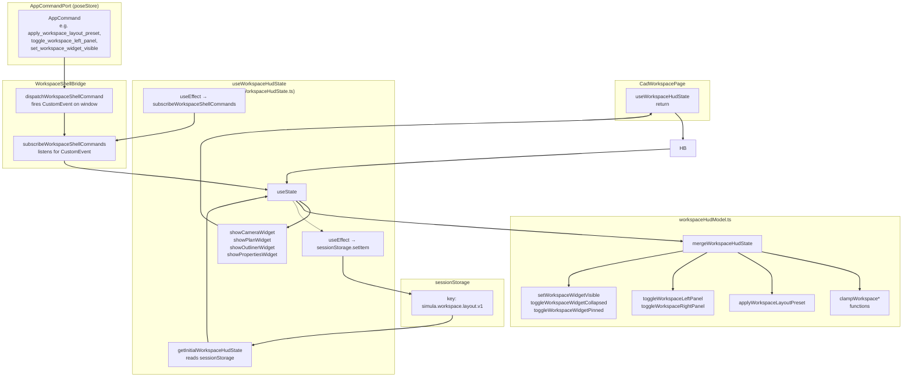

# HUD Layout & State Management

Relevant source files

- [](https://github.com/e7canasta/puppet-studio/blob/cdd483bd/src/core/workspace-shell/index.ts)
- [](https://github.com/e7canasta/puppet-studio/blob/cdd483bd/src/core/workspace-shell/workspaceShellBridge.ts)
- [](https://github.com/e7canasta/puppet-studio/blob/cdd483bd/src/features/bridge/hooks/index.ts)
- [](https://github.com/e7canasta/puppet-studio/blob/cdd483bd/src/features/terminal/model/terminalCommandLine.ts)
- [](https://github.com/e7canasta/puppet-studio/blob/cdd483bd/src/features/workspace/hooks/index.ts)
- [](https://github.com/e7canasta/puppet-studio/blob/cdd483bd/src/features/workspace/hooks/useWorkspaceHudState.ts)
- [](https://github.com/e7canasta/puppet-studio/blob/cdd483bd/src/features/workspace/model/index.ts)
- [](https://github.com/e7canasta/puppet-studio/blob/cdd483bd/src/features/workspace/model/workspaceHudModel.ts)
- [](https://github.com/e7canasta/puppet-studio/blob/cdd483bd/src/features/workspace/ui/pages/CadWorkspacePage.tsx)
- [](https://github.com/e7canasta/puppet-studio/blob/cdd483bd/src/shared/shortcuts/index.ts)

This page documents how the workspace HUD (heads-up display) tracks and mutates panel sizes, widget visibility, collapse state, and layout presets. It covers the pure model functions in `workspaceHudModel.ts`, the `useWorkspaceHudState` React hook, the `sessionStorage` persistence layer, and the `WorkspaceShellBridge` custom-event bus that allows decoupled components to issue layout commands.

For how `CadWorkspacePage` consumes this state and renders the panel grid, see [6.1](https://deepwiki.com/e7canasta/puppet-studio/6.1-cad-workspace-page). For the header bar controls that trigger layout changes, see [6.3](https://deepwiki.com/e7canasta/puppet-studio/6.3-header-bar-status-bar-and-widget-cards).

---

## Data Model

### Types

All HUD types are defined in [src/features/workspace/model/workspaceHudModel.ts](https://github.com/e7canasta/puppet-studio/blob/cdd483bd/src/features/workspace/model/workspaceHudModel.ts)

|Type|Purpose|
|---|---|
|`WorkspaceWidgetId`|Union of the four widget slot names: `'camera' \| 'outliner' \| 'planogram' \| 'properties'`|
|`WorkspaceLayoutPreset`|Union of named layout configurations: `'authoring' \| 'focus' \| 'observability'`|
|`WorkspaceWidgetHud`|Per-widget flags: `collapsed`, `pinned`, `visible`|
|`WorkspaceWidgetHudState`|`Record<WorkspaceWidgetId, WorkspaceWidgetHud>` — one `WorkspaceWidgetHud` per slot|
|`WorkspaceHudState`|Full layout snapshot (see below)|
|`WorkspaceRightPanelTab`|Active tab within the right panel: `'camera' \| 'planogram'`|

`WorkspaceWidgetId` and `WorkspaceLayoutPreset` are exported from the core layer at [src/core/workspace-shell/workspaceShellBridge.ts](https://github.com/e7canasta/puppet-studio/blob/cdd483bd/src/core/workspace-shell/workspaceShellBridge.ts) and re-used throughout the model, hook, and command bus.

### WorkspaceHudState shape

[src/features/workspace/model/workspaceHudModel.ts25-34](https://github.com/e7canasta/puppet-studio/blob/cdd483bd/src/features/workspace/model/workspaceHudModel.ts#L25-L34)

```
WorkspaceHudState {
  leftPanelSizePx         number   pixel width of the left panel
  leftPanelOpen           boolean  whether the left panel is rendered
  rightPanelSizePx        number   pixel width of the right panel
  rightPanelOpen          boolean  whether the right panel is rendered
  rightPanelOutlinerHeightPx  number  pixel height of the outliner section
  rightPanelTab           WorkspaceRightPanelTab
  terminalHeightPx        number   pixel height of the terminal strip
  widgets                 WorkspaceWidgetHudState
}
```

Sources: [src/features/workspace/model/workspaceHudModel.ts25-52](https://github.com/e7canasta/puppet-studio/blob/cdd483bd/src/features/workspace/model/workspaceHudModel.ts#L25-L52)

---

## Size Constants & Clamps

Every resizable dimension has a min, max, and default constant, and a corresponding clamp function.

|Constant|Value|Clamp function|
|---|---|---|
|`WORKSPACE_LEFT_PANEL_MIN_PX`|260|`clampWorkspaceLeftPanelSize`|
|`WORKSPACE_LEFT_PANEL_MAX_PX`|520||
|`WORKSPACE_LEFT_PANEL_DEFAULT_PX`|340||
|`WORKSPACE_RIGHT_PANEL_MIN_PX`|260|`clampWorkspaceRightPanelSize`|
|`WORKSPACE_RIGHT_PANEL_MAX_PX`|520||
|`WORKSPACE_RIGHT_PANEL_DEFAULT_PX`|340||
|`WORKSPACE_RIGHT_PANEL_OUTLINER_MIN_PX`|180|`clampWorkspaceRightPanelOutlinerHeight`|
|`WORKSPACE_RIGHT_PANEL_OUTLINER_MAX_PX`|520||
|`WORKSPACE_RIGHT_PANEL_OUTLINER_DEFAULT_PX`|300||
|`WORKSPACE_TERMINAL_MIN_PX`|180|`clampWorkspaceTerminalHeight`|
|`WORKSPACE_TERMINAL_MAX_PX`|520||
|`WORKSPACE_TERMINAL_DEFAULT_PX`|240||

All clamp functions use the same internal `clamp(value, min, max)` helper and are applied automatically within `mergeWorkspaceHudState`.

Sources: [src/features/workspace/model/workspaceHudModel.ts11-72](https://github.com/e7canasta/puppet-studio/blob/cdd483bd/src/features/workspace/model/workspaceHudModel.ts#L11-L72)

---

## Initial State

`INITIAL_WORKSPACE_HUD_STATE` and `INITIAL_WORKSPACE_WIDGETS` define the defaults. Widget initial state:

|Widget|`collapsed`|`pinned`|`visible`|
|---|---|---|---|
|`camera`|`true`|`true`|`true`|
|`outliner`|`false`|`true`|`true`|
|`planogram`|`false`|`true`|`true`|
|`properties`|`false`|`true`|`true`|

Sources: [src/features/workspace/model/workspaceHudModel.ts36-52](https://github.com/e7canasta/puppet-studio/blob/cdd483bd/src/features/workspace/model/workspaceHudModel.ts#L36-L52)

---

## Pure State Functions

All mutations are implemented as pure functions that accept a `WorkspaceHudState` and return a new one. None of them have side effects.

**State Diagram — panel open/close rules**




Sources: [src/features/workspace/model/workspaceHudModel.ts121-158](https://github.com/e7canasta/puppet-studio/blob/cdd483bd/src/features/workspace/model/workspaceHudModel.ts#L121-L158)

### Function reference table

|Function|Description|
|---|---|
|`mergeWorkspaceHudState(base, candidate)`|Deep-merges a partial candidate into base; clamps all pixel values; enforces panel-open invariants|
|`toggleWorkspaceLeftPanel(state)`|Toggles `leftPanelOpen`; if `properties` widget hidden, makes it visible first|
|`toggleWorkspaceRightPanel(state)`|Toggles `rightPanelOpen`; if no right widget visible, makes `outliner` visible first|
|`setWorkspaceLeftPanelSize(state, px)`|Clamps and sets `leftPanelSizePx`|
|`setWorkspaceRightPanelSize(state, px)`|Clamps and sets `rightPanelSizePx`|
|`setWorkspaceRightPanelOutlinerHeight(state, px)`|Clamps and sets `rightPanelOutlinerHeightPx`|
|`setWorkspaceTerminalHeight(state, px)`|Clamps and sets `terminalHeightPx`|
|`setWorkspaceWidgetVisible(state, widget, visible)`|Sets `widget.visible`; adjusts `leftPanelOpen` / `rightPanelOpen` accordingly|
|`toggleWorkspaceWidgetCollapsed(state, widget)`|Flips `widget.collapsed`|
|`toggleWorkspaceWidgetPinned(state, widget)`|Flips `widget.pinned`|
|`restoreWorkspaceLayoutDefaults()`|Returns a fresh copy of `INITIAL_WORKSPACE_HUD_STATE`|
|`applyWorkspaceLayoutPreset(state, preset)`|Applies one of three named layout presets|
|`activateWorkspaceCameraWidget(state)`|Sets `camera.visible=true`, opens right panel, sets tab to `'camera'`|
|`activateWorkspacePlanWidget(state)`|Sets `planogram.visible=true`, opens right panel, sets tab to `'planogram'`|

Sources: [src/features/workspace/model/workspaceHudModel.ts121-314](https://github.com/e7canasta/puppet-studio/blob/cdd483bd/src/features/workspace/model/workspaceHudModel.ts#L121-L314)

---

## Layout Presets

`applyWorkspaceLayoutPreset` applies one of three presets by calling `mergeWorkspaceHudState` with a preset-specific partial config.

**Preset: `focus`**

Collapses everything — no left panel, no right panel, all widgets hidden. Terminal height: 220 px.

**Preset: `observability`**

Right panel open at 380 px, outliner at 360 px, terminal at 320 px. Camera widget expanded, planogram collapsed. Left panel (properties) hidden.

**Preset: `authoring`** (default branch)

Restores all panels to default pixel sizes and re-enables `INITIAL_WORKSPACE_WIDGETS`.

Sources: [src/features/workspace/model/workspaceHudModel.ts197-244](https://github.com/e7canasta/puppet-studio/blob/cdd483bd/src/features/workspace/model/workspaceHudModel.ts#L197-L244)

---

## `useWorkspaceHudState` Hook

[src/features/workspace/hooks/useWorkspaceHudState.ts](https://github.com/e7canasta/puppet-studio/blob/cdd483bd/src/features/workspace/hooks/useWorkspaceHudState.ts)

This hook is the sole entry point into HUD state for React components. It owns a `useState<WorkspaceHudState>` instance and wires up two side effects.

### Initialization from `sessionStorage`

`getInitialWorkspaceHudState()` runs once at mount time:

1. Reads `window.sessionStorage.getItem(WORKSPACE_LAYOUT_STORAGE_KEY)` (key: `'simula.workspace.layout.v1'`).
2. If present, JSON-parses it and calls `mergeWorkspaceHudState(INITIAL_WORKSPACE_HUD_STATE, parsed)` — so unknown/malformed keys fall back to defaults.
3. If absent or invalid, returns `INITIAL_WORKSPACE_HUD_STATE`.

Sources: [src/features/workspace/hooks/useWorkspaceHudState.ts27-37](https://github.com/e7canasta/puppet-studio/blob/cdd483bd/src/features/workspace/hooks/useWorkspaceHudState.ts#L27-L37)

### Persistence effect

Every time `hudState` changes, the hook serialises it to `sessionStorage` under `WORKSPACE_LAYOUT_STORAGE_KEY`. Layout survives page refreshes within the same browser session.

[src/features/workspace/hooks/useWorkspaceHudState.ts94-97](https://github.com/e7canasta/puppet-studio/blob/cdd483bd/src/features/workspace/hooks/useWorkspaceHudState.ts#L94-L97)

### Shell command subscription

A second `useEffect` calls `subscribeWorkspaceShellCommands` to receive `WorkspaceShellCommand` events dispatched from anywhere in the application (including the terminal command processor). When a command arrives, it is mapped to the appropriate pure model function:

|`WorkspaceShellCommand.kind`|Model function called|
|---|---|
|`toggle_left_panel`|`toggleWorkspaceLeftPanel`|
|`toggle_right_panel`|`toggleWorkspaceRightPanel`|
|`restore_layout_defaults`|`restoreWorkspaceLayoutDefaults`|
|`set_widget_visible`|`setWorkspaceWidgetVisible`|
|`toggle_widget_collapsed`|`toggleWorkspaceWidgetCollapsed`|
|`toggle_widget_pinned`|`toggleWorkspaceWidgetPinned`|
|`apply_layout_preset`|`applyWorkspaceLayoutPreset`|

Sources: [src/features/workspace/hooks/useWorkspaceHudState.ts99-111](https://github.com/e7canasta/puppet-studio/blob/cdd483bd/src/features/workspace/hooks/useWorkspaceHudState.ts#L99-L111)

### Derived convenience flags

The hook computes four boolean flags and exposes them alongside the raw state:

|Flag|Condition|
|---|---|
|`showCameraWidget`|`rightPanelOpen && widgets.camera.visible`|
|`showPlanWidget`|`rightPanelOpen && widgets.planogram.visible`|
|`showOutlinerWidget`|`rightPanelOpen && widgets.outliner.visible`|
|`showPropertiesWidget`|`leftPanelOpen && widgets.properties.visible`|

Sources: [src/features/workspace/hooks/useWorkspaceHudState.ts113-132](https://github.com/e7canasta/puppet-studio/blob/cdd483bd/src/features/workspace/hooks/useWorkspaceHudState.ts#L113-L132)

---

## WorkspaceShellBridge

[src/core/workspace-shell/workspaceShellBridge.ts](https://github.com/e7canasta/puppet-studio/blob/cdd483bd/src/core/workspace-shell/workspaceShellBridge.ts)

This module provides a lightweight publish/subscribe mechanism that decouples command emitters (e.g., the `AppCommandPort`, the terminal) from the HUD hook. It uses a named custom DOM event on `window`.

**Event name (internal):** `simula.workspace.shell.command`

### `WorkspaceShellCommand` union

```
WorkspaceShellCommand =
  | { kind: 'apply_layout_preset'; preset: WorkspaceLayoutPreset }
  | { kind: 'restore_layout_defaults' }
  | { kind: 'toggle_left_panel' }
  | { kind: 'toggle_right_panel' }
  | { kind: 'set_widget_visible'; widget: WorkspaceWidgetId; visible: boolean }
  | { kind: 'toggle_widget_collapsed'; widget: WorkspaceWidgetId }
  | { kind: 'toggle_widget_pinned'; widget: WorkspaceWidgetId }
```

### `dispatchWorkspaceShellCommand(command)`

Fires a `CustomEvent<WorkspaceShellCommand>` on `window`. Safe to call from any module — no React context required. No-op in SSR (`typeof window === 'undefined'`).

### `subscribeWorkspaceShellCommands(listener)`

Adds a `window` event listener for the command event. Returns an unsubscribe function. Used internally by `useWorkspaceHudState`.

Sources: [src/core/workspace-shell/workspaceShellBridge.ts](https://github.com/e7canasta/puppet-studio/blob/cdd483bd/src/core/workspace-shell/workspaceShellBridge.ts)

---

## Full Data Flow Diagram

The diagram below maps the complete flow from a user interaction or `AppCommand` down to the `sessionStorage` write.



Sources: [src/features/workspace/hooks/useWorkspaceHudState.ts](https://github.com/e7canasta/puppet-studio/blob/cdd483bd/src/features/workspace/hooks/useWorkspaceHudState.ts) [src/features/workspace/model/workspaceHudModel.ts](https://github.com/e7canasta/puppet-studio/blob/cdd483bd/src/features/workspace/model/workspaceHudModel.ts) [src/core/workspace-shell/workspaceShellBridge.ts](https://github.com/e7canasta/puppet-studio/blob/cdd483bd/src/core/workspace-shell/workspaceShellBridge.ts)

---

## Integration with CadWorkspacePage

`CadWorkspacePage` calls `useWorkspaceHudState()` and destructures the full return value [src/features/workspace/ui/pages/CadWorkspacePage.tsx97-113](https://github.com/e7canasta/puppet-studio/blob/cdd483bd/src/features/workspace/ui/pages/CadWorkspacePage.tsx#L97-L113) The derived flags (`showCameraWidget`, `showOutlinerWidget`, `showPlanWidget`, `showPropertiesWidget`) gate rendering of the side panels. Pixel sizes are applied directly as inline `style` on `<aside>` elements.

Resize interactions call `setLeftPanelSize`, `setRightPanelSize`, `setRightPanelOutlinerHeight`, and `setTerminalHeight`. These use pointer-capture events tracked via `resizeStartRef` — see [6.1](https://deepwiki.com/e7canasta/puppet-studio/6.1-cad-workspace-page) for details.

Widget visibility changes from `WorkspaceHeaderBar`, the dock manager, and the quick-action palette are dispatched via `AppCommand` kinds such as `set_workspace_widget_visible`, `toggle_workspace_widget_collapsed`, `toggle_workspace_widget_pinned`, and `apply_workspace_layout_preset`. These flow through the `AppCommandPort` into `dispatchWorkspaceShellCommand`, arriving at the hook via the shell bridge subscription.

Sources: [src/features/workspace/ui/pages/CadWorkspacePage.tsx97-113](https://github.com/e7canasta/puppet-studio/blob/cdd483bd/src/features/workspace/ui/pages/CadWorkspacePage.tsx#L97-L113) [src/features/workspace/ui/pages/CadWorkspacePage.tsx376-402](https://github.com/e7canasta/puppet-studio/blob/cdd483bd/src/features/workspace/ui/pages/CadWorkspacePage.tsx#L376-L402)

---

## Terminal Command Integration

The terminal command processor ([src/features/terminal/model/terminalCommandLine.ts](https://github.com/e7canasta/puppet-studio/blob/cdd483bd/src/features/terminal/model/terminalCommandLine.ts)) maps several text commands directly to `AppCommand` values that eventually reach the shell bridge:

|Terminal command|`AppCommand.kind` produced|
|---|---|
|`layout <preset>`|`apply_workspace_layout_preset`|
|`layout_reset`|`restore_workspace_layout_defaults`|
|`left_panel`|`toggle_workspace_left_panel`|
|`right_panel`|`toggle_workspace_right_panel`|
|`widget_show <id>`|`set_workspace_widget_visible` (visible: true)|
|`widget_hide <id>`|`set_workspace_widget_visible` (visible: false)|
|`widget_fold <id>`|`toggle_workspace_widget_collapsed`|
|`widget_pin <id>`|`toggle_workspace_widget_pinned`|

For full terminal command documentation see [6.6](https://deepwiki.com/e7canasta/puppet-studio/6.6-terminal-command-processing).

Sources: [src/features/terminal/model/terminalCommandLine.ts219-320](https://github.com/e7canasta/puppet-studio/blob/cdd483bd/src/features/terminal/model/terminalCommandLine.ts#L219-L320)

### On this page

- [HUD Layout & State Management](https://deepwiki.com/e7canasta/puppet-studio/6.2-hud-layout-and-state-management#hud-layout-state-management)
- [Data Model](https://deepwiki.com/e7canasta/puppet-studio/6.2-hud-layout-and-state-management#data-model)
- [Types](https://deepwiki.com/e7canasta/puppet-studio/6.2-hud-layout-and-state-management#types)
- [WorkspaceHudState shape](https://deepwiki.com/e7canasta/puppet-studio/6.2-hud-layout-and-state-management#workspacehudstate-shape)
- [Size Constants & Clamps](https://deepwiki.com/e7canasta/puppet-studio/6.2-hud-layout-and-state-management#size-constants-clamps)
- [Initial State](https://deepwiki.com/e7canasta/puppet-studio/6.2-hud-layout-and-state-management#initial-state)
- [Pure State Functions](https://deepwiki.com/e7canasta/puppet-studio/6.2-hud-layout-and-state-management#pure-state-functions)
- [Function reference table](https://deepwiki.com/e7canasta/puppet-studio/6.2-hud-layout-and-state-management#function-reference-table)
- [Layout Presets](https://deepwiki.com/e7canasta/puppet-studio/6.2-hud-layout-and-state-management#layout-presets)
- [`useWorkspaceHudState` Hook](https://deepwiki.com/e7canasta/puppet-studio/6.2-hud-layout-and-state-management#useworkspacehudstate-hook)
- [Initialization from `sessionStorage`](https://deepwiki.com/e7canasta/puppet-studio/6.2-hud-layout-and-state-management#initialization-from-sessionstorage)
- [Persistence effect](https://deepwiki.com/e7canasta/puppet-studio/6.2-hud-layout-and-state-management#persistence-effect)
- [Shell command subscription](https://deepwiki.com/e7canasta/puppet-studio/6.2-hud-layout-and-state-management#shell-command-subscription)
- [Derived convenience flags](https://deepwiki.com/e7canasta/puppet-studio/6.2-hud-layout-and-state-management#derived-convenience-flags)
- [WorkspaceShellBridge](https://deepwiki.com/e7canasta/puppet-studio/6.2-hud-layout-and-state-management#workspaceshellbridge)
- [`WorkspaceShellCommand` union](https://deepwiki.com/e7canasta/puppet-studio/6.2-hud-layout-and-state-management#workspaceshellcommand-union)
- [`dispatchWorkspaceShellCommand(command)`](https://deepwiki.com/e7canasta/puppet-studio/6.2-hud-layout-and-state-management#dispatchworkspaceshellcommandcommand)
- [`subscribeWorkspaceShellCommands(listener)`](https://deepwiki.com/e7canasta/puppet-studio/6.2-hud-layout-and-state-management#subscribeworkspaceshellcommandslistener)
- [Full Data Flow Diagram](https://deepwiki.com/e7canasta/puppet-studio/6.2-hud-layout-and-state-management#full-data-flow-diagram)
- [Integration with CadWorkspacePage](https://deepwiki.com/e7canasta/puppet-studio/6.2-hud-layout-and-state-management#integration-with-cadworkspacepage)
- [Terminal Command Integration](https://deepwiki.com/e7canasta/puppet-studio/6.2-hud-layout-and-state-management#terminal-command-integration)

