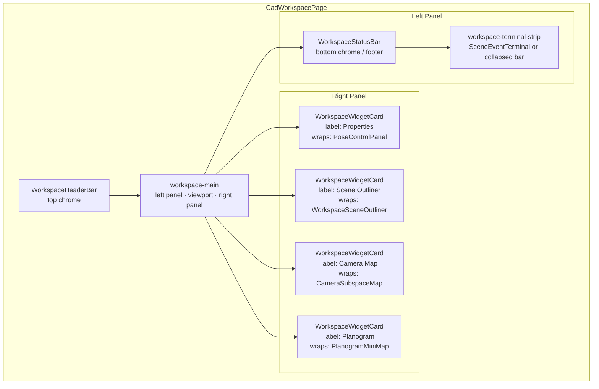
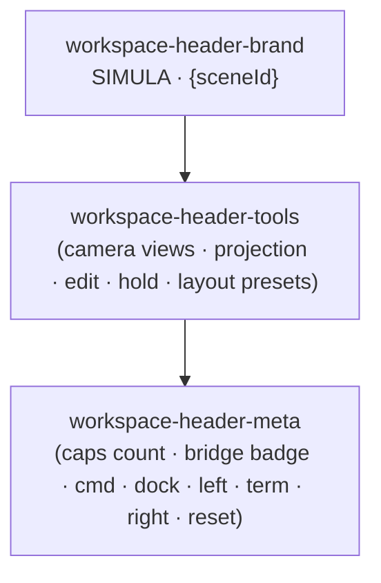
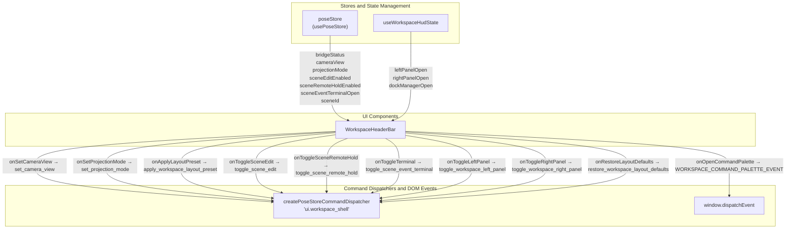
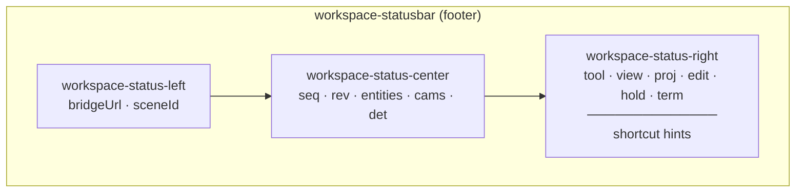
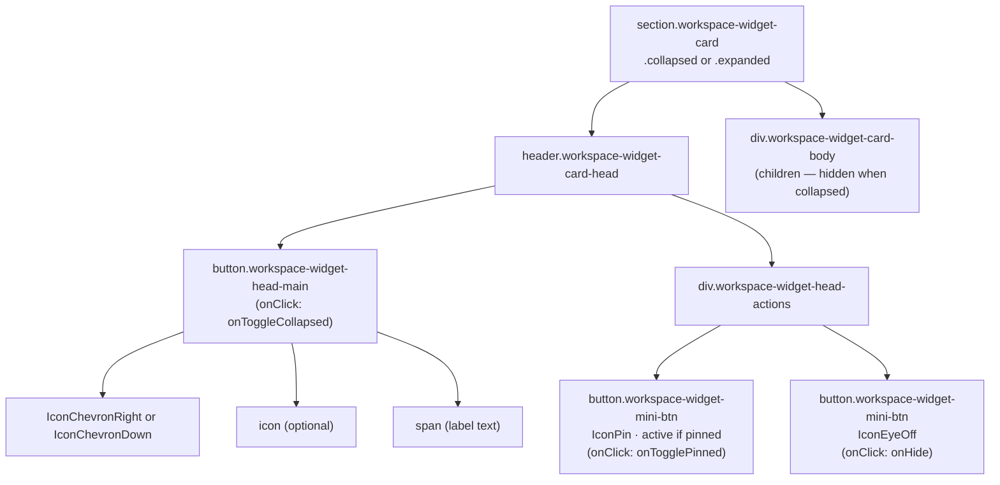
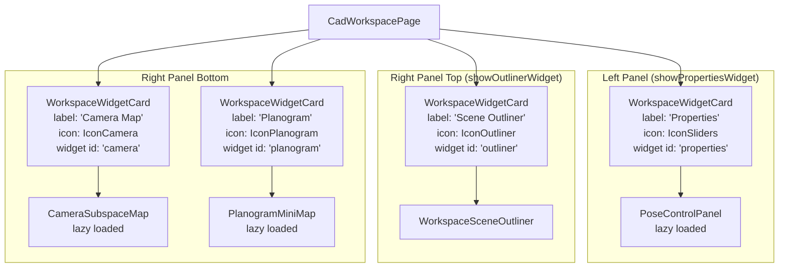
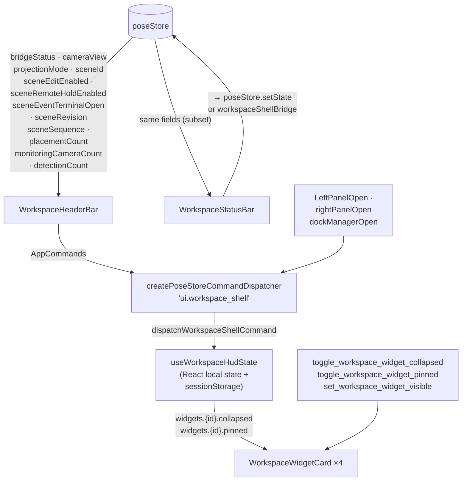

# Header Bar, Status Bar & Widget Cards

Relevant source files

- 
- 
- 
- 
- 
- 
- 
- 

This page documents three presentational shell components that frame the main workspace: `WorkspaceHeaderBar`, `WorkspaceStatusBar`, and `WorkspaceWidgetCard`. Together they form the top chrome, bottom chrome, and the reusable panel wrapper used by all side-panel widgets.

For the overall workspace layout and panel grid, see page [6.1](https://deepwiki.com/e7canasta/puppet-studio/6.1-cad-workspace-page). For the HUD state model that drives these components, see page [6.2](https://deepwiki.com/e7canasta/puppet-studio/6.2-hud-layout-and-state-management).

---

## Overview: Position in the Workspace Shell

**Diagram: Shell Component Layout**

Sources: [src/features/workspace/ui/pages/CadWorkspacePage.tsx458-835](https://github.com/e7canasta/puppet-studio/blob/cdd483bd/src/features/workspace/ui/pages/CadWorkspacePage.tsx#L458-L835)

---

## WorkspaceHeaderBar

`WorkspaceHeaderBar` is a pure presentational component rendered as the `<header>` element at the top of the workspace. It receives all interactive state as props and fires callbacks; it holds no local state.

### Props

|Prop|Type|Purpose|
|---|---|---|
|`activeCapabilities`|`number`|Count of currently enabled engine capabilities, displayed in the meta area|
|`bridgeStatus`|`'connected' \| 'connecting' \| 'disconnected'`|Drives the bridge status badge CSS class|
|`cameraView`|`'iso' \| 'top' \| 'front' \| 'back' \| 'left' \| 'right' \| 'sensor'`|Active camera view, marks the correct chip as active|
|`projectionMode`|`'orthographic' \| 'perspective'`|Active projection, marks the correct button as active|
|`sceneEditEnabled`|`boolean`|Controls the Edit ON/OFF chip state|
|`sceneRemoteHoldEnabled`|`boolean`|Controls the Hold ON/OFF chip state|
|`sceneEventTerminalOpen`|`boolean`|Active state for the Terminal toggle button|
|`leftPanelOpen`|`boolean`|Active state for the Left panel toggle button|
|`rightPanelOpen`|`boolean`|Active state for the Right panel toggle button|
|`dockManagerOpen`|`boolean`|Active state for the Dock button|
|`sceneId`|`string`|Displayed in the brand area next to the wordmark|
|`onSetCameraView`|`(view) => void`|Called by camera chip buttons|
|`onSetProjectionMode`|`(mode) => void`|Called by projection buttons|
|`onApplyLayoutPreset`|`(preset: WorkspaceLayoutPreset) => void`|Called by Focus / Author / Observe buttons|
|`onToggleSceneEdit`|`() => void`|Called by Edit chip|
|`onToggleSceneRemoteHold`|`() => void`|Called by Hold chip|
|`onToggleTerminal`|`() => void`|Called by Term icon button|
|`onToggleLeftPanel`|`() => void`|Called by Left icon button|
|`onToggleRightPanel`|`() => void`|Called by Right icon button|
|`onToggleDockManager`|`() => void`|Called by Dock icon button|
|`onOpenCommandPalette`|`() => void`|Called by Cmd icon button|
|`onRestoreLayoutDefaults`|`() => void`|Called by Reset icon button|

Sources: [src/features/workspace/ui/components/WorkspaceHeaderBar.tsx17-40](https://github.com/e7canasta/puppet-studio/blob/cdd483bd/src/features/workspace/ui/components/WorkspaceHeaderBar.tsx#L17-L40)

### Internal Layout

The header is divided into three `
` regions:

Sources: [src/features/workspace/ui/components/WorkspaceHeaderBar.tsx72-208](https://github.com/e7canasta/puppet-studio/blob/cdd483bd/src/features/workspace/ui/components/WorkspaceHeaderBar.tsx#L72-L208)

#### `workspace-header-brand`

Displays the static wordmark `SIMULA` and the current `sceneId` string, separated by a divider.

#### `workspace-header-tools`

Contains three logical control groups:

1. **Camera view chip group** (`workspace-chip-group`): buttons for `iso`, `front`, `right`, `top`, `sensor`. Each uses a `workspace-chip active` class when its view is the current `cameraView`. Calls `onSetCameraView`.
    
2. **Projection mode group** (labelled `aria-label="Projection mode"`): `Ortho` and `Persp` buttons. Calls `onSetProjectionMode`.
    
3. **Scene state toggles**: Edit chip (`Edit ON/OFF`), Hold chip (`Hold ON/OFF`).
    
4. **Layout preset group**: `Focus`, `Author`, `Observe` buttons. Each calls `onApplyLayoutPreset` with the corresponding `WorkspaceLayoutPreset` value.
    

#### `workspace-header-meta`

Contains the status and navigation icons, from left to right:

|Control|CSS / Icon|Action|
|---|---|---|
|Active caps count|`workspace-cap-count`|Read-only display of `activeCapabilities`|
|Bridge status badge|`workspace-bridge-status connected\|connecting\|disconnected`|Read-only; CSS class from `bridgeStatusClassName()`|
|Cmd button|`IconCommand`|`onOpenCommandPalette`|
|Dock button|`IconDock`|`onToggleDockManager`|
|Left button|`IconPanelLeft`|`onToggleLeftPanel`|
|Term button|`IconTerminal`|`onToggleTerminal`|
|Right button|`IconPanelRight`|`onToggleRightPanel`|
|Reset button|_(text only)_|`onRestoreLayoutDefaults`|

The `bridgeStatusClassName` helper [src/features/workspace/ui/components/WorkspaceHeaderBar.tsx42-46](https://github.com/e7canasta/puppet-studio/blob/cdd483bd/src/features/workspace/ui/components/WorkspaceHeaderBar.tsx#L42-L46) maps the `bridgeStatus` string to one of three CSS class suffixes: `connected`, `connecting`, or `disconnected`.

Sources: [src/features/workspace/ui/components/WorkspaceHeaderBar.tsx166-207](https://github.com/e7canasta/puppet-studio/blob/cdd483bd/src/features/workspace/ui/components/WorkspaceHeaderBar.tsx#L166-L207)

### How CadWorkspacePage Wires the Header

`CadWorkspacePage` reads state directly from `usePoseStore` and `useWorkspaceHudState`, then passes callbacks that dispatch commands via `createPoseStoreCommandDispatcher('ui.workspace_shell')`.

**Diagram: WorkspaceHeaderBar Data Flow**

Sources: [src/features/workspace/ui/pages/CadWorkspacePage.tsx460-483](https://github.com/e7canasta/puppet-studio/blob/cdd483bd/src/features/workspace/ui/pages/CadWorkspacePage.tsx#L460-L483)

---

## WorkspaceStatusBar

`WorkspaceStatusBar` is the `<footer>` element rendered at the bottom of the workspace. It is purely read-only — it has no interactive controls — and displays a dense summary of current scene state plus keyboard shortcut reminders.

### Props

|Prop|Type|Displayed as|
|---|---|---|
|`bridgeUrl`|`string`|Left section, before the scene ID|
|`sceneId`|`string`|Left section, after the bridge URL|
|`sceneSequence`|`number \| null`|Center: `seq:{value}`|
|`sceneRevision`|`number \| null`|Center: `rev:{value}`|
|`placementCount`|`number`|Center: `entities:{value}`|
|`monitoringCameraCount`|`number`|Center: `cams:{value}`|
|`detectionCount`|`number`|Center: `det:{value}`|
|`activeToolMode`|`'move' \| 'rotate' \| 'select'`|Right: `tool:{value}`|
|`cameraView`|_(view union)_|Right: `view:{formatted}` via `formatCameraView()`|
|`projectionMode`|`'orthographic' \| 'perspective'`|Right: `proj:ortho` or `proj:persp`|
|`sceneEditEnabled`|`boolean`|Right: `edit:on` or `edit:off`|
|`sceneRemoteHoldEnabled`|`boolean`|Right: `hold:on` or `hold:off`|
|`sceneEventTerminalOpen`|`boolean`|Right: `term:on` or `term:off`|

Sources: [src/features/workspace/ui/components/WorkspaceStatusBar.tsx3-17](https://github.com/e7canasta/puppet-studio/blob/cdd483bd/src/features/workspace/ui/components/WorkspaceStatusBar.tsx#L3-L17)

### Layout

The footer has three `
` sub-regions:

Sources: [src/features/workspace/ui/components/WorkspaceStatusBar.tsx41-70](https://github.com/e7canasta/puppet-studio/blob/cdd483bd/src/features/workspace/ui/components/WorkspaceStatusBar.tsx#L41-L70)

### Shortcut Hints

The right section appends keyboard shortcut strings sourced from the `STUDIO_SHORTCUTS` constant. These are read-only labels; they do not register any event listeners.

|Label|Shortcut source|
|---|---|
|`tool:…`|`STUDIO_SHORTCUTS.scene.toolSelect` / `toolMove` / `toolRotate`|
|`snap:…`|`STUDIO_SHORTCUTS.scene.snap`|
|`dims:…`|`STUDIO_SHORTCUTS.scene.measure`|
|_(workspace palette)_|`STUDIO_SHORTCUTS.workspace.palette`|
|_(terminal palette)_|`STUDIO_SHORTCUTS.terminal.palette`|
|_(terminal toggle)_|`STUDIO_SHORTCUTS.terminal.toggle`|

Sources: [src/features/workspace/ui/components/WorkspaceStatusBar.tsx62-68](https://github.com/e7canasta/puppet-studio/blob/cdd483bd/src/features/workspace/ui/components/WorkspaceStatusBar.tsx#L62-L68)

The `formatCameraView` helper [src/features/workspace/ui/components/WorkspaceStatusBar.tsx19-23](https://github.com/e7canasta/puppet-studio/blob/cdd483bd/src/features/workspace/ui/components/WorkspaceStatusBar.tsx#L19-L23) maps `'iso'` → `'iso_view'` and `'sensor'` → `'cam'`, passing other views through unchanged.

---

## WorkspaceWidgetCard

`WorkspaceWidgetCard` is a generic panel wrapper that provides a consistent header with collapse, pin, and hide controls. It is used for all four workspace widgets: Properties, Scene Outliner, Camera Map, and Planogram.

### Props

|Prop|Type|Purpose|
|---|---|---|
|`label`|`string`|Displayed in the card header|
|`icon`|`ReactNode`|Optional icon shown beside the label|
|`collapsed`|`boolean`|When `true`, the card body is hidden and the chevron points right|
|`pinned`|`boolean`|Drives the active state of the pin button|
|`onToggleCollapsed`|`() => void`|Called when the header row is clicked|
|`onTogglePinned`|`() => void`|Called when the pin button is clicked|
|`onHide`|`() => void`|Called when the hide button is clicked|
|`children`|`ReactNode`|The widget content, rendered inside `workspace-widget-card-body`|

Sources: [src/features/workspace/ui/components/WorkspaceWidgetCard.tsx5-14](https://github.com/e7canasta/puppet-studio/blob/cdd483bd/src/features/workspace/ui/components/WorkspaceWidgetCard.tsx#L5-L14)

### Rendered Structure

Sources: [src/features/workspace/ui/components/WorkspaceWidgetCard.tsx16-51](https://github.com/e7canasta/puppet-studio/blob/cdd483bd/src/features/workspace/ui/components/WorkspaceWidgetCard.tsx#L16-L51)

### Collapse vs. Hide vs. Unpin

These are three distinct, independent states tracked in `WorkspaceWidgetHud` (page [6.2](https://deepwiki.com/e7canasta/puppet-studio/6.2-hud-layout-and-state-management)):

|Action|`WorkspaceWidgetHud` field modified|Visual effect|
|---|---|---|
|Toggle collapsed|`collapsed`|Card body shown or hidden; chevron direction changes|
|Toggle pinned|`pinned`|Pin button gets active CSS class; used by dock manager|
|Hide|`visible`|The entire `WorkspaceWidgetCard` is unmounted by `CadWorkspacePage`|

When `collapsed` is `true`, the `workspace-widget-card-body` div is not rendered at all — not just hidden by CSS [src/features/workspace/ui/components/WorkspaceWidgetCard.tsx48](https://github.com/e7canasta/puppet-studio/blob/cdd483bd/src/features/workspace/ui/components/WorkspaceWidgetCard.tsx#L48-L48)

### Widget Instances in CadWorkspacePage

**Diagram: WorkspaceWidgetCard Instances and Their Content**

Sources: [src/features/workspace/ui/pages/CadWorkspacePage.tsx495-793](https://github.com/e7canasta/puppet-studio/blob/cdd483bd/src/features/workspace/ui/pages/CadWorkspacePage.tsx#L495-L793)

The visibility of each card is controlled by booleans derived from `useWorkspaceHudState`: `showPropertiesWidget`, `showOutlinerWidget`, `showCameraWidget`, and `showPlanWidget`. When a widget is not visible, `CadWorkspacePage` simply doesn't render its `WorkspaceWidgetCard` at all.

Callbacks passed to each card call `toggleWidgetCollapsedFromWorkspace` or `toggleWidgetPinnedFromWorkspace`, both of which dispatch `toggle_workspace_widget_collapsed` or `toggle_workspace_widget_pinned` commands via `createPoseStoreCommandDispatcher` [src/features/workspace/ui/pages/CadWorkspacePage.tsx126-145](https://github.com/e7canasta/puppet-studio/blob/cdd483bd/src/features/workspace/ui/pages/CadWorkspacePage.tsx#L126-L145)

---

## Data Flow Summary

**Diagram: Component–State–Command Relationships**

Sources: [src/features/workspace/ui/pages/CadWorkspacePage.tsx72-113](https://github.com/e7canasta/puppet-studio/blob/cdd483bd/src/features/workspace/ui/pages/CadWorkspacePage.tsx#L72-L113) [src/features/workspace/ui/components/WorkspaceHeaderBar.tsx17-209](https://github.com/e7canasta/puppet-studio/blob/cdd483bd/src/features/workspace/ui/components/WorkspaceHeaderBar.tsx#L17-L209) [src/features/workspace/ui/components/WorkspaceStatusBar.tsx1-71](https://github.com/e7canasta/puppet-studio/blob/cdd483bd/src/features/workspace/ui/components/WorkspaceStatusBar.tsx#L1-L71) [src/features/workspace/ui/components/WorkspaceWidgetCard.tsx1-51](https://github.com/e7canasta/puppet-studio/blob/cdd483bd/src/features/workspace/ui/components/WorkspaceWidgetCard.tsx#L1-L51) [src/core/workspace-shell/workspaceShellBridge.ts1-58](https://github.com/e7canasta/puppet-studio/blob/cdd483bd/src/core/workspace-shell/workspaceShellBridge.ts#L1-L58)

### On this page

- [Header Bar, Status Bar & Widget Cards](https://deepwiki.com/e7canasta/puppet-studio/6.3-header-bar-status-bar-and-widget-cards#header-bar-status-bar-widget-cards)
- [Overview: Position in the Workspace Shell](https://deepwiki.com/e7canasta/puppet-studio/6.3-header-bar-status-bar-and-widget-cards#overview-position-in-the-workspace-shell)
- [WorkspaceHeaderBar](https://deepwiki.com/e7canasta/puppet-studio/6.3-header-bar-status-bar-and-widget-cards#workspaceheaderbar)
- [Props](https://deepwiki.com/e7canasta/puppet-studio/6.3-header-bar-status-bar-and-widget-cards#props)
- [Internal Layout](https://deepwiki.com/e7canasta/puppet-studio/6.3-header-bar-status-bar-and-widget-cards#internal-layout)
- [`workspace-header-brand`](https://deepwiki.com/e7canasta/puppet-studio/6.3-header-bar-status-bar-and-widget-cards#workspace-header-brand)
- [`workspace-header-tools`](https://deepwiki.com/e7canasta/puppet-studio/6.3-header-bar-status-bar-and-widget-cards#workspace-header-tools)
- [`workspace-header-meta`](https://deepwiki.com/e7canasta/puppet-studio/6.3-header-bar-status-bar-and-widget-cards#workspace-header-meta)
- [How CadWorkspacePage Wires the Header](https://deepwiki.com/e7canasta/puppet-studio/6.3-header-bar-status-bar-and-widget-cards#how-cadworkspacepage-wires-the-header)
- [WorkspaceStatusBar](https://deepwiki.com/e7canasta/puppet-studio/6.3-header-bar-status-bar-and-widget-cards#workspacestatusbar)
- [Props](https://deepwiki.com/e7canasta/puppet-studio/6.3-header-bar-status-bar-and-widget-cards#props-1)
- [Layout](https://deepwiki.com/e7canasta/puppet-studio/6.3-header-bar-status-bar-and-widget-cards#layout)
- [Shortcut Hints](https://deepwiki.com/e7canasta/puppet-studio/6.3-header-bar-status-bar-and-widget-cards#shortcut-hints)
- [WorkspaceWidgetCard](https://deepwiki.com/e7canasta/puppet-studio/6.3-header-bar-status-bar-and-widget-cards#workspacewidgetcard)
- [Props](https://deepwiki.com/e7canasta/puppet-studio/6.3-header-bar-status-bar-and-widget-cards#props-2)
- [Rendered Structure](https://deepwiki.com/e7canasta/puppet-studio/6.3-header-bar-status-bar-and-widget-cards#rendered-structure)
- [Collapse vs. Hide vs. Unpin](https://deepwiki.com/e7canasta/puppet-studio/6.3-header-bar-status-bar-and-widget-cards#collapse-vs-hide-vs-unpin)
- [Widget Instances in CadWorkspacePage](https://deepwiki.com/e7canasta/puppet-studio/6.3-header-bar-status-bar-and-widget-cards#widget-instances-in-cadworkspacepage)
- [Data Flow Summary](https://deepwiki.com/e7canasta/puppet-studio/6.3-header-bar-status-bar-and-widget-cards#data-flow-summary)

