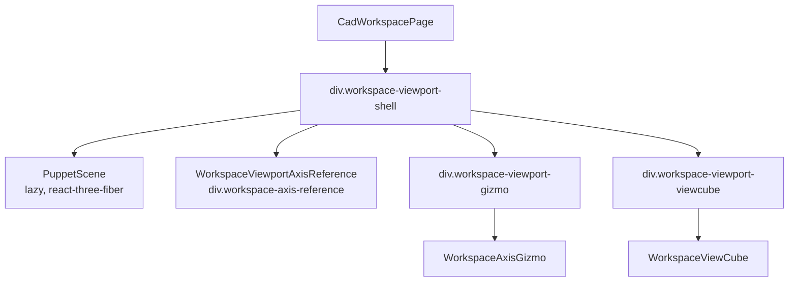
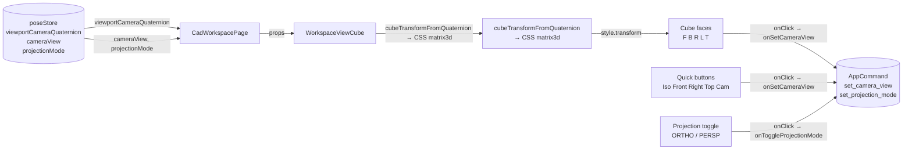
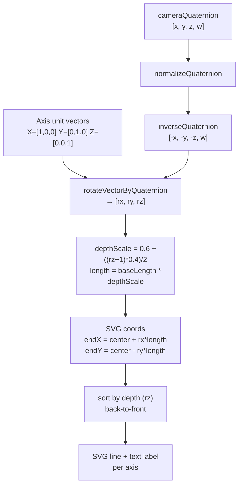
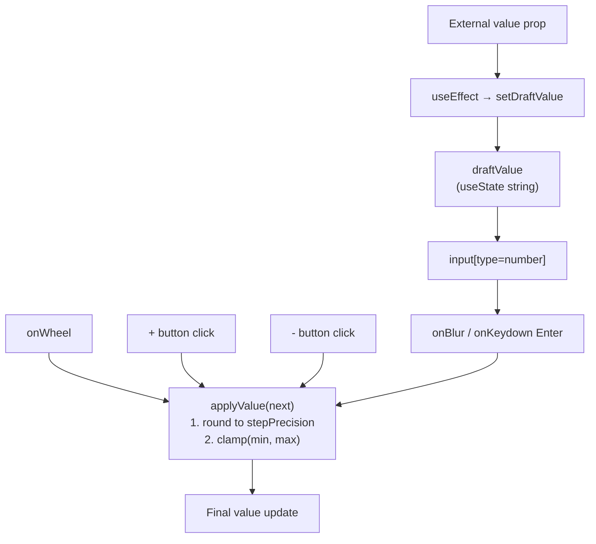

# Viewport Controls

Relevant source files

- [](https://github.com/e7canasta/puppet-studio/blob/cdd483bd/src/core/workspace-shell/workspaceShellBridge.ts)
- [](https://github.com/e7canasta/puppet-studio/blob/cdd483bd/src/features/pose/ui/AxisSlider.tsx)
- [](https://github.com/e7canasta/puppet-studio/blob/cdd483bd/src/features/terminal/model/terminalCommandLine.ts)
- [](https://github.com/e7canasta/puppet-studio/blob/cdd483bd/src/features/workspace/hooks/useWorkspaceHudState.ts)
- [](https://github.com/e7canasta/puppet-studio/blob/cdd483bd/src/features/workspace/model/workspaceHudModel.ts)
- [](https://github.com/e7canasta/puppet-studio/blob/cdd483bd/src/features/workspace/ui/components/WorkspaceAxisGizmo.tsx)
- [](https://github.com/e7canasta/puppet-studio/blob/cdd483bd/src/features/workspace/ui/components/WorkspaceViewCube.tsx)
- [](https://github.com/e7canasta/puppet-studio/blob/cdd483bd/src/features/workspace/ui/components/WorkspaceViewportAxisReference.tsx)
- [](https://github.com/e7canasta/puppet-studio/blob/cdd483bd/src/features/workspace/ui/pages/CadWorkspacePage.tsx)

This page documents the viewport control components that overlay the 3D scene canvas: `WorkspaceViewCube`, `WorkspaceAxisGizmo`, `WorkspaceViewportAxisReference`, and the `AxisSlider` input widget. These components are purely presentational overlays — they read `viewportCameraQuaternion`, `cameraView`, and `projectionMode` from `poseStore` and dispatch `AppCommand`s via `CadWorkspacePage`.

For the 3D rendering engine that produces the viewport itself, see [7 — 3D Scene Rendering](https://deepwiki.com/e7canasta/puppet-studio/7-3d-scene-rendering). For how `cameraView` and `projectionMode` are stored, see [3 — State Management](https://deepwiki.com/e7canasta/puppet-studio/3-state-management). For the pose control panel that uses `AxisSlider`, see [10 — Pose Controls](https://deepwiki.com/e7canasta/puppet-studio/10-pose-controls).

---

## Placement in the Workspace

All four components are mounted inside the viewport shell section of `CadWorkspacePage`. They are CSS-positioned overlays layered on top of the `PuppetScene` canvas.




**Diagram: Viewport overlay component tree**

Sources: [src/features/workspace/ui/pages/CadWorkspacePage.tsx660-704](https://github.com/e7canasta/puppet-studio/blob/cdd483bd/src/features/workspace/ui/pages/CadWorkspacePage.tsx#L660-L704)

---

## WorkspaceViewCube

**File:** [src/features/workspace/ui/components/WorkspaceViewCube.tsx](https://github.com/e7canasta/puppet-studio/blob/cdd483bd/src/features/workspace/ui/components/WorkspaceViewCube.tsx)

`WorkspaceViewCube` is a CSS 3D cube widget that rotates to track the current viewport camera orientation, and provides clickable faces and quick-select buttons to set the camera view.

### Props

|Prop|Type|Description|
|---|---|---|
|`cameraView`|`'iso' \| 'top' \| 'front' \| 'back' \| 'left' \| 'right' \| 'sensor'`|Currently active camera view preset|
|`cameraQuaternion`|`[number, number, number, number]`|Live quaternion of the viewport camera|
|`onSetCameraView`|`(view) => void`|Called when the user clicks a face or quick button|
|`onToggleProjectionMode`|`() => void`|Called when the user clicks the projection toggle|
|`projectionMode`|`'orthographic' \| 'perspective'`|Currently active projection|

### cubeTransformFromQuaternion

[src/features/workspace/ui/components/WorkspaceViewCube.tsx17-45](https://github.com/e7canasta/puppet-studio/blob/cdd483bd/src/features/workspace/ui/components/WorkspaceViewCube.tsx#L17-L45)

Converts the live camera quaternion into a CSS `matrix3d(...)` string that rotates a `<div>` to match the viewport camera's orientation. The algorithm:

1. Normalizes the quaternion via `normalizeQuaternion`.
2. Inverts it by negating `x`, `y`, `z` (keeping `w` positive), so the cube rotates _opposite_ to the camera — i.e., when the camera orbits right, the cube rotates left to track it.
3. Expands the resulting quaternion into a 3×3 rotation matrix (`r00`–`r22`).
4. Packs this into a CSS `matrix3d` in column-major order.

The cube size is fixed at `VIEW_CUBE_SIZE_PX = 44` pixels. Each face is positioned with a `translateZ(half)` plus an axis rotation:

|Face label|CSS transform|
|---|---|
|F (Front)|`translateZ(${half}px)`|
|B (Back)|`rotateY(180deg) translateZ(${half}px)`|
|R (Right)|`rotateY(90deg) translateZ(${half}px)`|
|L (Left)|`rotateY(-90deg) translateZ(${half}px)`|
|T (Top)|`rotateX(90deg) translateZ(${half}px)`|
|Bt (Bottom)|`rotateX(-90deg) translateZ(${half}px)` — not clickable|

The `sensor` camera view activates the same face highlight as `front` (`frontFaceActive = cameraView === 'front' || cameraView === 'sensor'`).

### Quick-select buttons and projection toggle

Below the cube, five text buttons allow direct view selection without interacting with the 3D cube faces: **Iso View**, **Front**, **Right**, **Top**, **Cam**. A separate button at the bottom toggles between `ORTHO` and `PERSP` labels.

**Diagram: WorkspaceViewCube data flow**


Sources: [src/features/workspace/ui/components/WorkspaceViewCube.tsx1-151](https://github.com/e7canasta/puppet-studio/blob/cdd483bd/src/features/workspace/ui/components/WorkspaceViewCube.tsx#L1-L151) [src/features/workspace/ui/pages/CadWorkspacePage.tsx687-703](https://github.com/e7canasta/puppet-studio/blob/cdd483bd/src/features/workspace/ui/pages/CadWorkspacePage.tsx#L687-L703)

---

## WorkspaceAxisGizmo

**File:** [src/features/workspace/ui/components/WorkspaceAxisGizmo.tsx](https://github.com/e7canasta/puppet-studio/blob/cdd483bd/src/features/workspace/ui/components/WorkspaceAxisGizmo.tsx)

`WorkspaceAxisGizmo` renders a 48×48 SVG showing three colored axis lines (X, Y, Z) that rotate to reflect the current viewport camera orientation. It is purely display-only — no click interactions.

### Props

|Prop|Type|Description|
|---|---|---|
|`cameraQuaternion`|`[number, number, number, number]`|Live quaternion of the viewport camera|

### Rendering pipeline

[src/features/workspace/ui/components/WorkspaceAxisGizmo.tsx38-96](https://github.com/e7canasta/puppet-studio/blob/cdd483bd/src/features/workspace/ui/components/WorkspaceAxisGizmo.tsx#L38-L96)

1. **Invert** the quaternion with `inverseQuaternion` (negate `x`, `y`, `z`; keep `w`). This gives the quaternion representing the "view space" transform — axes should appear as the camera sees them.
2. For each of the three world-space unit vectors `[1,0,0]`, `[0,1,0]`, `[0,0,1]`, call `rotateVectorByQuaternion` to project them into camera space.
3. Compute a **depth scale** from the z-component of the rotated vector:
    
    ```
    depthScale = 0.6 + ((rz + 1) * 0.4) / 2
    length = baseLength * depthScale
    ```
    
    This makes axes pointing toward the viewer appear longer (pseudo-3D).
4. Compute `endX` and `endY` in SVG coordinates (`endY` uses `-ry` to flip Y since SVG +Y is down).
5. **Sort axes back-to-front** by `depth` (`rz`) so that closer axes are drawn on top.
6. Render each axis as a `<line>` plus a `<text>` label. A small circle marks the origin.

### Axis colors

Colors are CSS custom properties, allowing theming:

|Axis|CSS variable|Default|
|---|---|---|
|X|`--axis-x`|`#e85a6a` (red)|
|Y|`--axis-y`|`#63c87a` (green)|
|Z|`--axis-z`|`#58a3ef` (blue)|

**Diagram: WorkspaceAxisGizmo math pipeline**




Sources: [src/features/workspace/ui/components/WorkspaceAxisGizmo.tsx1-96](https://github.com/e7canasta/puppet-studio/blob/cdd483bd/src/features/workspace/ui/components/WorkspaceAxisGizmo.tsx#L1-L96) [src/features/workspace/ui/pages/CadWorkspacePage.tsx687-689](https://github.com/e7canasta/puppet-studio/blob/cdd483bd/src/features/workspace/ui/pages/CadWorkspacePage.tsx#L687-L689)

---

## WorkspaceViewportAxisReference

**File:** [src/features/workspace/ui/components/WorkspaceViewportAxisReference.tsx](https://github.com/e7canasta/puppet-studio/blob/cdd483bd/src/features/workspace/ui/components/WorkspaceViewportAxisReference.tsx)

`WorkspaceViewportAxisReference` is a static, purely CSS component. It renders three axis lines and a center dot as positional reference guides inside the viewport. It has no props, no logic, and is marked `aria-hidden`.

[src/features/workspace/ui/components/WorkspaceViewportAxisReference.tsx1-10](https://github.com/e7canasta/puppet-studio/blob/cdd483bd/src/features/workspace/ui/components/WorkspaceViewportAxisReference.tsx#L1-L10)

```
div.workspace-axis-reference (aria-hidden)
  ├── div.workspace-axis-reference-line.axis-x
  ├── div.workspace-axis-reference-line.axis-y
  ├── div.workspace-axis-reference-line.axis-z
  └── div.workspace-axis-reference-dot
```

The appearance (position, length, color, crosshair style) is fully determined by CSS classes. The component is mounted directly inside the viewport shell, rendering beneath the `WorkspaceAxisGizmo` and `WorkspaceViewCube` overlays.

Sources: [src/features/workspace/ui/components/WorkspaceViewportAxisReference.tsx1-10](https://github.com/e7canasta/puppet-studio/blob/cdd483bd/src/features/workspace/ui/components/WorkspaceViewportAxisReference.tsx#L1-L10) [src/features/workspace/ui/pages/CadWorkspacePage.tsx664](https://github.com/e7canasta/puppet-studio/blob/cdd483bd/src/features/workspace/ui/pages/CadWorkspacePage.tsx#L664-L664)

---

## AxisSlider

**File:** [src/features/pose/ui/AxisSlider.tsx](https://github.com/e7canasta/puppet-studio/blob/cdd483bd/src/features/pose/ui/AxisSlider.tsx)

`AxisSlider` is a reusable numeric input control styled per axis (X, Y, Z). It is used in the pose control panel (see [10 — Pose Controls](https://deepwiki.com/e7canasta/puppet-studio/10-pose-controls)) and supports keyboard, mouse-wheel, and button-click interaction patterns.

### Props

|Prop|Type|Default|Description|
|---|---|---|---|
|`axis`|`AxisKey`|—|`'x'`, `'y'`, or `'z'`; drives CSS class|
|`min`|`number`|—|Minimum allowed value|
|`max`|`number`|—|Maximum allowed value|
|`onChange`|`(value: number) => void`|—|Called with the clamped, rounded value|
|`step`|`number`|`1`|Increment/decrement step|
|`unit`|`string`|`'deg'`|Display label shown after the input|
|`value`|`number`|—|Controlled value|

### Internal state

`AxisSlider` maintains a `draftValue` string in local state. This allows the user to type freely in the `<input>` without triggering `onChange` on every keystroke. The draft is committed on `blur` or `Enter`, and is reset to the controlled `value` when `value` changes externally.

### Input methods

|Interaction|Behavior|
|---|---|
|Click `−` button|`applyValue(value - step)`|
|Click `+` button|`applyValue(value + step)`|
|Type in input + blur|Parse draft, call `applyValue`|
|Type in input + Enter|Same as blur|
|ArrowUp in input|`applyValue(value + step)`|
|ArrowDown in input|`applyValue(value - step)`|
|Scroll wheel|`applyValue(value ± step)` depending on `deltaY`|

All paths run through the internal `applyValue` helper which rounds to the step's decimal precision via `stepPrecision(step)`, then clamps to `[min, max]` before calling `onChange`.

**Diagram: AxisSlider value commit flow**



Sources: [src/features/pose/ui/AxisSlider.tsx1-103](https://github.com/e7canasta/puppet-studio/blob/cdd483bd/src/features/pose/ui/AxisSlider.tsx#L1-L103)

---

## Component Summary

|Component|File|Interactive|Reads quaternion|Dispatches commands|
|---|---|---|---|---|
|`WorkspaceViewCube`|`workspace/ui/components/WorkspaceViewCube.tsx`|Yes|Yes — CSS 3D rotation|`set_camera_view`, `set_projection_mode`|
|`WorkspaceAxisGizmo`|`workspace/ui/components/WorkspaceAxisGizmo.tsx`|No|Yes — SVG projection|None|
|`WorkspaceViewportAxisReference`|`workspace/ui/components/WorkspaceViewportAxisReference.tsx`|No|No|None|
|`AxisSlider`|`pose/ui/AxisSlider.tsx`|Yes|No|Via `onChange` prop|

Sources: [src/features/workspace/ui/pages/CadWorkspacePage.tsx660-704](https://github.com/e7canasta/puppet-studio/blob/cdd483bd/src/features/workspace/ui/pages/CadWorkspacePage.tsx#L660-L704) [src/features/workspace/ui/components/WorkspaceViewCube.tsx1-151](https://github.com/e7canasta/puppet-studio/blob/cdd483bd/src/features/workspace/ui/components/WorkspaceViewCube.tsx#L1-L151) [src/features/workspace/ui/components/WorkspaceAxisGizmo.tsx1-96](https://github.com/e7canasta/puppet-studio/blob/cdd483bd/src/features/workspace/ui/components/WorkspaceAxisGizmo.tsx#L1-L96) [src/features/workspace/ui/components/WorkspaceViewportAxisReference.tsx1-10](https://github.com/e7canasta/puppet-studio/blob/cdd483bd/src/features/workspace/ui/components/WorkspaceViewportAxisReference.tsx#L1-L10) [src/features/pose/ui/AxisSlider.tsx1-103](https://github.com/e7canasta/puppet-studio/blob/cdd483bd/src/features/pose/ui/AxisSlider.tsx#L1-L103)
### On this page

- [Viewport Controls](https://deepwiki.com/e7canasta/puppet-studio/6.4-viewport-controls#viewport-controls)
- [Placement in the Workspace](https://deepwiki.com/e7canasta/puppet-studio/6.4-viewport-controls#placement-in-the-workspace)
- [WorkspaceViewCube](https://deepwiki.com/e7canasta/puppet-studio/6.4-viewport-controls#workspaceviewcube)
- [Props](https://deepwiki.com/e7canasta/puppet-studio/6.4-viewport-controls#props)
- [cubeTransformFromQuaternion](https://deepwiki.com/e7canasta/puppet-studio/6.4-viewport-controls#cubetransformfromquaternion)
- [Quick-select buttons and projection toggle](https://deepwiki.com/e7canasta/puppet-studio/6.4-viewport-controls#quick-select-buttons-and-projection-toggle)
- [WorkspaceAxisGizmo](https://deepwiki.com/e7canasta/puppet-studio/6.4-viewport-controls#workspaceaxisgizmo)
- [Props](https://deepwiki.com/e7canasta/puppet-studio/6.4-viewport-controls#props-1)
- [Rendering pipeline](https://deepwiki.com/e7canasta/puppet-studio/6.4-viewport-controls#rendering-pipeline)
- [Axis colors](https://deepwiki.com/e7canasta/puppet-studio/6.4-viewport-controls#axis-colors)
- [WorkspaceViewportAxisReference](https://deepwiki.com/e7canasta/puppet-studio/6.4-viewport-controls#workspaceviewportaxisreference)
- [AxisSlider](https://deepwiki.com/e7canasta/puppet-studio/6.4-viewport-controls#axisslider)
- [Props](https://deepwiki.com/e7canasta/puppet-studio/6.4-viewport-controls#props-2)
- [Internal state](https://deepwiki.com/e7canasta/puppet-studio/6.4-viewport-controls#internal-state)
- [Input methods](https://deepwiki.com/e7canasta/puppet-studio/6.4-viewport-controls#input-methods)
- [Component Summary](https://deepwiki.com/e7canasta/puppet-studio/6.4-viewport-controls#component-summary)

