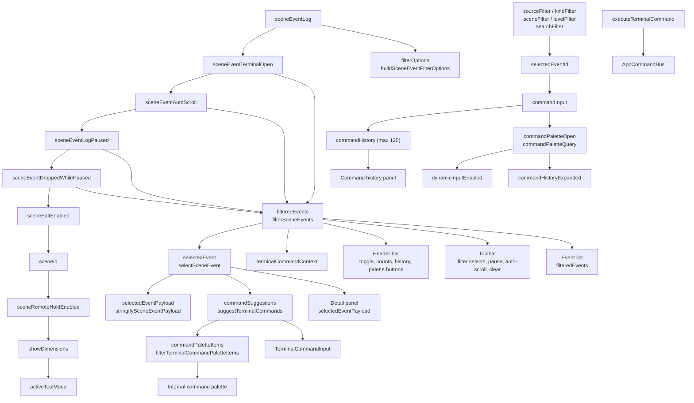
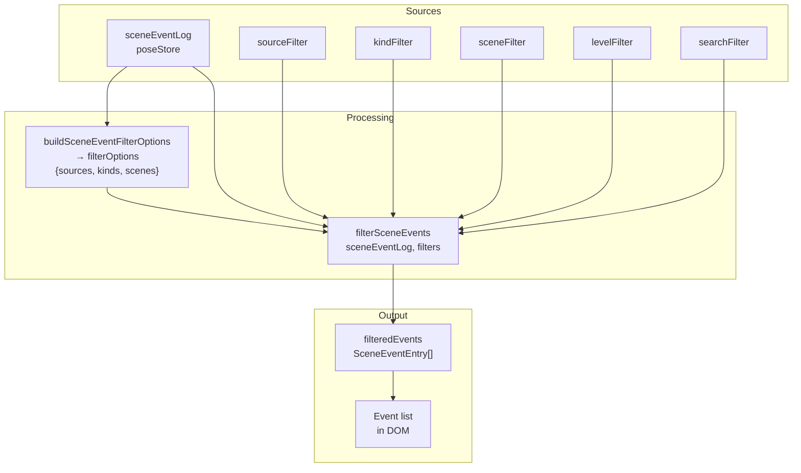
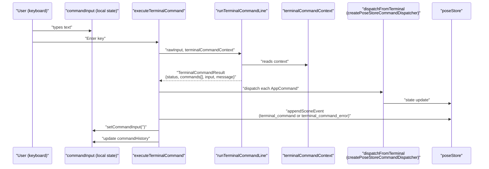
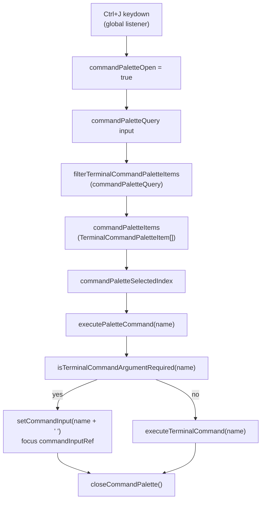

# Scene Event Terminal

Relevant source files

- [](https://github.com/e7canasta/puppet-studio/blob/cdd483bd/src/features/terminal/hooks/useSceneEventTerminalState.ts)
- [](https://github.com/e7canasta/puppet-studio/blob/cdd483bd/src/features/terminal/index.ts)
- [](https://github.com/e7canasta/puppet-studio/blob/cdd483bd/src/features/terminal/ui/SceneEventTerminal.tsx)
- [](https://github.com/e7canasta/puppet-studio/blob/cdd483bd/src/features/workspace/ui/components/WorkspaceCommandPalette.tsx)

This page covers the `SceneEventTerminal` React component and its companion hook `useSceneEventTerminalState`. Together they implement the in-workspace event log viewer, command input line, command history panel, and terminal-internal command palette.

For documentation on how raw text input is parsed and turned into `AppCommand`s, see the Terminal Command Processing page ([6.6](https://deepwiki.com/e7canasta/puppet-studio/6.6-terminal-command-processing)). For the workspace-level command palette (opened with `Ctrl+K`), see [6.7](https://deepwiki.com/e7canasta/puppet-studio/6.7-workspace-command-palette). For the `SceneEventEntry` data model and how events are produced throughout the system, see [11](https://deepwiki.com/e7canasta/puppet-studio/11-observability-and-event-logging).

---

## Component Overview

`SceneEventTerminal` is rendered inside `CadWorkspacePage` (see [6.1](https://deepwiki.com/e7canasta/puppet-studio/6.1-cad-workspace-page)) and accepts a single prop:

|Prop|Type|Default|Purpose|
|---|---|---|---|
|`layout`|`'docked' \| 'overlay'`|`'overlay'`|CSS class applied to the root `<section>` element|

The terminal can be in a collapsed or expanded state, controlled by `sceneEventTerminalOpen` in `poseStore`. When collapsed, only the header bar is visible.

**Source:** [src/features/terminal/ui/SceneEventTerminal.tsx8-12](https://github.com/e7canasta/puppet-studio/blob/cdd483bd/src/features/terminal/ui/SceneEventTerminal.tsx#L8-L12)

---

## Architecture

**Diagram: SceneEventTerminal component and data dependencies**



Sources: [src/features/terminal/hooks/useSceneEventTerminalState.ts28-108](https://github.com/e7canasta/puppet-studio/blob/cdd483bd/src/features/terminal/hooks/useSceneEventTerminalState.ts#L28-L108) [src/features/terminal/ui/SceneEventTerminal.tsx21-301](https://github.com/e7canasta/puppet-studio/blob/cdd483bd/src/features/terminal/ui/SceneEventTerminal.tsx#L21-L301)

---

## `useSceneEventTerminalState` Hook

The hook owns all state and logic for the terminal. The `SceneEventTerminal` component is a pure rendering layer that delegates everything to this hook.

### State from `poseStore`

These are read via `usePoseStore` subscriptions:

|State field|Usage|
|---|---|
|`sceneEventLog`|Source array for filtering and display|
|`sceneEventTerminalOpen`|Controls visibility of the body|
|`sceneEventAutoScroll`|Triggers scroll-to-bottom on new events|
|`sceneEventLogPaused`|Shown in Pause/Resume button label|
|`sceneEventDroppedWhilePaused`|Shown as a "dropped" counter in the header|
|`sceneId`|Passed into `terminalCommandContext`|
|`sceneEditEnabled`|Passed into `terminalCommandContext`|
|`activeToolMode`|Passed into `terminalCommandContext`|
|`sceneRemoteHoldEnabled`|Passed into `terminalCommandContext`|
|`showDimensions`|Passed into `terminalCommandContext`|

**Source:** [src/features/terminal/hooks/useSceneEventTerminalState.ts29-38](https://github.com/e7canasta/puppet-studio/blob/cdd483bd/src/features/terminal/hooks/useSceneEventTerminalState.ts#L29-L38)

### Local State

|Field|Type|Purpose|
|---|---|---|
|`sourceFilter`|`string`|Selected source in the source dropdown|
|`kindFilter`|`string`|Selected kind in the kind dropdown|
|`sceneFilter`|`string`|Selected scene ID in the scene dropdown|
|`levelFilter`|`'all' \| SceneEventLevel`|Selected level in the level dropdown|
|`searchFilter`|`string`|Free-text search across events|
|`selectedEventId`|`string \| null`|ID of the event shown in the detail panel|
|`commandInput`|`string`|Current text in the command input|
|`commandHistory`|`CommandHistoryEntry[]`|Executed command history, capped at 120|
|`commandHistoryExpanded`|`boolean`|Whether the history panel is visible|
|`commandHistoryCursor`|`number \| null`|Index into `commandHistory` for arrow-key navigation|
|`commandPaletteOpen`|`boolean`|Whether the terminal's internal palette is open|
|`commandPaletteQuery`|`string`|Search text for the internal palette|
|`commandPaletteSelectedIndex`|`number`|Highlighted item index in the internal palette|
|`commandSuggestionCursor`|`number \| null`|Index for Tab-cycling through `commandSuggestions`|
|`dynamicInputEnabled`|`boolean`|When true, focuses the command input automatically when terminal opens|

**Source:** [src/features/terminal/hooks/useSceneEventTerminalState.ts40-57](https://github.com/e7canasta/puppet-studio/blob/cdd483bd/src/features/terminal/hooks/useSceneEventTerminalState.ts#L40-L57)

### Derived State

|Derived value|Computed by|Inputs|
|---|---|---|
|`filterOptions`|`buildSceneEventFilterOptions`|`sceneEventLog`|
|`filteredEvents`|`filterSceneEvents`|`sceneEventLog` + all filter fields|
|`selectedEvent`|`selectSceneEvent`|`filteredEvents`, `selectedEventId`|
|`selectedEventPayload`|`stringifySceneEventPayload`|`selectedEvent`|
|`commandSuggestions`|`suggestTerminalCommands`|`commandInput`|
|`commandPaletteItems`|`filterTerminalCommandPaletteItems`|`commandPaletteQuery`|
|`terminalCommandContext`|assembled inline|various `poseStore` fields + `runtimeConfig`|

**Source:** [src/features/terminal/hooks/useSceneEventTerminalState.ts59-107](https://github.com/e7canasta/puppet-studio/blob/cdd483bd/src/features/terminal/hooks/useSceneEventTerminalState.ts#L59-L107)

---

## Event Log Display and Filtering

When the terminal is open, all events from `sceneEventLog` are passed through `filterSceneEvents` before display.



**Diagram: Filter pipeline**

Each event row in the list renders:

|Column|Source field|
|---|---|
|Level icon|`entry.level`|
|Time|`formatSceneEventTime(entry.at)`|
|Source|`entry.source`|
|Kind|`entry.kind`|
|Summary|`entry.summary`|
|Meta|`entry.sceneId`, `entry.sequence`, `entry.revision`|

The toolbar above the list provides `<select>` dropdowns for `source`, `kind`, `scene`, and `level`, plus a free-text input for `searchFilter`. Three action buttons control the log stream: **Pause/Resume**, **Auto scroll on/off**, and **Clear**.

Sources: [src/features/terminal/ui/SceneEventTerminal.tsx141-218](https://github.com/e7canasta/puppet-studio/blob/cdd483bd/src/features/terminal/ui/SceneEventTerminal.tsx#L141-L218) [src/features/terminal/hooks/useSceneEventTerminalState.ts60-77](https://github.com/e7canasta/puppet-studio/blob/cdd483bd/src/features/terminal/hooks/useSceneEventTerminalState.ts#L60-L77)

---

## Event Selection and Payload Inspection

Clicking an event row calls `setSelectedEventId(entry.id)`. The detail panel on the right then shows the full event data.

Two `useEffect` hooks maintain the `selectedEventId` invariant:

1. When `sceneEventAutoScroll` is on, the last event in `filteredEvents` is automatically selected and the scroll container (`bodyRef`) is scrolled to the bottom.
2. When `filteredEvents` changes and `selectedEventId` no longer exists in the filtered set, it resets to the last event.

**Source:** [src/features/terminal/hooks/useSceneEventTerminalState.ts109-131](https://github.com/e7canasta/puppet-studio/blob/cdd483bd/src/features/terminal/hooks/useSceneEventTerminalState.ts#L109-L131)

The detail panel renders:

- Level icon, timestamp, source, kind, and scene/seq/rev metadata in a header row
- `selectedEvent.summary` as a paragraph
- `selectedEventPayload` (JSON string from `stringifySceneEventPayload`) in a `<pre>` block

**Source:** [src/features/terminal/ui/SceneEventTerminal.tsx256-277](https://github.com/e7canasta/puppet-studio/blob/cdd483bd/src/features/terminal/ui/SceneEventTerminal.tsx#L256-L277)

---

## Command Input

The `TerminalCommandInput` component is rendered beneath the toolbar. Its behavior is driven by `handleCommandInputKeyDown`.

**Diagram: Command execution flow**



Sources: [src/features/terminal/hooks/useSceneEventTerminalState.ts133-174](https://github.com/e7canasta/puppet-studio/blob/cdd483bd/src/features/terminal/hooks/useSceneEventTerminalState.ts#L133-L174)

### Command Input Keyboard Bindings

|Key|Action|
|---|---|
|`Enter`|Execute current `commandInput` via `executeTerminalCommand`|
|`ArrowUp`|Navigate backward in `commandHistory`, restore that input|
|`ArrowDown`|Navigate forward in `commandHistory`|
|`Escape`|Clear `commandInput`, reset `commandHistoryCursor` and `commandSuggestionCursor`|
|`Tab`|Cycle through `commandSuggestions` using `commandSuggestionCursor`|

**Source:** [src/features/terminal/hooks/useSceneEventTerminalState.ts198-249](https://github.com/e7canasta/puppet-studio/blob/cdd483bd/src/features/terminal/hooks/useSceneEventTerminalState.ts#L198-L249)

### Auto-complete Suggestions

`commandSuggestions` is recomputed via `suggestTerminalCommands(commandInput)` on every keystroke. Tab advances `commandSuggestionCursor` cyclically through the suggestion list and writes the selected suggestion followed by a space into `commandInput`. The cursor resets to `null` whenever `commandInput` changes independently (i.e., the user types something new).

**Source:** [src/features/terminal/hooks/useSceneEventTerminalState.ts60](https://github.com/e7canasta/puppet-studio/blob/cdd483bd/src/features/terminal/hooks/useSceneEventTerminalState.ts#L60-L60) [src/features/terminal/hooks/useSceneEventTerminalState.ts237-253](https://github.com/e7canasta/puppet-studio/blob/cdd483bd/src/features/terminal/hooks/useSceneEventTerminalState.ts#L237-L253)

### `CommandHistoryEntry` Shape

```
{
  at: string          // ISO timestamp
  commandsCount: number
  input: string       // original text
  message: string     // result message from TerminalCommandResult
  status: 'ok' | 'error'
}
```

The history is capped at 120 entries; older entries are dropped. The history panel is rendered in reverse chronological order.

**Source:** [src/features/terminal/hooks/useSceneEventTerminalState.ts20-26](https://github.com/e7canasta/puppet-studio/blob/cdd483bd/src/features/terminal/hooks/useSceneEventTerminalState.ts#L20-L26) [src/features/terminal/hooks/useSceneEventTerminalState.ts157-169](https://github.com/e7canasta/puppet-studio/blob/cdd483bd/src/features/terminal/hooks/useSceneEventTerminalState.ts#L157-L169) [src/features/terminal/ui/SceneEventTerminal.tsx278-296](https://github.com/e7canasta/puppet-studio/blob/cdd483bd/src/features/terminal/ui/SceneEventTerminal.tsx#L278-L296)

---

## Terminal Command Palette (Internal)

The terminal has its own command palette distinct from the workspace-level `WorkspaceCommandPalette` ([6.7](https://deepwiki.com/e7canasta/puppet-studio/6.7-workspace-command-palette)). It is opened/closed with `Ctrl+J` / `Cmd+J` and lists items produced by `filterTerminalCommandPaletteItems`.

**Diagram: Internal palette interaction**



### Internal Palette Keyboard Bindings

|Key|Action|
|---|---|
|`ArrowDown`|Increment `commandPaletteSelectedIndex` (wraps)|
|`ArrowUp`|Decrement `commandPaletteSelectedIndex` (wraps)|
|`Enter`|Execute `commandPaletteItems[commandPaletteSelectedIndex]`|
|`Escape`|Close palette via `closeCommandPalette()`|

Each palette item displays its `name`, `usage`, and `description`.

Sources: [src/features/terminal/hooks/useSceneEventTerminalState.ts176-338](https://github.com/e7canasta/puppet-studio/blob/cdd483bd/src/features/terminal/hooks/useSceneEventTerminalState.ts#L176-L338) [src/features/terminal/ui/SceneEventTerminal.tsx105-138](https://github.com/e7canasta/puppet-studio/blob/cdd483bd/src/features/terminal/ui/SceneEventTerminal.tsx#L105-L138)

---

## Global Keyboard Shortcuts

The hook registers a `keydown` listener on `window` in a `useEffect`. These shortcuts are active regardless of focus.

|Shortcut|Effect|
|---|---|
|`Ctrl/Cmd + J`|Toggle terminal internal command palette|
|`Ctrl/Cmd + 9`|Dispatch `toggle_scene_event_terminal`|
|`F2`|Toggle `commandHistoryExpanded`|
|`F12`|Toggle `dynamicInputEnabled`|

When `dynamicInputEnabled` is on, the command input is automatically focused whenever `sceneEventTerminalOpen` becomes true.

**Source:** [src/features/terminal/hooks/useSceneEventTerminalState.ts259-301](https://github.com/e7canasta/puppet-studio/blob/cdd483bd/src/features/terminal/hooks/useSceneEventTerminalState.ts#L259-L301)

The shortcuts are documented in `STUDIO_SHORTCUTS.terminal` (referenced in the header bar tooltips at [src/features/terminal/ui/SceneEventTerminal.tsx89-109](https://github.com/e7canasta/puppet-studio/blob/cdd483bd/src/features/terminal/ui/SceneEventTerminal.tsx#L89-L109)).

---

## Auto-scroll

The scroll container is held in `bodyRef` (a `ref` on the `.event-terminal-body` div). When both `sceneEventTerminalOpen` and `sceneEventAutoScroll` are true, a `useEffect` runs on every `filteredEvents` change:

1. Sets `bodyRef.current.scrollTop = bodyRef.current.scrollHeight` (scrolls to bottom).
2. Calls `setSelectedEventId` with the last entry's ID.

The user can disable auto-scroll with the **Auto** toggle button in the toolbar, which dispatches `set_scene_event_auto_scroll` with `enabled: false`.

**Source:** [src/features/terminal/hooks/useSceneEventTerminalState.ts109-117](https://github.com/e7canasta/puppet-studio/blob/cdd483bd/src/features/terminal/hooks/useSceneEventTerminalState.ts#L109-L117)

---

## Summary of Dispatched Commands

Commands dispatched from `dispatchFromTerminal` (source tag `'ui.event_terminal'`):

|Command kind|Triggered by|
|---|---|
|`toggle_scene_event_terminal`|Toggle button, `Ctrl+9`|
|`set_scene_event_log_paused`|Pause/Resume button|
|`set_scene_event_auto_scroll`|Auto On/Off button|
|`clear_scene_event_log`|Clear button|
|Any `AppCommand`|`executeTerminalCommand` (via `runTerminalCommandLine`)|

Sources: [src/features/terminal/ui/SceneEventTerminal.tsx77](https://github.com/e7canasta/puppet-studio/blob/cdd483bd/src/features/terminal/ui/SceneEventTerminal.tsx#L77-L77) [src/features/terminal/ui/SceneEventTerminal.tsx196-215](https://github.com/e7canasta/puppet-studio/blob/cdd483bd/src/features/terminal/ui/SceneEventTerminal.tsx#L196-L215) [src/features/terminal/hooks/useSceneEventTerminalState.ts138-139](https://github.com/e7canasta/puppet-studio/blob/cdd483bd/src/features/terminal/hooks/useSceneEventTerminalState.ts#L138-L139) [src/features/terminal/hooks/useSceneEventTerminalState.ts274-277](https://github.com/e7canasta/puppet-studio/blob/cdd483bd/src/features/terminal/hooks/useSceneEventTerminalState.ts#L274-L277)


### On this page

- [Scene Event Terminal](https://deepwiki.com/e7canasta/puppet-studio/6.5-scene-event-terminal#scene-event-terminal)
- [Component Overview](https://deepwiki.com/e7canasta/puppet-studio/6.5-scene-event-terminal#component-overview)
- [Architecture](https://deepwiki.com/e7canasta/puppet-studio/6.5-scene-event-terminal#architecture)
- [`useSceneEventTerminalState` Hook](https://deepwiki.com/e7canasta/puppet-studio/6.5-scene-event-terminal#usesceneeventterminalstate-hook)
- [State from `poseStore`](https://deepwiki.com/e7canasta/puppet-studio/6.5-scene-event-terminal#state-from-posestore)
- [Local State](https://deepwiki.com/e7canasta/puppet-studio/6.5-scene-event-terminal#local-state)
- [Derived State](https://deepwiki.com/e7canasta/puppet-studio/6.5-scene-event-terminal#derived-state)
- [Event Log Display and Filtering](https://deepwiki.com/e7canasta/puppet-studio/6.5-scene-event-terminal#event-log-display-and-filtering)
- [Event Selection and Payload Inspection](https://deepwiki.com/e7canasta/puppet-studio/6.5-scene-event-terminal#event-selection-and-payload-inspection)
- [Command Input](https://deepwiki.com/e7canasta/puppet-studio/6.5-scene-event-terminal#command-input)
- [Command Input Keyboard Bindings](https://deepwiki.com/e7canasta/puppet-studio/6.5-scene-event-terminal#command-input-keyboard-bindings)
- [Auto-complete Suggestions](https://deepwiki.com/e7canasta/puppet-studio/6.5-scene-event-terminal#auto-complete-suggestions)
- [`CommandHistoryEntry` Shape](https://deepwiki.com/e7canasta/puppet-studio/6.5-scene-event-terminal#commandhistoryentry-shape)
- [Terminal Command Palette (Internal)](https://deepwiki.com/e7canasta/puppet-studio/6.5-scene-event-terminal#terminal-command-palette-internal)
- [Internal Palette Keyboard Bindings](https://deepwiki.com/e7canasta/puppet-studio/6.5-scene-event-terminal#internal-palette-keyboard-bindings)
- [Global Keyboard Shortcuts](https://deepwiki.com/e7canasta/puppet-studio/6.5-scene-event-terminal#global-keyboard-shortcuts)
- [Auto-scroll](https://deepwiki.com/e7canasta/puppet-studio/6.5-scene-event-terminal#auto-scroll)
- [Summary of Dispatched Commands](https://deepwiki.com/e7canasta/puppet-studio/6.5-scene-event-terminal#summary-of-dispatched-commands)
