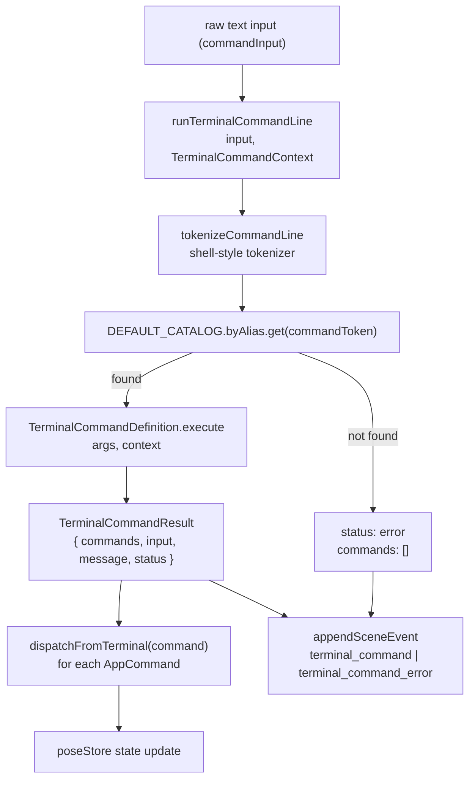
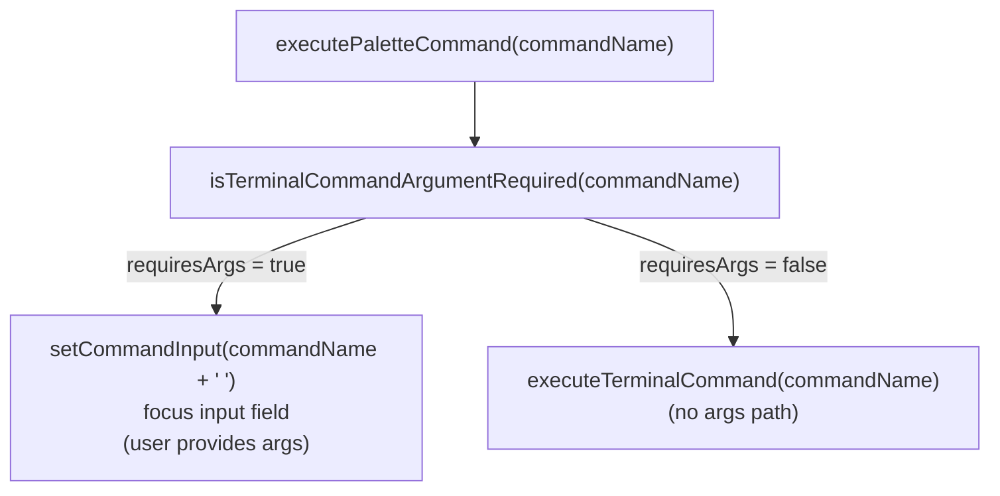

# Terminal Command Processing

Relevant source files

- [](https://github.com/e7canasta/puppet-studio/blob/cdd483bd/src/core/workspace-shell/workspaceShellBridge.ts)
- [](https://github.com/e7canasta/puppet-studio/blob/cdd483bd/src/features/terminal/hooks/useSceneEventTerminalState.ts)
- [](https://github.com/e7canasta/puppet-studio/blob/cdd483bd/src/features/terminal/model/terminalCommandLine.ts)
- [](https://github.com/e7canasta/puppet-studio/blob/cdd483bd/src/features/terminal/ui/SceneEventTerminal.tsx)
- [](https://github.com/e7canasta/puppet-studio/blob/cdd483bd/src/features/workspace/hooks/useWorkspaceHudState.ts)
- [](https://github.com/e7canasta/puppet-studio/blob/cdd483bd/src/features/workspace/model/workspaceHudModel.ts)
- [](https://github.com/e7canasta/puppet-studio/blob/cdd483bd/src/features/workspace/ui/components/WorkspaceCommandPalette.tsx)
- [](https://github.com/e7canasta/puppet-studio/blob/cdd483bd/src/features/workspace/ui/pages/CadWorkspacePage.tsx)

This page documents the terminal command parsing and execution system: the types, functions, and catalog that turn raw text typed into the `SceneEventTerminal` input field into dispatched `AppCommand` objects. For the terminal UI component itself (filters, event log display, command history, keyboard bindings), see [6.5](https://deepwiki.com/e7canasta/puppet-studio/6.5-scene-event-terminal). For the `AppCommand` types that are ultimately dispatched, see [4.1](https://deepwiki.com/e7canasta/puppet-studio/4.1-appcommand-types-and-dispatch).

---

## Purpose and Scope

When a user submits text in the terminal's command input, it is processed by `runTerminalCommandLine` in [src/features/terminal/model/terminalCommandLine.ts](https://github.com/e7canasta/puppet-studio/blob/cdd483bd/src/features/terminal/model/terminalCommandLine.ts) That function tokenizes the input, looks up a command definition by name or alias, executes it against the current `TerminalCommandContext`, and returns a `TerminalCommandResult` containing zero or more `AppCommand` values ready to be dispatched to `poseStore`.

This subsystem is entirely pure: it has no side effects and does not access React state directly. Side effects (dispatching, scene event logging) happen in the calling hook.

---

## Data Types

### `TerminalCommandContext`

Passed to every command's `execute` function. It carries a read-only snapshot of the state the command may need to reason about.

[src/features/terminal/model/terminalCommandLine.ts12-25](https://github.com/e7canasta/puppet-studio/blob/cdd483bd/src/features/terminal/model/terminalCommandLine.ts#L12-L25)

|Field|Type|Description|
|---|---|---|
|`activeToolMode`|`'move' \| 'rotate' \| 'select'`|Currently active tool|
|`capabilities`|`TerminalCapabilityStatus[]`|Engine capabilities and their enabled status|
|`engineCapabilitiesDisabled`|`string[]`|Capability IDs force-disabled via config|
|`engineCapabilitiesEnabled`|`string[]`|Capability IDs force-enabled via config|
|`engineCapabilityProfile`|`'demo' \| 'dev' \| 'ops'`|Active capability profile|
|`sceneEditEnabled`|`boolean`|Whether local scene editing is on|
|`sceneEventAutoScroll`|`boolean`|Auto-scroll state of the terminal|
|`sceneEventLogPaused`|`boolean`|Whether event capture is paused|
|`sceneEventTerminalOpen`|`boolean`|Whether the terminal panel is open|
|`sceneId`|`string`|Currently active scene ID|
|`sceneRemoteHoldEnabled`|`boolean`|Whether remote sync hold is on|
|`showDimensions`|`boolean`|Whether dimension overlay is visible|

The context is assembled in `useSceneEventTerminalState` from `usePoseStore` selectors and `runtimeConfig`:

[src/features/terminal/hooks/useSceneEventTerminalState.ts81-107](https://github.com/e7canasta/puppet-studio/blob/cdd483bd/src/features/terminal/hooks/useSceneEventTerminalState.ts#L81-L107)

---

### `TerminalCommandResult`

The return value of `runTerminalCommandLine`. It bundles together everything the caller needs.

[src/features/terminal/model/terminalCommandLine.ts29-34](https://github.com/e7canasta/puppet-studio/blob/cdd483bd/src/features/terminal/model/terminalCommandLine.ts#L29-L34)

|Field|Type|Description|
|---|---|---|
|`commands`|`AppCommand[]`|Zero or more commands to dispatch|
|`input`|`string`|The trimmed raw input string|
|`message`|`string`|Human-readable outcome message for logging|
|`status`|`'ok' \| 'error'`|Whether the command succeeded|

---

### `TerminalCommandDescriptor`

Public-facing descriptor for a command, used for autocomplete and the command palette.

[src/features/terminal/model/terminalCommandLine.ts49-55](https://github.com/e7canasta/puppet-studio/blob/cdd483bd/src/features/terminal/model/terminalCommandLine.ts#L49-L55)

|Field|Type|Description|
|---|---|---|
|`name`|`string`|Canonical command name|
|`aliases`|`string[]`|Alternative names accepted by the parser|
|`description`|`string`|Short description shown in help/palette|
|`usage`|`string`|Argument syntax (e.g. `view <iso\|front\|...>`)|
|`requiresArgs`|`boolean`|`true` if usage string contains `<`|

---

## Execution Pipeline

The diagram below maps the flow from raw text input to dispatched `AppCommand`.

**Terminal command execution flow**



Sources: [src/features/terminal/model/terminalCommandLine.ts660-685](https://github.com/e7canasta/puppet-studio/blob/cdd483bd/src/features/terminal/model/terminalCommandLine.ts#L660-L685) [src/features/terminal/hooks/useSceneEventTerminalState.ts133-173](https://github.com/e7canasta/puppet-studio/blob/cdd483bd/src/features/terminal/hooks/useSceneEventTerminalState.ts#L133-L173)

---

### Step 1 — Tokenization

`tokenizeCommandLine` in [src/features/terminal/model/terminalCommandLine.ts57-65](https://github.com/e7canasta/puppet-studio/blob/cdd483bd/src/features/terminal/model/terminalCommandLine.ts#L57-L65) splits the input into tokens using a regex that handles quoted strings (`"…"` and `'…'`) and whitespace-separated words. The first token becomes the command name; the rest are passed as `args`.

---

### Step 2 — Lookup

The module-level singleton `DEFAULT_CATALOG` ([src/features/terminal/model/terminalCommandLine.ts612](https://github.com/e7canasta/puppet-studio/blob/cdd483bd/src/features/terminal/model/terminalCommandLine.ts#L612-L612)) contains a `byAlias` map that indexes every command by both its `name` and all its `aliases`. A case-insensitive lookup is performed against this map.

If no matching definition is found, `runTerminalCommandLine` immediately returns a result with `status: 'error'` and an empty `commands` array.

---

### Step 3 — Argument Coercion Helpers

Before calling `execute`, argument strings are coerced using these internal helpers:

[src/features/terminal/model/terminalCommandLine.ts67-108](https://github.com/e7canasta/puppet-studio/blob/cdd483bd/src/features/terminal/model/terminalCommandLine.ts#L67-L108)

|Helper|Returns|Accepted inputs|
|---|---|---|
|`toBooleanFlag`|`boolean \| null`|`on`, `1`, `true` → `true`; `off`, `0`, `false` → `false`|
|`toPositiveNumber`|`number \| null`|Any finite positive number string|
|`toWorkspaceLayoutPreset`|`WorkspaceLayoutPreset \| null`|`focus`, `authoring`/`author`, `observability`/`observe`|
|`toWorkspaceWidgetId`|`WorkspaceWidgetId \| null`|`properties`/`props`/`left`, `outliner`/`tree`, `camera`/`cam`, `planogram`/`plan`|
|`toToolMode`|`'move' \| 'rotate' \| 'select' \| null`|`select`/`sel`, `move`/`mv`, `rotate`/`rot`|

---

### Step 4 — Execution and Result

Each `TerminalCommandDefinition.execute` receives `(args: string[], context: TerminalCommandContext)` and returns an object with `commands`, `message`, and an optional `status` (defaults to `'ok'`). `runTerminalCommandLine` wraps this with the original `input` string.

---

### Step 5 — Dispatch and Logging (in `useSceneEventTerminalState`)

The `executeTerminalCommand` callback in [src/features/terminal/hooks/useSceneEventTerminalState.ts133-173](https://github.com/e7canasta/puppet-studio/blob/cdd483bd/src/features/terminal/hooks/useSceneEventTerminalState.ts#L133-L173) does three things after receiving the result:

1. Iterates `result.commands` and calls `dispatchFromTerminal(command)` for each one.
2. Calls `appendSceneEvent` with kind `terminal_command` (ok) or `terminal_command_error` (error).
3. Appends an entry to the local `commandHistory` state array.

---

## Command Catalog

The full catalog is built once by `makeCommandCatalog` ([src/features/terminal/model/terminalCommandLine.ts118-609](https://github.com/e7canasta/puppet-studio/blob/cdd483bd/src/features/terminal/model/terminalCommandLine.ts#L118-L609)) and stored in the module-level `DEFAULT_CATALOG`. Every command, its aliases, argument form, and the `AppCommand` it produces is listed below.

**Command catalog and AppCommand mapping**

Sources: [src/features/terminal/model/terminalCommandLine.ts118-609](https://github.com/e7canasta/puppet-studio/blob/cdd483bd/src/features/terminal/model/terminalCommandLine.ts#L118-L609)

---

### Full Command Reference

|Name|Aliases|Usage|AppCommand kind(s)|Notes|
|---|---|---|---|---|
|`help`|`h`, `?`|`help`|—|Prints help text via `buildTerminalCommandHelp`|
|`caps`|`plugins`|`caps`|—|Lists capabilities and enabled status from context|
|`cap_profile`|`cap_policy`|`cap_profile`|—|Shows active profile + overrides|
|`cap_enable`|`plugin_on`|`cap_enable <id>`|`set_engine_capability_enabled` (enabled: true)|Validates id against known capabilities|
|`cap_disable`|`plugin_off`|`cap_disable <id>`|`set_engine_capability_enabled` (enabled: false)|Validates id against known capabilities|
|`tool`|—|`tool <select\|move\|rotate>`|`set_active_tool`|No-op if already active|
|`terminal`|`term`, `toggle`|`terminal`|`toggle_scene_event_terminal`||
|`layout`|`ws`, `workspace`|`layout <focus\|authoring\|observability>`|`apply_workspace_layout_preset`||
|`left_panel`|`left`|`left_panel`|`toggle_workspace_left_panel`||
|`right_panel`|`right`|`right_panel`|`toggle_workspace_right_panel`||
|`layout_reset`|`layout_default`, `ws_reset`|`layout_reset`|`restore_workspace_layout_defaults`||
|`widget_show`|`widget_on`|`widget_show <id>`|`set_workspace_widget_visible` (visible: true)||
|`widget_hide`|`widget_off`|`widget_hide <id>`|`set_workspace_widget_visible` (visible: false)||
|`widget_fold`|—|`widget_fold <id>`|`toggle_workspace_widget_collapsed`||
|`widget_pin`|—|`widget_pin <id>`|`toggle_workspace_widget_pinned`||
|`clear`|`cls`|`clear`|`clear_scene_event_log`||
|`pause`|`logpause`|`pause [on\|off]`|`set_scene_event_log_paused`|Toggles if no arg|
|`auto`|`scroll`|`auto [on\|off]`|`set_scene_event_auto_scroll`|Toggles if no arg|
|`scene`|`scn`|`scene <scene-id>`|`set_scene_id`|Requires non-empty arg|
|`view`|`v`|`view <iso\|front\|back\|left\|right\|top\|sensor>`|`set_camera_view`|Accepts short forms: `f`, `b`, `l`, `r`|
|`projection`|`proj`|`projection <orthographic\|perspective>`|`set_projection_mode`|Accepts `ortho`, `persp`|
|`edit`|—|`edit [on\|off]`|`toggle_scene_edit`|Toggles if no arg; no-op if already in target state|
|`hold`|—|`hold [on\|off]`|`toggle_scene_remote_hold`|Toggles if no arg; no-op if already in target state|
|`undo`|`u`|`undo`|`undo_scene_edit`||
|`redo`|`r`|`redo`|`redo_scene_edit`||
|`stats`|`engine_stats`|`stats`|`request_engine_stats`||
|`sim_preview`|`sim`, `engine_sim`|`sim_preview`|`request_engine_sim_preview`||
|`snap`|`grid_snap`|`snap [step-m]`|`run_scene_command` → `snap_selected_to_grid`|Uses `SCENE_COMMAND_SNAP_STEP_M` default|
|`select`|—|`select <placement-id\|none>`|`set_selected_placement`|`none` clears the selection|
|`dims`|`measure`, `msr`|`dims [on\|off]`|`set_show_dimensions`|Toggles if no arg|
|`bridge`|—|`bridge <on\|off>`|`set_bridge_enabled`|Arg required|
|`apply`|`apply_remote`|`apply`|`apply_deferred_scene_remote`||
|`remote_clear`|`drop_remote`|`remote_clear`|`clear_scene_deferred_remote`||

Sources: [src/features/terminal/model/terminalCommandLine.ts118-609](https://github.com/e7canasta/puppet-studio/blob/cdd483bd/src/features/terminal/model/terminalCommandLine.ts#L118-L609)

---

## Public API Functions

These are exported from the module and used by other parts of the terminal feature:

[src/features/terminal/model/terminalCommandLine.ts627-685](https://github.com/e7canasta/puppet-studio/blob/cdd483bd/src/features/terminal/model/terminalCommandLine.ts#L627-L685)

|Function|Signature|Used by|
|---|---|---|
|`runTerminalCommandLine`|`(input: string, context: TerminalCommandContext) => TerminalCommandResult \| null`|`executeTerminalCommand` in `useSceneEventTerminalState`|
|`suggestTerminalCommands`|`(prefix: string) => string[]`|`useSceneEventTerminalState` — drives autocomplete dropdown|
|`isTerminalCommandArgumentRequired`|`(commandName: string) => boolean`|`executePaletteCommand` — decides whether to pre-fill input or execute immediately|
|`listTerminalCommandDescriptors`|`() => TerminalCommandDescriptor[]`|Available for palette/help rendering|
|`getTerminalCommandDescriptor`|`(commandName: string) => TerminalCommandDescriptor \| null`|Lookup by canonical name|
|`buildTerminalCommandHelp`|`() => string`|`help` command's `execute` function|

`runTerminalCommandLine` returns `null` for blank input (no result is produced), rather than a result with `status: 'error'`.

---

## Autocomplete and Command Palette Integration

`suggestTerminalCommands` ([src/features/terminal/model/terminalCommandLine.ts652-658](https://github.com/e7canasta/puppet-studio/blob/cdd483bd/src/features/terminal/model/terminalCommandLine.ts#L652-L658)) filters command names and aliases by prefix match and returns canonical names. The terminal hook exposes the suggestions for Tab-completion:

[src/features/terminal/hooks/useSceneEventTerminalState.ts60](https://github.com/e7canasta/puppet-studio/blob/cdd483bd/src/features/terminal/hooks/useSceneEventTerminalState.ts#L60-L60)

```
const commandSuggestions = useMemo(() => suggestTerminalCommands(commandInput), [commandInput])
```

When the terminal-internal command palette selects an entry, `isTerminalCommandArgumentRequired` is checked. If `true`, the command name is pre-filled into the text input (with a trailing space) so the user can supply arguments before pressing Enter. If `false`, `executeTerminalCommand` is called directly.

[src/features/terminal/hooks/useSceneEventTerminalState.ts182-196](https://github.com/e7canasta/puppet-studio/blob/cdd483bd/src/features/terminal/hooks/useSceneEventTerminalState.ts#L182-L196)

**Palette vs. direct execution branching**



Sources: [src/features/terminal/hooks/useSceneEventTerminalState.ts182-196](https://github.com/e7canasta/puppet-studio/blob/cdd483bd/src/features/terminal/hooks/useSceneEventTerminalState.ts#L182-L196) [src/features/terminal/model/terminalCommandLine.ts631-634](https://github.com/e7canasta/puppet-studio/blob/cdd483bd/src/features/terminal/model/terminalCommandLine.ts#L631-L634)

---

## Context Assembly

`terminalCommandContext` is assembled inside `useSceneEventTerminalState` as a `useMemo` depending on the poseStore slices and `runtimeConfig` values it references:

[src/features/terminal/hooks/useSceneEventTerminalState.ts80-107](https://github.com/e7canasta/puppet-studio/blob/cdd483bd/src/features/terminal/hooks/useSceneEventTerminalState.ts#L80-L107)

`capabilities` is obtained via `listPoseStoreEngineCapabilities()` ([src/features/terminal/hooks/useSceneEventTerminalState.ts80](https://github.com/e7canasta/puppet-studio/blob/cdd483bd/src/features/terminal/hooks/useSceneEventTerminalState.ts#L80-L80)) which returns the live registered capabilities from the engine runtime. The context is recalculated only when its specific dependencies change, keeping re-renders minimal.

The fields `engineCapabilitiesDisabled`, `engineCapabilitiesEnabled`, and `engineCapabilityProfile` are read directly from `runtimeConfig` and are therefore static for the lifetime of the page — they reflect environment-variable configuration described in [12](https://deepwiki.com/e7canasta/puppet-studio/12-configuration).


### On this page

- [Terminal Command Processing](https://deepwiki.com/e7canasta/puppet-studio/6.6-terminal-command-processing#terminal-command-processing)
- [Purpose and Scope](https://deepwiki.com/e7canasta/puppet-studio/6.6-terminal-command-processing#purpose-and-scope)
- [Data Types](https://deepwiki.com/e7canasta/puppet-studio/6.6-terminal-command-processing#data-types)
- [`TerminalCommandContext`](https://deepwiki.com/e7canasta/puppet-studio/6.6-terminal-command-processing#terminalcommandcontext)
- [`TerminalCommandResult`](https://deepwiki.com/e7canasta/puppet-studio/6.6-terminal-command-processing#terminalcommandresult)
- [`TerminalCommandDescriptor`](https://deepwiki.com/e7canasta/puppet-studio/6.6-terminal-command-processing#terminalcommanddescriptor)
- [Execution Pipeline](https://deepwiki.com/e7canasta/puppet-studio/6.6-terminal-command-processing#execution-pipeline)
- [Step 1 — Tokenization](https://deepwiki.com/e7canasta/puppet-studio/6.6-terminal-command-processing#step-1-tokenization)
- [Step 2 — Lookup](https://deepwiki.com/e7canasta/puppet-studio/6.6-terminal-command-processing#step-2-lookup)
- [Step 3 — Argument Coercion Helpers](https://deepwiki.com/e7canasta/puppet-studio/6.6-terminal-command-processing#step-3-argument-coercion-helpers)
- [Step 4 — Execution and Result](https://deepwiki.com/e7canasta/puppet-studio/6.6-terminal-command-processing#step-4-execution-and-result)
- [Step 5 — Dispatch and Logging (in `useSceneEventTerminalState`)](https://deepwiki.com/e7canasta/puppet-studio/6.6-terminal-command-processing#step-5-dispatch-and-logging-in-usesceneeventterminalstate)
- [Command Catalog](https://deepwiki.com/e7canasta/puppet-studio/6.6-terminal-command-processing#command-catalog)
- [Full Command Reference](https://deepwiki.com/e7canasta/puppet-studio/6.6-terminal-command-processing#full-command-reference)
- [Public API Functions](https://deepwiki.com/e7canasta/puppet-studio/6.6-terminal-command-processing#public-api-functions)
- [Autocomplete and Command Palette Integration](https://deepwiki.com/e7canasta/puppet-studio/6.6-terminal-command-processing#autocomplete-and-command-palette-integration)
- [Context Assembly](https://deepwiki.com/e7canasta/puppet-studio/6.6-terminal-command-processing#context-assembly)

