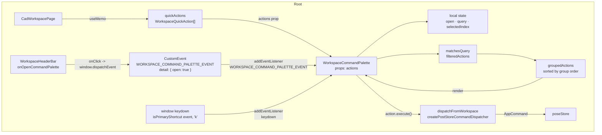
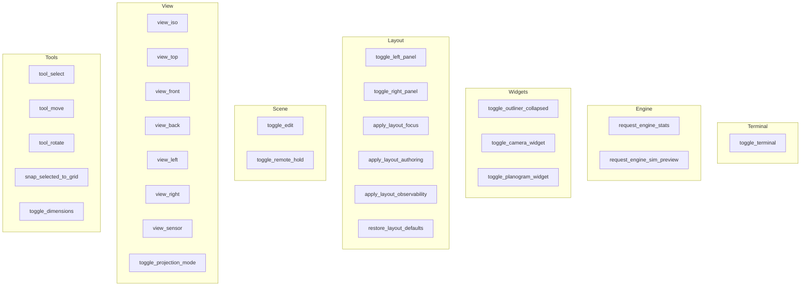
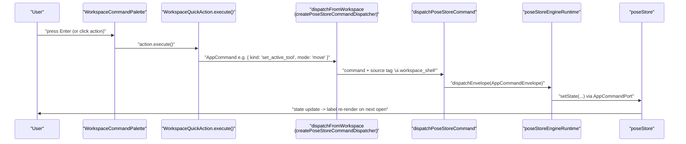

# Workspace Command Palette

Relevant source files

- [](https://github.com/e7canasta/puppet-studio/blob/cdd483bd/src/core/workspace-shell/workspaceShellBridge.ts)
- [](https://github.com/e7canasta/puppet-studio/blob/cdd483bd/src/features/terminal/hooks/useSceneEventTerminalState.ts)
- [](https://github.com/e7canasta/puppet-studio/blob/cdd483bd/src/features/terminal/model/terminalCommandLine.ts)
- [](https://github.com/e7canasta/puppet-studio/blob/cdd483bd/src/features/terminal/ui/SceneEventTerminal.tsx)
- [](https://github.com/e7canasta/puppet-studio/blob/cdd483bd/src/features/workspace/hooks/useWorkspaceHudState.ts)
- [](https://github.com/e7canasta/puppet-studio/blob/cdd483bd/src/features/workspace/model/workspaceHudModel.ts)
- [](https://github.com/e7canasta/puppet-studio/blob/cdd483bd/src/features/workspace/ui/components/WorkspaceCommandPalette.tsx)
- [](https://github.com/e7canasta/puppet-studio/blob/cdd483bd/src/features/workspace/ui/pages/CadWorkspacePage.tsx)

## Purpose and Scope

This page documents the `WorkspaceCommandPalette` component: its `WorkspaceQuickAction` interface, the `WORKSPACE_COMMAND_PALETTE_EVENT` custom DOM event used to open it imperatively, keyboard shortcut integration, and how `CadWorkspacePage` builds and registers the full set of quick actions.

This palette operates on high-level workspace commands (layout presets, tool switching, view changes, widget visibility). It is distinct from the **terminal's internal command palette**, which targets lower-level text-based terminal commands (see [6.5](https://deepwiki.com/e7canasta/puppet-studio/6.5-scene-event-terminal) and [6.6](https://deepwiki.com/e7canasta/puppet-studio/6.6-terminal-command-processing)).

---

## Overview

The Workspace Command Palette is a modal overlay rendered by `WorkspaceCommandPalette` at the bottom of `CadWorkspacePage`. It provides a searchable, keyboard-navigable list of `WorkspaceQuickAction` entries. Actions are grouped by category, filtered by a free-text query, and executed by calling their `execute` callback, which dispatches an `AppCommand` to `poseStore`.

The palette can be opened by:

1. The global keyboard shortcut **Ctrl+K** (or Cmd+K on macOS).
2. Dispatching the `WORKSPACE_COMMAND_PALETTE_EVENT` custom DOM event with `{ open: true }`.
3. The "Command" button in `WorkspaceHeaderBar`, which fires the same custom event.

Sources: [src/features/workspace/ui/components/WorkspaceCommandPalette.tsx1-205](https://github.com/e7canasta/puppet-studio/blob/cdd483bd/src/features/workspace/ui/components/WorkspaceCommandPalette.tsx#L1-L205) [src/features/workspace/ui/pages/CadWorkspacePage.tsx118-124](https://github.com/e7canasta/puppet-studio/blob/cdd483bd/src/features/workspace/ui/pages/CadWorkspacePage.tsx#L118-L124)

---

## Core Types

### `WorkspaceQuickAction`

Defined in [src/features/workspace/ui/components/WorkspaceCommandPalette.tsx8-15](https://github.com/e7canasta/puppet-studio/blob/cdd483bd/src/features/workspace/ui/components/WorkspaceCommandPalette.tsx#L8-L15):

|Field|Type|Required|Description|
|---|---|---|---|
|`id`|`string`|yes|Stable unique identifier|
|`label`|`string`|yes|Display name shown in the list|
|`keywords`|`string`|yes|Extra search terms (space-separated)|
|`execute`|`() => void`|yes|Called when the action is selected|
|`group`|`string`|no|Grouping category; defaults to `'Scene'`|
|`shortcut`|`string`|no|Displayed next to the label (no enforcement)|

The `matchesQuery` function [src/features/workspace/ui/components/WorkspaceCommandPalette.tsx21-25](https://github.com/e7canasta/puppet-studio/blob/cdd483bd/src/features/workspace/ui/components/WorkspaceCommandPalette.tsx#L21-L25) concatenates `label + ' ' + keywords` and does a case-insensitive substring match against the current query string.

---

## Component Architecture

**Diagram: WorkspaceCommandPalette data and event flow**




Sources: [src/features/workspace/ui/components/WorkspaceCommandPalette.tsx37-205](https://github.com/e7canasta/puppet-studio/blob/cdd483bd/src/features/workspace/ui/components/WorkspaceCommandPalette.tsx#L37-L205) [src/features/workspace/ui/pages/CadWorkspacePage.tsx96-124](https://github.com/e7canasta/puppet-studio/blob/cdd483bd/src/features/workspace/ui/pages/CadWorkspacePage.tsx#L96-L124) [src/features/workspace/ui/pages/CadWorkspacePage.tsx460-483](https://github.com/e7canasta/puppet-studio/blob/cdd483bd/src/features/workspace/ui/pages/CadWorkspacePage.tsx#L460-L483)

---

## Custom DOM Event: `WORKSPACE_COMMAND_PALETTE_EVENT`

The constant `WORKSPACE_COMMAND_PALETTE_EVENT` is exported from `WorkspaceCommandPalette.tsx` and set to the string `'simula.workspace.command_palette'` [src/features/workspace/ui/components/WorkspaceCommandPalette.tsx6](https://github.com/e7canasta/puppet-studio/blob/cdd483bd/src/features/workspace/ui/components/WorkspaceCommandPalette.tsx#L6-L6)

Any code that holds a reference to this constant can imperatively open or close the palette by dispatching a `CustomEvent` on `window`:

```
window.dispatchEvent(
  new CustomEvent(WORKSPACE_COMMAND_PALETTE_EVENT, {
    detail: { open: true },   // or { open: false }, or omit detail to toggle
  }),
)
```

`WorkspaceCommandPalette` listens to this event in a `useEffect` [src/features/workspace/ui/components/WorkspaceCommandPalette.tsx83-96](https://github.com/e7canasta/puppet-studio/blob/cdd483bd/src/features/workspace/ui/components/WorkspaceCommandPalette.tsx#L83-L96) When `detail.open` is a `boolean`, it sets the `open` state directly. If `detail` is absent or `open` is not a boolean, it toggles.

`CadWorkspacePage` wires this up via `openWorkspaceCommandPalette` [src/features/workspace/ui/pages/CadWorkspacePage.tsx118-124](https://github.com/e7canasta/puppet-studio/blob/cdd483bd/src/features/workspace/ui/pages/CadWorkspacePage.tsx#L118-L124) which is passed to `WorkspaceHeaderBar` as the `onOpenCommandPalette` prop.

Sources: [src/features/workspace/ui/components/WorkspaceCommandPalette.tsx6-96](https://github.com/e7canasta/puppet-studio/blob/cdd483bd/src/features/workspace/ui/components/WorkspaceCommandPalette.tsx#L6-L96) [src/features/workspace/ui/pages/CadWorkspacePage.tsx118-124](https://github.com/e7canasta/puppet-studio/blob/cdd483bd/src/features/workspace/ui/pages/CadWorkspacePage.tsx#L118-L124) [src/features/workspace/ui/pages/CadWorkspacePage.tsx467](https://github.com/e7canasta/puppet-studio/blob/cdd483bd/src/features/workspace/ui/pages/CadWorkspacePage.tsx#L467-L467)

---

## Keyboard Shortcut Integration

The component registers a `keydown` listener on `window` [src/features/workspace/ui/components/WorkspaceCommandPalette.tsx71-81](https://github.com/e7canasta/puppet-studio/blob/cdd483bd/src/features/workspace/ui/components/WorkspaceCommandPalette.tsx#L71-L81):

- **Ctrl+K / Cmd+K** (`isPrimaryShortcut(event, 'k')`): toggles the palette open/closed.
    - Guard: if the palette is currently **closed** and the event target is a text input (`INPUT`, `TEXTAREA`, `SELECT`, or `contentEditable`), the shortcut is **ignored**. This prevents the palette from popping open while typing in forms.
- **ArrowDown / ArrowUp**: navigate through filtered items (wraps around).
- **Enter**: executes the currently highlighted action and closes the palette.
- **Escape**: closes the palette without executing.

The shortcut label displayed in the palette header is read from `STUDIO_SHORTCUTS.workspace.palette` [src/features/workspace/ui/components/WorkspaceCommandPalette.tsx161](https://github.com/e7canasta/puppet-studio/blob/cdd483bd/src/features/workspace/ui/components/WorkspaceCommandPalette.tsx#L161-L161)

The `isTextInputTarget` helper [src/features/workspace/ui/components/WorkspaceCommandPalette.tsx31-35](https://github.com/e7canasta/puppet-studio/blob/cdd483bd/src/features/workspace/ui/components/WorkspaceCommandPalette.tsx#L31-L35) performs the input guard check.

Sources: [src/features/workspace/ui/components/WorkspaceCommandPalette.tsx31-35](https://github.com/e7canasta/puppet-studio/blob/cdd483bd/src/features/workspace/ui/components/WorkspaceCommandPalette.tsx#L31-L35) [src/features/workspace/ui/components/WorkspaceCommandPalette.tsx71-81](https://github.com/e7canasta/puppet-studio/blob/cdd483bd/src/features/workspace/ui/components/WorkspaceCommandPalette.tsx#L71-L81) [src/features/workspace/ui/components/WorkspaceCommandPalette.tsx122-144](https://github.com/e7canasta/puppet-studio/blob/cdd483bd/src/features/workspace/ui/components/WorkspaceCommandPalette.tsx#L122-L144)

---

## Action Grouping and Ordering

`WorkspaceCommandPalette` internally computes `groupedActions` [src/features/workspace/ui/components/WorkspaceCommandPalette.tsx48-69](https://github.com/e7canasta/puppet-studio/blob/cdd483bd/src/features/workspace/ui/components/WorkspaceCommandPalette.tsx#L48-L69) Groups are rendered in this fixed priority order:

|Priority|Group|
|---|---|
|1|Tools|
|2|View|
|3|Scene|
|4|Layout|
|5|Widgets|
|6|Engine|
|7|Terminal|
|∞|(any other group, sorted alphabetically)|

Actions with no `group` field assigned fall into `'Scene'`.




**Diagram: action group membership as registered in CadWorkspacePage**

Sources: [src/features/workspace/ui/pages/CadWorkspacePage.tsx216-450](https://github.com/e7canasta/puppet-studio/blob/cdd483bd/src/features/workspace/ui/pages/CadWorkspacePage.tsx#L216-L450) [src/features/workspace/ui/components/WorkspaceCommandPalette.tsx48-69](https://github.com/e7canasta/puppet-studio/blob/cdd483bd/src/features/workspace/ui/components/WorkspaceCommandPalette.tsx#L48-L69)

---

## Quick Actions Registered by `CadWorkspacePage`

`CadWorkspacePage` builds the `quickActions` array inside a `useMemo` [src/features/workspace/ui/pages/CadWorkspacePage.tsx216-450](https://github.com/e7canasta/puppet-studio/blob/cdd483bd/src/features/workspace/ui/pages/CadWorkspacePage.tsx#L216-L450) Each action's `execute` function closes over `dispatchFromWorkspace` (a `createPoseStoreCommandDispatcher('ui.workspace_shell')` instance) and relevant state slices for generating context-sensitive labels.

The full set of registered actions, their IDs, and the `AppCommand` each dispatches:

|`id`|Group|`AppCommand` kind|Notes|
|---|---|---|---|
|`toggle_left_panel`|Layout|`toggle_workspace_left_panel`|Label reflects current `leftPanelOpen`|
|`toggle_right_panel`|Layout|`toggle_workspace_right_panel`|Label reflects current `rightPanelOpen`|
|`apply_layout_focus`|Layout|`apply_workspace_layout_preset` `focus`||
|`apply_layout_authoring`|Layout|`apply_workspace_layout_preset` `authoring`||
|`apply_layout_observability`|Layout|`apply_workspace_layout_preset` `observability`||
|`restore_layout_defaults`|Layout|`restore_workspace_layout_defaults`||
|`toggle_terminal`|Terminal|`toggle_scene_event_terminal`|Shortcut: `STUDIO_SHORTCUTS.terminal.toggle`|
|`toggle_edit`|Scene|`toggle_scene_edit`|Label reflects current `sceneEditEnabled`|
|`toggle_remote_hold`|Scene|`toggle_scene_remote_hold`|Label reflects current `sceneRemoteHoldEnabled`|
|`view_iso`|View|`set_camera_view` `iso`||
|`view_top`|View|`set_camera_view` `top`||
|`view_front`|View|`set_camera_view` `front`||
|`view_back`|View|`set_camera_view` `back`||
|`view_left`|View|`set_camera_view` `left`||
|`view_right`|View|`set_camera_view` `right`||
|`view_sensor`|View|`set_camera_view` `sensor`||
|`toggle_projection_mode`|View|`set_projection_mode`|Toggles between ortho/perspective|
|`tool_select`|Tools|`set_active_tool` `select`|Label marks active tool|
|`tool_move`|Tools|`set_active_tool` `move`|Label marks active tool|
|`tool_rotate`|Tools|`set_active_tool` `rotate`|Label marks active tool|
|`snap_selected_to_grid`|Tools|`run_scene_command` `snap_selected_to_grid`|Guarded: no-op if `selectedPlacementId` is null; shortcut: `STUDIO_SHORTCUTS.scene.snap`|
|`toggle_dimensions`|Tools|`set_show_dimensions`|Shortcut: `STUDIO_SHORTCUTS.scene.measure`|
|`request_engine_stats`|Engine|`request_engine_stats`||
|`request_engine_sim_preview`|Engine|`request_engine_sim_preview`||
|`toggle_outliner_collapsed`|Widgets|`toggle_workspace_widget_collapsed` `outliner`||
|`toggle_camera_widget`|Widgets|`set_workspace_widget_visible` `camera`||
|`toggle_planogram_widget`|Widgets|`set_workspace_widget_visible` `planogram`||

Labels for boolean-state actions (e.g. `toggle_edit`) are reactive: the `useMemo` dependency array includes the relevant state slice (`sceneEditEnabled`, `rightPanelOpen`, etc.), so the label updates when state changes.

Sources: [src/features/workspace/ui/pages/CadWorkspacePage.tsx216-450](https://github.com/e7canasta/puppet-studio/blob/cdd483bd/src/features/workspace/ui/pages/CadWorkspacePage.tsx#L216-L450)

---

## Interaction with the Command Dispatch System

Actions call `dispatchFromWorkspace(command)`, where `dispatchFromWorkspace` is a `createPoseStoreCommandDispatcher('ui.workspace_shell')` instance [src/features/workspace/ui/pages/CadWorkspacePage.tsx96](https://github.com/e7canasta/puppet-studio/blob/cdd483bd/src/features/workspace/ui/pages/CadWorkspacePage.tsx#L96-L96) This routes commands through the `AppCommandBus` → `PoseStoreCommandBus` → `poseStoreEngineRuntime` → `poseStore`. For details on this pipeline, see [4](https://deepwiki.com/e7canasta/puppet-studio/4-command-system).

**Diagram: how a selected action reaches poseStore**



Sources: [src/features/workspace/ui/pages/CadWorkspacePage.tsx96](https://github.com/e7canasta/puppet-studio/blob/cdd483bd/src/features/workspace/ui/pages/CadWorkspacePage.tsx#L96-L96) [src/features/workspace/ui/pages/CadWorkspacePage.tsx216-450](https://github.com/e7canasta/puppet-studio/blob/cdd483bd/src/features/workspace/ui/pages/CadWorkspacePage.tsx#L216-L450) [src/features/workspace/ui/components/WorkspaceCommandPalette.tsx115-120](https://github.com/e7canasta/puppet-studio/blob/cdd483bd/src/features/workspace/ui/components/WorkspaceCommandPalette.tsx#L115-L120)

---

## Relationship to the Terminal Command Palette

The terminal (`SceneEventTerminal`) has its own separate command palette for terminal-specific commands, opened with **Ctrl+J** and managed by `useSceneEventTerminalState` [src/features/terminal/hooks/useSceneEventTerminalState.ts260-272](https://github.com/e7canasta/puppet-studio/blob/cdd483bd/src/features/terminal/hooks/useSceneEventTerminalState.ts#L260-L272) That palette operates on `TerminalCommandDescriptor` entries and calls `runTerminalCommandLine` (see [6.5](https://deepwiki.com/e7canasta/puppet-studio/6.5-scene-event-terminal) and [6.6](https://deepwiki.com/e7canasta/puppet-studio/6.6-terminal-command-processing)).

The two palettes are completely independent:

|Attribute|Workspace Command Palette|Terminal Command Palette|
|---|---|---|
|Component|`WorkspaceCommandPalette`|Inline in `SceneEventTerminal`|
|Shortcut|Ctrl+K|Ctrl+J|
|Event|`WORKSPACE_COMMAND_PALETTE_EVENT`|Internal state only|
|Item type|`WorkspaceQuickAction`|`TerminalCommandDescriptor`|
|Execution|`action.execute()` → `AppCommand`|`runTerminalCommandLine` → `AppCommand`|
|Scope|Workspace layout, view, tools|Terminal text commands|

Sources: [src/features/workspace/ui/components/WorkspaceCommandPalette.tsx71-81](https://github.com/e7canasta/puppet-studio/blob/cdd483bd/src/features/workspace/ui/components/WorkspaceCommandPalette.tsx#L71-L81) [src/features/terminal/hooks/useSceneEventTerminalState.ts259-272](https://github.com/e7canasta/puppet-studio/blob/cdd483bd/src/features/terminal/hooks/useSceneEventTerminalState.ts#L259-L272)


### On this page

- [Workspace Command Palette](https://deepwiki.com/e7canasta/puppet-studio/6.7-workspace-command-palette#workspace-command-palette)
- [Purpose and Scope](https://deepwiki.com/e7canasta/puppet-studio/6.7-workspace-command-palette#purpose-and-scope)
- [Overview](https://deepwiki.com/e7canasta/puppet-studio/6.7-workspace-command-palette#overview)
- [Core Types](https://deepwiki.com/e7canasta/puppet-studio/6.7-workspace-command-palette#core-types)
- [`WorkspaceQuickAction`](https://deepwiki.com/e7canasta/puppet-studio/6.7-workspace-command-palette#workspacequickaction)
- [Component Architecture](https://deepwiki.com/e7canasta/puppet-studio/6.7-workspace-command-palette#component-architecture)
- [Custom DOM Event: `WORKSPACE_COMMAND_PALETTE_EVENT`](https://deepwiki.com/e7canasta/puppet-studio/6.7-workspace-command-palette#custom-dom-event-workspace_command_palette_event)
- [Keyboard Shortcut Integration](https://deepwiki.com/e7canasta/puppet-studio/6.7-workspace-command-palette#keyboard-shortcut-integration)
- [Action Grouping and Ordering](https://deepwiki.com/e7canasta/puppet-studio/6.7-workspace-command-palette#action-grouping-and-ordering)
- [Quick Actions Registered by `CadWorkspacePage`](https://deepwiki.com/e7canasta/puppet-studio/6.7-workspace-command-palette#quick-actions-registered-by-cadworkspacepage)
- [Interaction with the Command Dispatch System](https://deepwiki.com/e7canasta/puppet-studio/6.7-workspace-command-palette#interaction-with-the-command-dispatch-system)
- [Relationship to the Terminal Command Palette](https://deepwiki.com/e7canasta/puppet-studio/6.7-workspace-command-palette#relationship-to-the-terminal-command-palette)
