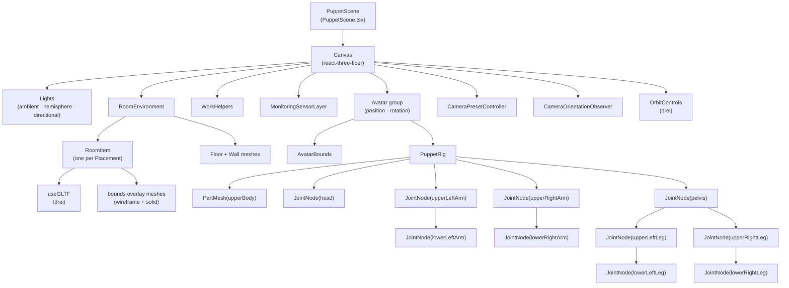
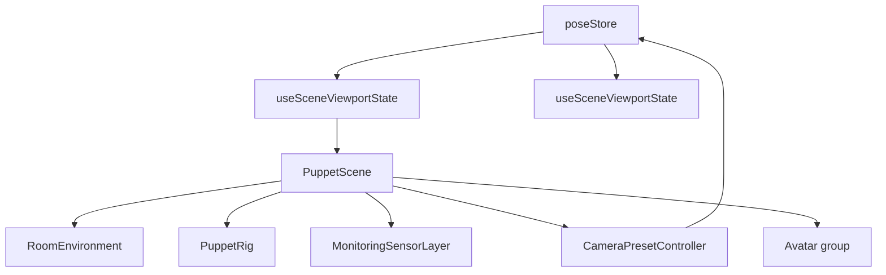
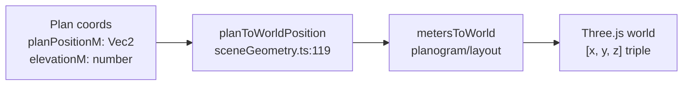
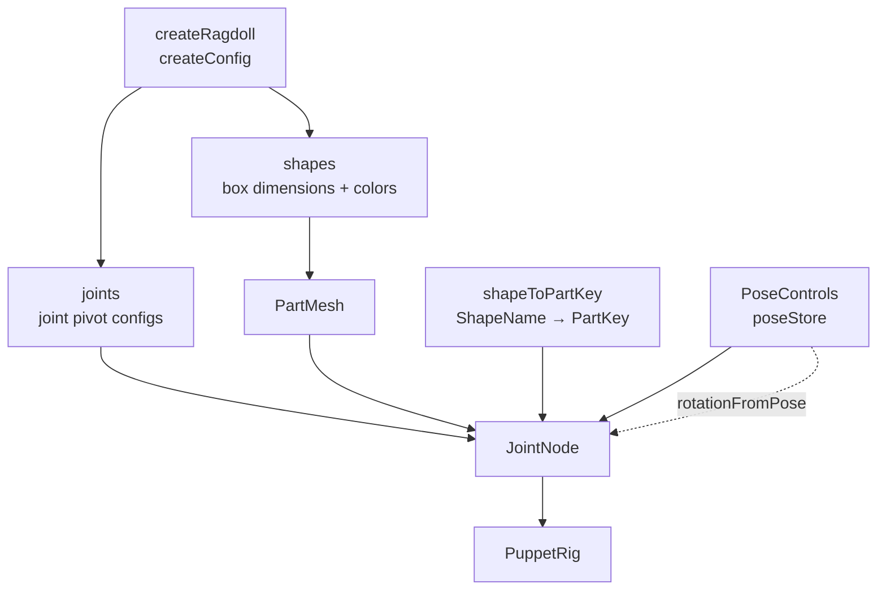

# 3D Scene Rendering

Relevant source files

- 
- 
- 
- 
- 
- 
- 

This page covers the 3D rendering subsystem: the React component tree rooted at `PuppetScene`, the asset catalog, and the scene-domain utility modules that convert planogram data into Three.js world coordinates. For detailed documentation of individual components and sub-components, see [PuppetScene Component](https://deepwiki.com/e7canasta/puppet-studio/7.1-puppetscene-component). For documentation of the geometry and projection utilities in depth, see [Scene Geometry & Projection Utilities](https://deepwiki.com/e7canasta/puppet-studio/7.2-scene-geometry-and-projection-utilities).

---

## Purpose

The rendering subsystem converts planogram state (room dimensions, placement positions, monitoring camera definitions, and avatar pose) into a live interactive 3D view using [react-three-fiber](https://docs.pmnd.rs/react-three-fiber). It does not own or mutate application state; it reads from `poseStore` via the `useSceneViewportState` hook and renders the scene imperatively through Three.js constructs.

---

## Component Tree

**`PuppetScene` component hierarchy**

Sources: [src/features/scene/ui/PuppetScene.tsx589-664](https://github.com/e7canasta/puppet-studio/blob/cdd483bd/src/features/scene/ui/PuppetScene.tsx#L589-L664)

---

## Data Flow into the Scene

`PuppetScene` reads all required state through `useSceneViewportState`, a hook that selects the relevant slices from `poseStore`. No component in this tree dispatches commands or writes to state, with one exception: `CameraOrientationObserver` calls `poseStore.getState().setViewportCameraQuaternion(...)` on each OrbitControls `change` event so that the HUD axis gizmo stays in sync.

**State-to-render data flow**

Sources: [src/features/scene/ui/PuppetScene.tsx589-660](https://github.com/e7canasta/puppet-studio/blob/cdd483bd/src/features/scene/ui/PuppetScene.tsx#L589-L660) [src/features/scene/ui/PuppetScene.tsx537-572](https://github.com/e7canasta/puppet-studio/blob/cdd483bd/src/features/scene/ui/PuppetScene.tsx#L537-L572)

---

## Sub-Component Responsibilities

|Component|File|Responsibility|
|---|---|---|
|`PuppetScene`|`PuppetScene.tsx:589`|Root: mounts `Canvas`, lighting, all sub-components|
|`RoomEnvironment`|`PuppetScene.tsx:219`|Floor + walls geometry; iterates `placements` → `RoomItem`|
|`RoomItem`|`PuppetScene.tsx:167`|Loads GLTF via `useGLTF`, scales via `computeUniformScale`, positions via `planToWorldPosition`|
|`WorkHelpers`|`PuppetScene.tsx:134`|Two overlaid `gridHelper`s (major/minor) + `axesHelper`|
|`PuppetRig`|`PuppetScene.tsx:99`|Procedural ragdoll; root is `upperBody`, children are `JointNode` chains|
|`JointNode`|`PuppetScene.tsx:84`|Applies pivot offsets and rotation from `PoseControls` to each limb segment|
|`PartMesh`|`PuppetScene.tsx:67`|Single `boxGeometry` mesh scaled to ragdoll shape dimensions|
|`AvatarBounds`|`PuppetScene.tsx:574`|Transparent bounding box + floor shadow ring at avatar origin|
|`MonitoringSensorLayer`|`PuppetScene.tsx:255`|Camera body + lens meshes; sight-line guide; sensor plane with projected detection boxes|
|`CameraPresetController`|`PuppetScene.tsx:372`|Imperatively positions the Three.js camera for each view preset (`iso`, `top`, `front`, `back`, `left`, `right`, `sensor`)|
|`CameraOrientationObserver`|`PuppetScene.tsx:537`|Writes camera quaternion to `poseStore` via RAF-throttled listener|

Sources: [src/features/scene/ui/PuppetScene.tsx1-665](https://github.com/e7canasta/puppet-studio/blob/cdd483bd/src/features/scene/ui/PuppetScene.tsx#L1-L665)

---

## Asset Catalog

`ASSET_CATALOG` in `src/planogram/catalog.ts` is a `Record<AssetId, AssetDefinition>` keyed by `AssetId`. Each entry provides the GLTF URL (resolved at build time via `new URL(..., import.meta.url)`), target real-world dimensions, a `fitAxis` hint for uniform scaling, a label, and a `miniMapColor` for 2D overlay tinting.

All catalog assets are preloaded at module load time with `useGLTF.preload` [src/features/scene/ui/PuppetScene.tsx662-664](https://github.com/e7canasta/puppet-studio/blob/cdd483bd/src/features/scene/ui/PuppetScene.tsx#L662-L664)

|`AssetId`|Label|`fitAxis`|Target size (W × D × H m)|
|---|---|---|---|
|`bedDouble`|Bed|`footprint`|1.72 × 2.05 × 0.62|
|`bookcaseOpenLow`|Bookcase|`height`|1.1 × 0.35 × 1.35|
|`cabinetBedDrawerTable`|Nightstand|`height`|0.5 × 0.42 × 0.6|
|`lampSquareTable`|Table Lamp|`height`|0.24 × 0.24 × 0.42|
|`plantSmall`|Plant|`height`|0.45 × 0.45 × 0.85|
|`rugRectangle`|Rug|`footprint`|1.6 × 2.2 × 0.02|

Sources: [src/planogram/catalog.ts1-59](https://github.com/e7canasta/puppet-studio/blob/cdd483bd/src/planogram/catalog.ts#L1-L59) [src/planogram/types.ts20-28](https://github.com/e7canasta/puppet-studio/blob/cdd483bd/src/planogram/types.ts#L20-L28)

---

## Coordinate System & Conversion Utilities

The planogram domain uses a **plan coordinate system**: X is width, Z is depth (both in meters, origin at room center), and Y is elevation. The Three.js world uses the same handedness. The conversion is handled by `planToWorldPosition` in `sceneGeometry.ts`, which passes coordinates through `metersToWorld` (a scale factor from the `planogram` layout module).

`buildAvatarWorldTransform` in `sceneViewportModel.ts` wraps this conversion for the avatar specifically, returning a `{ position, yaw }` struct.

Sources: [src/core/scene-domain/sceneGeometry.ts119-121](https://github.com/e7canasta/puppet-studio/blob/cdd483bd/src/core/scene-domain/sceneGeometry.ts#L119-L121) [src/features/scene/model/sceneViewportModel.ts9-17](https://github.com/e7canasta/puppet-studio/blob/cdd483bd/src/features/scene/model/sceneViewportModel.ts#L9-L17)

---

## Scene Domain Utility Modules

The `src/core/scene-domain/` directory contains two modules of pure calculation functions that serve both the 3D renderer and the 2D MiniMap. Neither module imports React or Three.js scene objects.

### `sceneGeometry.ts`

Operates on plan-space coordinates. Key exports:

|Export|Purpose|
|---|---|
|`degToRad`|Degrees → radians|
|`normalizeDeg`|Clamps to (−180, 180]|
|`placementYawDeg`|Effective yaw = `rotationDeg` + `asset.defaultRotationDeg`|
|`orientedRectCorners`|Four corners of a yaw-rotated rectangle in plan space|
|`getPlacementFootprintCorners`|Corners of a `Placement` using its `targetSizeM`|
|`getPlacementHalfExtents`|Axis-aligned half-extents of a rotated placement|
|`getPlacementBoundsRect`|Axis-aligned bounding `PlanRect`|
|`clampPlanPositionToRoom`|Clamps a plan position to room bounds given half-extents|
|`clampPlacementToRoom`|Full placement version of the above|
|`planToWorldPosition`|Converts `[xM, zM]` + elevation to Three.js `[x, y, z]`|
|`rectsOverlap`|AABB overlap test for `PlanRect` pairs|

Sources: [src/core/scene-domain/sceneGeometry.ts1-122](https://github.com/e7canasta/puppet-studio/blob/cdd483bd/src/core/scene-domain/sceneGeometry.ts#L1-L122)

### `sceneProjection.ts`

Operates on camera geometry and top-view layout. Key exports:

|Export|Purpose|
|---|---|
|`createPlanTransform`|Builds a `PlanTransform2D` mapping plan meters → canvas pixels, accounting for rotation via `QuarterTurns`|
|`PlanTransform2D`|Type: `{ toCanvas, roomCorners, roomBounds, scale }`|
|`computeTopViewPixelsPerMeter`|Computes orthographic zoom for a top-down viewport|
|`cameraWorldPosition`|`MonitoringCameraDefinition` → Three.js `[x, y, z]`|
|`cameraAngles`|`pitchDeg` / `yawDeg` → radians|
|`cameraForward`|Unit forward vector from pitch + yaw|
|`computeSensorPlaneDistance`|Distance from camera origin to the floor-intersecting sensor plane|

Sources: [src/core/scene-domain/sceneProjection.ts1-118](https://github.com/e7canasta/puppet-studio/blob/cdd483bd/src/core/scene-domain/sceneProjection.ts#L1-L118)

### `normalization.ts`

Two functions used exclusively by `RoomItem` for GLTF scaling:

- `measureObject(root: Object3D): MeasuredObject` — computes `Box3`-derived `{ center, minY, size }` for a loaded GLTF scene graph.
- `computeUniformScale(current, target, fitAxis): number` — returns the scalar to apply so that the `fitAxis` dimension matches `target`, or the smallest ratio for `'footprint'`.

Sources: [src/planogram/normalization.ts1-41](https://github.com/e7canasta/puppet-studio/blob/cdd483bd/src/planogram/normalization.ts#L1-L41)

---

## Ragdoll Configuration

The ragdoll joint and shape configuration is generated at module level by `createRagdoll(RAGDOLL_SCALE, ...)` imported from `createConfig`. The resulting `joints` and `shapes` objects drive both `PuppetRig` layout and the `shapeToPartKey` mapping, which bridges Three.js shape names (e.g. `'lowerLeftArm'`) to `PartKey` identifiers used by `PoseControls` (e.g. `'leftForearm'`).

Sources: [src/features/scene/ui/PuppetScene.tsx39-65](https://github.com/e7canasta/puppet-studio/blob/cdd483bd/src/features/scene/ui/PuppetScene.tsx#L39-L65) [src/features/scene/ui/PuppetScene.tsx84-132](https://github.com/e7canasta/puppet-studio/blob/cdd483bd/src/features/scene/ui/PuppetScene.tsx#L84-L132)

---

## Camera Preset System

`CameraPresetController` is a render-null component (`return null`) that runs a `useEffect` whenever `view`, `projectionMode`, `room`, or `sensorCamera` changes. It uses the `controlsRef` (pointing to the `OrbitControls` instance) to imperatively reposition the camera without triggering a React state update.

Supported view presets:

|`view` value|Camera behavior|
|---|---|
|`'iso'`|Fixed isometric position at `(8, 7.5, 8)`|
|`'top'`|Overhead; uses `computeTopViewPixelsPerMeter` for zoom; rotated by `topQuarterTurns`|
|`'front'` / `'back'` / `'left'` / `'right'`|Side elevation view at room-proportional distance|
|`'sensor'`|Matches the selected `MonitoringCameraDefinition`; uses `cameraForward` + `computeSensorPlaneDistance` for target|

Both `OrthographicCamera` and `PerspectiveCamera` are handled (the `Canvas` `key` prop on `projectionMode` causes a full remount when projection type changes).

Sources: [src/features/scene/ui/PuppetScene.tsx372-535](https://github.com/e7canasta/puppet-studio/blob/cdd483bd/src/features/scene/ui/PuppetScene.tsx#L372-L535)

---

## Related Pages

- [PuppetScene Component](https://deepwiki.com/e7canasta/puppet-studio/7.1-puppetscene-component) — detailed documentation of every sub-component
- [Scene Geometry & Projection Utilities](https://deepwiki.com/e7canasta/puppet-studio/7.2-scene-geometry-and-projection-utilities) — full API reference for `sceneGeometry.ts`, `sceneProjection.ts`, and `normalization.ts`
- [Planogram System](https://deepwiki.com/e7canasta/puppet-studio/8-planogram-system) — the `Placement`, `RoomDefinition`, and `ASSET_CATALOG` data model
- [Planogram MiniMap](https://deepwiki.com/e7canasta/puppet-studio/8.1-planogram-minimap) — the 2D canvas view that shares `PlanTransform2D` and scene-domain utilities
- [Camera System](https://deepwiki.com/e7canasta/puppet-studio/9-camera-system) — `CameraSubspaceMap` and detection overlay rendering in 2D
- [Pose Controls](https://deepwiki.com/e7canasta/puppet-studio/10-pose-controls) — `PoseControls` data structure driving `PuppetRig`

### On this page

- [3D Scene Rendering](https://deepwiki.com/e7canasta/puppet-studio/7-3d-scene-rendering#3d-scene-rendering)
- [Purpose](https://deepwiki.com/e7canasta/puppet-studio/7-3d-scene-rendering#purpose)
- [Component Tree](https://deepwiki.com/e7canasta/puppet-studio/7-3d-scene-rendering#component-tree)
- [Data Flow into the Scene](https://deepwiki.com/e7canasta/puppet-studio/7-3d-scene-rendering#data-flow-into-the-scene)
- [Sub-Component Responsibilities](https://deepwiki.com/e7canasta/puppet-studio/7-3d-scene-rendering#sub-component-responsibilities)
- [Asset Catalog](https://deepwiki.com/e7canasta/puppet-studio/7-3d-scene-rendering#asset-catalog)
- [Coordinate System & Conversion Utilities](https://deepwiki.com/e7canasta/puppet-studio/7-3d-scene-rendering#coordinate-system-conversion-utilities)
- [Scene Domain Utility Modules](https://deepwiki.com/e7canasta/puppet-studio/7-3d-scene-rendering#scene-domain-utility-modules)
- [`sceneGeometry.ts`](https://deepwiki.com/e7canasta/puppet-studio/7-3d-scene-rendering#scenegeometryts)
- [`sceneProjection.ts`](https://deepwiki.com/e7canasta/puppet-studio/7-3d-scene-rendering#sceneprojectionts)
- [`normalization.ts`](https://deepwiki.com/e7canasta/puppet-studio/7-3d-scene-rendering#normalizationts)
- [Ragdoll Configuration](https://deepwiki.com/e7canasta/puppet-studio/7-3d-scene-rendering#ragdoll-configuration)
- [Camera Preset System](https://deepwiki.com/e7canasta/puppet-studio/7-3d-scene-rendering#camera-preset-system)
- [Related Pages](https://deepwiki.com/e7canasta/puppet-studio/7-3d-scene-rendering#related-pages)
