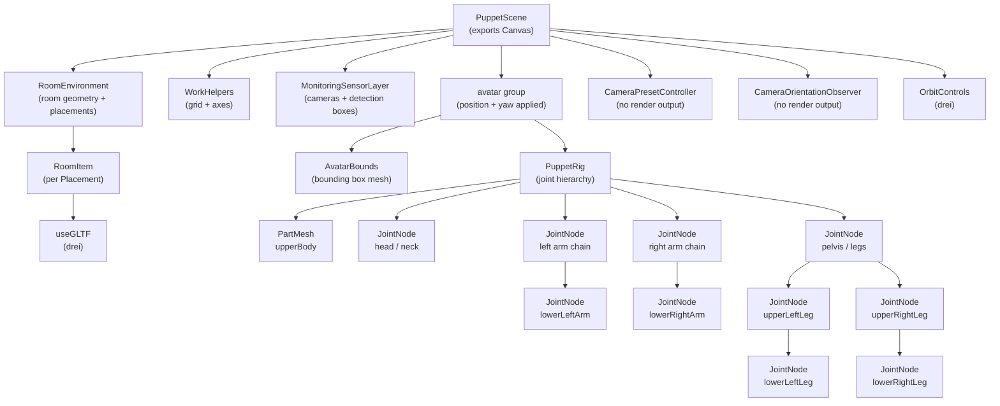
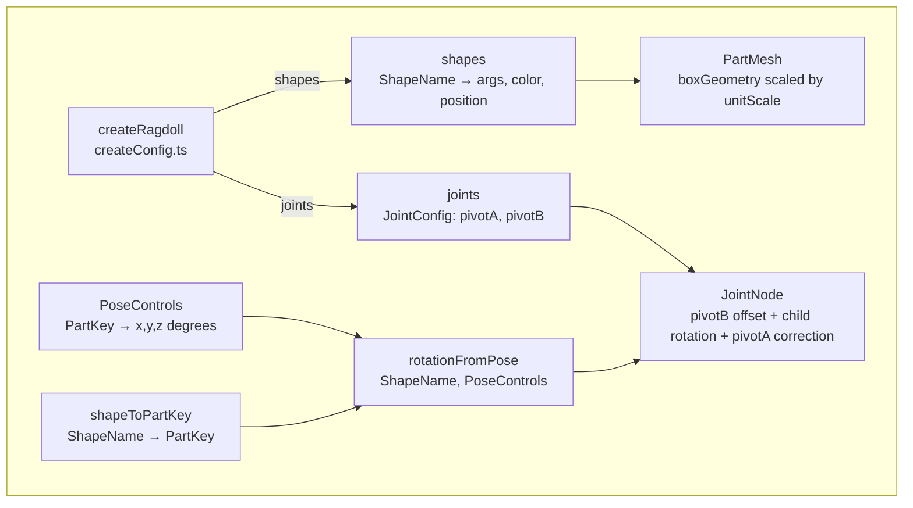
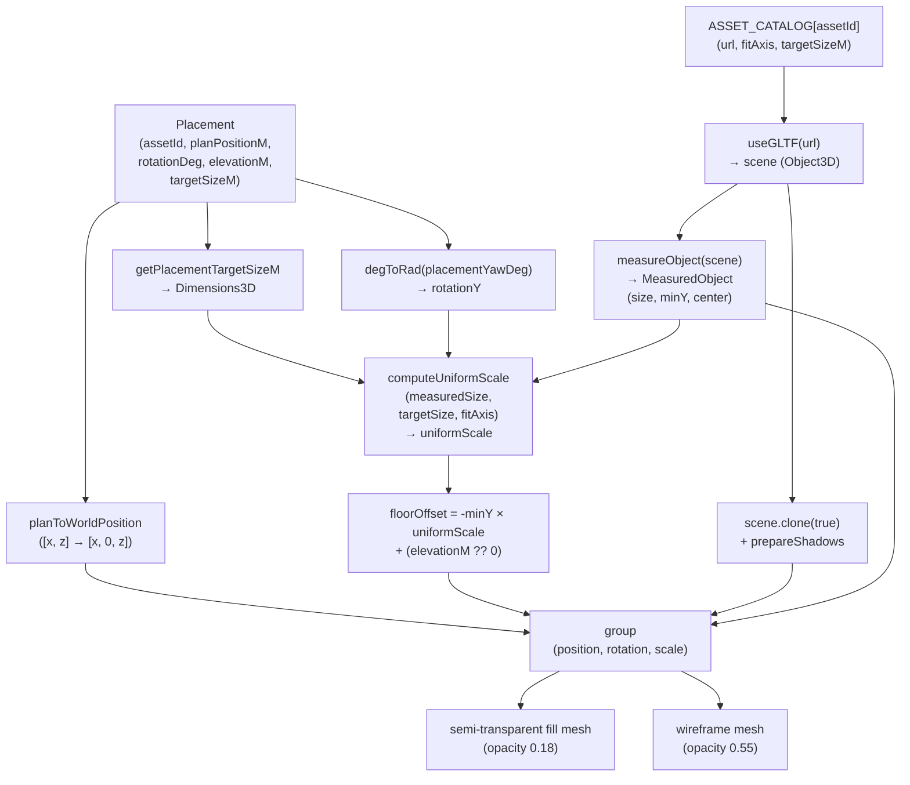
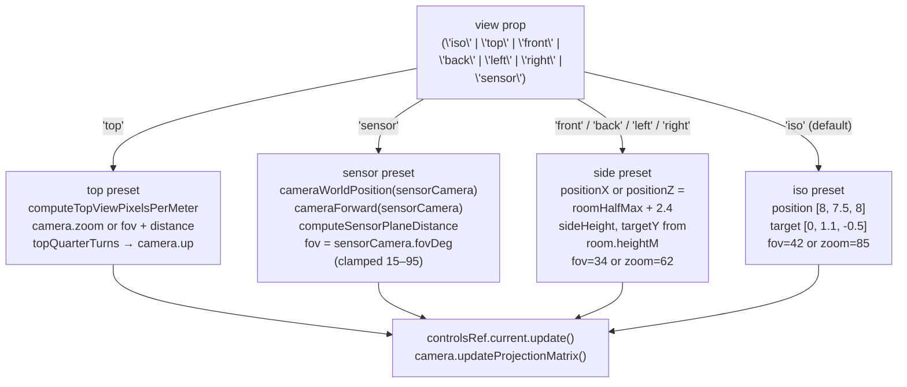
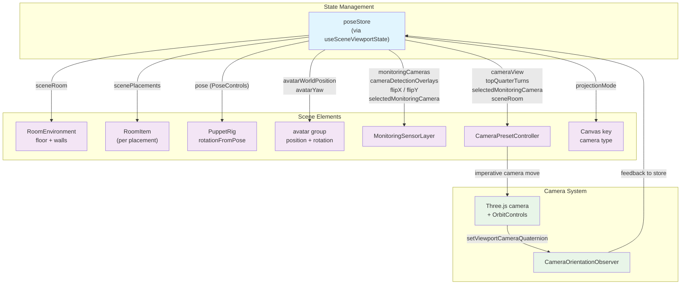

# PuppetScene Component

Relevant source files

- [](https://github.com/e7canasta/puppet-studio/blob/cdd483bd/src/features/camera/model/index.ts)
- [](https://github.com/e7canasta/puppet-studio/blob/cdd483bd/src/features/planogram/model/index.ts)
- [](https://github.com/e7canasta/puppet-studio/blob/cdd483bd/src/features/scene/model/sceneViewportModel.ts)
- [](https://github.com/e7canasta/puppet-studio/blob/cdd483bd/src/features/scene/ui/PuppetScene.tsx)
- [](https://github.com/e7canasta/puppet-studio/blob/cdd483bd/src/planogram/catalog.ts)
- [](https://github.com/e7canasta/puppet-studio/blob/cdd483bd/src/planogram/index.ts)
- [](https://github.com/e7canasta/puppet-studio/blob/cdd483bd/src/planogram/types.ts)

## Purpose and Scope

This page documents the `PuppetScene` component and all of its internal sub-components, located in [src/features/scene/ui/PuppetScene.tsx](https://github.com/e7canasta/puppet-studio/blob/cdd483bd/src/features/scene/ui/PuppetScene.tsx) It covers the react-three-fiber Canvas setup, the ragdoll avatar rig, room environment rendering, monitoring sensor projection, and camera preset control logic.

This page does not cover:

- The 2D planogram MiniMap — see [Planogram MiniMap](https://deepwiki.com/e7canasta/puppet-studio/8.1-planogram-minimap)
- The camera detection overlay in 2D space — see [Camera System](https://deepwiki.com/e7canasta/puppet-studio/9-camera-system)
- Scene geometry and projection utilities used internally — see [Scene Geometry & Projection Utilities](https://deepwiki.com/e7canasta/puppet-studio/7.2-scene-geometry-and-projection-utilities)
- The `poseStore` state fields read by this component — see [State Management](https://deepwiki.com/e7canasta/puppet-studio/3-state-management)

---

## Component Tree

**PuppetScene component hierarchy**




Sources: [src/features/scene/ui/PuppetScene.tsx589-659](https://github.com/e7canasta/puppet-studio/blob/cdd483bd/src/features/scene/ui/PuppetScene.tsx#L589-L659)

---

## State Integration

`PuppetScene` reads all scene state via the `useSceneViewportState` hook. It does not dispatch commands directly.

|Field from `useSceneViewportState`|Used by|
|---|---|
|`avatarWorldPosition`|Avatar group `position`|
|`avatarYaw`|Avatar group `rotation` Y|
|`pose`|`PuppetRig`|
|`scenePlacements`|`RoomEnvironment` → `RoomItem`|
|`sceneRoom`|`RoomEnvironment`, `WorkHelpers`, `CameraPresetController`|
|`monitoringCameras`|`MonitoringSensorLayer`|
|`cameraDetectionOverlays`|`MonitoringSensorLayer`|
|`cameraOverlayFlipX` / `cameraOverlayFlipY`|`MonitoringSensorLayer`|
|`selectedMonitoringCamera`|`MonitoringSensorLayer`, `CameraPresetController`|
|`cameraView`|`CameraPresetController`, `OrbitControls.enableRotate`|
|`topQuarterTurns`|`CameraPresetController`|
|`projectionMode`|`Canvas` key + camera props|

`CameraOrientationObserver` writes back to the store by calling `usePoseStore.getState().setViewportCameraQuaternion(...)` on every `OrbitControls` change event, throttled through `requestAnimationFrame`.

Sources: [src/features/scene/ui/PuppetScene.tsx589-604](https://github.com/e7canasta/puppet-studio/blob/cdd483bd/src/features/scene/ui/PuppetScene.tsx#L589-L604) [src/features/scene/ui/PuppetScene.tsx537-572](https://github.com/e7canasta/puppet-studio/blob/cdd483bd/src/features/scene/ui/PuppetScene.tsx#L537-L572)

---

## Canvas Setup

The root `Canvas` element ([src/features/scene/ui/PuppetScene.tsx607-617](https://github.com/e7canasta/puppet-studio/blob/cdd483bd/src/features/scene/ui/PuppetScene.tsx#L607-L617)) is keyed on `projectionMode`, which forces a full remount when switching between perspective and orthographic projection. This ensures Three.js uses the correct camera class.

|`projectionMode`|Camera type|Initial position|Initial FOV/zoom|
|---|---|---|---|
|`'perspective'`|`PerspectiveCamera`|`[8, 7.5, 8]`|`fov: 42`|
|`'orthographic'`|`OrthographicCamera`|`[8, 7.5, 8]`|`zoom: 85`|

Lighting setup:

- `ambientLight` at intensity `0.7`
- `hemisphereLight` sky `#ffffff` / ground `#d8d8d8` at `0.4`
- `directionalLight` with shadow casting at position `[13, 24, 7]`

---

## PuppetRig

`PuppetRig` is a purely visual, procedural ragdoll avatar. It has no physics — joint transforms are driven entirely by a `PoseControls` value.

**Ragdoll configuration data flow**



Sources: [src/features/scene/ui/PuppetScene.tsx39-132](https://github.com/e7canasta/puppet-studio/blob/cdd483bd/src/features/scene/ui/PuppetScene.tsx#L39-L132)

### Joint Hierarchy

Each `JointNode` applies a two-level transform:

1. Outer `group`: positioned at `pivotB`, rotated by `rotationFromPose`
2. Inner `group`: positioned at `-pivotA` (pivot correction), then renders the child `PartMesh` and any nested `JointNode` children

```
upperBody (root, baseHeight offset)
├── head          (neckJoint)
├── upperLeftArm  (leftShoulder)
│   └── lowerLeftArm  (leftElbowJoint)
├── upperRightArm (rightShoulder)
│   └── lowerRightArm (rightElbowJoint)
└── pelvis        (spineJoint)
    ├── upperLeftLeg  (leftHipJoint)
    │   └── lowerLeftLeg  (leftKneeJoint)
    └── upperRightLeg (rightHipJoint)
        └── lowerRightLeg (rightKneeJoint)
```

`baseHeight` is computed once from `shapes.upperBody.position[1]` to anchor the feet at world Y=0 ([src/features/scene/ui/PuppetScene.tsx101-106](https://github.com/e7canasta/puppet-studio/blob/cdd483bd/src/features/scene/ui/PuppetScene.tsx#L101-L106)).

### Part-to-Shape Mapping

The `shapeToPartKey` map ([src/features/scene/ui/PuppetScene.tsx44-55](https://github.com/e7canasta/puppet-studio/blob/cdd483bd/src/features/scene/ui/PuppetScene.tsx#L44-L55)) translates ragdoll `ShapeName` identifiers to `PartKey` identifiers used in `PoseControls`:

|ShapeName|PartKey|
|---|---|
|`head`|`head`|
|`upperBody`|`torsoBase`|
|`upperLeftArm`|`leftUpperArm`|
|`lowerLeftArm`|`leftForearm`|
|`upperRightArm`|`rightUpperArm`|
|`lowerRightArm`|`rightForearm`|
|`upperLeftLeg`|`leftThigh`|
|`lowerLeftLeg`|`leftFoot`|
|`upperRightLeg`|`rightThigh`|
|`lowerRightLeg`|`rightFoot`|

Parts with no mapping (e.g. `pelvis`) always render at `[0, 0, 0]` rotation.

---

## RoomEnvironment and RoomItem

### RoomEnvironment

`RoomEnvironment` ([src/features/scene/ui/PuppetScene.tsx219-253](https://github.com/e7canasta/puppet-studio/blob/cdd483bd/src/features/scene/ui/PuppetScene.tsx#L219-L253)) renders:

- A floor slab: `boxGeometry [widthM, 0.1, depthM]` at `y = -0.05`
- Back wall (Z−), left wall (X−), right wall (X+): semi-transparent `meshStandardMaterial`
- A wireframe bounding box for the whole room volume
- One `RoomItem` per entry in `placements`

### RoomItem

`RoomItem` ([src/features/scene/ui/PuppetScene.tsx167-217](https://github.com/e7canasta/puppet-studio/blob/cdd483bd/src/features/scene/ui/PuppetScene.tsx#L167-L217)) loads and positions a GLTF asset for a `Placement`.

**RoomItem rendering pipeline**




Sources: [src/features/scene/ui/PuppetScene.tsx167-217](https://github.com/e7canasta/puppet-studio/blob/cdd483bd/src/features/scene/ui/PuppetScene.tsx#L167-L217) [src/planogram/catalog.ts1-59](https://github.com/e7canasta/puppet-studio/blob/cdd483bd/src/planogram/catalog.ts#L1-L59)

### ASSET_CATALOG

`ASSET_CATALOG` ([src/planogram/catalog.ts10-59](https://github.com/e7canasta/puppet-studio/blob/cdd483bd/src/planogram/catalog.ts#L10-L59)) defines the six available asset types. GLTF files are resolved relative to the module at build time using `new URL(...)`.

|AssetId|Label|fitAxis|Target size (W×D×H m)|
|---|---|---|---|
|`bedDouble`|Bed|`footprint`|1.72 × 2.05 × 0.62|
|`bookcaseOpenLow`|Bookcase|`height`|1.1 × 0.35 × 1.35|
|`cabinetBedDrawerTable`|Nightstand|`height`|0.5 × 0.42 × 0.6|
|`lampSquareTable`|Table Lamp|`height`|0.24 × 0.24 × 0.42|
|`plantSmall`|Plant|`height`|0.45 × 0.45 × 0.85|
|`rugRectangle`|Rug|`footprint`|1.6 × 2.2 × 0.02|

All assets are preloaded at module initialization via [src/features/scene/ui/PuppetScene.tsx662-664](https://github.com/e7canasta/puppet-studio/blob/cdd483bd/src/features/scene/ui/PuppetScene.tsx#L662-L664):

```
for (const asset of Object.values(ASSET_CATALOG)) {
  useGLTF.preload(asset.url)
}
```

### planToWorldPosition and Coordinate System

`planToWorldPosition` converts a 2D plan coordinate `[planX, planZ]` (meters, plan space) to a Three.js world position `[x, 0, z]`. The Y component is always 0 — vertical offsets are applied separately via `floorOffset`. This means plan X maps to world X, and plan Z maps to world Z, with Y as the vertical axis.

Sources: [src/features/scene/model/sceneViewportModel.ts1-17](https://github.com/e7canasta/puppet-studio/blob/cdd483bd/src/features/scene/model/sceneViewportModel.ts#L1-L17) [src/features/scene/ui/PuppetScene.tsx191](https://github.com/e7canasta/puppet-studio/blob/cdd483bd/src/features/scene/ui/PuppetScene.tsx#L191-L191)

---

## MonitoringSensorLayer

`MonitoringSensorLayer` ([src/features/scene/ui/PuppetScene.tsx255-370](https://github.com/e7canasta/puppet-studio/blob/cdd483bd/src/features/scene/ui/PuppetScene.tsx#L255-L370)) renders two categories of geometry:

**1. Per-camera body** (for all cameras):

- A box mesh representing the camera housing (`0.1 × 0.08 × 0.1` m), colored indigo if selected
- A cone mesh representing the lens direction
- A thin line mesh showing the look direction toward the sensor plane

**2. Sensor plane** (selected camera only):

- Plane dimensions are derived from `computeSensorPlaneDistance(selectedCamera, 0)` and the camera's `fovDeg` and `aspectRatio`
- A translucent fill plane and wireframe plane in cyan
- Per-detection-box geometry: fill quad + wireframe quad + anchor circle
    - `normalizeDetectionBox2D` applies `flipX`/`flipY` before projection
    - `projectNormalizedDetectionToSensorPlane` maps normalized UV coordinates to world-space offsets on the plane
    - Detection boxes with a `trackId` are colored orange; others are red

Camera orientation is applied via nested rotations: outer `[0, yaw, 0]`, inner `[-pitch, 0, 0]` ([src/features/scene/ui/PuppetScene.tsx293-295](https://github.com/e7canasta/puppet-studio/blob/cdd483bd/src/features/scene/ui/PuppetScene.tsx#L293-L295)).

Sources: [src/features/scene/ui/PuppetScene.tsx255-370](https://github.com/e7canasta/puppet-studio/blob/cdd483bd/src/features/scene/ui/PuppetScene.tsx#L255-L370)

---

## AvatarBounds

`AvatarBounds` ([src/features/scene/ui/PuppetScene.tsx574-587](https://github.com/e7canasta/puppet-studio/blob/cdd483bd/src/features/scene/ui/PuppetScene.tsx#L574-L587)) renders a reference bounding box and floor shadow ring at the avatar's origin. Uses constants from the planogram module:

- `TARGET_AVATAR_FOOTPRINT_WIDTH_M`
- `TARGET_AVATAR_FOOTPRINT_DEPTH_M`
- `TARGET_AVATAR_HEIGHT_M`

The box is centered at `[0, TARGET_AVATAR_HEIGHT_M / 2, 0]` (floor-anchored). A ring geometry at `y = 0.01` indicates the foot contact area.

---

## CameraPresetController

`CameraPresetController` ([src/features/scene/ui/PuppetScene.tsx372-535](https://github.com/e7canasta/puppet-studio/blob/cdd483bd/src/features/scene/ui/PuppetScene.tsx#L372-L535)) is a render-less component (`return null`) that imperatively repositions the Three.js camera and `OrbitControls` target whenever the `view` prop changes.

To avoid redundant updates, it tracks a `appliedPresetRef` string that encodes all relevant inputs. The preset is only re-applied when this key changes.

**Camera preset logic**



Sources: [src/features/scene/ui/PuppetScene.tsx372-535](https://github.com/e7canasta/puppet-studio/blob/cdd483bd/src/features/scene/ui/PuppetScene.tsx#L372-L535)

### Preset Key Deduplication

Each branch constructs a string key that includes:

- The view name
- `projectionKind` (`'ortho'` or `'persp'`)
- A `roomSignature` (W|D|H|thickness)
- For `top`: `topQuarterTurns` and canvas size
- For `sensor`: `sensorSignature` (camera id + all camera params)

If `appliedPresetRef.current === presetKey`, the `useEffect` body returns early with no side effects.

---

## CameraOrientationObserver

`CameraOrientationObserver` ([src/features/scene/ui/PuppetScene.tsx537-572](https://github.com/e7canasta/puppet-studio/blob/cdd483bd/src/features/scene/ui/PuppetScene.tsx#L537-L572)) listens to the `OrbitControls` `'change'` event and writes the camera's current quaternion back to `poseStore` via `setViewportCameraQuaternion`. Updates are debounced through `requestAnimationFrame` (one pending frame at a time) to avoid per-frame thrashing.

This quaternion is consumed by the `WorkspaceViewCube` and `WorkspaceAxisGizmo` components described in [Viewport Controls](https://deepwiki.com/e7canasta/puppet-studio/6.4-viewport-controls).

---

## WorkHelpers

`WorkHelpers` ([src/features/scene/ui/PuppetScene.tsx134-146](https://github.com/e7canasta/puppet-studio/blob/cdd483bd/src/features/scene/ui/PuppetScene.tsx#L134-L146)) renders a two-layer reference grid and an axes helper. Grid sizing is computed from the room dimensions plus a 4 m margin, then snapped to `GRID_MINOR_STEP_M` increments.

|Layer|Color (major/minor)|Y offset|
|---|---|---|
|Major grid|`#687790` / `#b8c3d3`|0.002 m|
|Minor grid|`#b9c2d1` / `#d9e0eb`|0.001 m|
|Axes helper|— (RGB default)|0 (group at 0.005)|

---

## Full Data Flow Summary

**PuppetScene: state to render mapping**



Sources: [src/features/scene/ui/PuppetScene.tsx589-664](https://github.com/e7canasta/puppet-studio/blob/cdd483bd/src/features/scene/ui/PuppetScene.tsx#L589-L664) [src/features/scene/model/sceneViewportModel.ts1-17](https://github.com/e7canasta/puppet-studio/blob/cdd483bd/src/features/scene/model/sceneViewportModel.ts#L1-L17) [src/planogram/catalog.ts1-59](https://github.com/e7canasta/puppet-studio/blob/cdd483bd/src/planogram/catalog.ts#L1-L59) [src/planogram/types.ts1-86](https://github.com/e7canasta/puppet-studio/blob/cdd483bd/src/planogram/types.ts#L1-L86)

### On this page

- [PuppetScene Component](https://deepwiki.com/e7canasta/puppet-studio/7.1-puppetscene-component#puppetscene-component)
- [Purpose and Scope](https://deepwiki.com/e7canasta/puppet-studio/7.1-puppetscene-component#purpose-and-scope)
- [Component Tree](https://deepwiki.com/e7canasta/puppet-studio/7.1-puppetscene-component#component-tree)
- [State Integration](https://deepwiki.com/e7canasta/puppet-studio/7.1-puppetscene-component#state-integration)
- [Canvas Setup](https://deepwiki.com/e7canasta/puppet-studio/7.1-puppetscene-component#canvas-setup)
- [PuppetRig](https://deepwiki.com/e7canasta/puppet-studio/7.1-puppetscene-component#puppetrig)
- [Joint Hierarchy](https://deepwiki.com/e7canasta/puppet-studio/7.1-puppetscene-component#joint-hierarchy)
- [Part-to-Shape Mapping](https://deepwiki.com/e7canasta/puppet-studio/7.1-puppetscene-component#part-to-shape-mapping)
- [RoomEnvironment and RoomItem](https://deepwiki.com/e7canasta/puppet-studio/7.1-puppetscene-component#roomenvironment-and-roomitem)
- [RoomEnvironment](https://deepwiki.com/e7canasta/puppet-studio/7.1-puppetscene-component#roomenvironment)
- [RoomItem](https://deepwiki.com/e7canasta/puppet-studio/7.1-puppetscene-component#roomitem)
- [ASSET_CATALOG](https://deepwiki.com/e7canasta/puppet-studio/7.1-puppetscene-component#asset_catalog)
- [planToWorldPosition and Coordinate System](https://deepwiki.com/e7canasta/puppet-studio/7.1-puppetscene-component#plantoworldposition-and-coordinate-system)
- [MonitoringSensorLayer](https://deepwiki.com/e7canasta/puppet-studio/7.1-puppetscene-component#monitoringsensorlayer)
- [AvatarBounds](https://deepwiki.com/e7canasta/puppet-studio/7.1-puppetscene-component#avatarbounds)
- [CameraPresetController](https://deepwiki.com/e7canasta/puppet-studio/7.1-puppetscene-component#camerapresetcontroller)
- [Preset Key Deduplication](https://deepwiki.com/e7canasta/puppet-studio/7.1-puppetscene-component#preset-key-deduplication)
- [CameraOrientationObserver](https://deepwiki.com/e7canasta/puppet-studio/7.1-puppetscene-component#cameraorientationobserver)
- [WorkHelpers](https://deepwiki.com/e7canasta/puppet-studio/7.1-puppetscene-component#workhelpers)
- [Full Data Flow Summary](https://deepwiki.com/e7canasta/puppet-studio/7.1-puppetscene-component#full-data-flow-summary)

