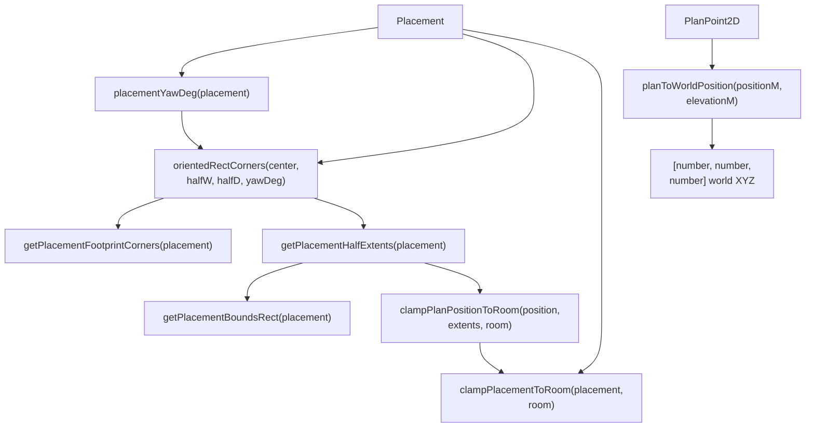
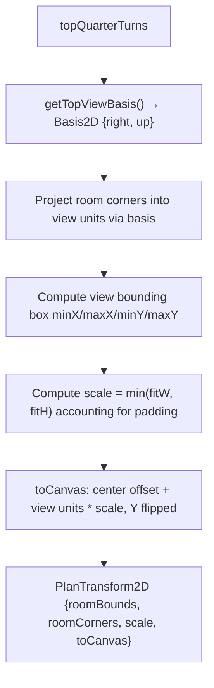
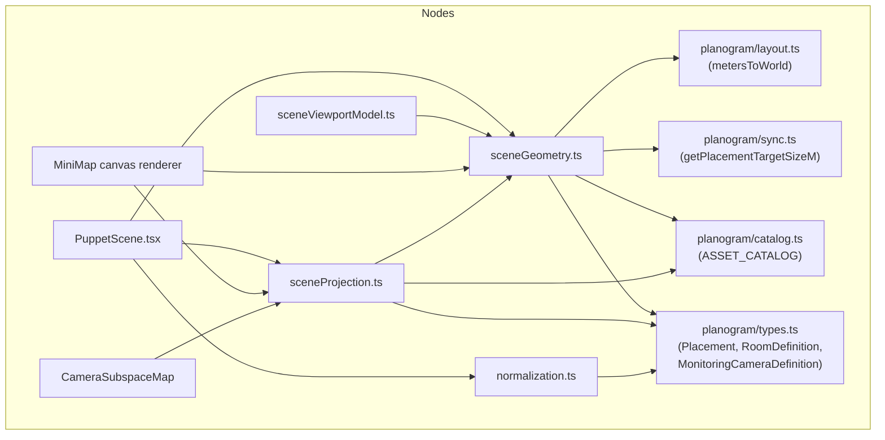

# Scene Geometry & Projection Utilities

Relevant source files

- [](https://github.com/e7canasta/puppet-studio/blob/cdd483bd/src/core/scene-domain/sceneGeometry.ts)
- [](https://github.com/e7canasta/puppet-studio/blob/cdd483bd/src/core/scene-domain/sceneProjection.ts)
- [](https://github.com/e7canasta/puppet-studio/blob/cdd483bd/src/features/scene/model/sceneViewportModel.ts)
- [](https://github.com/e7canasta/puppet-studio/blob/cdd483bd/src/features/scene/ui/PuppetScene.tsx)
- [](https://github.com/e7canasta/puppet-studio/blob/cdd483bd/src/planogram/catalog.ts)
- [](https://github.com/e7canasta/puppet-studio/blob/cdd483bd/src/planogram/normalization.ts)
- [](https://github.com/e7canasta/puppet-studio/blob/cdd483bd/src/planogram/types.ts)

This page documents the pure geometric and projection utility modules that underpin spatial reasoning in the 3D scene: coordinate conversion, placement footprint computation, room-boundary clamping, plan-space-to-canvas projection, camera vector math, and GLTF asset normalization. These utilities are consumed by the 3D renderer ([7.1](https://deepwiki.com/e7canasta/puppet-studio/7.1-puppetscene-component)), the MiniMap canvas renderer ([8.2](https://deepwiki.com/e7canasta/puppet-studio/8.2-minimap-canvas-rendering)), and the camera overlay system ([9](https://deepwiki.com/e7canasta/puppet-studio/9-camera-system)).

---

## Module Overview

|Module|File|Primary Responsibility|
|---|---|---|
|`sceneGeometry`|`src/core/scene-domain/sceneGeometry.ts`|Plan-space geometry: placement footprints, room clamping, coordinate conversion|
|`sceneProjection`|`src/core/scene-domain/sceneProjection.ts`|2D plan-to-canvas transforms, camera vector math, top-view scaling|
|`normalization`|`src/planogram/normalization.ts`|GLTF bounding-box measurement and uniform scale computation|

**Coordinate systems used in this codebase:**

|Space|Axes|Unit|
|---|---|---|
|Plan space|X = room width, Z = room depth (both from room center)|meters|
|World space (Three.js)|X = width, Y = up, Z = depth|world units (`WORLD_UNITS_PER_METER`)|
|Canvas space|X = right, Y = down (top-left origin)|pixels|

`planToWorldPosition` is the canonical bridge between plan space and world space.

Sources: [src/core/scene-domain/sceneGeometry.ts1-122](https://github.com/e7canasta/puppet-studio/blob/cdd483bd/src/core/scene-domain/sceneGeometry.ts#L1-L122) [src/core/scene-domain/sceneProjection.ts1-118](https://github.com/e7canasta/puppet-studio/blob/cdd483bd/src/core/scene-domain/sceneProjection.ts#L1-L118) [src/planogram/normalization.ts1-41](https://github.com/e7canasta/puppet-studio/blob/cdd483bd/src/planogram/normalization.ts#L1-L41)

---

## `sceneGeometry.ts` — Plan-Space Geometry

**Module-level data flow:**



Sources: [src/core/scene-domain/sceneGeometry.ts1-122](https://github.com/e7canasta/puppet-studio/blob/cdd483bd/src/core/scene-domain/sceneGeometry.ts#L1-L122)

### Type Aliases

```
PlanPoint2D  = [number, number]            // [xM, zM] in plan space
PlanRect     = { minX, maxX, minZ, maxZ }  // axis-aligned bounds in plan space
PlanHalfExtents2D = { x, z }              // AABB half-extents after rotation
```

[src/core/scene-domain/sceneGeometry.ts6-18](https://github.com/e7canasta/puppet-studio/blob/cdd483bd/src/core/scene-domain/sceneGeometry.ts#L6-L18)

### Angle Utilities

|Function|Signature|Description|
|---|---|---|
|`degToRad`|`(degrees: number) => number`|Converts degrees to radians (`degrees * π / 180`)|
|`normalizeDeg`|`(value: number) => number`|Normalizes any degree value to `[-180, 180]`|

[src/core/scene-domain/sceneGeometry.ts20-27](https://github.com/e7canasta/puppet-studio/blob/cdd483bd/src/core/scene-domain/sceneGeometry.ts#L20-L27)

### Placement Yaw

```
placementYawDeg(placement) = placement.rotationDeg + asset.defaultRotationDeg
```

`placementYawDeg` reads the `ASSET_CATALOG` to add the asset's `defaultRotationDeg` to the placement's own `rotationDeg`. This is the effective yaw used everywhere geometry is computed.

[src/core/scene-domain/sceneGeometry.ts29-32](https://github.com/e7canasta/puppet-studio/blob/cdd483bd/src/core/scene-domain/sceneGeometry.ts#L29-L32)

### Oriented Rectangle Corners

`orientedRectCorners(center, halfWidthM, halfDepthM, yawDeg)` returns the four corners of a rotated rectangle in plan space. The local-frame corners are:

```
[-halfW, -halfD],  [+halfW, -halfD],
[+halfW, +halfD],  [-halfW, +halfD]
```

Each is rotated by `yawDeg` around the center using a 2D rotation matrix:

```
rotated_x = centerX + lx * cos(yaw) - lz * sin(yaw)
rotated_z = centerZ + lx * sin(yaw) + lz * cos(yaw)
```

[src/core/scene-domain/sceneGeometry.ts34-51](https://github.com/e7canasta/puppet-studio/blob/cdd483bd/src/core/scene-domain/sceneGeometry.ts#L34-L51)

### Placement Footprint Functions

|Function|Returns|Notes|
|---|---|---|
|`getPlacementFootprintCorners`|`PlanPoint2D[]`|Four corners of the placement's footprint using `getPlacementTargetSizeM` and `placementYawDeg`|
|`getPlacementHalfExtents`|`PlanHalfExtents2D`|Axis-aligned half-extents of the rotated footprint (for AABB tests)|
|`getPlacementBoundsRect`|`PlanRect`|Axis-aligned bounding rectangle centered on `planPositionM`|

`getPlacementHalfExtents` computes the AABB half-extents accounting for rotation:

```
x = |cos(yaw)| * halfWidth + |sin(yaw)| * halfDepth
z = |sin(yaw)| * halfWidth + |cos(yaw)| * halfDepth
```

[src/core/scene-domain/sceneGeometry.ts53-84](https://github.com/e7canasta/puppet-studio/blob/cdd483bd/src/core/scene-domain/sceneGeometry.ts#L53-L84)

### Room Clamping

|Function|Purpose|
|---|---|
|`clampPlanPositionToRoom(position, extents, room)`|Clamps a `PlanPoint2D` so the AABB does not exceed room boundaries|
|`clampPlacementToRoom(placement, room)`|Returns a new `Placement` with `planPositionM` clamped; returns the original object unchanged if no clamping was needed|
|`rectsOverlap(a, b)`|Standard AABB overlap test (open intervals)|

The safe range for a center position is:

```
minX = -room.widthM/2 + extents.x    maxX = room.widthM/2 - extents.x
minZ = -room.depthM/2 + extents.z    maxZ = room.depthM/2 - extents.z
```

If `min > max` (object wider than room), the clamp result is the midpoint `(min + max) / 2`.

[src/core/scene-domain/sceneGeometry.ts86-117](https://github.com/e7canasta/puppet-studio/blob/cdd483bd/src/core/scene-domain/sceneGeometry.ts#L86-L117)

### `planToWorldPosition`

```
planToWorldPosition(positionM: PlanPoint2D, elevationM = 0): [number, number, number]
```

Converts a 2D plan-space coordinate to a Three.js world-space position:

```
world X = metersToWorld(positionM[0])   // plan X → world X
world Y = metersToWorld(elevationM)     // floor elevation → world Y (up)
world Z = metersToWorld(positionM[1])   // plan Z → world Z
```

This is the single point that applies the `WORLD_UNITS_PER_METER` scale factor. All 3D scene objects use this function to convert plan-space meter coordinates into world units.

[src/core/scene-domain/sceneGeometry.ts119-121](https://github.com/e7canasta/puppet-studio/blob/cdd483bd/src/core/scene-domain/sceneGeometry.ts#L119-L121) [src/planogram/layout.ts](https://github.com/e7canasta/puppet-studio/blob/cdd483bd/src/planogram/layout.ts)

---

## `sceneProjection.ts` — 2D Canvas Projection & Camera Math

### `PlanTransform2D`

`PlanTransform2D` is the central data structure for mapping plan-space meters to 2D canvas pixels:

```
type PlanTransform2D = {
  roomBounds: { minX, maxX, minY, maxY }  // canvas-space room AABB
  roomCorners: Array<[number, number]>     // canvas-space room corners
  scale: number                            // pixels per meter
  toCanvas: (xM: number, zM: number) => [number, number]
}
```

[src/core/scene-domain/sceneProjection.ts12-17](https://github.com/e7canasta/puppet-studio/blob/cdd483bd/src/core/scene-domain/sceneProjection.ts#L12-L17)

### `createPlanTransform`

```
createPlanTransform(room, mapWidth, mapHeight, padding, topQuarterTurns): PlanTransform2D
```

**Algorithm:**




The `toCanvas` closure captures the center offset and scale:

```
canvas_x = mapWidth/2  + view_x * scale
canvas_y = mapHeight/2 - view_y * scale    ← Y axis flipped
```

[src/core/scene-domain/sceneProjection.ts26-81](https://github.com/e7canasta/puppet-studio/blob/cdd483bd/src/core/scene-domain/sceneProjection.ts#L26-L81)

### Top-View Rotation: `getTopViewBasis`

`topQuarterTurns` controls how the plan is rotated in the 2D view. Each value produces a different `right`/`up` basis:

|`topQuarterTurns`|`right`|`up`|Equivalent rotation|
|---|---|---|---|
|`0`|`[-1, 0]`|`[0, 1]`|0°|
|`1`|`[0, 1]`|`[1, 0]`|90° CCW|
|`2`|`[1, 0]`|`[0, -1]`|180°|
|`3`|`[0, -1]`|`[-1, 0]`|270° CCW|

[src/core/scene-domain/sceneProjection.ts19-24](https://github.com/e7canasta/puppet-studio/blob/cdd483bd/src/core/scene-domain/sceneProjection.ts#L19-L24)

### `computeTopViewPixelsPerMeter`

```
computeTopViewPixelsPerMeter(viewportWidthPx, viewportHeightPx, room): number
```

Returns the optimal pixel density for the top-down orthographic camera view. It is capped at `TOP_VIEW_TARGET_PX_PER_M * WORLD_UNITS_PER_METER` and never falls below `1`.

Used in `CameraPresetController` to set `camera.zoom` for orthographic cameras and to derive the camera distance for perspective cameras.

[src/core/scene-domain/sceneProjection.ts83-90](https://github.com/e7canasta/puppet-studio/blob/cdd483bd/src/core/scene-domain/sceneProjection.ts#L83-L90) [src/features/scene/ui/PuppetScene.tsx422-432](https://github.com/e7canasta/puppet-studio/blob/cdd483bd/src/features/scene/ui/PuppetScene.tsx#L422-L432)

### Camera Vector Math

These functions operate on `MonitoringCameraDefinition` and produce Three.js-compatible vectors:

|Function|Returns|Description|
|---|---|---|
|`cameraWorldPosition(camera)`|`[number, number, number]`|Calls `planToWorldPosition` with `camera.planPositionM` and `camera.heightM`|
|`cameraAngles(camera)`|`{ pitch, yaw }`|`pitchDeg` and `yawDeg` converted to radians|
|`cameraForward(camera)`|`[number, number, number]`|Forward unit vector in world space|

`cameraForward` uses spherical coordinates:

```
forward = [sin(yaw)*cos(pitch),  sin(pitch),  cos(yaw)*cos(pitch)]
```

[src/core/scene-domain/sceneProjection.ts92-106](https://github.com/e7canasta/puppet-studio/blob/cdd483bd/src/core/scene-domain/sceneProjection.ts#L92-L106)

### `computeSensorPlaneDistance`

```
computeSensorPlaneDistance(camera: MonitoringCameraDefinition, anchorWorldZ = 0): number
```

Finds the distance along the camera's forward ray at which the ray crosses the plane `z = anchorWorldZ` in world space.

```
distance = (anchorWorldZ - cameraOrigin.z) / forward.z
```

Falls back to `camera.overlayDistanceM` if:

- `forward.z` is near zero (ray is nearly horizontal)
- The computed distance is non-finite or less than `0.2`

This is used in `MonitoringSensorLayer` to position the detection overlay plane at the correct depth relative to the tracked subject's floor position.

[src/core/scene-domain/sceneProjection.ts108-117](https://github.com/e7canasta/puppet-studio/blob/cdd483bd/src/core/scene-domain/sceneProjection.ts#L108-L117) [src/features/scene/ui/PuppetScene.tsx280-283](https://github.com/e7canasta/puppet-studio/blob/cdd483bd/src/features/scene/ui/PuppetScene.tsx#L280-L283)

---

## `normalization.ts` — GLTF Asset Measurement & Scaling

### `measureObject`

```
measureObject(root: Object3D): MeasuredObject
```

Uses Three.js `Box3.setFromObject` to compute the tight bounding box of any `Object3D` (including a loaded GLTF scene graph).

```
type MeasuredObject = {
  center: { x: number; y: number; z: number }  // bounding box center
  minY: number                                   // lowest Y coordinate (floor contact)
  size: Dimensions3D                             // { width, height, depth }
}
```

All three size components are guarded to be at least `EPSILON = 1e-6` to prevent division-by-zero in scale computation.

[src/planogram/normalization.ts14-30](https://github.com/e7canasta/puppet-studio/blob/cdd483bd/src/planogram/normalization.ts#L14-L30)

### `computeUniformScale`

```
computeUniformScale(current: Dimensions3D, target: Dimensions3D, fitAxis: FitAxis): number
```

Computes a single uniform scale factor so that a GLTF model fits within a target size along the specified axis:

|`fitAxis`|Scale rule|
|---|---|
|`'height'`|`target.height / current.height`|
|`'width'`|`target.width / current.width`|
|`'depth'`|`target.depth / current.depth`|
|`'footprint'`|`min(widthRatio, depthRatio)`|

Used in `RoomItem` to scale each GLTF model to the planogram placement's `targetSizeM`, with the floor offset corrected using `measuredBase.minY * uniformScale`.

[src/planogram/normalization.ts32-41](https://github.com/e7canasta/puppet-studio/blob/cdd483bd/src/planogram/normalization.ts#L32-L41) [src/features/scene/ui/PuppetScene.tsx185-189](https://github.com/e7canasta/puppet-studio/blob/cdd483bd/src/features/scene/ui/PuppetScene.tsx#L185-L189)

---

## Dependency Map



Sources: [src/core/scene-domain/sceneGeometry.ts1-4](https://github.com/e7canasta/puppet-studio/blob/cdd483bd/src/core/scene-domain/sceneGeometry.ts#L1-L4) [src/core/scene-domain/sceneProjection.ts1-3](https://github.com/e7canasta/puppet-studio/blob/cdd483bd/src/core/scene-domain/sceneProjection.ts#L1-L3) [src/planogram/normalization.ts1-4](https://github.com/e7canasta/puppet-studio/blob/cdd483bd/src/planogram/normalization.ts#L1-L4) [src/features/scene/ui/PuppetScene.tsx9-33](https://github.com/e7canasta/puppet-studio/blob/cdd483bd/src/features/scene/ui/PuppetScene.tsx#L9-L33) [src/features/scene/model/sceneViewportModel.ts1-3](https://github.com/e7canasta/puppet-studio/blob/cdd483bd/src/features/scene/model/sceneViewportModel.ts#L1-L3)

---

## Key Constants (from `planogram` index)

The following constants are used by the projection utilities but defined in the planogram package:

|Constant|Used In|Purpose|
|---|---|---|
|`WORLD_UNITS_PER_METER`|`planToWorldPosition`, `computeTopViewPixelsPerMeter`|Scale factor between meter coordinates and Three.js world units|
|`TOP_VIEW_PADDING_M`|`computeTopViewPixelsPerMeter`|Padding around room in meters in the top-down view|
|`TOP_VIEW_TARGET_PX_PER_M`|`computeTopViewPixelsPerMeter`|Maximum desired resolution for the top-down orthographic view|
|`GRID_MAJOR_STEP_M` / `GRID_MINOR_STEP_M`|`WorkHelpers` in `PuppetScene`|Grid spacing in the 3D scene|
|`RAGDOLL_SCALE`|`PuppetScene.tsx`|Scale applied to the ragdoll rig joints and shapes|

Sources: [src/features/scene/ui/PuppetScene.tsx22-33](https://github.com/e7canasta/puppet-studio/blob/cdd483bd/src/features/scene/ui/PuppetScene.tsx#L22-L33) [src/core/scene-domain/sceneProjection.ts1-2](https://github.com/e7canasta/puppet-studio/blob/cdd483bd/src/core/scene-domain/sceneProjection.ts#L1-L2)


### On this page

- [Scene Geometry & Projection Utilities](https://deepwiki.com/e7canasta/puppet-studio/7.2-scene-geometry-and-projection-utilities#scene-geometry-projection-utilities)
- [Module Overview](https://deepwiki.com/e7canasta/puppet-studio/7.2-scene-geometry-and-projection-utilities#module-overview)
- [`sceneGeometry.ts` — Plan-Space Geometry](https://deepwiki.com/e7canasta/puppet-studio/7.2-scene-geometry-and-projection-utilities#scenegeometryts-plan-space-geometry)
- [Type Aliases](https://deepwiki.com/e7canasta/puppet-studio/7.2-scene-geometry-and-projection-utilities#type-aliases)
- [Angle Utilities](https://deepwiki.com/e7canasta/puppet-studio/7.2-scene-geometry-and-projection-utilities#angle-utilities)
- [Placement Yaw](https://deepwiki.com/e7canasta/puppet-studio/7.2-scene-geometry-and-projection-utilities#placement-yaw)
- [Oriented Rectangle Corners](https://deepwiki.com/e7canasta/puppet-studio/7.2-scene-geometry-and-projection-utilities#oriented-rectangle-corners)
- [Placement Footprint Functions](https://deepwiki.com/e7canasta/puppet-studio/7.2-scene-geometry-and-projection-utilities#placement-footprint-functions)
- [Room Clamping](https://deepwiki.com/e7canasta/puppet-studio/7.2-scene-geometry-and-projection-utilities#room-clamping)
- [`planToWorldPosition`](https://deepwiki.com/e7canasta/puppet-studio/7.2-scene-geometry-and-projection-utilities#plantoworldposition)
- [`sceneProjection.ts` — 2D Canvas Projection & Camera Math](https://deepwiki.com/e7canasta/puppet-studio/7.2-scene-geometry-and-projection-utilities#sceneprojectionts-2d-canvas-projection-camera-math)
- [`PlanTransform2D`](https://deepwiki.com/e7canasta/puppet-studio/7.2-scene-geometry-and-projection-utilities#plantransform2d)
- [`createPlanTransform`](https://deepwiki.com/e7canasta/puppet-studio/7.2-scene-geometry-and-projection-utilities#createplantransform)
- [Top-View Rotation: `getTopViewBasis`](https://deepwiki.com/e7canasta/puppet-studio/7.2-scene-geometry-and-projection-utilities#top-view-rotation-gettopviewbasis)
- [`computeTopViewPixelsPerMeter`](https://deepwiki.com/e7canasta/puppet-studio/7.2-scene-geometry-and-projection-utilities#computetopviewpixelspermeter)
- [Camera Vector Math](https://deepwiki.com/e7canasta/puppet-studio/7.2-scene-geometry-and-projection-utilities#camera-vector-math)
- [`computeSensorPlaneDistance`](https://deepwiki.com/e7canasta/puppet-studio/7.2-scene-geometry-and-projection-utilities#computesensorplanedistance)
- [`normalization.ts` — GLTF Asset Measurement & Scaling](https://deepwiki.com/e7canasta/puppet-studio/7.2-scene-geometry-and-projection-utilities#normalizationts-gltf-asset-measurement-scaling)
- [`measureObject`](https://deepwiki.com/e7canasta/puppet-studio/7.2-scene-geometry-and-projection-utilities#measureobject)
- [`computeUniformScale`](https://deepwiki.com/e7canasta/puppet-studio/7.2-scene-geometry-and-projection-utilities#computeuniformscale)
- [Dependency Map](https://deepwiki.com/e7canasta/puppet-studio/7.2-scene-geometry-and-projection-utilities#dependency-map)
- [Key Constants (from `planogram` index)](https://deepwiki.com/e7canasta/puppet-studio/7.2-scene-geometry-and-projection-utilities#key-constants-from-planogram-index)

