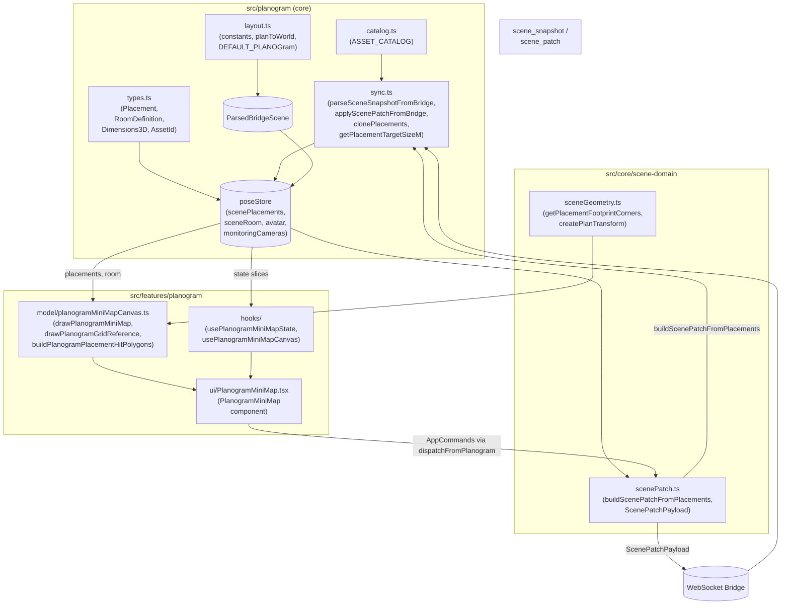
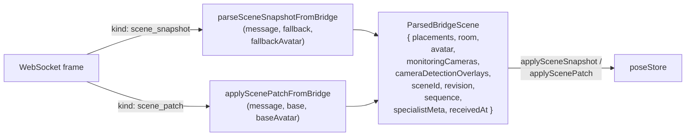
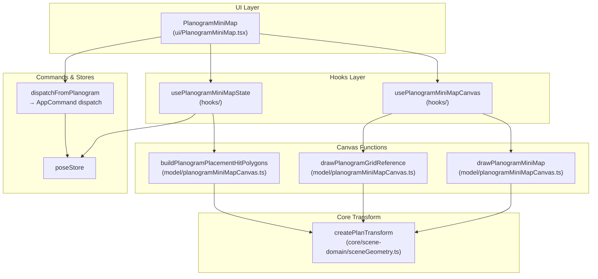

# Planogram System

Relevant source files

- [](https://github.com/e7canasta/puppet-studio/blob/cdd483bd/lib/geometry/src/simula_geometry/cuboid_lift.py)
- [](https://github.com/e7canasta/puppet-studio/blob/cdd483bd/src/core/scene-domain/scenePatch.ts)
- [](https://github.com/e7canasta/puppet-studio/blob/cdd483bd/src/features/camera/model/index.ts)
- [](https://github.com/e7canasta/puppet-studio/blob/cdd483bd/src/features/planogram/model/index.ts)
- [](https://github.com/e7canasta/puppet-studio/blob/cdd483bd/src/features/planogram/model/planogramMiniMapCanvas.ts)
- [](https://github.com/e7canasta/puppet-studio/blob/cdd483bd/src/features/planogram/ui/PlanogramMiniMap.tsx)
- [](https://github.com/e7canasta/puppet-studio/blob/cdd483bd/src/planogram/index.ts)
- [](https://github.com/e7canasta/puppet-studio/blob/cdd483bd/src/planogram/layout.ts)
- [](https://github.com/e7canasta/puppet-studio/blob/cdd483bd/src/planogram/sync.ts)

This page describes the planogram data model, the constants and utilities that operate on it, and how the system fits together at a high level. For detailed coverage of the MiniMap React component and interaction logic, see [Planogram MiniMap](https://deepwiki.com/e7canasta/puppet-studio/8.1-planogram-minimap). For canvas rendering details, see [MiniMap Canvas Rendering](https://deepwiki.com/e7canasta/puppet-studio/8.2-minimap-canvas-rendering). For the bridge ingestion pipeline, see [Scene Sync](https://deepwiki.com/e7canasta/puppet-studio/8.3-scene-sync).

---

## Purpose

The planogram system is the representation of the physical room layout: what objects (fixtures, furniture) exist, where they sit on a 2D floor plan, and how that layout is received from and sent to the WebSocket bridge. It also provides the 2D overhead MiniMap that operators use to view and edit object placement in real time.

---

## Data Model

The core types live in `src/planogram/types.ts` and are re-exported through `src/planogram/index.ts` [src/planogram/index.ts1-6](https://github.com/e7canasta/puppet-studio/blob/cdd483bd/src/planogram/index.ts#L1-L6)

### Key Types

|Type|Description|
|---|---|
|`Placement`|A single object on the floor plan|
|`RoomDefinition`|Dimensions of the room envelope|
|`Dimensions3D`|Width/depth/height in meters|
|`AssetId`|String key into `ASSET_CATALOG`|
|`MonitoringCameraDefinition`|Camera mount position and optics|
|`CameraDetectionOverlay`|Per-camera detection bounding boxes|
|`DetectionBox2D`|A single 2D bounding box (UV-normalized)|
|`PlanogramDefinition`|`{ room: RoomDefinition, placements: Placement[] }`|

### `Placement` Fields

Defined implicitly by `parsePlacement` [src/planogram/sync.ts110-154](https://github.com/e7canasta/puppet-studio/blob/cdd483bd/src/planogram/sync.ts#L110-L154):

|Field|Type|Required|Description|
|---|---|---|---|
|`id`|`string`|Yes|Stable identifier (may be `trk:<trackId>` or `obj:<objectId>`)|
|`assetId`|`AssetId`|Yes|Key into `ASSET_CATALOG`|
|`planPositionM`|`[number, number]`|Yes|`[x, z]` floor-plan position in meters|
|`trackId`|`string`|No|External tracker ID|
|`objectId`|`string`|No|External object/entity ID|
|`rotationDeg`|`number`|No|Yaw rotation in degrees|
|`elevationM`|`number`|No|Vertical offset from floor in meters|
|`targetSizeM`|`Dimensions3D`|No|Override for asset catalog size|

### `RoomDefinition` Fields

Defined by `parseRoom` [src/planogram/sync.ts156-172](https://github.com/e7canasta/puppet-studio/blob/cdd483bd/src/planogram/sync.ts#L156-L172):

|Field|Type|Description|
|---|---|---|
|`widthM`|`number`|Room width (X axis) in meters|
|`depthM`|`number`|Room depth (Z axis) in meters|
|`heightM`|`number`|Ceiling height in meters|
|`wallThicknessM`|`number`|Wall thickness in meters|

### `ASSET_CATALOG`

Defined in `src/planogram/catalog.ts` and re-exported via `src/planogram/index.ts` [src/planogram/index.ts1](https://github.com/e7canasta/puppet-studio/blob/cdd483bd/src/planogram/index.ts#L1-L1)

`ASSET_CATALOG` maps each `AssetId` string to an asset definition including:

- `targetSizeM` (`Dimensions3D`) — canonical physical dimensions
- `miniMapColor` — CSS color string used by the MiniMap renderer
- `label` — human-readable display name

The catalog is used in two key places:

- `isAssetId` [src/planogram/sync.ts80-82](https://github.com/e7canasta/puppet-studio/blob/cdd483bd/src/planogram/sync.ts#L80-L82) validates incoming bridge data against the catalog
- `getPlacementTargetSizeM` [src/planogram/sync.ts407-409](https://github.com/e7canasta/puppet-studio/blob/cdd483bd/src/planogram/sync.ts#L407-L409) resolves effective dimensions: it returns `placement.targetSizeM` if present, otherwise falls back to the catalog default

---

## Layout Constants

Defined in `src/planogram/layout.ts` [src/planogram/layout.ts1-35](https://github.com/e7canasta/puppet-studio/blob/cdd483bd/src/planogram/layout.ts#L1-L35):

|Constant|Value|Purpose|
|---|---|---|
|`WORLD_UNITS_PER_METER`|`1`|Scale factor (1:1)|
|`GRID_MINOR_STEP_M`|`0.5`|Minor grid spacing in meters|
|`GRID_MAJOR_STEP_M`|`1`|Major grid spacing in meters|
|`TOP_VIEW_TARGET_PX_PER_M`|`90`|Target density for the top-down 3D view|
|`TARGET_AVATAR_HEIGHT_M`|`1.72`|Reference avatar height|
|`TARGET_AVATAR_FOOTPRINT_WIDTH_M`|`0.52`|Avatar footprint width used in MiniMap|
|`TARGET_AVATAR_FOOTPRINT_DEPTH_M`|`0.34`|Avatar footprint depth used in MiniMap|
|`DEFAULT_PLANOGRAM`|`{ room: 4×4×2.7m, placements: [] }`|Fallback used before any bridge scene arrives|

The `planToWorld` utility converts a 2D plan `[x, z]` position (with optional elevation) into a 3D world `[x, y, z]` vector [src/planogram/layout.ts33-35](https://github.com/e7canasta/puppet-studio/blob/cdd483bd/src/planogram/layout.ts#L33-L35)

---

## System Overview

**Planogram system modules and their roles**



Sources: [src/planogram/index.ts1-6](https://github.com/e7canasta/puppet-studio/blob/cdd483bd/src/planogram/index.ts#L1-L6) [src/planogram/sync.ts1-11](https://github.com/e7canasta/puppet-studio/blob/cdd483bd/src/planogram/sync.ts#L1-L11) [src/planogram/layout.ts1-35](https://github.com/e7canasta/puppet-studio/blob/cdd483bd/src/planogram/layout.ts#L1-L35) [src/features/planogram/ui/PlanogramMiniMap.tsx1-20](https://github.com/e7canasta/puppet-studio/blob/cdd483bd/src/features/planogram/ui/PlanogramMiniMap.tsx#L1-L20) [src/features/planogram/model/planogramMiniMapCanvas.ts1-18](https://github.com/e7canasta/puppet-studio/blob/cdd483bd/src/features/planogram/model/planogramMiniMapCanvas.ts#L1-L18) [src/core/scene-domain/scenePatch.ts1-10](https://github.com/e7canasta/puppet-studio/blob/cdd483bd/src/core/scene-domain/scenePatch.ts#L1-L10)

---

## Bridge Synchronization Overview

The bridge delivers scene state via two message kinds: full snapshots and incremental patches. Both are parsed in `src/planogram/sync.ts` and produce a `ParsedBridgeScene` value that is committed to `poseStore`.

**Bridge ingestion pipeline**



Sources: [src/planogram/sync.ts411-468](https://github.com/e7canasta/puppet-studio/blob/cdd483bd/src/planogram/sync.ts#L411-L468) [src/planogram/sync.ts471-550](https://github.com/e7canasta/puppet-studio/blob/cdd483bd/src/planogram/sync.ts#L471-L550)

### `ParsedBridgeScene` Structure

`ParsedBridgeScene` is an internal type [src/planogram/sync.ts35-44](https://github.com/e7canasta/puppet-studio/blob/cdd483bd/src/planogram/sync.ts#L35-L44) extending the snapshot with:

|Field|Type|Source|
|---|---|---|
|`placements`|`Placement[]`|`entities[]` or `placements[]` in message|
|`room`|`RoomDefinition`|`metadata.room` or `room` in message|
|`avatar`|`AvatarTransform \| null`|Character entity from `entities[]`|
|`monitoringCameras`|`MonitoringCameraDefinition[] \| null`|`metadata.monitoringCameras`|
|`cameraDetectionOverlays`|`CameraDetectionOverlay[] \| null`|`metadata.cameraDetections`|
|`sceneId`|`string \| null`|`message.sceneId` or `source.sceneId`|
|`revision`|`number \| null`|`message.revision`|
|`sequence`|`number \| null`|`message.sequence`|
|`specialistMeta`|`SceneSpecialistMeta \| null`|`metadata.specialist`|
|`receivedAt`|`string`|`message.receivedAt` or current time|

### `SceneSpecialistMeta`

Carries provenance and freshness metadata from an upstream spatial analysis service [src/planogram/sync.ts19-26](https://github.com/e7canasta/puppet-studio/blob/cdd483bd/src/planogram/sync.ts#L19-L26):

|Field|Type|Description|
|---|---|---|
|`source`|`string \| null`|Originating system name|
|`generatedAt`|`string \| null`|ISO timestamp of scene generation|
|`spatialAgeS`|`number \| null`|Age of spatial data in seconds|
|`spatialFresh`|`boolean \| null`|Whether data is within freshness window|
|`spatialStaleAfterS`|`number \| null`|Freshness threshold in seconds|
|`stalePolicy`|`string \| null`|Policy name applied when stale|

### `AvatarTransform`

Tracks the avatar (character entity) on the floor plan [src/planogram/sync.ts28-33](https://github.com/e7canasta/puppet-studio/blob/cdd483bd/src/planogram/sync.ts#L28-L33):

|Field|Type|Description|
|---|---|---|
|`objectId`|`string \| null`|Entity object ID|
|`planPositionM`|`[number, number]`|`[x, z]` floor position|
|`rotationDeg`|`number`|Yaw in degrees|
|`trackId`|`string \| null`|Tracker ID|

### Patch Mechanics

`applyScenePatchFromBridge` [src/planogram/sync.ts471-550](https://github.com/e7canasta/puppet-studio/blob/cdd483bd/src/planogram/sync.ts#L471-L550) performs incremental updates:

1. **Removes** — filters out placements matching any token in `rawPatch.removes` (matched by `id`, `trackId`, or `objectId` via `placementMatchesToken`)
2. **Upserts** — iterates `rawPatch.upserts` (or `rawPatch.entities`); uses `findPlacementIndex` to locate existing placements by `trackId` → `objectId` → `id` priority order; replaces or appends

### Outbound Patch Building

When local edits are published to the bridge, `buildScenePatchFromPlacements` [src/core/scene-domain/scenePatch.ts49-79](https://github.com/e7canasta/puppet-studio/blob/cdd483bd/src/core/scene-domain/scenePatch.ts#L49-L79) diffs two `Placement[]` arrays and returns a `ScenePatchPayload`:

```
ScenePatchPayload {
  removes?: string[]         // IDs of removed placements
  upserts?: Record<string, unknown>[]  // Changed or added entities
}
```

Placements are compared field-by-field (including `targetSizeM`) by `placementEquals` [src/core/scene-domain/scenePatch.ts12-26](https://github.com/e7canasta/puppet-studio/blob/cdd483bd/src/core/scene-domain/scenePatch.ts#L12-L26) Only changed or newly added placements produce upserts.

---

## MiniMap Visualization Overview

The `PlanogramMiniMap` component renders a 2D top-down canvas view of all placements, the room boundary, coordinate grid, avatar footprint, and constraint zones.

**MiniMap component relationships**


Sources: [src/features/planogram/ui/PlanogramMiniMap.tsx22-60](https://github.com/e7canasta/puppet-studio/blob/cdd483bd/src/features/planogram/ui/PlanogramMiniMap.tsx#L22-L60) [src/features/planogram/model/planogramMiniMapCanvas.ts191-325](https://github.com/e7canasta/puppet-studio/blob/cdd483bd/src/features/planogram/model/planogramMiniMapCanvas.ts#L191-L325) [src/features/planogram/model/planogramMiniMapCanvas.ts406-416](https://github.com/e7canasta/puppet-studio/blob/cdd483bd/src/features/planogram/model/planogramMiniMapCanvas.ts#L406-L416)

The canvas dimensions are fixed constants [src/features/planogram/model/planogramMiniMapCanvas.ts19-25](https://github.com/e7canasta/puppet-studio/blob/cdd483bd/src/features/planogram/model/planogramMiniMapCanvas.ts#L19-L25):

|Constant|Value|Purpose|
|---|---|---|
|`PLANOGRAM_MAP_WIDTH`|`280`|Main map canvas width (CSS px)|
|`PLANOGRAM_MAP_HEIGHT`|`220`|Main map canvas height (CSS px)|
|`PLANOGRAM_MAP_PADDING`|`18`|Inset padding for room bounds|
|`PLANOGRAM_GRID_REF_WIDTH`|`280`|Grid reference canvas width|
|`PLANOGRAM_GRID_REF_HEIGHT`|`145`|Grid reference canvas height|

Placement hit-testing is polygon-based: `buildPlanogramPlacementHitPolygons` projects each placement's footprint corners into canvas space, and `pointInPolygon` (ray-casting algorithm) tests pointer events [src/features/planogram/model/planogramMiniMapCanvas.ts418-430](https://github.com/e7canasta/puppet-studio/blob/cdd483bd/src/features/planogram/model/planogramMiniMapCanvas.ts#L418-L430) The MiniMap iterates hit polygons in reverse render order to pick the topmost placement [src/features/planogram/ui/PlanogramMiniMap.tsx152-162](https://github.com/e7canasta/puppet-studio/blob/cdd483bd/src/features/planogram/ui/PlanogramMiniMap.tsx#L152-L162)

For full details on canvas rendering, see [MiniMap Canvas Rendering](https://deepwiki.com/e7canasta/puppet-studio/8.2-minimap-canvas-rendering). For the state hook and interaction logic, see [Planogram MiniMap](https://deepwiki.com/e7canasta/puppet-studio/8.1-planogram-minimap).

---

## Relationship to poseStore

The planogram data is owned by `poseStore`. The relevant state slices are:

|Slice|Type|Description|
|---|---|---|
|`scenePlacements`|`Placement[]`|Current floor-plan objects|
|`sceneRoom`|`RoomDefinition`|Current room dimensions|
|`avatar`|`AvatarTransform \| null`|Avatar position/rotation|
|`monitoringCameras`|`MonitoringCameraDefinition[]`|Camera mounts|
|`cameraDetectionOverlays`|`CameraDetectionOverlay[]`|Detection bounding boxes|
|`sceneRevision`|`number \| null`|Last received revision counter|
|`sceneSequence`|`number \| null`|Last received sequence counter|

For the full `poseStore` schema and actions, see [State Management](https://deepwiki.com/e7canasta/puppet-studio/3-state-management).


### On this page

- [Planogram System](https://deepwiki.com/e7canasta/puppet-studio/8-planogram-system#planogram-system)
- [Purpose](https://deepwiki.com/e7canasta/puppet-studio/8-planogram-system#purpose)
- [Data Model](https://deepwiki.com/e7canasta/puppet-studio/8-planogram-system#data-model)
- [Key Types](https://deepwiki.com/e7canasta/puppet-studio/8-planogram-system#key-types)
- [`Placement` Fields](https://deepwiki.com/e7canasta/puppet-studio/8-planogram-system#placement-fields)
- [`RoomDefinition` Fields](https://deepwiki.com/e7canasta/puppet-studio/8-planogram-system#roomdefinition-fields)
- [`ASSET_CATALOG`](https://deepwiki.com/e7canasta/puppet-studio/8-planogram-system#asset_catalog)
- [Layout Constants](https://deepwiki.com/e7canasta/puppet-studio/8-planogram-system#layout-constants)
- [System Overview](https://deepwiki.com/e7canasta/puppet-studio/8-planogram-system#system-overview)
- [Bridge Synchronization Overview](https://deepwiki.com/e7canasta/puppet-studio/8-planogram-system#bridge-synchronization-overview)
- [`ParsedBridgeScene` Structure](https://deepwiki.com/e7canasta/puppet-studio/8-planogram-system#parsedbridgescene-structure)
- [`SceneSpecialistMeta`](https://deepwiki.com/e7canasta/puppet-studio/8-planogram-system#scenespecialistmeta)
- [`AvatarTransform`](https://deepwiki.com/e7canasta/puppet-studio/8-planogram-system#avatartransform)
- [Patch Mechanics](https://deepwiki.com/e7canasta/puppet-studio/8-planogram-system#patch-mechanics)
- [Outbound Patch Building](https://deepwiki.com/e7canasta/puppet-studio/8-planogram-system#outbound-patch-building)
- [MiniMap Visualization Overview](https://deepwiki.com/e7canasta/puppet-studio/8-planogram-system#minimap-visualization-overview)
- [Relationship to poseStore](https://deepwiki.com/e7canasta/puppet-studio/8-planogram-system#relationship-to-posestore)

