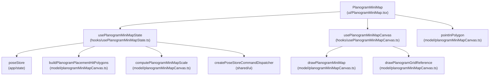
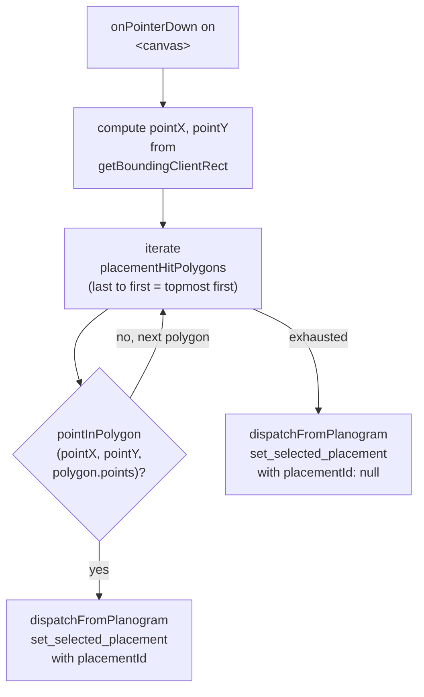
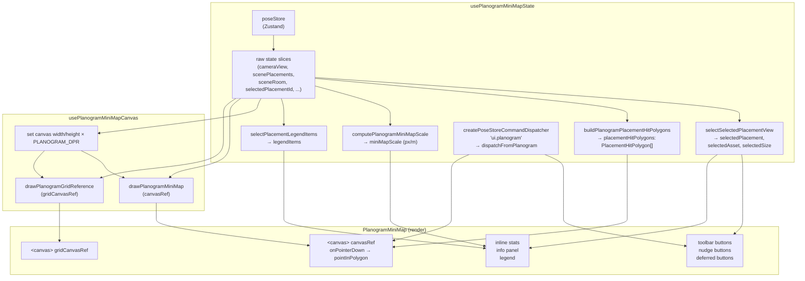

# Planogram MiniMap

Relevant source files

- [](https://github.com/e7canasta/puppet-studio/blob/cdd483bd/src/features/camera/ui/index.ts)
- [](https://github.com/e7canasta/puppet-studio/blob/cdd483bd/src/features/planogram/hooks/index.ts)
- [](https://github.com/e7canasta/puppet-studio/blob/cdd483bd/src/features/planogram/hooks/usePlanogramMiniMapCanvas.ts)
- [](https://github.com/e7canasta/puppet-studio/blob/cdd483bd/src/features/planogram/hooks/usePlanogramMiniMapState.ts)
- [](https://github.com/e7canasta/puppet-studio/blob/cdd483bd/src/features/planogram/model/planogramMiniMapCanvas.ts)
- [](https://github.com/e7canasta/puppet-studio/blob/cdd483bd/src/features/planogram/ui/PlanogramMiniMap.tsx)
- [](https://github.com/e7canasta/puppet-studio/blob/cdd483bd/src/features/planogram/ui/index.ts)
- [](https://github.com/e7canasta/puppet-studio/blob/cdd483bd/src/planogram/layout.ts)

## Purpose & Scope

This page documents the **Planogram MiniMap** subsystem: the `PlanogramMiniMap` React component, the `usePlanogramMiniMapState` hook that derives all its state from `poseStore`, the `usePlanogramMiniMapCanvas` hook that drives canvas rendering, and the pointer-event hit-testing logic used for placement selection.

For the low-level canvas drawing routines (`drawPlanogramMiniMap`, `drawPlanogramGridReference`, `PlacementHitPolygon`, `PlanTransform2D`) see [8.2](https://github.com/e7canasta/puppet-studio/blob/cdd483bd/8.2) For the planogram data model (`Placement`, `RoomDefinition`, `ASSET_CATALOG`) and bridge synchronization see [8](https://github.com/e7canasta/puppet-studio/blob/cdd483bd/8) and [8.3](https://github.com/e7canasta/puppet-studio/blob/cdd483bd/8.3)

---

## Overview

The MiniMap is a 2D top-down canvas widget embedded inside the workspace panel grid. It gives the operator a plan-view of the scene room, showing placement footprints, avatar position, constraint zones, and an axis/scale reference. It also hosts the toolbar buttons and nudge controls for editing placements.

**Two `<canvas>` elements are managed:**

|Canvas ref|Size (CSS)|Content|
|---|---|---|
|`canvasRef`|280 × 220 px|Full MiniMap: room, placements, avatar, grid, constraints, scale bar|
|`gridCanvasRef`|280 × 145 px|Grid reference only: axes, integer metre tick marks|

Canvas physical pixels are scaled by `PLANOGRAM_DPR` (= `window.devicePixelRatio`) for HiDPI sharpness.

Sources: [src/features/planogram/ui/PlanogramMiniMap.tsx22-82](https://github.com/e7canasta/puppet-studio/blob/cdd483bd/src/features/planogram/ui/PlanogramMiniMap.tsx#L22-L82) [src/features/planogram/hooks/usePlanogramMiniMapCanvas.ts49-95](https://github.com/e7canasta/puppet-studio/blob/cdd483bd/src/features/planogram/hooks/usePlanogramMiniMapCanvas.ts#L49-L95) [src/features/planogram/model/planogramMiniMapCanvas.ts19-26](https://github.com/e7canasta/puppet-studio/blob/cdd483bd/src/features/planogram/model/planogramMiniMapCanvas.ts#L19-L26)

---

## Component Tree

**Diagram: PlanogramMiniMap component and its hooks**



Sources: [src/features/planogram/ui/PlanogramMiniMap.tsx1-82](https://github.com/e7canasta/puppet-studio/blob/cdd483bd/src/features/planogram/ui/PlanogramMiniMap.tsx#L1-L82) [src/features/planogram/hooks/usePlanogramMiniMapState.ts1-100](https://github.com/e7canasta/puppet-studio/blob/cdd483bd/src/features/planogram/hooks/usePlanogramMiniMapState.ts#L1-L100) [src/features/planogram/hooks/usePlanogramMiniMapCanvas.ts1-95](https://github.com/e7canasta/puppet-studio/blob/cdd483bd/src/features/planogram/hooks/usePlanogramMiniMapCanvas.ts#L1-L95)

---

## `usePlanogramMiniMapState` Hook

`usePlanogramMiniMapState` is the sole state source for `PlanogramMiniMap`. It subscribes to individual `poseStore` slices and computes several memoized derived values.

### Raw poseStore subscriptions

|Returned name|poseStore field|
|---|---|
|`cameraView`|`state.cameraView`|
|`avatarPlanPositionM`|`state.avatarPlanPositionM`|
|`avatarRotationDeg`|`state.avatarRotationDeg`|
|`avatarTrackId`|`state.avatarTrackId`|
|`sceneError`|`state.sceneError`|
|`sceneLastEventAt`|`state.sceneLastEventAt`|
|`scenePlacements`|`state.scenePlacements`|
|`sceneRevision`|`state.sceneRevision`|
|`sceneRoom`|`state.sceneRoom`|
|`sceneSequence`|`state.sceneSequence`|
|`sceneSource`|`state.sceneSource`|
|`sceneEditEnabled`|`state.sceneEditEnabled`|
|`sceneRemoteHoldEnabled`|`state.sceneRemoteHoldEnabled`|
|`sceneDeferredRemoteCount`|`state.sceneDeferredRemoteCount`|
|`sceneDeferredApplyPendingConfirm`|`state.sceneDeferredApplyPendingConfirm`|
|`sceneDeferredRemoteLastAt`|`state.sceneDeferredRemoteLastAt`|
|`sceneDeferredRemoteLastKind`|`state.sceneDeferredRemoteLastKind`|
|`sceneRemoteOverrideAt`|`state.sceneRemoteOverrideAt`|
|`sceneRemoteOverrideKind`|`state.sceneRemoteOverrideKind`|
|`monitoringCameras`|`state.monitoringCameras`|
|`projectionMode`|`state.projectionMode`|
|`selectedMonitoringCameraId`|`state.selectedMonitoringCameraId`|
|`selectedPlacementId`|`state.selectedPlacementId`|
|`sceneRedoDepth`|`state.sceneRedoDepth`|
|`sceneUndoDepth`|`state.sceneUndoDepth`|
|`showDimensions`|`state.showDimensions`|
|`topQuarterTurns`|`state.topQuarterTurns`|

### Memoized derived values

|Returned name|Derivation|
|---|---|
|`selectedPlacement`, `selectedPlacementAssetId`, `selectedAsset`, `selectedSize`|`selectSelectedPlacementView(scenePlacements, selectedPlacementId)`|
|`selectedMonitoringCamera`|`selectMonitoringCamera(monitoringCameras, selectedMonitoringCameraId)`|
|`legendItems`|`selectPlacementLegendItems(scenePlacements)`|
|`miniMapScale`|`computePlanogramMiniMapScale(sceneRoom, topQuarterTurns)` — pixels per metre at current map size|
|`placementHitPolygons`|`buildPlanogramPlacementHitPolygons(scenePlacements, sceneRoom, topQuarterTurns)`|

### Command dispatcher

`dispatchFromPlanogram` is created via `createPoseStoreCommandDispatcher('ui.planogram')`. All button clicks and canvas pointer events route through this dispatcher, tagging every command with the `'ui.planogram'` source.

Sources: [src/features/planogram/hooks/usePlanogramMiniMapState.ts15-100](https://github.com/e7canasta/puppet-studio/blob/cdd483bd/src/features/planogram/hooks/usePlanogramMiniMapState.ts#L15-L100)

---

## `usePlanogramMiniMapCanvas` Hook

`usePlanogramMiniMapCanvas` is a `useEffect`-based hook that owns canvas sizing and re-drawing. It takes two `RefObject<HTMLCanvasElement>` arguments and a `UsePlanogramMiniMapCanvasArgs` bag.

**Effect dependencies** (any change triggers a full redraw):

- `avatar` (position, rotation, trackId)
- `constraints`
- `scenePlacements`
- `sceneRoom`
- `selectedPlacementAssetId`
- `selectedPlacementId`
- `showDimensions`
- `topQuarterTurns`

**Rendering steps inside the effect:**

1. Set physical pixel dimensions on both canvases (`width × PLANOGRAM_DPR`).
2. Apply a `setTransform(DPR, 0, 0, DPR, 0, 0)` scale so all drawing coordinates remain in CSS pixels.
3. Call `drawPlanogramMiniMap(...)` on `canvasRef`.
4. Call `drawPlanogramGridReference(...)` on `gridCanvasRef`.

See [8.2](https://github.com/e7canasta/puppet-studio/blob/cdd483bd/8.2) for the full drawing pipeline.

Sources: [src/features/planogram/hooks/usePlanogramMiniMapCanvas.ts33-95](https://github.com/e7canasta/puppet-studio/blob/cdd483bd/src/features/planogram/hooks/usePlanogramMiniMapCanvas.ts#L33-L95)

---

## Pointer-Event Hit Testing

Placement selection on the canvas uses `pointInPolygon` (a ray-casting algorithm):

**Diagram: Pointer-down hit-test flow**



`placementHitPolygons` is a `PlacementHitPolygon[]` where each entry holds a `placementId` and four canvas-space corner points derived from `getPlacementFootprintCorners` projected through the current `PlanTransform2D`. Iteration goes from last to first index so that visually topmost placements (rendered last) are hit first.

Sources: [src/features/planogram/ui/PlanogramMiniMap.tsx147-164](https://github.com/e7canasta/puppet-studio/blob/cdd483bd/src/features/planogram/ui/PlanogramMiniMap.tsx#L147-L164) [src/features/planogram/model/planogramMiniMapCanvas.ts406-430](https://github.com/e7canasta/puppet-studio/blob/cdd483bd/src/features/planogram/model/planogramMiniMapCanvas.ts#L406-L430)

---

## UI Sections & Controls

**Diagram: PlanogramMiniMap UI layout and the commands each control dispatches**

```mermaid
graph TD
    subgraph "mini-map-legend"
        A["legendItems color dots"]
    end

    subgraph "gridCanvasRef"
        B["drawPlanogramGridReference"]
    end

    subgraph "placement-tools"
        C["placement label + Cotas<br/>set_show_dimensions"]
        D["↑ ↓ ← →<br/>move_selected_by ±SCENE_COMMAND_MOVE_STEP_M"]
        E["⟲ ⟳<br/>rotate_selected_by ±SCENE_COMMAND_ROTATE_STEP_DEG"]
        F["Snap 5cm<br/>snap_selected_to_grid SCENE_COMMAND_SNAP_STEP_M"]
        G["Undo / Redo<br/>undo_scene_edit / redo_scene_edit"]
    end

    subgraph "mini-map-select-row"
        H["camera select<br/>set_selected_monitoring_camera"]
    end

    subgraph "details.mini-map-info"
        I["grid steps, miniMapScale,<br/>constraints, deferred mode,<br/>hold release, remote overwrite"]
    end

    subgraph "mini-map-inline-actions"
        J["apply deferred<br/>apply_deferred_scene_remote"]
        K["clear deferred<br/>clear_scene_deferred_remote"]
        L["clear overwrite flag<br/>clear_scene_remote_override"]
    end

    subgraph "mini-map-inline-stats"
        M["source, rev, seq, last"]
        N["edit, hold, deferred, cams"]
    end

    subgraph "canvas"
        O["onPointerDown<br/>set_selected_placement"]
    end

    subgraph "mini-map-head"
        P["Iso / Top / Cam<br/>set_camera_view"]
        Q["↺ ↻<br/>rotate_top_view direction:-1/+1"]
        R["Ortho / Persp<br/>set_projection_mode"]
        S["Edit on/off<br/>toggle_scene_edit"]
        T["Hold remote / Accept remote<br/>toggle_scene_remote_hold"]
    end

    A --> B
    B --> C
    C --> D
    D --> E
    E --> F
    F --> G
    G --> H
    H --> I
    I --> J
    J --> K
    K --> L
    L --> M
    M --> N
    N --> O
    O --> P
    P --> Q
    Q --> R
    R --> S
    S --> T
```



Sources: [src/features/planogram/ui/PlanogramMiniMap.tsx83-411](https://github.com/e7canasta/puppet-studio/blob/cdd483bd/src/features/planogram/ui/PlanogramMiniMap.tsx#L83-L411)

### Toolbar Buttons

|Button|Enabled condition|Dispatched command|
|---|---|---|
|Iso View|always|`set_camera_view` `view:'iso'`|
|Top|always|`set_camera_view` `view:'top'`|
|Cam|`monitoringCameras.length > 0`|`set_camera_view` `view:'sensor'`|
|↺ / ↻|always|`rotate_top_view` `direction: -1 / +1`|
|Ortho / Persp|always|`set_projection_mode` `mode:'orthographic'/'perspective'`|
|Edit on/off|always|`toggle_scene_edit`|
|Hold remote / Accept remote|always|`toggle_scene_remote_hold`|

### Placement Edit Buttons

All placement-edit buttons are disabled when `!sceneEditEnabled || !selectedPlacement`.

|Button|Command kind|Parameters|
|---|---|---|
|↑|`move_selected_by`|`deltaM: [0, SCENE_COMMAND_MOVE_STEP_M]`|
|↓|`move_selected_by`|`deltaM: [0, -SCENE_COMMAND_MOVE_STEP_M]`|
|←|`move_selected_by`|`deltaM: [-SCENE_COMMAND_MOVE_STEP_M, 0]`|
|→|`move_selected_by`|`deltaM: [SCENE_COMMAND_MOVE_STEP_M, 0]`|
|⟲ 15°|`rotate_selected_by`|`deltaDeg: -SCENE_COMMAND_ROTATE_STEP_DEG`|
|⟳ 15°|`rotate_selected_by`|`deltaDeg: +SCENE_COMMAND_ROTATE_STEP_DEG`|
|Snap 5cm|`snap_selected_to_grid`|`stepM: SCENE_COMMAND_SNAP_STEP_M`|
|Undo|`undo_scene_edit`|disabled when `sceneUndoDepth <= 0`|
|Redo|`redo_scene_edit`|disabled when `sceneRedoDepth <= 0`|

Step constants are defined in `src/core/config` and referenced as `SCENE_COMMAND_MOVE_STEP_M`, `SCENE_COMMAND_ROTATE_STEP_DEG`, `SCENE_COMMAND_SNAP_STEP_M`.

Sources: [src/features/planogram/ui/PlanogramMiniMap.tsx86-376](https://github.com/e7canasta/puppet-studio/blob/cdd483bd/src/features/planogram/ui/PlanogramMiniMap.tsx#L86-L376)

### Deferred Remote Actions

The inline action block (`mini-map-inline-actions`) is shown when `sceneDeferredRemoteCount > 0` or `sceneRemoteOverrideAt` is set:

- **apply deferred** — dispatches `apply_deferred_scene_remote`. If `sceneDeferredApplyPendingConfirm` is true, the label becomes "confirm + apply deferred".
- **clear deferred** — dispatches `clear_scene_deferred_remote`.
- **clear overwrite flag** — shown only when `sceneRemoteOverrideAt` is truthy; dispatches `clear_scene_remote_override`.

Sources: [src/features/planogram/ui/PlanogramMiniMap.tsx178-208](https://github.com/e7canasta/puppet-studio/blob/cdd483bd/src/features/planogram/ui/PlanogramMiniMap.tsx#L178-L208)

### Info Panel (Expandable `<details>`)

The collapsible `<details class="mini-map-info">` block displays read-only diagnostics:

|Field|Source|
|---|---|
|Grid minor/major step|`GRID_MINOR_STEP_M`, `GRID_MAJOR_STEP_M` (from `src/planogram/layout.ts`)|
|MiniMap scale|`miniMapScale` (px/m)|
|Top-ortho target|`TOP_VIEW_TARGET_PX_PER_M`|
|Constraint zone count|`runtimeConfig.sceneConstraintZones.length`|
|Deferred mode / queue limit|`runtimeConfig.sceneDeferredApplyMode`, `runtimeConfig.sceneDeferredQueueLimit`|
|Hold release auto/confirm|`runtimeConfig.sceneDeferredAutoApplyOnRelease`, `runtimeConfig.sceneDeferredRequireConfirmOnRelease`|
|Deferred latest|`sceneDeferredRemoteLastKind`, `sceneDeferredRemoteLastAt`|
|Deferred confirm pending|`sceneDeferredApplyPendingConfirm`|
|Remote overwrite|`sceneRemoteOverrideKind`, `sceneRemoteOverrideAt`|
|Active camera|`selectedMonitoringCamera?.label`|

Sources: [src/features/planogram/ui/PlanogramMiniMap.tsx209-237](https://github.com/e7canasta/puppet-studio/blob/cdd483bd/src/features/planogram/ui/PlanogramMiniMap.tsx#L209-L237)

### Selected Placement Label

When a placement is selected, the label above the edit grid reads:

```
<asset.label> • x:<planPositionM[0]> z:<planPositionM[1]> • rot:<rotationDeg>° • <w>x<d>x<h>m [• track:...] [• object:...]
```

When nothing is selected, it shows "Selecciona un mueble en el minimapa".

Sources: [src/features/planogram/ui/PlanogramMiniMap.tsx261-269](https://github.com/e7canasta/puppet-studio/blob/cdd483bd/src/features/planogram/ui/PlanogramMiniMap.tsx#L261-L269)

### Legend

The `legendItems` array (from `selectPlacementLegendItems`) provides `{ id, miniMapColor, label }` objects. Each is rendered as a color dot next to the asset label. An additional "Avatar" entry with class `avatar-dot` is appended statically.

Sources: [src/features/planogram/ui/PlanogramMiniMap.tsx397-408](https://github.com/e7canasta/puppet-studio/blob/cdd483bd/src/features/planogram/ui/PlanogramMiniMap.tsx#L397-L408) [src/features/planogram/hooks/usePlanogramMiniMapState.ts52](https://github.com/e7canasta/puppet-studio/blob/cdd483bd/src/features/planogram/hooks/usePlanogramMiniMapState.ts#L52-L52)

---

## Constants

|Constant|Value|Defined in|
|---|---|---|
|`PLANOGRAM_MAP_WIDTH`|280|`model/planogramMiniMapCanvas.ts:19`|
|`PLANOGRAM_MAP_HEIGHT`|220|`model/planogramMiniMapCanvas.ts:20`|
|`PLANOGRAM_MAP_PADDING`|18|`model/planogramMiniMapCanvas.ts:21`|
|`PLANOGRAM_GRID_REF_WIDTH`|280|`model/planogramMiniMapCanvas.ts:22`|
|`PLANOGRAM_GRID_REF_HEIGHT`|145|`model/planogramMiniMapCanvas.ts:23`|
|`PLANOGRAM_GRID_REF_PADDING`|16|`model/planogramMiniMapCanvas.ts:24`|
|`PLANOGRAM_DPR`|`window.devicePixelRatio \| 1`|`model/planogramMiniMapCanvas.ts:25`|
|`GRID_MINOR_STEP_M`|0.5 m|`src/planogram/layout.ts:4`|
|`GRID_MAJOR_STEP_M`|1.0 m|`src/planogram/layout.ts:5`|
|`TOP_VIEW_TARGET_PX_PER_M`|90|`src/planogram/layout.ts:6`|
|`TARGET_AVATAR_FOOTPRINT_WIDTH_M`|0.52 m|`src/planogram/layout.ts:11`|
|`TARGET_AVATAR_FOOTPRINT_DEPTH_M`|0.34 m|`src/planogram/layout.ts:12`|

Sources: [src/features/planogram/model/planogramMiniMapCanvas.ts19-26](https://github.com/e7canasta/puppet-studio/blob/cdd483bd/src/features/planogram/model/planogramMiniMapCanvas.ts#L19-L26) [src/planogram/layout.ts4-12](https://github.com/e7canasta/puppet-studio/blob/cdd483bd/src/planogram/layout.ts#L4-L12)

---

## Data Flow Summary

**Diagram: Data flow from poseStore through hooks to rendered output**



Sources: [src/features/planogram/hooks/usePlanogramMiniMapState.ts15-100](https://github.com/e7canasta/puppet-studio/blob/cdd483bd/src/features/planogram/hooks/usePlanogramMiniMapState.ts#L15-L100) [src/features/planogram/hooks/usePlanogramMiniMapCanvas.ts33-95](https://github.com/e7canasta/puppet-studio/blob/cdd483bd/src/features/planogram/hooks/usePlanogramMiniMapCanvas.ts#L33-L95) [src/features/planogram/ui/PlanogramMiniMap.tsx22-411](https://github.com/e7canasta/puppet-studio/blob/cdd483bd/src/features/planogram/ui/PlanogramMiniMap.tsx#L22-L411)


### On this page

- [Planogram MiniMap](https://deepwiki.com/e7canasta/puppet-studio/8.1-planogram-minimap#planogram-minimap)
- [Purpose & Scope](https://deepwiki.com/e7canasta/puppet-studio/8.1-planogram-minimap#purpose-scope)
- [Overview](https://deepwiki.com/e7canasta/puppet-studio/8.1-planogram-minimap#overview)
- [Component Tree](https://deepwiki.com/e7canasta/puppet-studio/8.1-planogram-minimap#component-tree)
- [`usePlanogramMiniMapState` Hook](https://deepwiki.com/e7canasta/puppet-studio/8.1-planogram-minimap#useplanogramminimapstate-hook)
- [Raw poseStore subscriptions](https://deepwiki.com/e7canasta/puppet-studio/8.1-planogram-minimap#raw-posestore-subscriptions)
- [Memoized derived values](https://deepwiki.com/e7canasta/puppet-studio/8.1-planogram-minimap#memoized-derived-values)
- [Command dispatcher](https://deepwiki.com/e7canasta/puppet-studio/8.1-planogram-minimap#command-dispatcher)
- [`usePlanogramMiniMapCanvas` Hook](https://deepwiki.com/e7canasta/puppet-studio/8.1-planogram-minimap#useplanogramminimapcanvas-hook)
- [Pointer-Event Hit Testing](https://deepwiki.com/e7canasta/puppet-studio/8.1-planogram-minimap#pointer-event-hit-testing)
- [UI Sections & Controls](https://deepwiki.com/e7canasta/puppet-studio/8.1-planogram-minimap#ui-sections-controls)
- [Toolbar Buttons](https://deepwiki.com/e7canasta/puppet-studio/8.1-planogram-minimap#toolbar-buttons)
- [Placement Edit Buttons](https://deepwiki.com/e7canasta/puppet-studio/8.1-planogram-minimap#placement-edit-buttons)
- [Deferred Remote Actions](https://deepwiki.com/e7canasta/puppet-studio/8.1-planogram-minimap#deferred-remote-actions)
- [Info Panel (Expandable `<details>`)](https://deepwiki.com/e7canasta/puppet-studio/8.1-planogram-minimap#info-panel-expandable-details)
- [Selected Placement Label](https://deepwiki.com/e7canasta/puppet-studio/8.1-planogram-minimap#selected-placement-label)
- [Legend](https://deepwiki.com/e7canasta/puppet-studio/8.1-planogram-minimap#legend)
- [Constants](https://deepwiki.com/e7canasta/puppet-studio/8.1-planogram-minimap#constants)
- [Data Flow Summary](https://deepwiki.com/e7canasta/puppet-studio/8.1-planogram-minimap#data-flow-summary)

