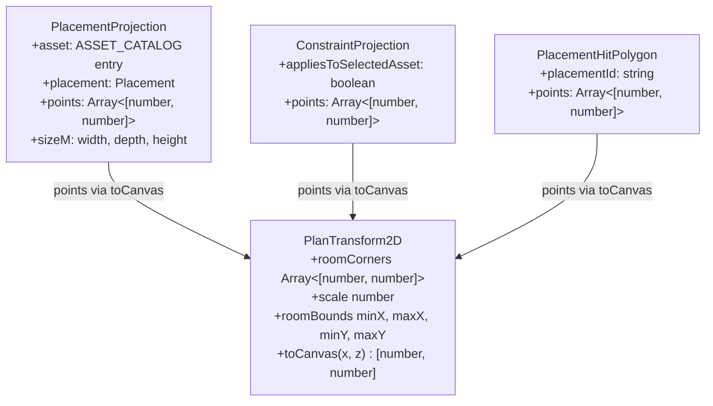
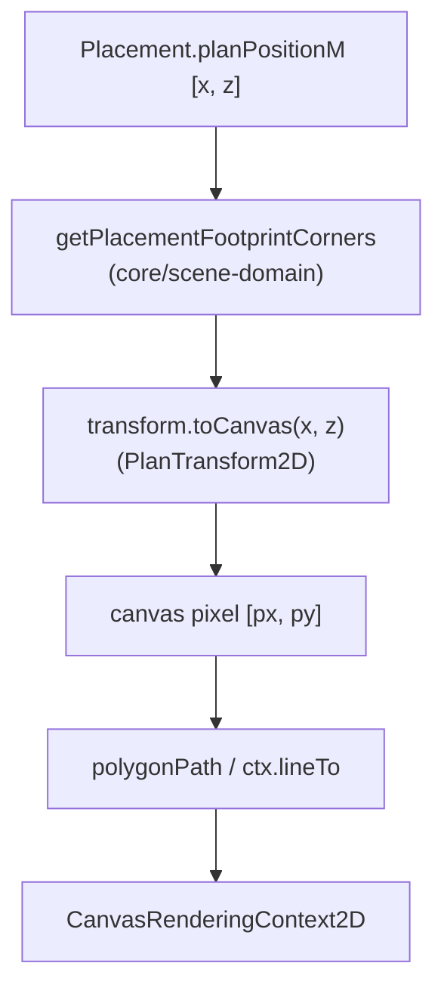
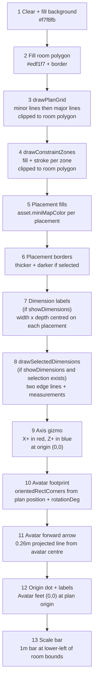
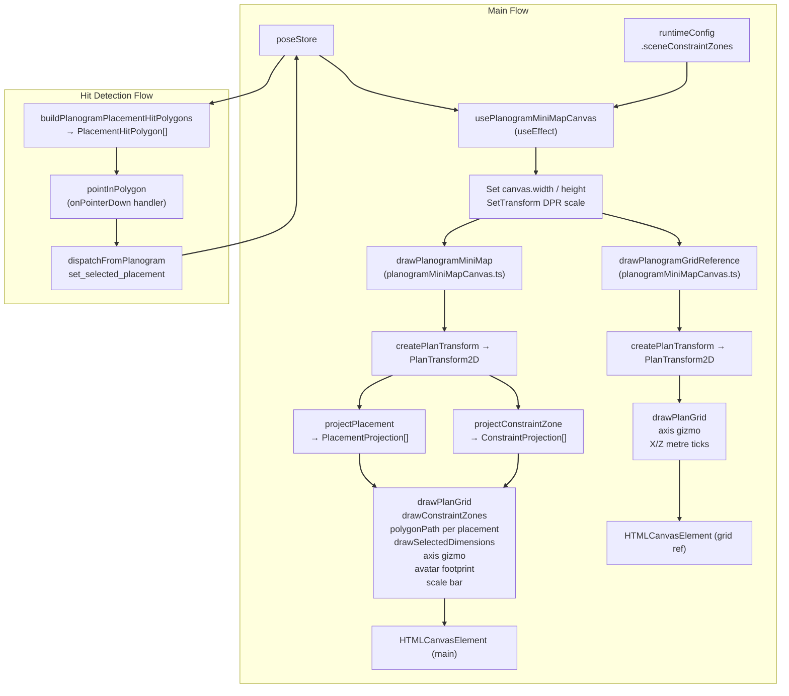

# MiniMap Canvas Rendering

Relevant source files

- [](https://github.com/e7canasta/puppet-studio/blob/cdd483bd/src/features/planogram/hooks/index.ts)
- [](https://github.com/e7canasta/puppet-studio/blob/cdd483bd/src/features/planogram/hooks/usePlanogramMiniMapCanvas.ts)
- [](https://github.com/e7canasta/puppet-studio/blob/cdd483bd/src/features/planogram/hooks/usePlanogramMiniMapState.ts)
- [](https://github.com/e7canasta/puppet-studio/blob/cdd483bd/src/features/planogram/model/planogramMiniMapCanvas.ts)
- [](https://github.com/e7canasta/puppet-studio/blob/cdd483bd/src/features/planogram/ui/PlanogramMiniMap.tsx)
- [](https://github.com/e7canasta/puppet-studio/blob/cdd483bd/src/planogram/layout.ts)

## Purpose and Scope

This page documents the canvas rendering layer for the planogram mini-map: the drawing functions, coordinate projection pipeline, supporting types, and the React hook that wires them into the DOM. It covers `drawPlanogramMiniMap`, `drawPlanogramGridReference`, `buildPlanogramPlacementHitPolygons`, `pointInPolygon`, and `usePlanogramMiniMapCanvas`.

For the React component that hosts these canvases and handles user interactions (placement selection, move/rotate buttons), see [8.1](https://deepwiki.com/e7canasta/puppet-studio/8.1-planogram-minimap). For the scene geometry utilities (`createPlanTransform`, `getPlacementFootprintCorners`, `orientedRectCorners`) that this module depends on, see [7.2](https://deepwiki.com/e7canasta/puppet-studio/7.2-scene-geometry-and-projection-utilities).

---

## Module Layout

All rendering logic lives in a single file:

|File|Role|
|---|---|
|`src/features/planogram/model/planogramMiniMapCanvas.ts`|Canvas draw functions, hit polygon builder, utility helpers|
|`src/features/planogram/hooks/usePlanogramMiniMapCanvas.ts`|React `useEffect` hook — sets up canvas dimensions and DPR, then calls the draw functions|
|`src/features/planogram/hooks/usePlanogramMiniMapState.ts`|Provides state values fed into `usePlanogramMiniMapCanvas`|
|`src/planogram/layout.ts`|Grid step constants and avatar footprint constants|

Sources: [src/features/planogram/model/planogramMiniMapCanvas.ts1-18](https://github.com/e7canasta/puppet-studio/blob/cdd483bd/src/features/planogram/model/planogramMiniMapCanvas.ts#L1-L18) [src/features/planogram/hooks/usePlanogramMiniMapCanvas.ts1-15](https://github.com/e7canasta/puppet-studio/blob/cdd483bd/src/features/planogram/hooks/usePlanogramMiniMapCanvas.ts#L1-L15) [src/planogram/layout.ts1-13](https://github.com/e7canasta/puppet-studio/blob/cdd483bd/src/planogram/layout.ts#L1-L13)

---

## Canvas Dimension Constants

[src/features/planogram/model/planogramMiniMapCanvas.ts19-25](https://github.com/e7canasta/puppet-studio/blob/cdd483bd/src/features/planogram/model/planogramMiniMapCanvas.ts#L19-L25)

|Constant|Value|Description|
|---|---|---|
|`PLANOGRAM_MAP_WIDTH`|280|CSS width of the main mini-map canvas (px)|
|`PLANOGRAM_MAP_HEIGHT`|220|CSS height of the main mini-map canvas (px)|
|`PLANOGRAM_MAP_PADDING`|18|Padding applied inside the canvas when fitting the room|
|`PLANOGRAM_GRID_REF_WIDTH`|280|CSS width of the grid reference canvas (px)|
|`PLANOGRAM_GRID_REF_HEIGHT`|145|CSS height of the grid reference canvas (px)|
|`PLANOGRAM_GRID_REF_PADDING`|16|Padding for the grid reference canvas|
|`PLANOGRAM_DPR`|`window.devicePixelRatio \| 1`|Device pixel ratio; used to scale canvas backing store|

Grid step values come from `src/planogram/layout.ts`:

|Constant|Value|Used for|
|---|---|---|
|`GRID_MINOR_STEP_M`|`0.5`|Minor grid line interval (metres)|
|`GRID_MAJOR_STEP_M`|`1.0`|Major grid line interval (metres)|
|`TARGET_AVATAR_FOOTPRINT_WIDTH_M`|`0.52`|Avatar footprint rectangle half-width × 2|
|`TARGET_AVATAR_FOOTPRINT_DEPTH_M`|`0.34`|Avatar footprint rectangle half-depth × 2|

Sources: [src/features/planogram/model/planogramMiniMapCanvas.ts19-25](https://github.com/e7canasta/puppet-studio/blob/cdd483bd/src/features/planogram/model/planogramMiniMapCanvas.ts#L19-L25) [src/planogram/layout.ts4-14](https://github.com/e7canasta/puppet-studio/blob/cdd483bd/src/planogram/layout.ts#L4-L14)

---

## Internal Types

**Diagram: Types and their relationships**



- `PlacementProjection` is an internal type (not exported). It is computed per frame by `projectPlacement` and carries the canvas-space polygon for each scene placement.
- `ConstraintProjection` is internal. It is computed by `projectConstraintZone` and carries both the canvas polygon and a flag indicating whether the zone applies to the currently selected asset.
- `PlacementHitPolygon` is **exported**. It is the same polygon in canvas space but stripped to only `placementId` and `points`, used by the parent component for pointer hit-testing.

Sources: [src/features/planogram/model/planogramMiniMapCanvas.ts27-42](https://github.com/e7canasta/puppet-studio/blob/cdd483bd/src/features/planogram/model/planogramMiniMapCanvas.ts#L27-L42)

---

## `PlanTransform2D` and Coordinate Conversion

The central concept is `PlanTransform2D`, created by `createPlanTransform` (documented in [7.2](https://deepwiki.com/e7canasta/puppet-studio/7.2-scene-geometry-and-projection-utilities)). It takes:

- a `RoomDefinition` (width and depth in metres)
- canvas width, height, and padding
- `topQuarterTurns` (a `QuarterTurns` value, 0–3) describing map orientation

It returns an object whose `toCanvas(planX, planZ)` method converts world-plan coordinates (metres, origin at room centre) to 2D canvas pixel coordinates. All rendering functions call `transform.toCanvas` to convert every point before drawing.

**Diagram: Coordinate conversion flow**



Sources: [src/features/planogram/model/planogramMiniMapCanvas.ts67-72](https://github.com/e7canasta/puppet-studio/blob/cdd483bd/src/features/planogram/model/planogramMiniMapCanvas.ts#L67-L72) [src/features/planogram/model/planogramMiniMapCanvas.ts80-93](https://github.com/e7canasta/puppet-studio/blob/cdd483bd/src/features/planogram/model/planogramMiniMapCanvas.ts#L80-L93)

---

## `drawPlanogramMiniMap` — Full Rendering Pipeline

**Signature** [src/features/planogram/model/planogramMiniMapCanvas.ts191-201](https://github.com/e7canasta/puppet-studio/blob/cdd483bd/src/features/planogram/model/planogramMiniMapCanvas.ts#L191-L201):

```
drawPlanogramMiniMap(
  canvas, room, placements, constraints,
  selectedAssetId, selectedPlacementId,
  showDimensions, topQuarterTurns, avatar
)
```


**Diagram: Rendering layer order (bottom to top)**



### Step-by-Step Notes

**Background & room** [src/features/planogram/model/planogramMiniMapCanvas.ts209-219](https://github.com/e7canasta/puppet-studio/blob/cdd483bd/src/features/planogram/model/planogramMiniMapCanvas.ts#L209-L219):  
The full canvas is filled first. The room polygon (`transform.roomCorners`) is then filled and stroked on top.

**Grid** [src/features/planogram/model/planogramMiniMapCanvas.ts95-144](https://github.com/e7canasta/puppet-studio/blob/cdd483bd/src/features/planogram/model/planogramMiniMapCanvas.ts#L95-L144):  
`drawPlanGrid` clips to the room polygon with `ctx.clip()`. It iterates X and Z axes from `−room.widthM/2` to `+room.widthM/2` (and same for depth) at `GRID_MINOR_STEP_M` and `GRID_MAJOR_STEP_M` intervals, drawing horizontal and vertical lines in canvas space.

**Constraint zones** [src/features/planogram/model/planogramMiniMapCanvas.ts168-189](https://github.com/e7canasta/puppet-studio/blob/cdd483bd/src/features/planogram/model/planogramMiniMapCanvas.ts#L168-L189):  
`drawConstraintZones` also clips to the room polygon. Each zone uses a stronger pink fill/stroke (`rgba(157, 23, 77, 0.14)`) when `appliesToSelectedAsset` is true; otherwise a muted grey.

**Placements** [src/features/planogram/model/planogramMiniMapCanvas.ts224-246](https://github.com/e7canasta/puppet-studio/blob/cdd483bd/src/features/planogram/model/planogramMiniMapCanvas.ts#L224-L246):  
Each `PlacementProjection` is drawn with `asset.miniMapColor` fill. Selected placement gets `lineWidth = 2.2`; others get `lineWidth = 1`.

**Dimension labels** [src/features/planogram/model/planogramMiniMapCanvas.ts249-252](https://github.com/e7canasta/puppet-studio/blob/cdd483bd/src/features/planogram/model/planogramMiniMapCanvas.ts#L249-L252) [src/features/planogram/model/planogramMiniMapCanvas.ts146-166](https://github.com/e7canasta/puppet-studio/blob/cdd483bd/src/features/planogram/model/planogramMiniMapCanvas.ts#L146-L166):  
When `showDimensions` is true, a `width x depth m` label is drawn at the placement centre. `drawSelectedDimensions` additionally draws annotated edge lines along two sides of the selected placement's polygon.

**Axis gizmo** [src/features/planogram/model/planogramMiniMapCanvas.ts254-275](https://github.com/e7canasta/puppet-studio/blob/cdd483bd/src/features/planogram/model/planogramMiniMapCanvas.ts#L254-L275):  
The plan origin `(0, 0)` is converted to canvas space. Unit vectors `(1, 0)` and `(0, 1)` are also converted; the difference from the origin gives direction vectors for the X+ (red) and Z+ (blue) axis lines, normalized to 22 px.

**Avatar** [src/features/planogram/model/planogramMiniMapCanvas.ts277-312](https://github.com/e7canasta/puppet-studio/blob/cdd483bd/src/features/planogram/model/planogramMiniMapCanvas.ts#L277-L312):  
`orientedRectCorners` is called with the avatar's plan position, half-dimensions from `TARGET_AVATAR_FOOTPRINT_WIDTH_M` / `TARGET_AVATAR_FOOTPRINT_DEPTH_M`, and `rotationDeg`. The four corners are projected to canvas and drawn as a polygon. A forward-facing arrow is drawn from the avatar centre along `rotationDeg` for 0.26 metres.

**Scale bar** [src/features/planogram/model/planogramMiniMapCanvas.ts314-324](https://github.com/e7canasta/puppet-studio/blob/cdd483bd/src/features/planogram/model/planogramMiniMapCanvas.ts#L314-L324):  
`transform.scale` is the number of pixels per metre. A horizontal line of exactly `transform.scale` pixels is drawn labelled `"1m"` at the lower-left of the room bounds.

Sources: [src/features/planogram/model/planogramMiniMapCanvas.ts191-325](https://github.com/e7canasta/puppet-studio/blob/cdd483bd/src/features/planogram/model/planogramMiniMapCanvas.ts#L191-L325)

---

## `drawPlanogramGridReference` — Grid Reference Canvas

**Signature** [src/features/planogram/model/planogramMiniMapCanvas.ts327-329](https://github.com/e7canasta/puppet-studio/blob/cdd483bd/src/features/planogram/model/planogramMiniMapCanvas.ts#L327-L329):

```
drawPlanogramGridReference(canvas, room, topQuarterTurns)
```

This is a simpler, static canvas showing only the room outline, grid, axis gizmo, and integer metre tick marks along each axis. It does not show placements, avatar, or constraints.

**Rendering steps:**

1. Clear and fill background (`#f7f9fc`).
2. Fill room polygon (`#eff3f8`) with border.
3. `drawPlanGrid` with slightly different colours (`major: '#9facc0'`, `minor: '#d5ddea'`).
4. Axis gizmo — X+ (red `#cf5454`) and Z+ (blue `#4f78cb`) arrows of length 20 px.
5. Origin dot at `(0, 0)` with label `"(0,0)"`.
6. Integer metre ticks along the X axis: red dot + coordinate label for each whole metre from `⌈-widthM/2⌉` to `⌊widthM/2⌋` (skipping 0).
7. Integer metre ticks along the Z axis: blue dot + coordinate label.

Label positions are clamped to stay within the canvas bounds using the internal `clamp` helper.

Sources: [src/features/planogram/model/planogramMiniMapCanvas.ts327-404](https://github.com/e7canasta/puppet-studio/blob/cdd483bd/src/features/planogram/model/planogramMiniMapCanvas.ts#L327-L404)

---

## Hit Detection Utilities

### `buildPlanogramPlacementHitPolygons`

[src/features/planogram/model/planogramMiniMapCanvas.ts406-416](https://github.com/e7canasta/puppet-studio/blob/cdd483bd/src/features/planogram/model/planogramMiniMapCanvas.ts#L406-L416)

Creates one `PlacementHitPolygon` per placement. Uses the same `createPlanTransform` and `getPlacementFootprintCorners` pipeline used during rendering, so the polygons match exactly what is drawn on screen. Called inside `usePlanogramMiniMapState` and the results stored as `placementHitPolygons`.

### `pointInPolygon`

[src/features/planogram/model/planogramMiniMapCanvas.ts418-430](https://github.com/e7canasta/puppet-studio/blob/cdd483bd/src/features/planogram/model/planogramMiniMapCanvas.ts#L418-L430)

A standard ray-casting even-odd winding algorithm. Returns `true` if `(pointX, pointY)` is inside the given polygon. Used by `PlanogramMiniMap.tsx` in the `onPointerDown` handler to find which placement was clicked.

### `computePlanogramMiniMapScale`

[src/features/planogram/model/planogramMiniMapCanvas.ts438-440](https://github.com/e7canasta/puppet-studio/blob/cdd483bd/src/features/planogram/model/planogramMiniMapCanvas.ts#L438-L440)

Returns `transform.scale` (pixels per metre) for the main mini-map. Used in `usePlanogramMiniMapState` to expose `miniMapScale` to the UI info panel.

Sources: [src/features/planogram/model/planogramMiniMapCanvas.ts406-440](https://github.com/e7canasta/puppet-studio/blob/cdd483bd/src/features/planogram/model/planogramMiniMapCanvas.ts#L406-L440) [src/features/planogram/ui/PlanogramMiniMap.tsx149-163](https://github.com/e7canasta/puppet-studio/blob/cdd483bd/src/features/planogram/ui/PlanogramMiniMap.tsx#L149-L163)

---

## `usePlanogramMiniMapCanvas` Hook

[src/features/planogram/hooks/usePlanogramMiniMapCanvas.ts33-95](https://github.com/e7canasta/puppet-studio/blob/cdd483bd/src/features/planogram/hooks/usePlanogramMiniMapCanvas.ts#L33-L95)

This hook owns the two canvas references (`canvasRef` for the main map, `gridCanvasRef` for the grid reference) and runs a single `useEffect` that fires whenever any input value changes.

**Effect logic:**

1. Read both canvas refs. Bail out if either is null.
2. Set backing-store dimensions: `canvas.width = Math.floor(PLANOGRAM_MAP_WIDTH * PLANOGRAM_DPR)`, etc.
3. Set CSS display size: `canvas.style.width = PLANOGRAM_MAP_WIDTH + 'px'`, etc.
4. Obtain `CanvasRenderingContext2D` for each canvas.
5. Call `ctx.setTransform(PLANOGRAM_DPR, 0, 0, PLANOGRAM_DPR, 0, 0)` so all draw calls use logical pixels (the DPR scaling is transparent to `drawPlanogramMiniMap`).
6. Set default fonts (`12px Segoe UI` for main; `11px Segoe UI` for grid).
7. Call `drawPlanogramMiniMap(...)`.
8. Call `drawPlanogramGridReference(...)`.

**Inputs (`UsePlanogramMiniMapCanvasArgs`)**:

|Field|Type|Source|
|---|---|---|
|`avatar`|`MiniMapAvatar`|`poseStore` via `usePlanogramMiniMapState`|
|`constraints`|`SceneConstraintZone[]`|`runtimeConfig.sceneConstraintZones`|
|`scenePlacements`|`Placement[]`|`poseStore.scenePlacements`|
|`sceneRoom`|`RoomDefinition`|`poseStore.sceneRoom`|
|`selectedPlacementAssetId`|`string \| null`|derived in `usePlanogramMiniMapState`|
|`selectedPlacementId`|`string \| null`|`poseStore.selectedPlacementId`|
|`showDimensions`|`boolean`|`poseStore.showDimensions`|
|`topQuarterTurns`|`QuarterTurns`|`poseStore.topQuarterTurns`|

The effect dependency array includes all eight arguments plus both canvas refs, so any change to any input triggers a full redraw.

Sources: [src/features/planogram/hooks/usePlanogramMiniMapCanvas.ts1-95](https://github.com/e7canasta/puppet-studio/blob/cdd483bd/src/features/planogram/hooks/usePlanogramMiniMapCanvas.ts#L1-L95) [src/features/planogram/ui/PlanogramMiniMap.tsx72-81](https://github.com/e7canasta/puppet-studio/blob/cdd483bd/src/features/planogram/ui/PlanogramMiniMap.tsx#L72-L81)

---

## End-to-End Data Flow

**Diagram: From poseStore to canvas pixels**



Sources: [src/features/planogram/hooks/usePlanogramMiniMapCanvas.ts49-94](https://github.com/e7canasta/puppet-studio/blob/cdd483bd/src/features/planogram/hooks/usePlanogramMiniMapCanvas.ts#L49-L94) [src/features/planogram/model/planogramMiniMapCanvas.ts191-325](https://github.com/e7canasta/puppet-studio/blob/cdd483bd/src/features/planogram/model/planogramMiniMapCanvas.ts#L191-L325) [src/features/planogram/hooks/usePlanogramMiniMapState.ts53-60](https://github.com/e7canasta/puppet-studio/blob/cdd483bd/src/features/planogram/hooks/usePlanogramMiniMapState.ts#L53-L60) [src/features/planogram/ui/PlanogramMiniMap.tsx149-163](https://github.com/e7canasta/puppet-studio/blob/cdd483bd/src/features/planogram/ui/PlanogramMiniMap.tsx#L149-L163)

---

## Internal Helper Reference

|Function|Location|Purpose|
|---|---|---|
|`polygonPath`|[line 57-65](https://github.com/e7canasta/puppet-studio/blob/cdd483bd/line%2057-65)()|Traces a closed polygon path on a `CanvasRenderingContext2D`|
|`projectPlacement`|[line 67-72](https://github.com/e7canasta/puppet-studio/blob/cdd483bd/line%2067-72)()|Converts `Placement` → `PlacementProjection` using `toCanvas`|
|`projectConstraintZone`|[line 80-93](https://github.com/e7canasta/puppet-studio/blob/cdd483bd/line%2080-93)()|Converts `SceneConstraintZone` → `ConstraintProjection`|
|`drawPlanGrid`|[line 95-144](https://github.com/e7canasta/puppet-studio/blob/cdd483bd/line%2095-144)()|Draws minor and major grid lines, clipped to room polygon|
|`drawSelectedDimensions`|[line 146-166](https://github.com/e7canasta/puppet-studio/blob/cdd483bd/line%20146-166)()|Draws two annotated edge lines for the selected placement|
|`drawConstraintZones`|[line 168-189](https://github.com/e7canasta/puppet-studio/blob/cdd483bd/line%20168-189)()|Fills and strokes constraint zone rectangles|
|`zoneAppliesToAsset`|[line 74-78](https://github.com/e7canasta/puppet-studio/blob/cdd483bd/line%2074-78)()|Returns true if zone has no `assetIds` filter, or if `selectedAssetId` is in the list|
|`normalizeVector`|[line 48-51](https://github.com/e7canasta/puppet-studio/blob/cdd483bd/line%2048-51)()|Scales a 2D vector to a given length|
|`midpoint`|[line 53-55](https://github.com/e7canasta/puppet-studio/blob/cdd483bd/line%2053-55)()|Returns midpoint of two canvas-space points|
|`clamp`|[line 44-46](https://github.com/e7canasta/puppet-studio/blob/cdd483bd/line%2044-46)()|Numeric clamp used to keep text labels within canvas bounds|
|`formatSceneSource`|[line 432-436](https://github.com/e7canasta/puppet-studio/blob/cdd483bd/line%20432-436)()|Formats `'default' \| 'scene' \| 'local_edit'` for display in status row|


### On this page

- [MiniMap Canvas Rendering](https://deepwiki.com/e7canasta/puppet-studio/8.2-minimap-canvas-rendering#minimap-canvas-rendering)
- [Purpose and Scope](https://deepwiki.com/e7canasta/puppet-studio/8.2-minimap-canvas-rendering#purpose-and-scope)
- [Module Layout](https://deepwiki.com/e7canasta/puppet-studio/8.2-minimap-canvas-rendering#module-layout)
- [Canvas Dimension Constants](https://deepwiki.com/e7canasta/puppet-studio/8.2-minimap-canvas-rendering#canvas-dimension-constants)
- [Internal Types](https://deepwiki.com/e7canasta/puppet-studio/8.2-minimap-canvas-rendering#internal-types)
- [`PlanTransform2D` and Coordinate Conversion](https://deepwiki.com/e7canasta/puppet-studio/8.2-minimap-canvas-rendering#plantransform2d-and-coordinate-conversion)
- [`drawPlanogramMiniMap` — Full Rendering Pipeline](https://deepwiki.com/e7canasta/puppet-studio/8.2-minimap-canvas-rendering#drawplanogramminimap-full-rendering-pipeline)
- [Step-by-Step Notes](https://deepwiki.com/e7canasta/puppet-studio/8.2-minimap-canvas-rendering#step-by-step-notes)
- [`drawPlanogramGridReference` — Grid Reference Canvas](https://deepwiki.com/e7canasta/puppet-studio/8.2-minimap-canvas-rendering#drawplanogramgridreference-grid-reference-canvas)
- [Hit Detection Utilities](https://deepwiki.com/e7canasta/puppet-studio/8.2-minimap-canvas-rendering#hit-detection-utilities)
- [`buildPlanogramPlacementHitPolygons`](https://deepwiki.com/e7canasta/puppet-studio/8.2-minimap-canvas-rendering#buildplanogramplacementhitpolygons)
- [`pointInPolygon`](https://deepwiki.com/e7canasta/puppet-studio/8.2-minimap-canvas-rendering#pointinpolygon)
- [`computePlanogramMiniMapScale`](https://deepwiki.com/e7canasta/puppet-studio/8.2-minimap-canvas-rendering#computeplanogramminimapscale)
- [`usePlanogramMiniMapCanvas` Hook](https://deepwiki.com/e7canasta/puppet-studio/8.2-minimap-canvas-rendering#useplanogramminimapcanvas-hook)
- [End-to-End Data Flow](https://deepwiki.com/e7canasta/puppet-studio/8.2-minimap-canvas-rendering#end-to-end-data-flow)
- [Internal Helper Reference](https://deepwiki.com/e7canasta/puppet-studio/8.2-minimap-canvas-rendering#internal-helper-reference)

