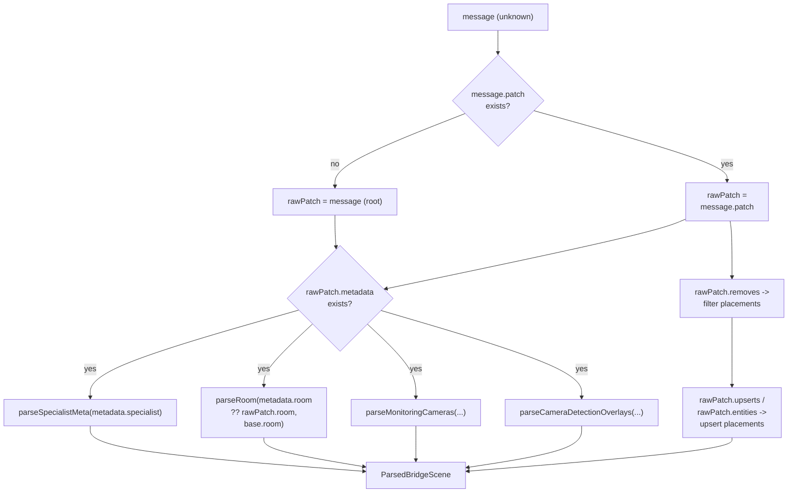
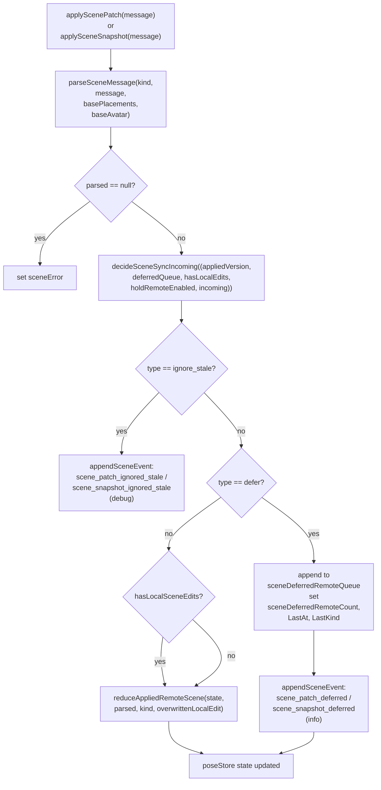
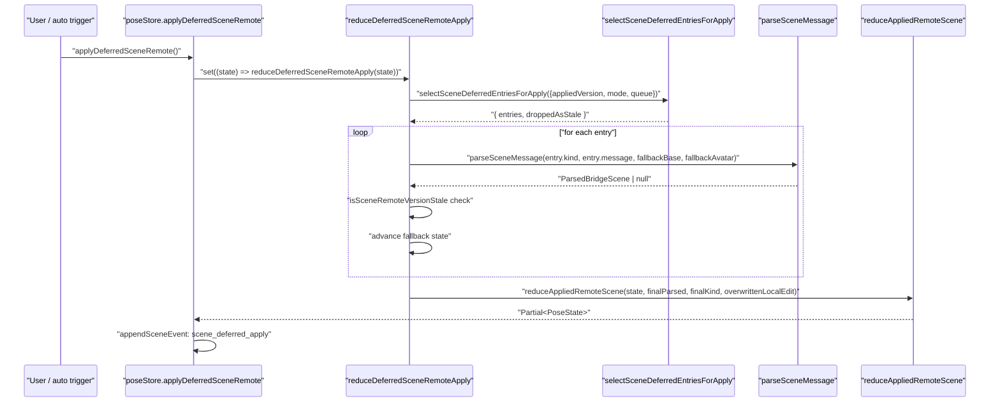
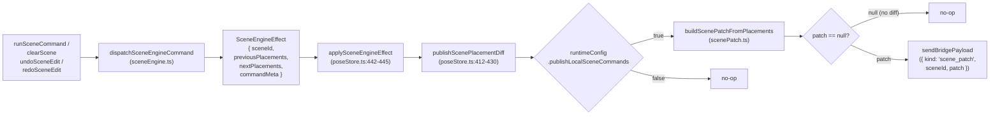

# Scene Sync

Relevant source files

- [](https://github.com/e7canasta/puppet-studio/blob/cdd483bd/lib/geometry/src/simula_geometry/cuboid_lift.py)
- [](https://github.com/e7canasta/puppet-studio/blob/cdd483bd/src/app/state/poseStore.ts)
- [](https://github.com/e7canasta/puppet-studio/blob/cdd483bd/src/core/scene-domain/scenePatch.ts)
- [](https://github.com/e7canasta/puppet-studio/blob/cdd483bd/src/planogram/sync.ts)

This page documents the scene synchronization subsystem: how incoming bridge messages are parsed into structured data, how that data is applied to `poseStore`, how deferred messages are queued and replayed, and how local placement edits are serialized and sent back to the bridge as outbound patches.

For the bridge transport layer (WebSocket connection, reconnect, message framing), see [Bridge Communication](https://deepwiki.com/e7canasta/puppet-studio/5-bridge-communication). For the `poseStore` state slices that scene sync writes into, see [State Management](https://deepwiki.com/e7canasta/puppet-studio/3-state-management). For how `scene_snapshot` / `scene_patch` messages are routed from raw WebSocket frames to the `applySceneSnapshot` / `applyScenePatch` actions, see [Message Parsing & State Adapter](https://deepwiki.com/e7canasta/puppet-studio/5.2-message-parsing-and-state-adapter).

---

## Core Data Types

The following types are the building blocks shared across the sync subsystem.

### `ParsedBridgeScene` (internal result type)

Defined internally in [`src/planogram/sync.ts35-44](https://github.com/e7canasta/puppet-studio/blob/cdd483bd/%60src/planogram/sync.ts#L35-L44) as the return type of both `parseSceneSnapshotFromBridge` and `applyScenePatchFromBridge`. In `poseStore.ts` it is accessed via:

```
type ParsedSceneMessage = NonNullable<ReturnType<typeof applyScenePatchFromBridge>>
```

|Field|Type|Description|
|---|---|---|
|`placements`|`Placement[]`|All object placements after parse/patch|
|`room`|`RoomDefinition`|Room geometry|
|`avatar`|`AvatarTransform \| null`|Character position and identity|
|`cameraDetectionOverlays`|`CameraDetectionOverlay[] \| null`|Per-camera detection boxes (null if absent)|
|`monitoringCameras`|`MonitoringCameraDefinition[] \| null`|Camera definitions (null if absent)|
|`receivedAt`|`string`|ISO timestamp from message or `new Date()`|
|`revision`|`number \| null`|Monotonic revision counter|
|`sequence`|`number \| null`|Monotonic sequence counter|
|`sceneId`|`string \| null`|Scene identifier from the message|
|`specialistMeta`|`SceneSpecialistMeta \| null`|Freshness and provenance metadata|

### `AvatarTransform`

Exported from [`src/planogram/sync.ts28-33](https://github.com/e7canasta/puppet-studio/blob/cdd483bd/%60src/planogram/sync.ts#L28-L33)

|Field|Type|
|---|---|
|`objectId`|`string \| null`|
|`planPositionM`|`[number, number]`|
|`rotationDeg`|`number`|
|`trackId`|`string \| null`|

### `SceneSpecialistMeta`

Exported from [`src/planogram/sync.ts19-26](https://github.com/e7canasta/puppet-studio/blob/cdd483bd/%60src/planogram/sync.ts#L19-L26) Populated from `message.scene.metadata.specialist` (or `message.patch.metadata.specialist`).

|Field|Type|Meaning|
|---|---|---|
|`generatedAt`|`string \| null`|ISO timestamp when the upstream specialist generated the scene|
|`source`|`string \| null`|Identifier of the upstream model/pipeline|
|`spatialAgeS`|`number \| null`|Age of the spatial data in seconds|
|`spatialFresh`|`boolean \| null`|Whether spatial data is considered fresh|
|`spatialStaleAfterS`|`number \| null`|Threshold for marking spatial data stale|
|`stalePolicy`|`string \| null`|Policy name applied when data becomes stale|

### `ScenePatchPayload`

Defined in [`src/core/scene-domain/scenePatch.ts3-6](https://github.com/e7canasta/puppet-studio/blob/cdd483bd/%60src/core/scene-domain/scenePatch.ts#L3-L6) Used for **outbound** patches sent from the frontend to the bridge.

```
type ScenePatchPayload = {
  removes?: string[]
  upserts?: Array<Record<string, unknown>>
}
```

---

**Type relationships diagram:**

Sources: [`src/planogram/sync.ts14-44](https://github.com/e7canasta/puppet-studio/blob/cdd483bd/%60src/planogram/sync.ts#L14-L44) [`src/core/scene-domain/scenePatch.ts3-6](https://github.com/e7canasta/puppet-studio/blob/cdd483bd/%60src/core/scene-domain/scenePatch.ts#L3-L6)

---

## Inbound Parsing: `parseSceneSnapshotFromBridge`

[`src/planogram/sync.ts411-469](https://github.com/e7canasta/puppet-studio/blob/cdd483bd/%60src/planogram/sync.ts#L411-L469)

**Signature:**

```
parseSceneSnapshotFromBridge(
  message: unknown,
  fallback: SceneSnapshot,
  fallbackAvatar?: AvatarTransform | null
): ParsedBridgeScene | null
```

A `scene_snapshot` message is a complete scene description. The parser accepts either:

- `{ scene: { ... } }` — scene data nested under a `scene` key
- A flat object — the root is treated as the scene source

**Parsing steps:**

1. Validate that `message` is a plain object; return `null` otherwise.
2. Resolve `source` as `message.scene` if present, else `message` itself.
3. Parse `metadata.specialist` → `SceneSpecialistMeta` via `parseSpecialistMeta`.
4. Parse `metadata.room ?? source.room` → `RoomDefinition` via `parseRoom`.
5. Parse `metadata.monitoringCameras ?? source.monitoringCameras` → `MonitoringCameraDefinition[]`.
6. Parse `metadata.cameraDetections ?? source.detectionOverlays` → `CameraDetectionOverlay[]`.
7. Extract `sceneId` from `message.sceneId ?? message.scene_id ?? source.sceneId`.
8. If `source.entities` is an array: iterate entities. Entities where `isCharacterEntity()` is true are routed to `parseCharacterTransform`; all others are parsed as `Placement` via `parsePlacement`. This resets the placement list from scratch.
9. If no `entities` key but `source.placements` is present: parse each entry via `parsePlacement` with no fallback.
10. Extract `revision` and `sequence` as integers from `message.revision` / `message.sequence`.

`isCharacterEntity` [src/planogram/sync.ts355-360](https://github.com/e7canasta/puppet-studio/blob/cdd483bd/src/planogram/sync.ts#L355-L360) matches `entityType` / `type` / `kind` / `category` values of `character`, `avatar`, `player`, or `robot` (case-insensitive).

Sources: [`src/planogram/sync.ts411-469](https://github.com/e7canasta/puppet-studio/blob/cdd483bd/%60src/planogram/sync.ts#L411-L469)

---

## Inbound Parsing: `applyScenePatchFromBridge`

[`src/planogram/sync.ts471-550](https://github.com/e7canasta/puppet-studio/blob/cdd483bd/%60src/planogram/sync.ts#L471-L550)

**Signature:**

```
applyScenePatchFromBridge(
  message: unknown,
  base: SceneSnapshot,
  baseAvatar?: AvatarTransform | null
): ParsedBridgeScene | null
```

A `scene_patch` message applies incremental changes on top of an existing (`base`) snapshot. The patch can be found:

- Under `message.patch` — explicit wrapper
- Or at the `message` root if no `patch` key is present

**Patch operations (applied in order):**

1. **Removes** — `rawPatch.removes` is an array of string IDs or objects with `trackId` / `objectId` / `id`. Matching placements are filtered out of the cloned `base.placements`. If the current avatar matches a remove token, `avatar` is set to `null`.
    
2. **Upserts** — entries in `rawPatch.upserts` (or `rawPatch.entities`) are processed:
    
    - Character entities → `parseCharacterTransform` updates `avatar`.
    - Object entities → `findPlacementIndex` [src/planogram/sync.ts370-389](https://github.com/e7canasta/puppet-studio/blob/cdd483bd/src/planogram/sync.ts#L370-L389) looks up by `trackId` first, then `objectId`, then `id`. If found, the existing placement is updated; if not, a new placement is appended.

`findPlacementIndex` also matches the synthesized `trk:<trackId>` and `obj:<objectId>` ID patterns that `parsePlacement` can generate when no explicit `id` is provided.

**Patch message diagram (field lookup):**



Sources: [`src/planogram/sync.ts471-550](https://github.com/e7canasta/puppet-studio/blob/cdd483bd/%60src/planogram/sync.ts#L471-L550) [`src/planogram/sync.ts370-389](https://github.com/e7canasta/puppet-studio/blob/cdd483bd/%60src/planogram/sync.ts#L370-L389)

---

## Ingestion Pipeline in `poseStore`

Once `poseStore.applySceneSnapshot` or `poseStore.applyScenePatch` is called (by the bridge state adapter — see [Message Parsing & State Adapter](https://deepwiki.com/e7canasta/puppet-studio/5.2-message-parsing-and-state-adapter)), a multi-step decision process runs inside the Zustand `set` callback.

### Key helpers in `poseStore.ts`

|Helper|Location|Role|
|---|---|---|
|`parseSceneMessage`|[src/app/state/poseStore.ts203-213](https://github.com/e7canasta/puppet-studio/blob/cdd483bd/src/app/state/poseStore.ts#L203-L213)|Dispatches to `applyScenePatchFromBridge` or `parseSceneSnapshotFromBridge` by `kind`|
|`reduceAppliedRemoteScene`|[src/app/state/poseStore.ts267-325](https://github.com/e7canasta/puppet-studio/blob/cdd483bd/src/app/state/poseStore.ts#L267-L325)|Produces the full `Partial<PoseState>` from a `ParsedBridgeScene`|
|`mergeSpecialistMeta`|[src/app/state/poseStore.ts181-201](https://github.com/e7canasta/puppet-studio/blob/cdd483bd/src/app/state/poseStore.ts#L181-L201)|Merges incoming `SceneSpecialistMeta` fields with current state, preferring non-null incoming values|
|`createDeferredEnvelope`|[src/app/state/poseStore.ts239-251](https://github.com/e7canasta/puppet-studio/blob/cdd483bd/src/app/state/poseStore.ts#L239-L251)|Wraps a message+metadata into a `SceneSyncDeferredEnvelope` for the queue|
|`hasLocalSceneEdits`|[src/app/state/poseStore.ts235-237](https://github.com/e7canasta/puppet-studio/blob/cdd483bd/src/app/state/poseStore.ts#L235-L237)|Returns `true` if `sceneSource === 'local_edit'` or undo/redo stacks are non-empty|

### Decision flow for `applyScenePatch` and `applySceneSnapshot`

Both actions follow the same pattern ([src/app/state/poseStore.ts559-712](https://github.com/e7canasta/puppet-studio/blob/cdd483bd/src/app/state/poseStore.ts#L559-L712)):




### `reduceAppliedRemoteScene` output

[`src/app/state/poseStore.ts267-325](https://github.com/e7canasta/puppet-studio/blob/cdd483bd/%60src/app/state/poseStore.ts#L267-L325)

This function produces the following `poseStore` mutations from a `ParsedBridgeScene`:

|`poseStore` field|Source|
|---|---|
|`scenePlacements`|`parsed.placements`|
|`sceneRoom`|`parsed.room`|
|`avatarObjectId` / `avatarTrackId`|`parsed.avatar`|
|`avatarPlanPositionM` / `avatarRotationDeg`|`parsed.avatar`|
|`monitoringCameras`|`parsed.monitoringCameras ?? state.monitoringCameras`|
|`cameraDetectionOverlays`|`parsed.cameraDetectionOverlays ?? state.cameraDetectionOverlays`|
|`sceneRevision`|`parsed.revision ?? (state.sceneRevision ?? 0) + 1`|
|`sceneSequence`|`parsed.sequence ?? state.sceneSequence`|
|`sceneLastAppliedRemoteRevision/Sequence`|From `parsed.revision` / `parsed.sequence`|
|`sceneId`|`parsed.sceneId ?? state.sceneId`|
|`sceneSource`|`'scene'` (always reset)|
|`sceneUndoStack` / `sceneRedoStack`|Cleared (reset to `[]`)|
|`sceneSpecialistGeneratedAt` etc.|Via `mergeSpecialistMeta`|
|`sceneDeferredRemoteQueue`|Cleared|
|`selectedPlacementId`|Preserved if placement still exists, else `null`|
|`selectedMonitoringCameraId`|Preserved or reset to first camera|
|`sceneRemoteOverrideAt/Kind`|Set only if `overwrittenLocalEdit` is true|

Sources: [`src/app/state/poseStore.ts203-213](https://github.com/e7canasta/puppet-studio/blob/cdd483bd/%60src/app/state/poseStore.ts#L203-L213) [`src/app/state/poseStore.ts267-325](https://github.com/e7canasta/puppet-studio/blob/cdd483bd/%60src/app/state/poseStore.ts#L267-L325) [`src/app/state/poseStore.ts559-712](https://github.com/e7canasta/puppet-studio/blob/cdd483bd/%60src/app/state/poseStore.ts#L559-L712)

---

## Deferred Queue

The deferred queue exists to handle two cases:

1. **Remote hold** — the user has explicitly paused remote updates (`sceneRemoteHoldEnabled = true`).
2. **Local edits** — the frontend has unsaved local edits (undo stack is non-empty or `sceneSource === 'local_edit'`).

When `decideSceneSyncIncoming` returns `{ type: 'defer' }`, the incoming message is stored in `sceneDeferredRemoteQueue` as a `SceneSyncDeferredEnvelope` (containing `kind`, `message`, `receivedAt`, `revision`, `sequence`).

### `applyDeferredSceneRemote`

[`src/app/state/poseStore.ts713-732](https://github.com/e7canasta/puppet-studio/blob/cdd483bd/%60src/app/state/poseStore.ts#L713-L732)

Called either:

- Automatically when `sceneRemoteHoldEnabled` is toggled off and `sceneDeferredAutoApplyOnRelease` is enabled in `runtimeConfig`.
- Manually by the user confirming a deferred apply (when `sceneDeferredRequireConfirmOnRelease` is set).

The internal reducer `reduceDeferredSceneRemoteApply` [src/app/state/poseStore.ts327-410](https://github.com/e7canasta/puppet-studio/blob/cdd483bd/src/app/state/poseStore.ts#L327-L410) processes the queue:

1. Calls `selectSceneDeferredEntriesForApply` (from `sceneSyncEngine.ts`) to pick which entries to apply, respecting `runtimeConfig.sceneDeferredApplyMode`.
2. Iterates entries in order, applying `parseSceneMessage` for each and skipping entries that are stale relative to `latestVersion` (tracked via `mergeSceneRemoteVersion` / `isSceneRemoteVersionStale`).
3. Accumulates the final valid `ParsedBridgeScene` (chaining patches — each entry's output is the next entry's `base`).
4. Calls `reduceAppliedRemoteScene` with the final result.

If all entries are stale after selection, the queue is cleared without applying anything.



Sources: [`src/app/state/poseStore.ts327-410](https://github.com/e7canasta/puppet-studio/blob/cdd483bd/%60src/app/state/poseStore.ts#L327-L410) [`src/app/state/poseStore.ts713-732](https://github.com/e7canasta/puppet-studio/blob/cdd483bd/%60src/app/state/poseStore.ts#L713-L732)

---

## Outbound Sync: `buildScenePatchFromPlacements`

When a local scene edit is committed (via `runSceneCommand`, `clearScene`, `undoSceneEdit`, `redoSceneEdit`), the scene engine produces a `SceneEngineEffect`. The function `applySceneEngineEffect` [src/app/state/poseStore.ts442-445](https://github.com/e7canasta/puppet-studio/blob/cdd483bd/src/app/state/poseStore.ts#L442-L445) immediately calls `publishScenePlacementDiff` which:

1. Checks `runtimeConfig.publishLocalSceneCommands` — if false, no-ops.
2. Calls `buildScenePatchFromPlacements(previous, next)` [src/core/scene-domain/scenePatch.ts49-79](https://github.com/e7canasta/puppet-studio/blob/cdd483bd/src/core/scene-domain/scenePatch.ts#L49-L79)
3. If a non-null patch is produced, calls `sendBridgePayload` with `kind: 'scene_patch'`.

### `buildScenePatchFromPlacements`

[`src/core/scene-domain/scenePatch.ts49-79](https://github.com/e7canasta/puppet-studio/blob/cdd483bd/%60src/core/scene-domain/scenePatch.ts#L49-L79)

Compares two `Placement[]` arrays by ID:

|Condition|Action|
|---|---|
|`prevById` has ID but `nextById` does not|Add ID to `removes`|
|Both have ID but `placementEquals` returns false|Add serialized entity to `upserts`|
|`nextById` has ID but `prevById` does not|Add serialized entity to `upserts` (new)|
|Both have ID and `placementEquals` returns true|No entry emitted|

Returns `null` if both `removes` and `upserts` are empty (no-op diff).

`placementEquals` [src/core/scene-domain/scenePatch.ts12-26](https://github.com/e7canasta/puppet-studio/blob/cdd483bd/src/core/scene-domain/scenePatch.ts#L12-L26) compares: `id`, `assetId`, `planPositionM`, `rotationDeg` (normalized to 0 if undefined), `elevationM` (normalized), `trackId`, `objectId`, and all three `targetSizeM` dimensions.

`placementToSceneEntity` [src/core/scene-domain/scenePatch.ts28-47](https://github.com/e7canasta/puppet-studio/blob/cdd483bd/src/core/scene-domain/scenePatch.ts#L28-L47) serializes a `Placement` to a plain record with `entityType: 'object'`, including only fields that are present (optional fields are omitted if absent).

**Outbound sync diagram:**



Sources: [`src/core/scene-domain/scenePatch.ts`](https://github.com/e7canasta/puppet-studio/blob/cdd483bd/%60src/core/scene-domain/scenePatch.ts%60) [`src/app/state/poseStore.ts412-430](https://github.com/e7canasta/puppet-studio/blob/cdd483bd/%60src/app/state/poseStore.ts#L412-L430) [`src/app/state/poseStore.ts442-445](https://github.com/e7canasta/puppet-studio/blob/cdd483bd/%60src/app/state/poseStore.ts#L442-L445)

---

## Placement Identity Resolution

Both the snapshot and patch parsers resolve placement identity using a priority chain. Understanding this is important for debugging missing or duplicated placements.

### `parsePlacement` ID derivation

[`src/planogram/sync.ts110-154](https://github.com/e7canasta/puppet-studio/blob/cdd483bd/%60src/planogram/sync.ts#L110-L154)

```
id = raw.id
  ?? (trackId ? `trk:${trackId}` : null)
  ?? (objectId ? `obj:${objectId}` : null)
  ?? fallback.id
  ?? null  → rejected
```

If neither `id`, `trackId`, nor `objectId` can produce an ID, the entity is dropped.

### `findPlacementIndex` lookup order (for patch upserts)

[`src/planogram/sync.ts370-389](https://github.com/e7canasta/puppet-studio/blob/cdd483bd/%60src/planogram/sync.ts#L370-L389)

1. `rawPlacement.trackId` → find existing placement where `placement.trackId === trackId` or `placement.id === 'trk:<trackId>'`
2. `rawPlacement.objectId` → find where `placement.objectId === objectId` or `placement.id === 'obj:<objectId>'`
3. `rawPlacement.id` → exact match on `placement.id`
4. Returns `-1` (new entity, will be appended)

### `placementMatchesToken` (for patch removes)

[`src/planogram/sync.ts362-368](https://github.com/e7canasta/puppet-studio/blob/cdd483bd/%60src/planogram/sync.ts#L362-L368)

A placement matches a remove token string if the token equals any of: `placement.id`, `placement.trackId`, `placement.objectId`, `trk:<trackId>`, or `obj:<objectId>`.

Sources: [`src/planogram/sync.ts110-154](https://github.com/e7canasta/puppet-studio/blob/cdd483bd/%60src/planogram/sync.ts#L110-L154) [`src/planogram/sync.ts362-389](https://github.com/e7canasta/puppet-studio/blob/cdd483bd/%60src/planogram/sync.ts#L362-L389)

---

## Scene Sync State Fields in `poseStore`

The following `poseStore` fields are owned primarily by the scene sync subsystem:

|Field|Type|Purpose|
|---|---|---|
|`sceneSource`|`'default' \| 'scene' \| 'local_edit'`|Tracks whether current scene came from bridge or local edit|
|`sceneRevision`|`number \| null`|Last applied revision number|
|`sceneSequence`|`number \| null`|Last applied sequence number|
|`sceneLastAppliedRemoteRevision`|`number \| null`|Tracks version for stale-check|
|`sceneLastAppliedRemoteSequence`|`number \| null`|Tracks version for stale-check|
|`sceneLastEventAt`|`string \| null`|`receivedAt` of last applied message|
|`sceneRemoteHoldEnabled`|`boolean`|When true, incoming messages are deferred|
|`sceneRemoteOverrideAt`|`string \| null`|Timestamp when a remote update overwrote a local edit|
|`sceneRemoteOverrideKind`|`SceneSyncRemoteKind \| null`|Kind of the overwriting message|
|`sceneDeferredRemoteQueue`|`SceneSyncDeferredEnvelope[]`|Buffered messages waiting for apply|
|`sceneDeferredRemoteCount`|`number`|Queue length (mirrored for UI)|
|`sceneDeferredRemoteLastAt`|`string \| null`|`receivedAt` of last queued message|
|`sceneDeferredRemoteLastKind`|`SceneSyncRemoteKind \| null`|Kind of last queued message|
|`sceneDeferredApplyPendingConfirm`|`boolean`|True when user must confirm apply of deferred queue|
|`sceneSpecialistGeneratedAt`|`string \| null`|From `SceneSpecialistMeta.generatedAt`|
|`sceneSpecialistSource`|`string \| null`|From `SceneSpecialistMeta.source`|
|`sceneSpatialAgeS`|`number \| null`|From `SceneSpecialistMeta.spatialAgeS`|
|`sceneSpatialFresh`|`boolean \| null`|From `SceneSpecialistMeta.spatialFresh`|
|`sceneSpatialStaleAfterS`|`number \| null`|From `SceneSpecialistMeta.spatialStaleAfterS`|
|`sceneSpatialStalePolicy`|`string \| null`|From `SceneSpecialistMeta.stalePolicy`|

Sources: [`src/app/state/poseStore.ts57-157](https://github.com/e7canasta/puppet-studio/blob/cdd483bd/%60src/app/state/poseStore.ts#L57-L157)


### On this page

- [Scene Sync](https://deepwiki.com/e7canasta/puppet-studio/8.3-scene-sync#scene-sync)
- [Core Data Types](https://deepwiki.com/e7canasta/puppet-studio/8.3-scene-sync#core-data-types)
- [`ParsedBridgeScene` (internal result type)](https://deepwiki.com/e7canasta/puppet-studio/8.3-scene-sync#parsedbridgescene-internal-result-type)
- [`AvatarTransform`](https://deepwiki.com/e7canasta/puppet-studio/8.3-scene-sync#avatartransform)
- [`SceneSpecialistMeta`](https://deepwiki.com/e7canasta/puppet-studio/8.3-scene-sync#scenespecialistmeta)
- [`ScenePatchPayload`](https://deepwiki.com/e7canasta/puppet-studio/8.3-scene-sync#scenepatchpayload)
- [Inbound Parsing: `parseSceneSnapshotFromBridge`](https://deepwiki.com/e7canasta/puppet-studio/8.3-scene-sync#inbound-parsing-parsescenesnapshotfrombridge)
- [Inbound Parsing: `applyScenePatchFromBridge`](https://deepwiki.com/e7canasta/puppet-studio/8.3-scene-sync#inbound-parsing-applyscenepatchfrombridge)
- [Ingestion Pipeline in `poseStore`](https://deepwiki.com/e7canasta/puppet-studio/8.3-scene-sync#ingestion-pipeline-in-posestore)
- [Key helpers in `poseStore.ts`](https://deepwiki.com/e7canasta/puppet-studio/8.3-scene-sync#key-helpers-in-posestorets)
- [Decision flow for `applyScenePatch` and `applySceneSnapshot`](https://deepwiki.com/e7canasta/puppet-studio/8.3-scene-sync#decision-flow-for-applyscenepatch-and-applyscenesnapshot)
- [`reduceAppliedRemoteScene` output](https://deepwiki.com/e7canasta/puppet-studio/8.3-scene-sync#reduceappliedremotescene-output)
- [Deferred Queue](https://deepwiki.com/e7canasta/puppet-studio/8.3-scene-sync#deferred-queue)
- [`applyDeferredSceneRemote`](https://deepwiki.com/e7canasta/puppet-studio/8.3-scene-sync#applydeferredsceneremote)
- [Outbound Sync: `buildScenePatchFromPlacements`](https://deepwiki.com/e7canasta/puppet-studio/8.3-scene-sync#outbound-sync-buildscenepatchfromplacements)
- [`buildScenePatchFromPlacements`](https://deepwiki.com/e7canasta/puppet-studio/8.3-scene-sync#buildscenepatchfromplacements)
- [Placement Identity Resolution](https://deepwiki.com/e7canasta/puppet-studio/8.3-scene-sync#placement-identity-resolution)
- [`parsePlacement` ID derivation](https://deepwiki.com/e7canasta/puppet-studio/8.3-scene-sync#parseplacement-id-derivation)
- [`findPlacementIndex` lookup order (for patch upserts)](https://deepwiki.com/e7canasta/puppet-studio/8.3-scene-sync#findplacementindex-lookup-order-for-patch-upserts)
- [`placementMatchesToken` (for patch removes)](https://deepwiki.com/e7canasta/puppet-studio/8.3-scene-sync#placementmatchestoken-for-patch-removes)
- [Scene Sync State Fields in `poseStore`](https://deepwiki.com/e7canasta/puppet-studio/8.3-scene-sync#scene-sync-state-fields-in-posestore)

