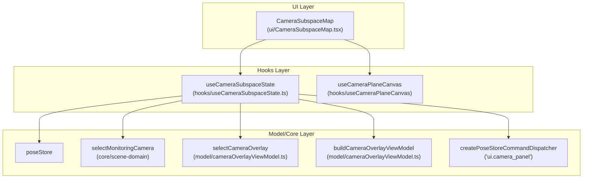
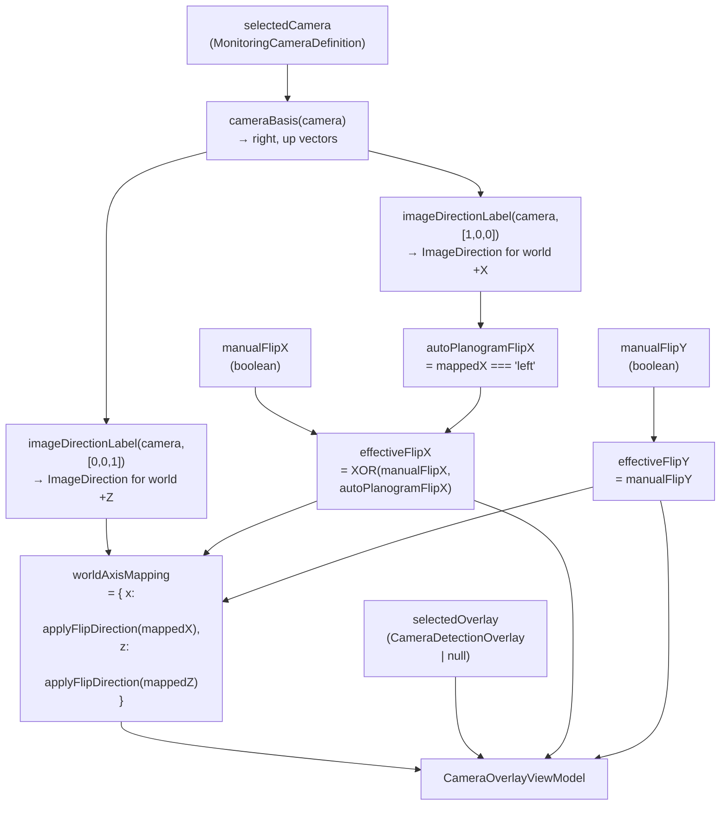
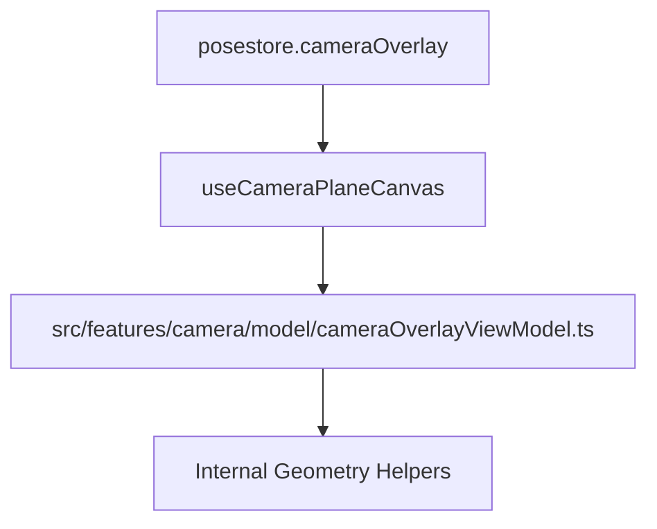
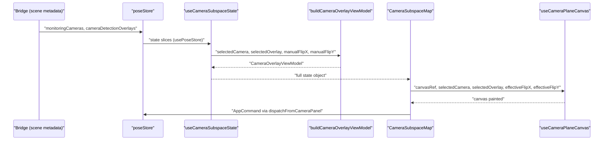

# Camera System

Relevant source files

- [](https://github.com/e7canasta/puppet-studio/blob/cdd483bd/src/features/camera/hooks/useCameraSubspaceState.ts)
- [](https://github.com/e7canasta/puppet-studio/blob/cdd483bd/src/features/camera/index.ts)
- [](https://github.com/e7canasta/puppet-studio/blob/cdd483bd/src/features/camera/model/cameraOverlayViewModel.ts)
- [](https://github.com/e7canasta/puppet-studio/blob/cdd483bd/src/features/camera/ui/CameraSubspaceMap.tsx)
- [](https://github.com/e7canasta/puppet-studio/blob/cdd483bd/src/features/pose/hooks/usePoseControlPanelState.ts)
- [](https://github.com/e7canasta/puppet-studio/blob/cdd483bd/src/features/scene/hooks/useSceneViewportState.ts)

This page covers the camera subspace visualization feature: the `CameraSubspaceMap` UI panel, the `useCameraSubspaceState` hook, the `buildCameraOverlayViewModel` model layer, and the flip/axis mapping logic for aligning camera images to the planogram coordinate system.

For details on how `MonitoringCameraDefinition` and `CameraDetectionOverlay` are defined and populated from the bridge, see the Planogram System ([8](https://deepwiki.com/e7canasta/puppet-studio/8-planogram-system)) and Scene Sync ([8.3](https://deepwiki.com/e7canasta/puppet-studio/8.3-scene-sync)) pages. For the 3D scene's `MonitoringSensorLayer` rendering, see PuppetScene ([7.1](https://deepwiki.com/e7canasta/puppet-studio/7.1-puppetscene-component)). For `poseStore` camera-related state fields, see State Management ([3](https://deepwiki.com/e7canasta/puppet-studio/3-state-management)).

---

## Overview

The Camera System provides a 2D panel that visualizes detection overlays received from a monitoring camera. It lets the user:

- Select which monitoring camera to inspect
- Flip the camera image on X and/or Y axes to align it with planogram orientation
- Read back how world axes (+X, +Z) project into the camera image

The panel is a read-only view into data that arrives via the bridge (`metadata.scene`). No scene edits are made from this panel.

**Component structure:**



Sources: [src/features/camera/ui/CameraSubspaceMap.tsx1-108](https://github.com/e7canasta/puppet-studio/blob/cdd483bd/src/features/camera/ui/CameraSubspaceMap.tsx#L1-L108) [src/features/camera/hooks/useCameraSubspaceState.ts1-40](https://github.com/e7canasta/puppet-studio/blob/cdd483bd/src/features/camera/hooks/useCameraSubspaceState.ts#L1-L40)

---

## poseStore Fields Used

`useCameraSubspaceState` subscribes to the following `poseStore` fields:

|Field|Type|Description|
|---|---|---|
|`cameraOverlayFlipX`|`boolean`|User-toggled manual X-axis flip|
|`cameraOverlayFlipY`|`boolean`|User-toggled manual Y-axis flip|
|`cameraDetectionOverlays`|`CameraDetectionOverlay[]`|Detection box payloads indexed by camera ID|
|`cameraView`|`string`|Active camera view mode (e.g. `'sensor'`)|
|`monitoringCameras`|`MonitoringCameraDefinition[]`|All cameras from scene metadata|
|`selectedMonitoringCameraId`|`string \| null`|Currently selected camera|

Sources: [src/features/camera/hooks/useCameraSubspaceState.ts9-15](https://github.com/e7canasta/puppet-studio/blob/cdd483bd/src/features/camera/hooks/useCameraSubspaceState.ts#L9-L15)

---

## useCameraSubspaceState Hook

Declared in [src/features/camera/hooks/useCameraSubspaceState.ts8-40](https://github.com/e7canasta/puppet-studio/blob/cdd483bd/src/features/camera/hooks/useCameraSubspaceState.ts#L8-L40)

The hook derives all data needed by `CameraSubspaceMap` from `poseStore`. Its return value is:

|Property|Origin|
|---|---|
|`cameraOverlayFlipX`|`poseStore` direct|
|`cameraOverlayFlipY`|`poseStore` direct|
|`cameraView`|`poseStore` direct|
|`monitoringCameras`|`poseStore` direct|
|`selectedCamera`|`selectMonitoringCamera(monitoringCameras, selectedMonitoringCameraId)`|
|`selectedOverlay`|`selectCameraOverlay(cameraDetectionOverlays, selectedCamera)`|
|`autoPlanogramFlipX`|spread from `buildCameraOverlayViewModel`|
|`effectiveFlipX`|spread from `buildCameraOverlayViewModel`|
|`effectiveFlipY`|spread from `buildCameraOverlayViewModel`|
|`worldAxisMapping`|spread from `buildCameraOverlayViewModel`|
|`dispatchFromCameraPanel`|`createPoseStoreCommandDispatcher('ui.camera_panel')`|

The `overlayView` object returned by `buildCameraOverlayViewModel` is spread directly into the hook's return value ([src/features/camera/hooks/useCameraSubspaceState.ts38](https://github.com/e7canasta/puppet-studio/blob/cdd483bd/src/features/camera/hooks/useCameraSubspaceState.ts#L38-L38)).

Sources: [src/features/camera/hooks/useCameraSubspaceState.ts1-40](https://github.com/e7canasta/puppet-studio/blob/cdd483bd/src/features/camera/hooks/useCameraSubspaceState.ts#L1-L40)

---

## Model Layer

### selectCameraOverlay

[src/features/camera/model/cameraOverlayViewModel.ts61-67](https://github.com/e7canasta/puppet-studio/blob/cdd483bd/src/features/camera/model/cameraOverlayViewModel.ts#L61-L67)

```
selectCameraOverlay(overlays, selectedCamera) → CameraDetectionOverlay | null
```

Finds the first entry in `overlays` whose `cameraId` matches `selectedCamera.id`. Returns `null` if no camera is selected or no matching overlay exists.

### buildCameraOverlayViewModel

[src/features/camera/model/cameraOverlayViewModel.ts69-96](https://github.com/e7canasta/puppet-studio/blob/cdd483bd/src/features/camera/model/cameraOverlayViewModel.ts#L69-L96)

The main model function. Takes the selected camera definition, the selected overlay, and manual flip booleans. Returns a `CameraOverlayViewModel`.

**Input → Output mapping:**



Sources: [src/features/camera/model/cameraOverlayViewModel.ts69-96](https://github.com/e7canasta/puppet-studio/blob/cdd483bd/src/features/camera/model/cameraOverlayViewModel.ts#L69-L96)

---

## Types

### CameraAxisMapping

[src/features/camera/model/cameraOverlayViewModel.ts5-8](https://github.com/e7canasta/puppet-studio/blob/cdd483bd/src/features/camera/model/cameraOverlayViewModel.ts#L5-L8)

```
type ImageDirection = 'left' | 'right' | 'up' | 'down'

type CameraAxisMapping = {
  x: ImageDirection   // where world +X axis points in the camera image
  z: ImageDirection   // where world +Z axis points in the camera image
}
```

This is displayed in the UI as the metadata row: `world +X → image {x} | world +Z → image {z}`.

### CameraOverlayViewModel

[src/features/camera/model/cameraOverlayViewModel.ts10-16](https://github.com/e7canasta/puppet-studio/blob/cdd483bd/src/features/camera/model/cameraOverlayViewModel.ts#L10-L16)

|Field|Type|Meaning|
|---|---|---|
|`autoPlanogramFlipX`|`boolean`|True when world +X projects to the left side of the camera image (auto-flip needed)|
|`effectiveFlipX`|`boolean`|Final X flip applied to canvas: `XOR(manualFlipX, autoPlanogramFlipX)`|
|`effectiveFlipY`|`boolean`|Final Y flip applied to canvas: equals `manualFlipY`|
|`selectedOverlay`|`CameraDetectionOverlay \| null`|Active detection overlay for the selected camera|
|`worldAxisMapping`|`CameraAxisMapping \| null`|World axes after effective flips are applied|

Sources: [src/features/camera/model/cameraOverlayViewModel.ts1-16](https://github.com/e7canasta/puppet-studio/blob/cdd483bd/src/features/camera/model/cameraOverlayViewModel.ts#L1-L16)

---

## Flip Logic

The flip system has two layers: an automatic layer and a manual layer.

**Automatic flip (`autoPlanogramFlipX`)**

The camera image's horizontal axis may run in the opposite direction from the planogram's +X axis. `autoPlanogramFlipX` is `true` when `imageDirectionLabel(camera, [1,0,0]) === 'left'`, meaning world +X projects to the left side of the image. In this case the image needs to be mirrored horizontally before overlaying it on the planogram.

**Manual flips (`cameraOverlayFlipX`, `cameraOverlayFlipY`)**

The user can independently toggle X and Y flips from the UI buttons. These are stored in `poseStore` as `cameraOverlayFlipX` and `cameraOverlayFlipY`.

**Effective flip computation**

```
effectiveFlipX = XOR(manualFlipX, autoPlanogramFlipX)
effectiveFlipY = manualFlipY
```

Using XOR means: if the auto-flip is already applied, toggling the manual flip turns it off; if the auto-flip is not needed, the manual flip applies directly.

**World axis mapping after flips**

`applyFlipDirection` adjusts a direction label to account for effective flips: a flip on X swaps `'left'` and `'right'`; a flip on Y swaps `'up'` and `'down'`. The final `worldAxisMapping` reflects the actual projection after all flips.




Sources: [src/features/camera/model/cameraOverlayViewModel.ts56-96](https://github.com/e7canasta/puppet-studio/blob/cdd483bd/src/features/camera/model/cameraOverlayViewModel.ts#L56-L96)

---

## Internal Geometry Helpers

These functions are private to `cameraOverlayViewModel.ts`:

|Function|Signature|Purpose|
|---|---|---|
|`cameraBasis`|`(camera) → { right, up }`|Computes 3D right and up unit vectors from `yawDeg` and `pitchDeg`|
|`dot3`|`(a, b) → number`|3D dot product|
|`imageDirectionLabel`|`(camera, axis) → ImageDirection`|Projects a world axis onto the camera's screen plane, returns the dominant direction|
|`applyFlipDirection`|`(direction, flipX, flipY) → ImageDirection`|Adjusts a direction label for active flips|
|`xorBool`|`(a, b) → boolean`|Logical XOR|
|`degToRad`|`(value) → number`|Degree to radian conversion (local copy)|

`cameraBasis` uses standard spherical-to-Cartesian:

- `forward = [sin(yaw)·cos(pitch), sin(pitch), cos(yaw)·cos(pitch)]`
- `right = [cos(yaw), 0, −sin(yaw)]`
- `up = forward × right`

Sources: [src/features/camera/model/cameraOverlayViewModel.ts18-55](https://github.com/e7canasta/puppet-studio/blob/cdd483bd/src/features/camera/model/cameraOverlayViewModel.ts#L18-L55)

---

## CameraSubspaceMap UI Component

[src/features/camera/ui/CameraSubspaceMap.tsx5-108](https://github.com/e7canasta/puppet-studio/blob/cdd483bd/src/features/camera/ui/CameraSubspaceMap.tsx#L5-L108)

The component renders inside a `.sensor-map` container. Its structure:

|Section|Contents|
|---|---|
|Header|Title + "Cam view" toggle button (activates `cameraView === 'sensor'`)|
|Camera selector|`<select>` over `monitoringCameras`; dispatches `set_selected_monitoring_camera`|
|Flip controls|Flip X, Flip Y, Reset buttons; dispatch `set_camera_overlay_flip` / `reset_camera_overlay_flip`|
|Canvas|`<canvas ref={canvasRef}>` rendered by `useCameraPlaneCanvas`|
|Metadata rows|Box count, timestamp, camera position/yaw/pitch, world axis mapping, auto-align status|

`useCameraPlaneCanvas` receives `(canvasRef, selectedCamera, selectedOverlay, effectiveFlipX, effectiveFlipY)` and is responsible for drawing the `CameraDetectionOverlay` boxes onto the canvas with the correct flip transforms.

### Commands Dispatched

|Command kind|Trigger|Fields|
|---|---|---|
|`set_camera_view`|"Cam view" button|`view: 'sensor'`|
|`set_selected_monitoring_camera`|Camera `<select>` change|`cameraId: string \| null`|
|`set_camera_overlay_flip`|Flip X / Flip Y buttons|`axis: 'x' \| 'y'`, `enabled: boolean`|
|`reset_camera_overlay_flip`|Reset button|_(no extra fields)_|

All commands are dispatched through `createPoseStoreCommandDispatcher('ui.camera_panel')`. See Command System ([4](https://deepwiki.com/e7canasta/puppet-studio/4-command-system)) for dispatch flow details.

Sources: [src/features/camera/ui/CameraSubspaceMap.tsx26-90](https://github.com/e7canasta/puppet-studio/blob/cdd483bd/src/features/camera/ui/CameraSubspaceMap.tsx#L26-L90) [src/features/camera/hooks/useCameraSubspaceState.ts29](https://github.com/e7canasta/puppet-studio/blob/cdd483bd/src/features/camera/hooks/useCameraSubspaceState.ts#L29-L29)

---

## Data Flow Summary




Sources: [src/features/camera/hooks/useCameraSubspaceState.ts1-40](https://github.com/e7canasta/puppet-studio/blob/cdd483bd/src/features/camera/hooks/useCameraSubspaceState.ts#L1-L40) [src/features/camera/ui/CameraSubspaceMap.tsx1-108](https://github.com/e7canasta/puppet-studio/blob/cdd483bd/src/features/camera/ui/CameraSubspaceMap.tsx#L1-L108) [src/features/camera/model/cameraOverlayViewModel.ts1-96](https://github.com/e7canasta/puppet-studio/blob/cdd483bd/src/features/camera/model/cameraOverlayViewModel.ts#L1-L96)


### On this page

- [Camera System](https://deepwiki.com/e7canasta/puppet-studio/9-camera-system#camera-system)
- [Overview](https://deepwiki.com/e7canasta/puppet-studio/9-camera-system#overview)
- [poseStore Fields Used](https://deepwiki.com/e7canasta/puppet-studio/9-camera-system#posestore-fields-used)
- [useCameraSubspaceState Hook](https://deepwiki.com/e7canasta/puppet-studio/9-camera-system#usecamerasubspacestate-hook)
- [Model Layer](https://deepwiki.com/e7canasta/puppet-studio/9-camera-system#model-layer)
- [selectCameraOverlay](https://deepwiki.com/e7canasta/puppet-studio/9-camera-system#selectcameraoverlay)
- [buildCameraOverlayViewModel](https://deepwiki.com/e7canasta/puppet-studio/9-camera-system#buildcameraoverlayviewmodel)
- [Types](https://deepwiki.com/e7canasta/puppet-studio/9-camera-system#types)
- [CameraAxisMapping](https://deepwiki.com/e7canasta/puppet-studio/9-camera-system#cameraaxismapping)
- [CameraOverlayViewModel](https://deepwiki.com/e7canasta/puppet-studio/9-camera-system#cameraoverlayviewmodel)
- [Flip Logic](https://deepwiki.com/e7canasta/puppet-studio/9-camera-system#flip-logic)
- [Internal Geometry Helpers](https://deepwiki.com/e7canasta/puppet-studio/9-camera-system#internal-geometry-helpers)
- [CameraSubspaceMap UI Component](https://deepwiki.com/e7canasta/puppet-studio/9-camera-system#camerasubspacemap-ui-component)
- [Commands Dispatched](https://deepwiki.com/e7canasta/puppet-studio/9-camera-system#commands-dispatched)
- [Data Flow Summary](https://deepwiki.com/e7canasta/puppet-studio/9-camera-system#data-flow-summary)

